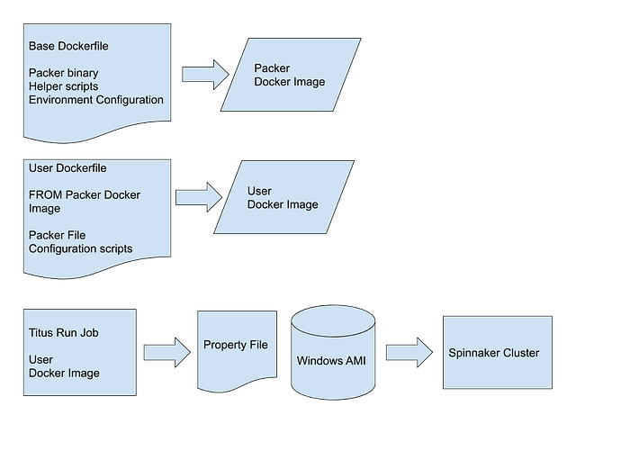
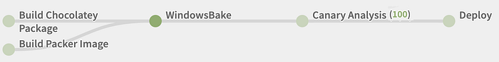

# Applying Netflix DevOps Patterns to Windows

Baking Windows with Packer

By [Justin Phelps](https://twitter.com/linuturk) and [Manuel Correa](https://twitter.com/mcorreadev)

Customizing Windows images at Netflix was a manual, error-prone, and time consuming process. In this blog post, we describe how we improved the methodology, which technologies we leveraged, and how this has improved service deployment and consistency.

## Artisan Crafted Images

In the Netflix [full cycle](https://medium.com/netflix-techblog/full-cycle-developers-at-netflix-a08c31f83249) DevOps culture the team responsible for building a service is also responsible for deploying, testing, infrastructure, and operation of that service. **A key responsibility of Netflix engineers is identifying gaps and pain points in the development and operation of services. **Though the majority of our services run on Linux Amazon Machine Images (AMIs), there are still many services critical to the Netflix Playback Experience running on Windows Elastic Compute Cloud (EC2) instances at scale.

We looked at our process for creating a Windows AMI and discovered it was error-prone and full of toil. First, an engineer would launch an EC2 instance and wait for the instance to come online. Once the instance was available, the engineer would use a remote administration tool like RDP to login to the instance to install software and customize settings. This image was then saved as an AMI and used in an Auto Scale Group to deploy a cluster of instances. Because this process was time consuming and painful, our Windows instances were usually missing the latest security updates from Microsoft.

Last year, we decided to improve the AMI baking process. The challenges with service management included:

- Stale documentation
- OS Updates
- High cognitive overhead
- A lack of continuous testing

## Scaling Image Creation

Our existing AMI baking tool [Aminator](https://medium.com/netflix-techblog/ami-creation-with-aminator-98d627ca37b0) does not support Windows so we had to leverage other tools. We had several goals in mind when trying to improve the baking methodology:

- Configuration as code
- Leverage [Spinnaker](https://www.spinnaker.io/) for Continuous Delivery
- [Eliminate Toil](https://landing.google.com/sre/sre-book/chapters/eliminating-toil/)

### Configuration as Code

The first part of our new Windows baking solution is [Packer](https://www.packer.io/). Packer allows you to describe your image customization process as a JSON file. We make use of the [amazon-ebs](http://packer.io/docs/builders/amazon-ebs.html) Packer builder to launch an EC2 instance. Once online, Packer uses WinRM to copy files and run PowerShell scripts against the instance. If all of the configuration steps are successful then Packer saves a new AMI. The configuration file, referenced scripts, and artifact dependency definitions all live in an internal git repository. We now have the software and instance configuration as code. This means changes can be tracked and reviewed like any other code change.

Packer requires specific information for your baking environment and extensive AWS IAM permissions. In order to simplify the use of Packer for our software developers, we bundled Netflix-specific AWS environment information and helper scripts. Initially, we did this with a git repository and Packer variable files. There was also a special EC2 instance where Packer was executed as Jenkins jobs. This setup was better than manually baking images but we still had some ergonomic challenges. For example, it became cumbersome to ensure users of Packer received updates.

The last piece of the puzzle was finding a way to package our software for installation on Windows. This would allow for reuse of helper scripts and infrastructure tools without requiring every user to copy that solution into their Packer scripts. Ideally, this would work similar to how applications are packaged in the Animator process. We solved this by leveraging [Chocolatey](https://chocolatey.org/), the package manager for Windows. Chocolatey packages are created and then stored in an internal artifact repository. This repository is added as a source for the choco install command. This means we can create and reuse packages that help integrate Windows into the Netflix ecosystem.

### Leverage Spinnaker for Continuous Delivery

*The Base Dockerfile allows updates of Packer, helper scripts, and environment configuration to propagate through the entire Windows Baking process.*

To make the baking process more robust we decided to create a Docker image that contains Packer, our environment configuration, and helper scripts. Downstream users create their own Docker images based on this base image. This means we can update the base image with new environment information and helper scripts, and users get these updates automatically. With their new Docker image, users launch their Packer baking jobs using [Titus](https://medium.com/netflix-techblog/titus-the-netflix-container-management-platform-is-now-open-source-f868c9fb5436), our container management system. The Titus job produces a property file as part of a Spinnaker pipeline. The resulting property file contains the AMI ID and is consumed by later pipeline stages for deployment. Running the bake in Titus removed the single EC2 instance limitation, allowing for parallel execution of the jobs.

Now each change in the infrastructure is tested, canaried, and deployed like any other code change. This process is automated via a Spinnaker pipeline:

*Example Spinnaker pipeline showing the bake, canary, and deployment stages.*

In the canary stage, [Kayenta](https://medium.com/netflix-techblog/automated-canary-analysis-at-netflix-with-kayenta-3260bc7acc69) is used to compare metrics between a baseline (current AMI) and the canary (new AMI). The canary stage will determine a score based on metrics such as CPU, threads, latency, and GC pauses. If this score is within a healthy threshold the AMI is deployed to each environment. Running a canary for each change and testing the AMI in production allows us to capture insights around impact on Windows updates, script changes, tuning web server configuration, among others.

### Eliminate Toil

Automating these tedious operational tasks allows teams to move faster. Our engineers no longer have to manually update Windows, Java, Tomcat, IIS, and other services. We can easily test server tuning changes, software upgrades, and other modifications to the runtime environment. Every code and infrastructure change goes through the same testing and deployment pipeline.

## Reaping the Benefits

Changes that used to require hours of manual work are now easy to modify, test, and deploy. Other teams can quickly deploy secure and reproducible instances in an automated fashion. Services are more reliable, testable, and documented. Changes to the infrastructure are now reviewed like any other code change. This removes unnecessary cognitive load and documents tribal knowledge. Removing toil has allowed the team to focus on other features and bug fixes. All of these benefits reduce the risk of a customer-affecting outage. Adopting the [Immutable Server pattern](https://medium.com/netflix-techblog/how-we-build-code-at-netflix-c5d9bd727f15) for Windows using Packer and Chocolatey has paid big dividends.

---
**Tags:** Docker · DevOps · Windows · AWS
