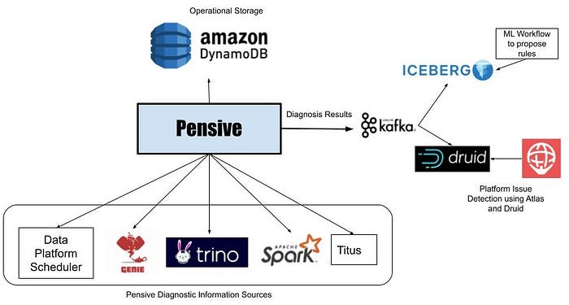
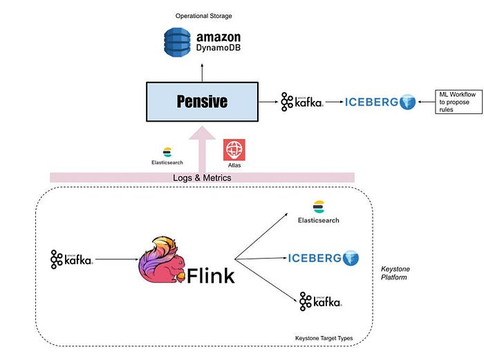

# Auto-Diagnosis and Remediation in Netflix Data Platform

By [_Vikram Srivastava_](https://www.linkedin.com/in/vikram-srivastava-8641ba6/) and [_Marcelo Mayworm_](https://www.linkedin.com/in/mayworm/)

Netflix has one of the most complex data platforms in the cloud on which our data scientists and engineers run batch and streaming workloads. As our subscribers grow worldwide and [Netflix enters the world of gaming](https://about.netflix.com/en/news/let-the-games-begin-a-new-way-to-experience-entertainment-on-mobile), the number of batch workflows and real-time data pipelines increases rapidly. The data platform is built on top of several distributed systems, and due to the inherent nature of these systems, it is inevitable that these workloads run into failures periodically. Troubleshooting these problems is not a trivial task and requires collecting logs and metrics from several different systems and analyzing them to identify the root cause. At our scale, even a tiny percentage of disrupted workloads can generate a substantial operational support burden for the data platform team when troubleshooting involves manual steps. And we can’t discount the productivity impact it causes on data platform users.

It motivates us to be proactive in detecting and handling failed workloads in our production environment, avoiding interruptions that could slow down our teams. We have been working on an auto-diagnosis and remediation system called Pensive in the data platform to address these concerns. With the goal of troubleshooting failing and slow workloads and remediating them without human intervention wherever possible. As our platform continues to grow and different scenarios and issues can disrupt the workloads, Pensive has to be proactive in detecting broad problems at the platform level in real-time and diagnosing the impact across the workloads.

Pensive infrastructure comprises two separate systems to support batch and streaming workloads. This blog will explore these two systems and how they perform auto-diagnosis and remediation across our Big Data Platform and Real-time infrastructure.

## Batch Pensive

*Batch Pensive Architecture*

Batch workflows in the data platform run using a [Scheduler](https://netflixtechblog.com/scheduling-notebooks-348e6c14cfd6) service that launches containers on the Netflix container management platform called [Titus](https://netflixtechblog.com/titus-the-netflix-container-management-platform-is-now-open-source-f868c9fb5436) to run workflow steps. These steps launch jobs on clusters running Apache Spark and TrinoDb via [Genie](https://netflix.github.io/genie/). If a workflow step fails, Scheduler asks Pensive to diagnose the step’s error. Pensive collects logs for the failed jobs launched by the step from the relevant data platform components and then extracts the stack traces. **Pensive relies on a regular expression based rules engine that has been curated over time**. The rules encode information about whether an error is due to a platform issue or a user bug and whether the error is transient or not. If a regular expression from one of the rules matches, then Pensive returns information about that error to the Scheduler. If the error is transient, Scheduler will retry that step with exponential backoff a few more times.

The most critical part of Pensive is the set of rules used to classify an error. We need to evolve them as the platform evolves to ensure that the percentage of errors that Pensive cannot classify remains low. Initially, the rules were added on an ad-hoc basis as requests came in from platform component owners and users. We have now moved to a more systematic approach where unknown errors are fed into a Machine Learning process that performs clustering to propose new regular expressions for commonly occurring errors. We take the proposals to platform component owners to then come up with the classification of the error source and whether it is of transitory nature. In the future, we are looking to automate this process.

### Detection of Platform-wide Issues

Pensive does error classification on individual workflow step failures, but by doing real-time analytics on the errors detected by Pensive using Apache Kafka and Apache Druid, we can quickly identify platform issues affecting many workflows. Once the individual diagnoses get stored in a Druid table, our monitoring and alerting system called [Atlas](https://netflixtechblog.com/introducing-atlas-netflixs-primary-telemetry-platform-bd31f4d8ed9a) does aggregations every minute and sends out alerts if there is a sudden increase in the number of failures due to platform errors. This has led to a dramatic reduction in the time it takes to detect issues in hardware or bugs in recently rolled out data platform software.

## Streaming Pensive

*Streaming Pensive Architecture*

Apache Flink powers real-time stream processing jobs in the Netflix data platform. And most of the Flink jobs run under a managed platform called [Keystone](https://netflixtechblog.com/keystone-real-time-stream-processing-platform-a3ee651812a), which abstracts out the underlying Flink job details and allows users to consume data from Apache Kafka streams and publish them to different data stores like Elasticsearch and [Apache Iceberg](https://github.com/Netflix/iceberg) on AWS S3.

Since the data platform manages keystone pipelines, users expect platform issues to be detected and remediated by the Keystone team without any involvement from their end. Furthermore, data in Kafka streams have a finite retention period, which adds time pressure for resolving the issues to avoid data loss.

For every Flink job running as part of a Keystone pipeline, we monitor the metric indicating how far the Flink consumer lags behind the Kafka producer. If it crosses a threshold, [Atlas](https://netflixtechblog.com/introducing-atlas-netflixs-primary-telemetry-platform-bd31f4d8ed9a) sends a notification to Streaming Pensive.

Like its batch counterpart, Streaming Pensive also has a rules engine to diagnose errors. However, in addition to logs, Streaming Pensive also has rules for checking various metric values for multiple components in the Keystone pipeline. The issue may occur in the source Kafka stream, the main Flink job, or the sinks to which the Flink job is writing data. Streaming Pensive diagnoses it and tries to remediate the issue automatically when it happens. Some examples where we are able to auto-remediate are:

- If Streaming Pensive finds that one or more Flink Task Managers are going out of memory, it can redeploy the Flink cluster with more Task Managers.
- If Streaming Pensive finds that there is an unexpected increase in the rate of incoming messages on the source Kafka cluster, it can increase the topic retention size and period so that we don’t lose any data while the consumer is lagging. If the spike goes away after some time, Streaming Pensive can revert the retention changes. Otherwise, it will page the job owner to investigate if there is a bug causing the increased rate or if the consumers need to be reconfigured to handle the higher rate.

Even though we have a high success rate, there are still occasions where automation is not possible. If manual intervention is required, Streaming Pensive will page the relevant component team to take timely action to resolve the issue.

## What’s Next?

Pensive has had a significant impact on the operability of the Netflix data platform. And helped engineering teams lower the burden of operations work, freeing them to tackle more critical and challenging problems. But our job is nowhere near done. We have a long roadmap ahead of us. Some of the features and expansions we have planned are:

- Batch Pensive is currently diagnosing failed jobs only, and we want to increase the scope into optimization to determine why jobs have become slow.
- Auto-configure batch workflows so that they finish successfully or become faster and use fewer resources when possible. One example where it can dramatically help is Spark jobs, where memory tuning is a significant challenge.
- Expand Pensive with Machine Learning classifiers.
- The streaming platform recently added [Data Mesh](./data-movement-in-netflix-studio-via-data-mesh-3fddcceb1059.md), and we need to expand Streaming Pensive to cover that.

## Acknowledgments

This work could not have been completed without the help of the Big Data Compute and the Real-time Data Infrastructure teams within the Netflix data platform. They have been great partners for us as we work on improving the Pensive infrastructure.

---
**Tags:** Big Data · Data Platforms · Stream Processing · Automation · Auto Remediation
