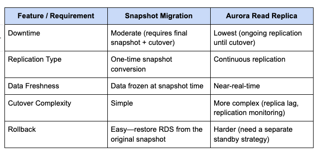
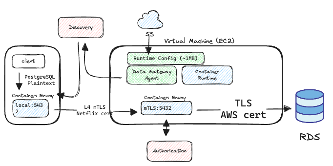
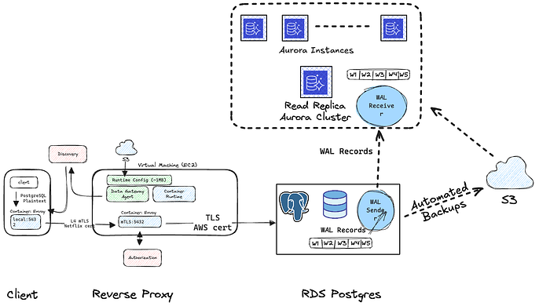
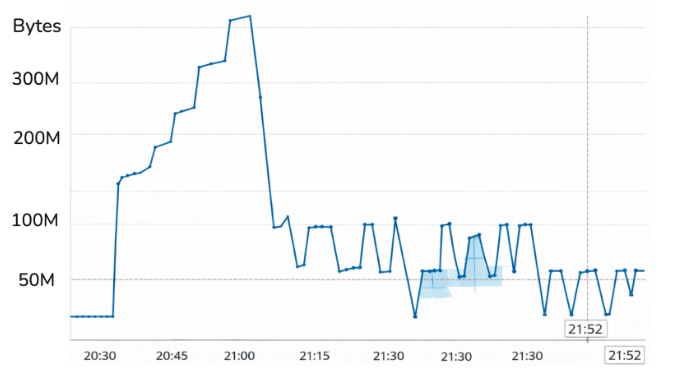
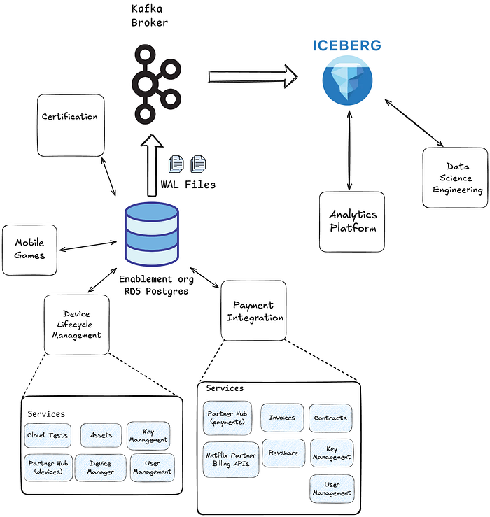

# Automating RDS Postgres to Aurora Postgres Migration

[Ram Srivasta Kannan,](https://www.linkedin.com/in/ramsrivatsa/) [Wale Akintayo](https://www.linkedin.com/in/wale-akintayo-30782a82/), [Jay Bharadwaj](https://www.linkedin.com/in/jay-bharadwaj-4b310ab8/), [John Crimmins](https://www.linkedin.com/in/john-crimmins-39730b3a/), [Shengwei Wang,](https://www.linkedin.com/in/shengwei4721/) [Zhitao Zhu](https://www.linkedin.com/in/zhitao-cathy-zhu/)

## Introduction

In 2024, the Online Data Stores team at Netflix conducted a comprehensive review of the relational database technologies used across the company. This evaluation examined functionality, performance, and total cost of ownership across our database ecosystem. Based on this analysis, we decided to standardize on **Amazon Aurora PostgreSQL as the primary relational database** offering for Netflix teams.

Several key factors influenced this decision:

- **PostgreSQL already **underpinned** **the majority of our relational workloads, which made it a natural foundation for standardization. Internal evaluations revealed that Aurora PostgreSQL had supported over 95% of the applications and workloads running on other relational databases across our internal services.
- **Industry momentum had continued to shift toward PostgreSQL, **driven by its open ecosystem, strong community support, and broad adoption across modern data platforms.
- **Aurora’s cloud-native, distributed architecture** provided clear advantages in scalability, high availability, and elasticity compared to traditional single-node PostgreSQL deployments.
- Aurora PostgreSQL offered a **rich feature set**, along with a **strong, forward-looking roadmap** aligned with the needs of large-scale, globally distributed applications.

## A Clear Migration Path Forward

As part of this strategic shift, one of our key initiatives for 2024/2025 was migrating existing users to Aurora PostgreSQL. This effort began with RDS PostgreSQL migrations and will expand to include migrations from other relational systems in subsequent phases.

As a data platform organization, our goal is to make this evolution predictable, well-supported, and minimally disruptive. This allows teams to adopt Aurora PostgreSQL at a pace that aligns with their product and operational roadmaps, while we move toward a unified and scalable relational data platform across the organization.

## Database Migration: More Than a Simple Transfer

Migrating a database involves far more than copying rows from one system to another. It is a coordinated process of transitioning both data and database functionality while preserving correctness, availability, and performance. At scale, a well-designed migration must minimize disruption to applications and ensure a clean, deterministic handoff from the old system to the new one.

Most database migrations follow a common set of high-level steps:

1. **Data Replication**: Data is first copied from the source database to the destination, typically using replication, so that ongoing changes are continuously captured and applied.
2. **Quiescence**: Write traffic to the source database is halted, allowing the destination to fully catch up and eliminate any remaining divergence.
3. **Validation**: The system verifies that the source and destination databases are fully synchronized and contain identical data.
4. **Cutover**: Client applications are reconfigured to point to the destination database, which becomes the new primary source of truth.

## Challenges

### Operational Challenges

Migrating to a new relational database at Netflix scale presents substantial operational challenges. With a fleet approaching 400 PostgreSQL clusters, manually migrating each one is simply not scalable for the data platform team. Such an approach would require a significant amount of time, introduce the risk of human error, and necessitate considerable hands-on engineering effort. Compounding the problem, coordinating downtime across the many interconnected services that depend on each database is extremely cumbersome at this scale.

To address these challenges, we designed a self-service migration workflow that enables service owners to run their own RDS PostgreSQL to Aurora PostgreSQL migrations. The workflow automatically handles orchestration, safety checks, and correctness guarantees end-to-end, resulting in lower operational overhead and a predictable, reliable migration experience.

## Technical challenges

- **Zero data loss** — We must guarantee that all data from the source cluster is fully and safely migrated to the destination within a very tight window, with no possibility of data loss.
- **Minimal downtime — **Some downtime is unavoidable during migration, as applications must briefly pause write traffic while cutting over to Aurora PostgreSQL. For higher-tier services that power critical parts of the Netflix ecosystem, this window must be kept extremely short to prevent user-facing impact and maintain service reliability.
- **No control over client applications** — As the platform team, we manage the databases, but application teams handle the read and write operations. We cannot assume that they have the ability to pause writes on demand, nor do we want to expose such controls to them, as mistakes could lead to data inconsistencies post migration. Therefore, building a self-service migration pipeline requires creative control-plane solutions to halt traffic, ensuring that no writes occur during the validation and cutover phases.
- **No direct access to RDS credentials** — The migration automation must perform replication, quiescence, and validation without requesting database credentials from users or relying on manual authentication. Source databases are often tightly secured, allowing access only from client applications, but more importantly, requiring credential access — even if it were possible — would significantly increase operational overhead and risk. At the same time, the migration platform may operate in environments without direct access to the source database, making traditional verification or parity checks impossible.
- **No Degradation in Performance** — The migration process must not impact the performance or stability of production databases once they are running in the Aurora PostgreSQL ecosystem.
- **Full Ecosystem Parity** — Beyond migrating the core database, associated components such as parameter groups, read replicas, and replication slots must also be migrated to ensure functional equivalence.

**Minimal User Effort** — Since we rely on teams who are not database experts to perform migrations, the process must be simple, intuitive, and fully self-guided.

## AWS recommended migration techniques

### Using a snapshot

One of the simplest AWS-recommended approaches for migrating from RDS PostgreSQL to Aurora PostgreSQL is based on snapshots. In this model, write traffic to the source PostgreSQL database is first stopped. A manual snapshot of the RDS PostgreSQL instance is then taken and migrated to Aurora, where AWS converts it into an Aurora-compatible format.  
   
Once the conversion completes, a new Aurora PostgreSQL cluster is created from the snapshot. After the cluster is brought online and validated, application traffic is redirected to the Aurora endpoint, completing the migration.

[Reference](https://docs.aws.amazon.com/AmazonRDS/latest/AuroraUserGuide/AuroraPostgreSQL.Migrating.RDSPostgreSQL.Import.Console.html)

### Using an Aurora read replica

In the read-replica–based approach, an Aurora PostgreSQL read replica is created from an existing RDS PostgreSQL instance. AWS establishes continuous, asynchronous replication from the RDS source to the Aurora replica, allowing ongoing changes to be streamed in near real time.

Because replication runs continuously, the Aurora replica remains closely synchronized with the source database. This enables teams to provision and validate the Aurora environment — including configuration, connectivity, and performance characteristics — while production traffic continues to flow to the source.

When the replication lag is sufficiently low, write traffic is briefly paused to allow the replica to fully catch up. The Aurora read replica is then promoted to a standalone Aurora PostgreSQL cluster, and application traffic is redirected to the new Aurora endpoint. This approach significantly reduces downtime compared to snapshot-based migrations and is well-suited for production systems that require minimal disruption.


*Migration Strategy Trade-Offs*

These differences represent the key considerations when choosing a migration strategy from RDS PostgreSQL to Aurora PostgreSQL. For our automation, we opted for the Aurora Read Replica approach, trading increased implementation complexity for a significantly shorter downtime window for client applications.


*Netflix RDS PostgreSQL Deployment Architecture*

In Netflix’s RDS setup, a [Data Access Layer](https://netflixtechblog.medium.com/data-gateway-a-platform-for-growing-and-protecting-the-data-tier-f1ed8db8f5c6) (DAL) sits between applications and backend databases, acting as middleware that centralizes database connectivity, security, and traffic routing on behalf of client applications.

On the client side, applications connect through a forward proxy that manages mutual TLS (mTLS) authentication and establishes a secure tunnel to the Data Gateway service. The Data Gateway, acting as a reverse proxy for database servers, terminates client connections, enforces centralized authentication and authorization, and forwards traffic to the appropriate RDS PostgreSQL instance.

This layered design ensures that applications never handle raw database credentials, provides a consistent and secure access pattern across all datastore types, and delivers isolated, transparent connectivity to managed PostgreSQL clusters. While the primary goal of this architecture is to enforce strong security controls and standardize how applications access external AWS data stores, it also allows backend databases to be switched transparently via configuration, enabling controlled, low-downtime migrations.

## Migration Process

The Platform team’s goal is to deliver a fully automated, self-service workflow that helps with the migration of customer RDS PostgreSQL instances to Aurora PostgreSQL clusters. This migration tool orchestrates the entire process — from preparing the source environment, initializing the Aurora read replica, and maintaining continuous synchronization, all the way through to cutover — without requiring any database credentials or manual intervention from the customer.

Designed for minimal downtime and seamless user experience, the workflow ensures full ecosystem parity between RDS and Aurora, preserving performance characteristics and operational behavior while enabling customers to benefit from Aurora’s improved scalability, resilience, and cost efficiency.

## Data Replication Phase

### Enable Automated Backups

Automated backups must be enabled on the source database because the Aurora [read replica](https://docs.aws.amazon.com/AmazonRDS/latest/UserGuide/USER_PostgreSQL.Replication.ReadReplicas.Configuration.html?utm_source=chatgpt.com) is initialized from a consistent snapshot of the source and then kept in sync through continuous replication. Automated backups provide the stable snapshot required to bootstrap the replica, along with the continuous streaming of write-ahead log (WAL) records needed to keep the read replica closely synchronized with the source.

### Port RDS parameters to an Aurora parameter group

We create a dedicated Aurora parameter group for each cluster and migrate all RDS-compatible parameters from the source RDS instance. This ensures that the Aurora cluster inherits the same configuration settings — such as memory configuration, connection limits, query planner behavior, and other PostgreSQL engine parameters that have equivalents in Aurora. Parameters that are unsupported or behave differently in Aurora are either omitted or adjusted according to Aurora best practices.

### Create an Aurora read replica cluster and instance

Creating an Aurora read replica cluster is a critical step in migrating from RDS PostgreSQL to Aurora PostgreSQL. At this stage, the Aurora cluster is created and attached to the RDS PostgreSQL primary as a replica, establishing continuous replication from the source RDS PostgreSQL instance. These Aurora read replicas stay nearly in sync with ongoing changes by streaming write-ahead logs (WAL) from the source, enabling minimal downtime during cutover. The cluster is fully operational for validation and performance testing, but it is not yet writable — RDS remains the authoritative primary.



### Quiescence Phase

The goal of the quiescence phase is to transition client applications from the source RDS PostgreSQL instance to the Aurora PostgreSQL cluster as the new primary database, while preserving data consistency during cutover.

The first step in this process is to stop all write traffic to the source RDS PostgreSQL instance to guarantee consistency. To achieve this, we instruct users to halt application-level traffic, which helps prevent issues such as retry storms, queue backlogs, or unnecessary resource consumption when connectivity changes during cutover. This coordination also gives teams time to prepare operationally, for example, by suppressing alerts, notifying downstream consumers, or communicating planned maintenance to their customers.

However, relying solely on application-side controls is unreliable. Operational gaps, misconfigurations, or lingering connections can still modify the source database state, potentially resulting in changes that are not replicated to the destination and leading to data inconsistency or loss. To enforce a clean and deterministic cutover, we also block traffic at the infrastructure layer. This is done by detaching the RDS instance’s security groups to prevent new inbound connections, followed by a reboot of the instance. With security groups removed, no new SQL sessions can be established, and the reboot forcibly terminates any existing connections.

This approach intentionally avoids requiring database credentials or logging into the PostgreSQL server to manually terminate connections. While it may be slower than application- or database-level intervention, it provides a reliably automated and repeatable mechanism to fully quiesce the source RDS PostgreSQL instance before Aurora promotion, eliminating the risk of divergent writes or an inconsistent WAL state.

### Validation Phase

To determine whether the Aurora read replica has fully caught up with the source RDS PostgreSQL instance, we track replication progress using Aurora’s OldestReplicationSlotLag metric. This metric represents how far the Aurora replica is behind the source in applying write-ahead log (WAL) records.

Once client traffic is halted during quiescence, the source RDS PostgreSQL instance stops producing meaningful WAL entries. At that point, the replication lag should converge to zero, indicating that all WAL records corresponding to real writes have been fully replayed on Aurora.

However, in practice, our experiments show that the metric never settles at a steady zero. Instead, it briefly drops to **0**, then quickly returns to **64 MB**, repeating this pattern every few minutes as shown in the figure below.


*OldestReplicationSlotLag*

This behavior stems from how OldestReplicationSlotLag is calculated. Internally, the lag is derived using the following query:

```
SELECT
  slot_name,
  pg_wal_lsn_diff(pg_current_wal_lsn(), restart_lsn) AS slot_lag_bytes
FROM pg_replication_slots;
```

Conceptually, this translates to:

```
OldestReplicationSlotLag = current_WAL_position_on_RDS 
                           – restart_lsn
```

See AWS references [here](https://docs.aws.amazon.com/AmazonRDS/latest/UserGuide/USER_PostgreSQL.Replication.ReadReplicas.Monitor.html) and [here](https://repost.aws/knowledge-center/rds-postgresql-use-logical-replication).

The [_restart_lsn_](https://www.morling.dev/blog/postgres-replication-slots-confirmed-flush-lsn-vs-restart-lsn/#:~:text=And%20this%20is%20exactly%20the,has%20a%20few%20important%20implications:) represents the oldest write-ahead log (WAL) record that PostgreSQL must retain to ensure a replication consumer can safely resume replication.

When PostgreSQL performs a WAL segment switch, Aurora typically catches up almost immediately. At that moment, the restart_lsn briefly matches the source’s current WAL position, causing the reported lag to drop to 0. During idle periods, PostgreSQL performs an empty WAL segment rotation approximately every five minutes, driven by the archive_timeout = 300s setting in the database parameter group.

Immediately afterward, PostgreSQL begins writing to the new WAL segment. Since this new segment has not yet been fully flushed or consumed by Aurora, the WAL position in source RDS PostgreSQL advances ahead of the restart_lsn of Aurora PostgreSQL by exactly one segment. As a result, OldestReplicationSlotLag jumps to 64 MB, which corresponds to the configured WAL segment size at database initialization, and remains there until the next segment switch occurs.

Because idle PostgreSQL performs an empty WAL rotation approximately every five minutes, this zero-then-64 MB oscillation is expected. Importantly, the moment when the lag drops to 0 indicates that all meaningful WAL records have been fully replicated, and the Aurora read replica is fully caught up with the source.

### Cutover Phase

Once the Aurora read replica has fully caught up with the source RDS PostgreSQL instance — as confirmed through replication lag analysis — the final step is to promote the replica and redirect application traffic. Promoting the Aurora read replica converts it into an independent, writable Aurora PostgreSQL cluster with its own writer and reader endpoints. At this point, the source RDS PostgreSQL instance is no longer the authoritative primary and is made inaccessible.

Because Netflix’s RDS ecosystem is fronted by a Data Access Layer (DAL), consisting of client-side forward proxies and a centralized Data Gateway, switching databases does not require application code changes or database credential access. Instead, traffic redirection is handled entirely through configuration updates in the reverse-proxy layer. Specifically, we update the runtime configuration of the Envoy-based Data Gateway to route traffic to the newly promoted Aurora cluster. Once this configuration change propagates, all client-initiated database connections are transparently routed through the DAL to the Aurora writer endpoint, completing the migration without requiring any application changes.

This proxy-level cutover, combined with Aurora promotion, enables a seamless transition for service owners, minimizes downtime, and preserves data consistency throughout the migration process.

## Customer Experience: Migrating a Business-Critical Partner Platform

One of the critical teams to adopt the RDS PostgreSQL to Aurora PostgreSQL migration workflow was the Enablement Applications team. This team owns a set of databases that model Netflix’s entire ecosystem of partner integrations, including device manufacturers, discovery platforms, and distribution partners. These databases power a suite of enterprise applications that partners worldwide rely on to build, test, certify, and launch Netflix experiences on their devices and services.

Because these databases sit at the center of Netflix’s partner enablement and certification workflows, they are consumed by a diverse set of client applications across both internal and external organizations. **Internally**, reliability teams use this data to identify streaming failures for specific devices and configurations, supporting quality improvements across the device ecosystem. At the same time, these databases directly serve **external** partners operating across many regions. Device manufacturers rely on them to configure, test, and certify new hardware, while payment partners use them to set up and launch bundled offerings with Netflix.


*Simplified Enablement Applications Overview*

**Device Lifecycle Management**

Netflix works with a wide range of device partners to ensure Netflix streams seamlessly across a diverse ecosystem of consumer devices. A core responsibility of Device Lifecycle Management is to provide tools and workflows that allow partners to develop, test, and certify Netflix integrations on their devices.

As part of the device lifecycle, partners run Netflix-provided test suites against their NRDP implementation. We store **signals that represent the current stage for each device in the certification process**. This certification data forms the backbone of Netflix’s device enablement program, ensuring that only validated devices can launch Netflix experiences.

**Partner Billed Integrations**

In addition to device enablement, the same partner metadata is also consumed by Netflix’s Partner Billed Integrations organization. This group enables external partners to offer Netflix as part of bundled subscription and billing experiences.

Any disruption in these databases affects partner integration workflows. If the database is unavailable, partners may be unable to configure or launch service bundles with Netflix. Maintaining high availability and data correctness is essential to preserving smooth integration operations.

The global nature of these workflows makes it difficult to schedule downtime windows. Any disruption would impact partner productivity and risk eroding trust in Netflix’s integration and certification processes.

## Preparation

Given the criticality of the Enablement Applications databases, thorough preparation was essential before initiating the migration. The team invested significant effort upfront to understand traffic patterns, identify all consumers, and establish clear communication channels.

**Understand Client Fan-Out and Traffic Patterns  
**The first step was to gain a complete view of how the databases were being used in production. Using observability tools like CloudWatch metrics, the team analyzed PostgreSQL connection counts, read and write patterns, and overall load characteristics. This helped establish a baseline for normal behavior and ensured there were no unexpected traffic spikes or hidden dependencies that could complicate the migration.

Just as importantly, this baseline gave the Enablement Applications team a rough idea of the post-migration behavior on Aurora. For example, they expected to see a similar number of active database connections and comparable traffic patterns after cutover, making it easier to validate that the migration had preserved operational characteristics.

**Identify and Enumerate All Database Consumers  
**Unlike most databases, where the set of consumers is well known to the owning team, these databases were accessed by a wide range of internal services and external-facing systems that were not fully enumerated upfront. To address this, we leveraged a tool called flowlogs, an eBPF-based network attribution tooling was used to capture TCP flow data to identify the services and applications establishing connections to the database([link](./how-netflix-accurately-attributes-ebpf-flow-logs-afe6d644a3bc.md)).  
   
This approach allowed the team to enumerate active consumers, including those that were not previously documented, ensuring no clients were missed during migration planning.

**Establish Dedicated Communication Channels  
**Once all consumers were identified, a dedicated communication channel was created to provide continuous updates throughout the migration process. This channel was used to share timelines, readiness checks, status updates, and cutover notifications, ensuring that all stakeholders remained aligned and could respond quickly if issues arose.

## Migration Process

After completing application-side preparation, the Enablement Applications team initiated the data replication phase of the migration workflow. The automation successfully provisioned the Aurora read replica cluster and ported the RDS PostgreSQL parameter group to a corresponding Aurora parameter group, bringing the destination environment up with equivalent configuration.

### Unexpected Replication Slot Behavior

However, shortly after replication began, we observed that the OldestReplicationSlotLag metric was unexpectedly high. This was counterintuitive, as Aurora read replicas are designed to remain closely synchronized with the source database by continuously streaming write-ahead logs (WAL).

Further investigation revealed the presence of an inactive logical replication slot on the source RDS PostgreSQL instance. An inactive replication slot can cause elevated OldestReplicationSlotLag because PostgreSQL must retain all WAL records required by the slot’s last known position (restart_lsn), even if no client is actively consuming data from it. Replication slots are intentionally designed to prevent data loss by ensuring that a consumer can resume replication from where it left off. As a result, PostgreSQL will not recycle or delete WAL segments needed by a replication slot until the slot advances. When a slot becomes inactive — such as when a client migration task is stopped or abandoned — the slot’s position no longer moves forward. Meanwhile, the database continues to generate WAL, forcing PostgreSQL to retain increasingly older WAL files. This growing gap between the current WAL position and the slot’s restart_lsn manifests as a high OldestReplicationSlotLag.

Identifying and addressing these inactive replication slots was a critical prerequisite to proceeding safely with the migration and ensuring accurate replication state during cutover.

**Successful Migration After Remediation  
 **After identifying the inactive logical replication slot, the team safely cleaned it up on the source RDS PostgreSQL instance and resumed the migration workflow. With the stale slot removed, replication progressed as expected, and the Aurora read replica quickly converged with the source. The migration then proceeded smoothly through the quiescence phase, with no unexpected behavior or replication anomalies observed.

Following promotion, application traffic transitioned seamlessly to the newly writable Aurora PostgreSQL cluster. Through the Data Access Layer, new client connections were automatically routed to Aurora, and observability metrics confirmed healthy behavior — connection counts, read/write patterns, and overall load closely matched pre-migration baselines. From the application and partner perspective, the cutover was transparent, validating both the correctness of the migration workflow and the effectiveness of the preparation steps.

## Open questions

### How do we select target Aurora PostgreSQL instance types based on the existing production RDS PostgreSQL instance?

When selecting the target Aurora PostgreSQL instance type for a production migration, our guidance is intentionally conservative. We prioritize stability and performance first, and optimize for cost only after observing real workload behavior on Aurora.

In practice, the recommended approach is to adopt Graviton2-based instances (particularly the _r6g_ family) whenever possible, maintain the same instance family and size where feasible, and — at minimum — preserve the memory footprint of the existing RDS instance.

Unlike RDS PostgreSQL, Aurora does not support the _m_-series, making a direct family match impossible for those instances. In such cases, simply keeping the same “size” (e.g., 2xlarge → 2xlarge) is not meaningful because the memory profiles differ across families. Instead, we map instances by memory equivalence. For example, an Aurora _r6g.xlarge_ provides a memory footprint comparable to an RDS _m5.2xlarge_, making it a practical replacement. This memory-aligned strategy offers a safer and more predictable baseline for production migrations.

### Downtime During RDS → Aurora Cutover?

To achieve minimal downtime during an RDS PostgreSQL → Aurora PostgreSQL migration, we front-load as much work as possible into the preparation phase. By the time we reach cutover, the Aurora read replica is already provisioned and continuously replicating WAL from the source RDS instance. Before initiating downtime, we ensure that the replication lag between Aurora and RDS has stabilized within an acceptable threshold. If the lag is large or fluctuating significantly, forcing a cutover will only inflate downtime.

Downtime begins the moment we remove the security groups from the source RDS instance, blocking all inbound traffic. We then reboot the instance to forcibly terminate existing connections, which typically takes up to a minute. From this point forward, no writes can be performed.

After traffic is halted, the next objective is to verify that Aurora has fully replayed all meaningful WAL records from RDS. We track this using **OldestReplicationSlotLag**. We first wait for the metric to drop to **0**, indicating that Aurora has consumed all WAL with real writes. Under normal idle behavior, PostgreSQL triggers an empty WAL switch every five minutes. After observing one data point at 0, we wait for an additional idle WAL rotation and confirm that the lag oscillates within the expected **0 → 64 MB** pattern — signifying that the only remaining WAL segments are empty ones produced during idle time. At this point, we know the Aurora replica is fully caught up and can be safely promoted.

While these validation steps run, we perform the configuration updates on the Envoy reverse proxy in parallel. Once promotion completes and Envoy is restarted with the new runtime configuration, all client-initiated connections begin routing to the Aurora cluster. In practice, the total write-downtime observed across services averages **around 10 minutes**, dominated largely by the RDS reboot and the idle WAL switch interval.

**Optimization: Reducing Idle-Time Wait**

For services requiring stricter downtime budgets, waiting the full five minutes for an idle WAL switch can be prohibitively expensive. In such cases, we can force a WAL rotation immediately after traffic is cut off by issuing:

SELECT pg_switch_wal();

Once the switch occurs, OldestReplicationSlotLag will drop to 0 again as Aurora consumes the new (empty) WAL segment. This approach eliminates the need to wait for the default archive_timeout interval, which can significantly reduce overall downtime.

### How do we migrate CDC consumers?

As part of the data platform organization in Netflix, we provide a managed Change Data Capture (CDC) service across a variety of datastores. For PostgreSQL, logical replication slots is the way of implementing change data capture. At Netflix, we build a managed abstraction on top of these replication slots called **datamesh** to manage customers who are leveraging them ([link](./data-mesh-a-data-movement-and-processing-platform-netflix-1288bcab2873.md)).

Each logical replication slot tracks a consumer’s position in the write-ahead log (WAL), ensuring that WAL records are retained until the consumer has successfully processed them. This guarantees ordered and reliable delivery of row-level changes to downstream systems. At the same time, it tightly couples the lifecycle of replication slots to database operations, making their management a critical consideration during database migrations.

A key challenge in migrating from RDS PostgreSQL to Aurora PostgreSQL is transitioning these CDC consumers safely — without data loss, stalled replication, or extended downtime — while ensuring that replication slots are correctly managed throughout the cutover process.

Each row-level change in PostgreSQL is emitted as a CDC event with an operation type of INSERT, UPDATE, DELETE, or REFRESH. REFRESH events are generated during backfills by querying the database directly and emitting the current state of rows in chunks. Downstream consumers are designed to be idempotent and eventually consistent, allowing them to safely process retries, replays, and backfills.

**Handling Replication Slots During Migration**

Before initiating database cutover, we temporarily pause CDC consumption by stopping the infrastructure responsible for consuming from PostgreSQL replication slots and writing into datamesh source. This also drops the replication slot from the database and cleans up our internal state around replication slot offsets. This essentially resets the state of the connector to one of a brand new one.

This step is critical for two reasons. First, it prevents replication slots from blocking WAL recycling during migration. Second, it ensures that no CDC consumers are left pointing at the source database once traffic is quiesced and cutover begins. While CDC consumers are paused, downstream systems temporarily stop receiving new change events, but remain stable. Once CDC consumers are paused, we proceed with stopping other client traffic and executing the RDS-to-Aurora cutover.

**Reinitializing CDC After Cutover**

After the Aurora PostgreSQL cluster has been promoted and traffic has been redirected, CDC consumers are reconfigured to point to the Aurora endpoint and restarted. Because their previous state was intentionally cleared, consumers initialize as if they are starting fresh.

On startup, new logical replication slots are created on Aurora, and a full backfill is performed by querying the database and emitting REFRESH events for all existing rows. These events let the consumer know that a manual refresh was done from Aurora and to treat this as an upsert operation. This establishes a clean and consistent baseline from which ongoing CDC can resume. Consumers are expected to handle these refresh events correctly as part of normal operation.

By explicitly managing PostgreSQL replication slots as part of the migration workflow, we are able to migrate CDC consumers safely and predictably, without leaving behind stalled slots, retained WAL, or consumers pointing to the wrong database. This approach allows CDC pipelines to be cleanly re-established on Aurora while preserving correctness and operational simplicity.

### How do we roll back in the middle of the process?

**Pre-quiescence  
**Rolling back before the pre-quienscence phase is quite easy. Your primary RDS database is still the source. Rolling back before the quiescence phase is straightforward. At this stage, the primary RDS PostgreSQL instance continues to serve as the sole source of truth, and no client traffic has been redirected.

If a rollback is required, the migration can be safely aborted by deleting the newly created Aurora PostgreSQL cluster along with its associated parameter groups. No changes are needed on the application side, and normal operations on RDS PostgreSQL can continue without impact.

**During-quiescence  
**Rolling back during the quiescence phase is more involved. At this point, client traffic to the source RDS PostgreSQL instance has already been stopped by detaching its security groups. To roll back safely, access must first be restored by reattaching the original security groups to the RDS instance, allowing client connections to resume. In addition, any logical replication slots removed during the migration must be recreated so that CDC consumers can continue processing changes from the source database.

Once connectivity and replication slots are restored, the RDS PostgreSQL instance can safely resume its role as the primary source of truth.

**Post-quiescence   
**Rolling back after cutover, once the Aurora PostgreSQL cluster is serving production traffic, is significantly more complex. At this stage, Aurora has become the primary source of truth, and client applications may already have written new data to it.

In this scenario, rollback requires setting up replication in the opposite direction, with Aurora as the source and RDS PostgreSQL as the destination. This can be achieved using a service such as AWS Database Migration Service (DMS). AWS provides detailed guidance for setting up this reverse replication flow, which can be followed to migrate data back to RDS if necessary.

## Conclusion

Standardizing and reducing the surface area of data technologies is crucial for any large-scale platform. For the Netflix platform team, this strategy allows us to concentrate engineering effort, deliver deeper value on a smaller set of well-understood systems, and significantly cut the operational overhead of running multiple database technologies that serve similar purposes. Within the relational database ecosystem, Aurora PostgreSQL has become the paved-path datastore — offering strong scalability, resilience, and consistent operational patterns across the fleet.

Migrations of this scale demand solutions that are reliable, low-touch, and minimally disruptive for service owners. Our automated RDS PostgreSQL → Aurora PostgreSQL workflow represents a major step forward, providing predictable cutovers, strong correctness guarantees, and a migration experience that works uniformly across diverse workloads.

As we continue this journey, the Relational Data Platform team is building higher-level abstractions and capabilities on top of Aurora, enabling service owners to focus less on the complexities of database internals and more on delivering product value. More to come — stay tuned.

## Acknowledgements

Special thanks to our other stunning colleagues/customers who contributed to the success of the RDS PostgreSQL to Aurora PostgreSQL migration. [Sumanth Pasupuleti](https://www.linkedin.com/in/sumanth-pasupuleti), [Cole Perez](https://www.linkedin.com/in/coleaperez), [Ammar Khaku](https://www.linkedin.com/in/akhaku)

---
**Tags:** Aurora · Postgres · Netflix · Database Migration · Postgresql
