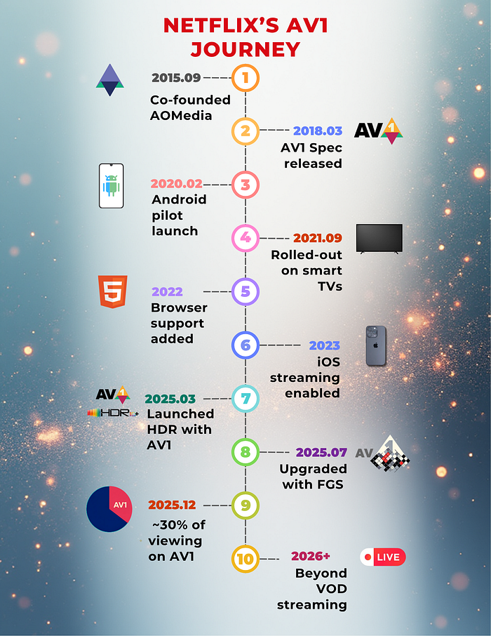

# AV1 — Now Powering 30% of Netflix Streaming

[Liwei Guo](https://www.linkedin.com/in/liwei-guo/), [Zhi Li](https://www.linkedin.com/in/henryzhili/), [Sheldon Radford](https://www.linkedin.com/in/sheldon-radford/), [Jeff Watts](https://www.linkedin.com/in/jeffrwatts/)

Streaming video has become an integral part of our daily lives. At Netflix, our top priority is delivering the best possible entertainment experience to our members, regardless of their devices or network conditions. One of the key technologies enabling this is [AV1](https://aomedia.org/specifications/av1/), a modern, open video codec that is rapidly transforming both how we stream content and how users experience it. Today, AV1 powers approximately 30% of all Netflix viewing, marking a major milestone in our efforts to bring more efficient and higher-quality streaming to our members.

In this post, we’ll revisit Netflix’s AV1 journey to date, highlight emerging use cases, and share adoption trends across the device ecosystem. Having witnessed AV1’s significant impact，and with [AV2 on the horizon](https://aomedia.org/press%20releases/AOMedia-Announces-Year-End-Launch-of-Next-Generation-Video-Codec-AV2-on-10th-Anniversary/), we’re more excited than ever about how open codecs will continue to revolutionize streaming for everyone.

## AV1: A Modern, Open Codec

Since entering the streaming business in 2007, Netflix has primarily relied on H.264/AVC as its streaming format. However, we quickly recognized that a modern, open codec would benefit not only Netflix, but the entire multimedia industry. In 2015, together with a group of like-minded industry leaders, Netflix co-founded the [Alliance for Open Media (AOMedia)](https://aomedia.org/) to develop and promote next generation, open source media technologies. The AV1 codec became the first major project of this collaboration, with ambitious goals: to deliver significant improvements in compression efficiency over state-of-the-art codecs, and to introduce rich features that enable new use cases. After three years of collaborative development, AV1 was officially released in 2018.

## Netflix’s AV1 Journey: From Android to TVs and Beyond

### Piloting on Android Mobile

When we first set out to bring AV1 streaming to Netflix members, Android was the ideal starting point. Android’s flexibility allowed us to quickly integrate a software AV1 decoder using the efficient [dav1d](https://code.videolan.org/videolan/dav1d) library, which was already optimized for ARM chipsets in mobile devices.

AV1’s superior compression efficiency was especially valuable for mobile users, many of whom are mindful of their data usage and network conditions. By adopting AV1, we were able to deliver noticeably better video quality at lower bitrates. For members relying on cellular data, this meant crisper images with fewer compression artifacts, even when bandwidth was limited. [Launching AV1 support on Android](./netflix-now-streaming-av1-on-android-d5264a515202.md) in 2020 marked a significant step forward for Netflix on mobile, making high-quality streaming more accessible and enjoyable for members everywhere.

### Front-and-Center for Netflix VOD Streaming

The success of our AV1 launch on Android proved its value for Netflix streaming, motivating us to expand support to smart TVs and other large-screen devices, where most of our members watch their favorite shows.

Smart TVs depend on hardware decoders for efficient high-quality playback. We worked closely with device manufacturers and SoC vendors to certify these devices, ensuring they are both conformant and performant. This collaborative effort enabled our AV1 streaming to TV devices in [late 2021](./bringing-av1-streaming-to-netflix-members-tvs-b7fc88e42320.md). Shortly thereafter, we expanded AV1 streaming to web browsers (in 2022) and continued to broaden device support. In 2023, this included Apple devices with the introduction of AV1 hardware support in the new M3 and A17 Pro chips.

As more devices began shipping with AV1 hardware support, a rapidly growing share of our members could enjoy the benefits of this advanced codec. Combined with our investment in adding AV1 streams across the entire catalog, AV1 viewing share has been consistently increasing in recent years. Today, AV1 accounts for approximately 30% of all Netflix streaming, making it our second most-used codec — and it’s on track to become number one very soon. The payoff has been substantial.

- **Elevating Streaming Experience Across the Board**: Large-screen TVs and other devices demand higher bitrates to deliver stunning 4K, high frame rate (HFR) experiences. AV1’s superior compression efficiency has allowed us to provide these experiences using less data, making high-quality streaming more accessible and reliable. **On average, AV1 streaming sessions achieve VMAF scores¹ that are 4.3 points higher than AVC and 0.9 points higher than HEVC sessions. At the same time, AV1 sessions use one-third less bandwidth than both AVC and HEVC, resulting in 45% fewer buffering interruptions.** Moreover, Netflix’s diverse content catalog benefits universally from AV1, with improvements across all content types.
- **Driving Network Efficiency Worldwide**: Netflix streams are delivered through our own content delivery network ([Open Connect](https://openconnect.netflix.com/en/?utm_referrer=https%3A%2F%2Fwww.google.com%2F)), in partnership with local ISPs around the globe. With more than 300 million members, Netflix streaming constitutes a non-trivial portion of global internet traffic. Because AV1 is a more efficient codec, its streams are smaller in size (while providing even better visual quality). By shifting a substantial share of our streaming to AV1, we reduce overall internet bandwidth consumption, and lessen system and network load for both Netflix and our partners.

### Unlocking Advanced Experiences

In addition to its superior compression efficiency, AV1 was designed to support a rich set of features. Once we established a robust framework for the continuous expansion of AV1 streaming, we quickly shifted our focus towards exploring AV1’s unique features to unlock even more advanced and immersive experiences for our members.

**High-Dynamic-Range(HDR)  
**HDR brings enhanced detail, vivid colors, and greater clarity to images. As a premium streaming service, Netflix has been a pioneer in adopting HDR, offering HDR streaming since 2016. In March 2025, we launched [AV1 HDR streaming](./hdr10-now-streaming-on-netflix-c9ab1f4bd72b.md). We chose HDR10+ as the HDR format for its use of dynamic metadata, which enabled us to adapt the tone mapping per device in a scene-dependent manner.

As anticipated, the combination of AV1 and HDR10+ allows us to deliver images with greater detail, more vibrant colors, and an overall heightened sense of immersion for our members. At the moment, 85% of our HDR catalog (from the perspective of view-hours) has AV1-HDR10+ coverage, and this number is expected to reach 100% in the next couple of months.

*Photographs of devices displaying the same (cropped) frame with HDR10 metadata (left) and HDR10+ metadata (right). Notice the preservation of the flashlight detail in the HDR10+ capture, and the over-exposure of the region under the flashlight in the HDR10 one.*

**Cinematic Film Grain  
**Film grain is a hallmark of the cinematic experience, widely used in the movie industry to enhance a film’s depth, texture, and realism. However, because film grain is inherently random, faithfully representing it in digital video requires a significant amount of data. This presents a unique challenge for streaming: restricting the bitrate can result in grain that appears unnatural or distorted, while increasing the bitrate to accurately preserve cinematic grain almost inevitably leads to elevated rebuffering. The AV1 specification incorporates a unique solution called Film Grain Synthesis (FGS). **Instead of encoding grain as part of every frame, the grain is stripped out before encoding and then resynthesized at the decoder using parameters sent in the bitstream, delivering a realistic cinematic film grain experience without the usual data costs.**

This approach represents a significant shift from traditional compression and streaming techniques. Our team invested substantial effort in fine-tuning the media processing pipeline, ensuring FGS delivers robust performance at scale. In July 2025, we successfully [productized AV1 FGS](./av1-scale-film-grain-synthesis-the-awakening-ee09cfdff40b.md), and the results were astonishing: AV1 with FGS could deliver videos with cinematic film grain at a bitrate well within the capabilities of typical household internet connections. For non-FGS AV1 encodings, even at much higher bitrate, they may not be able to achieve comparable quality.

*The same (cropped) frame from source (left), regular AV1 stream encoded at 8274kbps (middle) and AV1 FGS stream encoded at 2804 kbps (right). The AV1 FGS stream reduces the bitrate by 66% while delivering clearly better quality.*

### Beyond VOD Streaming

So far, our AV1 journey has been mainly on VOD, but we see significant opportunities for AV1 beyond traditional VOD streaming. On a mission to entertain the world, Netflix has constantly explored and established other ways to bring joy to our members, and we believe AV1 could contribute to the success of these new products.

**Live Streaming  
**Debuting in 2023, live streaming has experienced [rapid growth](https://help.netflix.com/en/node/129840) at Netflix, becoming a key part of our streaming offerings in just two short years. We are actively evaluating the use of AV1 in live streaming, as we believe it could help further scale Netflix’s live programming:

- **Hyper-scale concurrent viewership: **Live streaming at Netflix means delivering content to [tens of millions](https://www.netflix.com/tudum/articles/jake-paul-vs-mike-tyson-live-release-date-news) of viewers simultaneously. AV1’s superior compression efficiency could significantly reduce the required bandwidth, enabling us to deliver high-quality live experiences to large audiences without compromising video quality.
- **Customizable graphics overlay**: for **live sport events such as football, tennis and boxing**, graphics overlays have become an integral part of the member experience — from embedding game statistics to delivering sponsorships. AV1 offers an opportunity to make the graphics highly customizable: layered coding is supported in AV1’s main profile, allowing encoding the main content in the base layer, and graphics in the enhancement layer, and easily swapping out one version of the enhancement layer with another. We envision that the use of AV1’s layered coding can greatly simplify the live streaming workflow and reduce delivery costs.

**Cloud Gaming  
**Cloud gaming is a new Netflix offering that is currently in the [beta phase](https://help.netflix.com/en/node/132197) and is available to members in select countries. The game engines run on cloud servers, while the rendered graphics are streamed directly to members’ devices. By removing barriers and transforming every Netflix-enabled device into a game console, Cloud gaming aims to deliver a seamless, “play anywhere” experience for our members. For a glimpse of this in action, [watch as Co-CEO Greg Peters and CTO Elizabeth Stone play a round of Boggle Party — powered entirely by Netflix’s cloud gaming platform](https://www.linkedin.com/feed/update/urn:li:activity:7382077927875825664/)!

Unlike traditional video streaming, cloud gaming requires that every player action is reflected instantly on the screen to ensure a responsive and immersive experience. This makes delivering high-quality video frames with extremely low latency, despite fluctuating network conditions, one of the biggest challenges in cloud gaming.

Our team is actively working on productizing AV1 for cloud gaming. Given AV1’s high compression efficiency, we can reduce frame sizes, helping video frames get through even when network conditions become challenging. This positions AV1 as a promising technology for enabling a high-quality, low-latency gaming experience across a wide range of devices.

## A Device Ecosystem United for AV1

Netflix is a streaming company, and we have worked diligently to create highly efficient and standards-conformant AV1 streams for our catalog. However, an equally, if not more, important factor in AV1’s success is the widespread support from device manufacturers. Throughout our AV1 journey, we have been impressed by the unprecedented pace at which the device ecosystem has embraced AV1.

Just six months after the AV1 specification was finalized, the open-source AV1 decoder library sponsored by AOM, dav1d, was released. Small, performant, and highly resource-efficient, dav1d bridged the gap for early adopters like Netflix while hardware solutions were still in development. Continuous improvements to its performance and compatibility have made dav1d the preferred choice for a wide range of platforms and practical applications. Today, it serves as [Android’s default software decoder](https://aomedia.org/av1-adoption-showcase/google-story/). Additionally, it plays a key role in web browsers — for Netflix, it powers approximately 40% of our browser playback. This broad adoption has significantly expanded access to high-quality AV1 streaming, even in the absence of dedicated hardware decoders.

Netflix maintains a close working relationship with device manufacturers and SoC vendors, and we have witnessed first-hand their enthusiasm for adopting AV1. To ensure optimal streaming performance, Netflix has a rigorous certification process to verify proper support for our streaming formats on devices. AV1 was added to this certification process in 2019, and since then, we have seen a steady increase in the number of devices with full AV1 decoding capabilities. Over the past five years (2021–2025), 88% of large-screen devices, including TVs, set-top boxes, and streaming sticks, submitted for Netflix certification have supported AV1, with the vast majority offering full 4K@60fps capability. Notably, since 2023, almost all devices we have received for certification are AV1-capable.

We have also been impressed by the robustness of AV1 implementations across these devices. As mentioned earlier, FGS is an innovative tool that departs from traditional codec architectures and was not included in our initial full-scale AV1 streaming rollout. When we launched FGS this July, we worked closely with our partners to ensure broad device compatibility. We are pleased with the successful progress made, and AV1 with FGS is now supported across a significant and growing number of in-field devices.

## Looking Ahead: AV1 Today, AV2 Tomorrow

As we reflect on our AV1 journey, it’s clear that the codec has already transformed the streaming experience for hundreds of millions of Netflix members worldwide. Thanks to industry-wide collaboration and rapid device adoption, AV1 is delivering higher quality, greater efficiency, and new cinematic features to more screens than ever before.

Looking ahead, we are excited about the forthcoming release of AV2, announced by the Alliance for Open Media for the end of 2025. [AV2 is poised to set a new benchmark for compression efficiency and streaming capabilities, building on the solid foundation laid by AV1](https://www.youtube.com/watch?v=RUMwMe_2Dqo). At Netflix, we remain committed to adopting the best open technologies to delight our members around the globe. While AV2 represents the future of streaming, AV1 is very much the present — serving as the backbone of our platform and powering exceptional entertainment experiences across a vast and ever-expanding ecosystem of devices.

## Acknowledgement

The success of AV1 at Netflix is the result of the dedication, expertise, and collaboration of many teams across the company — including Encoding, Clients, Device Certification, Partner Engineering, Data Science & Engineering, Infra, Platform, etc.

We would also like to thank [Artem Danylenko](https://www.linkedin.com/in/artemdanylenko/), [Aditya Mavlankar](https://www.linkedin.com/in/aditya-mavlankar-7139791/), [Anne Aaron](https://www.linkedin.com/in/anne-aaron/), [Cyril Concolato](https://www.linkedin.com/in/cyril-concolato-567a522/), [Allan Zhou](https://www.linkedin.com/in/allanzp/) and [Anush Moorthy](https://www.linkedin.com/in/anush-moorthy-b8451142/) for their valuable comments and feedback on earlier drafts of this post.

## Footnotes

1. These numbers represent a snapshot of data from November 13, 2025. Actual values may vary slightly from day to day and across different regions, depending on the mix of content, devices, and internet connectivity.

---
**Tags:** Av1 · Video Encoding · Streaming · Aomedia · Netflix
