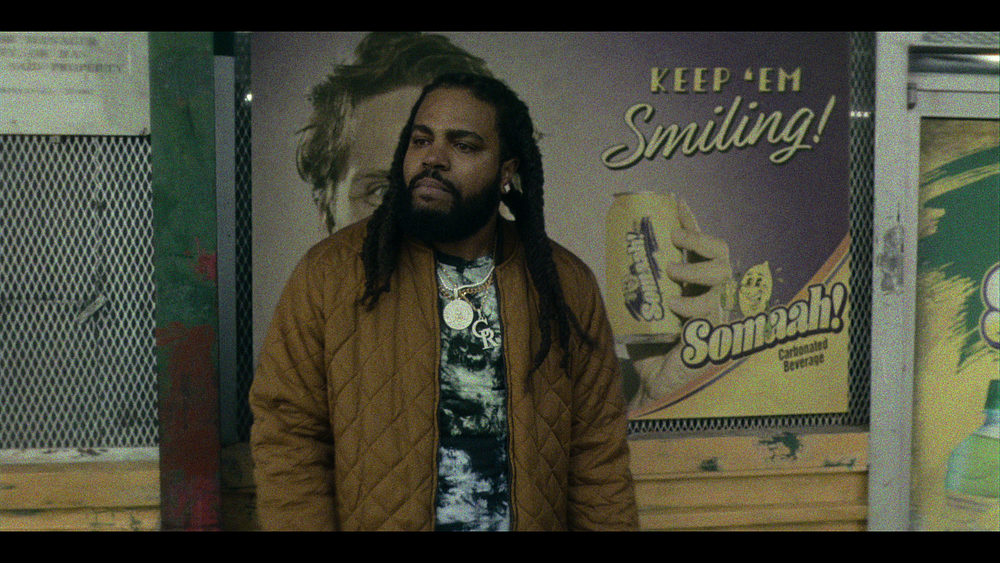
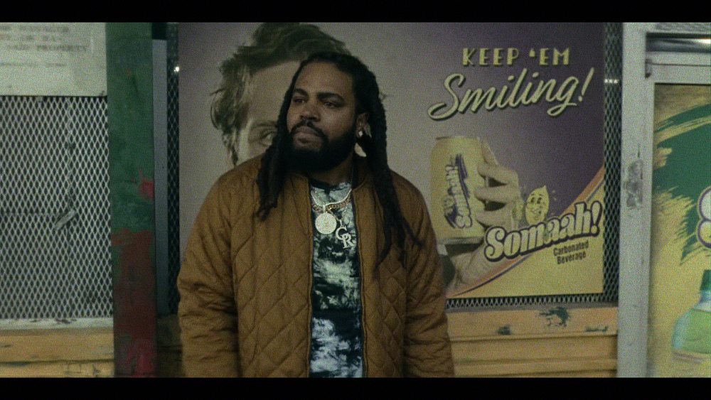
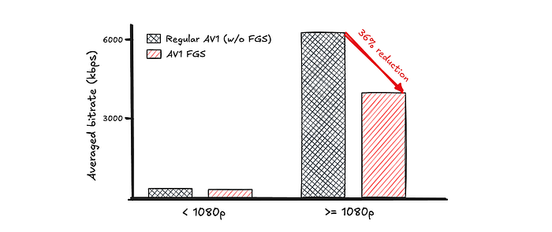

# AV1 @ Scale: Film Grain Synthesis, The Awakening

> Unleashing Film Grain Synthesis on Netflix and Enhancing Visuals for Millions

[Li-Heng Chen](https://www.linkedin.com/in/li-heng-chen-a75458a2/), [Andrey Norkin](https://www.linkedin.com/in/andreynorkin/), [Liwei Guo](https://www.linkedin.com/in/liwei-guo/), [Zhi Li](https://www.linkedin.com/in/henryzhili/), [Agata Opalach](https://www.linkedin.com/in/agataopalach/) and [Anush Moorthy](https://www.linkedin.com/in/anush-moorthy-b8451142/)

**Picture this: you’re watching a classic film, and the subtle dance of film grain adds a layer of authenticity and nostalgia to every scene.** This grain, formed from tiny particles during the film’s development, is more than just a visual effect. It plays a key role in storytelling by enhancing the film’s depth and contributing to its realism. However, film grain is as elusive as it is beautiful. Its random nature makes it notoriously difficult to compress. Traditional compression algorithms struggle to manage it, often forcing a choice between preserving the grain and reducing file size.

In the digital age, noise remains a ubiquitous element in video content. Camera sensor noise introduces its own characteristics, while filmmakers often add intentional grain during post-production to evoke mood or a vintage feel. These elements create a visually rich experience that tests conventional compression methods.

**We’re giving members globally a transformed streaming experience with the recent rollout of AV1 Film Grain Synthesis (FGS) streams. While FGS has been part of the AV1 standard since its inception, we only enabled it for a limited number of titles during ****[our initial launch of the AV1 codec in 2021](./bringing-av1-streaming-to-netflix-members-tvs-b7fc88e42320.md)****. Now, we’re enabling this innovative technology at scale, leveraging it to preserve the artistic integrity of film grain while optimizing data efficiency. In this blog post, we’ll explore how FGS revolutionizes video streaming and enhances your viewing experience.**

## Understanding Film Grain Synthesis in AV1

The AV1 Film Grain Synthesis tool models film grain through two key components, with model parameters estimated before the encoding of the denoised video:

**Film Grain Pattern**: an _auto-regressive (AR) model_ is used to replicate the pattern of film grain. The key parameters are the AR coefficients, which can be estimated from the residual between the source video and the denoised video, essentially capturing the noise. This model captures the spatial correlation between the grain samples, ensuring that the noise characteristics of the original content are accurately preserved. By adjusting the auto-regressive coefficients {ai}, the model can control the grain’s shape, making it appear coarser or finer. With these coefficients, a 64x64 noise template is generated, as illustrated in the animation below. To construct the noise layer during playback, random 32x32 patches are extracted from the 64x64 noise template and added to the decoded video.

*Fig. 1 The synthesis process of the 64x64 noise template using the simplest AR kernel with a lag parameter L=1. Each noise value is calculated as a linear combination of previously synthesized noise sample values, with AR coefficients a0, a1, a2, a3 and a white Gaussian noise (wgn) component.*

**Film Grain Intensity**: a _scaling function_ is employed to control the grain’s appearance under varying lighting conditions. This function, estimated during the encoding process, models the relationship between pixel value and noise intensity using a piecewise linear function. This allows for precise adjustments to the grain strength based on video brightness and color. Consequently, the film grain strength is adapted to the areas of the picture, closely recreating the look of the original video. The animation below demonstrates how the grain intensity is adjusted by the scaling function:

*Fig. 2 Illustration of the scaling function’s impact on film grain intensity. Left: The scaling function graph showing the relationship between pixel value and scaling intensity. Right: A grayscale SMPTE bars frame with film grain applied according to the scaling function.*

With these models specified by AV1 standard, the encoding process first removes the film grain from the video. The standard does not mandate a specific method for this step, allowing users to choose their preferred denoiser. Following the denoising, the video is compressed, and the grain’s pattern and intensity are estimated and transmitted alongside the compressed video data. During playback, the film grain is recreated and reintegrated into the video using a block-based method. This approach is optimized for consumer devices, ensuring smooth playback and high-quality visuals. For a more detailed explanation, please refer to the [original paper](https://norkin.org/pdf/DCC_2018_AV1_film_grain.pdf).

By combining these components, the AV1 Film Grain Synthesis tool preserves the artistic integrity of film grain while making the content “easier to compress” by denoising the source video prior to encoding. This process enables high-quality video streaming, even in content with heavy grain, resulting in significant bitrate savings and improved visual quality.

## Visual Quality Improvement, Bitrate Reduction, and Member Benefits

In our pursuit of premium streaming quality, enabling AV1 Film Grain Synthesis has led to significant bitrate reduction, allowing us to deliver high-quality video with less data while preserving the artistic integrity of film grain. Below, we showcase visual examples highlighting the improved quality and reduced bitrate, using a frame from the Netflix title [_They Cloned Tyrone_](https://www.netflix.com/title/80996324):

*A source video frame from They Cloned Tyrone*

*Regular AV1 (without FGS) @ 8274 kbps*

*AV1 with FGS @ 2804 kbps*

The visual comparison highlights a significant bitrate reduction of approximately 66%, with regular AV1 encoding at 8274 kbps compared to AV1 with FGS at 2804 kbps. In this example, which features strong film grain, it may be observed that the regular version exhibits distorted noise with a discrete cosine transform (DCT)-like pattern. In contrast, the FGS version preserves the integrity of the film grain at a lower bitrate.

Additionally, synthesized noise effectively masks compression artifacts, resulting in a more visually appealing experience. In this comparison below, both the regular AV1 stream and the AV1 FGS stream without synthesized noise (equivalent to compressing the denoised video) show compression artifacts. In contrast, the AV1 FGS stream with grain synthesis (rightmost figure) improves visual quality through contrast masking in human visual systems. The added film grain, a form of mask, effectively conceals some compression artifacts.

*Cropped frame comparison: Regular AV1 stream (Left), AV1 FGS stream without grain synthesis during decoding (Middle), and AV1 FGS stream with grain synthesis (Right).*

Currently, we lack a dedicated quality model for film grain synthesis. The noise appearing at different pixel locations between the source and decoded video poses challenges for pixelwise comparison methods like [PSNR](https://en.wikipedia.org/wiki/Peak_signal-to-noise_ratio) or [VMAF](https://netflixtechblog.com/toward-a-practical-perceptual-video-quality-metric-653f208b9652), leading to penalized quality scores. Despite this, our internal assessment highlights the improvements in visual quality and the value of these advancements.

To evaluate the impact of AV1 Film Grain Synthesis, we selected approximately 300 titles from the Netflix catalog, each with varying levels of graininess. The bar chart below illustrates a 36% reduction in average bitrate for resolutions of 1080p and above when AV1 film grain synthesis is enabled, highlighting its efficacy in optimizing data usage. For resolutions below 1080p, the reduction in bitrate is relatively small, reaching only a 10% decrease, likely because noise is filtered out during the downscaling process. Furthermore, enabling the film grain synthesis coding tool consistently introduces syntax overhead to the bitstream.

*Fig. 3: Comparison of average values across resolution categories between regular AV1 streams (without film grain synthesis) and AV1 streams with film grain synthesis enabled.*

Finally, we conducted A/B testing prior to rollout to understand the overall streaming impact of enabling AV1 Film Grain Synthesis. This testing showcased a smoother and more reliable Quality of Experience (QoE) for our members. The improvements include:

- **Lower Initial and Average Bitrate**: Bitrate at the start of the playback reduced by 24% and average bitrate by 31.6%, lower network bandwidth requirements and reduced storage needs for downloaded streams.
- **Decreased Playback Errors**: Playback error rate reduced by approximately 3%.
- **Reduced Rebuffering**: 10% fewer rebuffers and a 5% reduction in rebuffer duration resulting from the lower bitrate.
- **Faster Start Play**: Start play delay reduced by 10%, potentially due to the lower bitrate, which may help devices reach the target buffer level more quickly.
- **Improved Playback Stability**: Observed 10% fewer noticeable bitrate drops and a 10% reduction in the time users spend adjusting their playback position during video playback, likely influenced by reduced bitrate and rebuffering.
- **Higher Resolution Streaming**: About 0.7% of viewing hours shifted from lower resolutions (≤ 1080p) to 2160p on 4K-capable devices. This shift is attributed to reduced bitrates at switching points, which make it easier to achieve the highest resolution during a session.

## Behind the Scenes: Our Film Grain Adventure Continues

We’re always excited to share our progress with the community. This blog provides an overview of our journey: from the initial launch of the AV1 codec to the recent addition of Film Grain Synthesis (FGS) streams, highlighting the impact these innovations have on Netflix’s streaming quality. Since March, we’ve been rolling out FGS across scale, and many users can now enjoy the FGS-enabled streams, provided their device supports this feature. We encourage you to watch some of the author’s favorite titles [The Hot Spot](https://www.netflix.com/title/81985186), [Kung Fu Cult Master](https://www.netflix.com/title/70018511), [Initial D](https://www.netflix.com/title/70043379), [God of Gamblers II](https://www.netflix.com/title/70005331), [Baahubali 2: The Conclusion](https://www.netflix.com/title/80203996), or [Dept. Q](https://www.netflix.com/title/81487660) (you may need to toggle off HDR from the settings menu) on Netflix to experience the new FGS streams firsthand.

In the next post, we will share how we did this in [our video encoding pipeline](./rebuilding-netflix-video-processing-pipeline-with-microservices-4e5e6310e359.md), detailing the process and insights we’ve gained. Stay tuned to the [Netflix Tech Blog](https://netflixtechblog.com/) for the latest updates.

## Acknowledgments

This achievement is the result of a collaborative effort among several Open Connect teams at Netflix, including Video Algorithms, Media Encoding Pipeline, Media Foundations, Infrastructure Capacity Planning, and Open Connect Control Plane. We also received invaluable support from Client & Partner Technologies, Streaming & Discovery Experiences, Media Compute & Storage Infrastructure, Data Science & Engineering, and the Global Production Technology team. We would like to express our sincere gratitude to the following individuals for their contributions to the project’s success:

- Prudhvi Kumar Chaganti and Ken Thomas for the discussion and assistance on rollout strategy
- Poojarani Chennai Natarajan, Lara Deek , Ivan Ivanov, and Ishaan Shastri for their essential support in planning and operations for Open Connect.
- Alex Chang for his support in everything related to data analysis, and Jessica Tweneboah and Amelia Taylor for their assistance with AB testing.
- David Zheng, Janet Xue, Scott Bolter, Brian Li, Allan Zhou, Vivian Li, Sarah Kurdoghlian, Artem Danylenko, Greg Freedman, and many other dedicated team members played a crucial role in device certification and collaboration with device partners. Their efforts significantly improved compatibility across platforms. (Spoiler alert: this was one of the biggest challenges we faced for productizing AV1 FGS!)
- Javier Fernandez-Ivern and Ritesh Makharia expertly managed the playback logic
- Joseph McCormick and JD Vandenberg for providing valuable insights from a content production point of view, and Alex ‘Ally’ Michaelson for assisting in monitoring customer service.
- A special thanks to Roger Quero, who played a key role in supporting various aspects of the project and contributed significantly to its overall success while he was at Netflix.

---
**Tags:** Streaming · Videos · Video Encoding · Microservices
