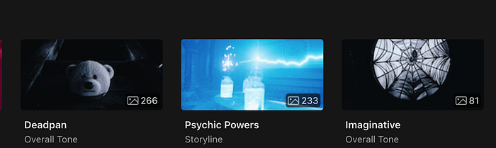
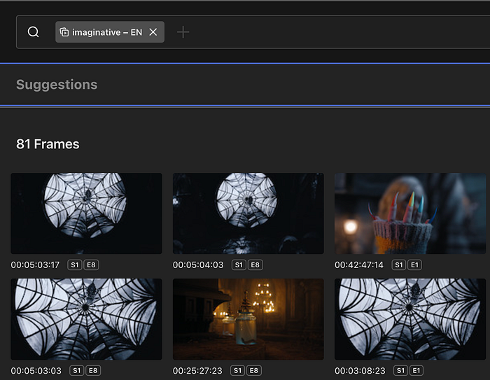
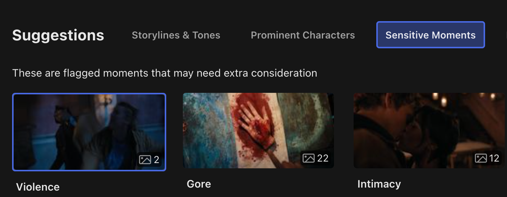
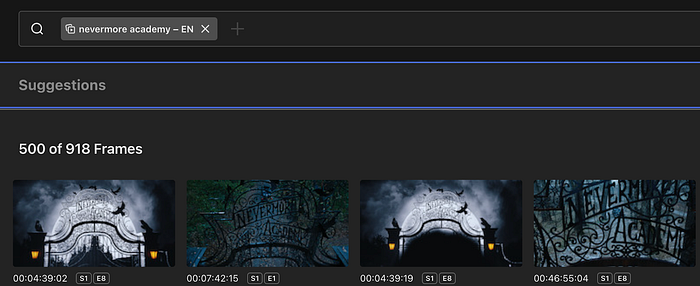
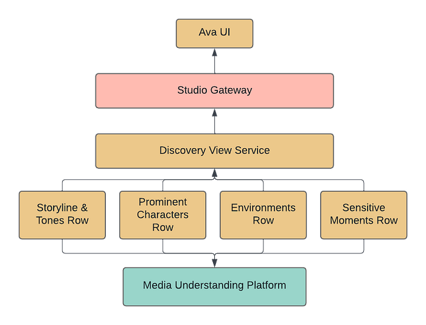
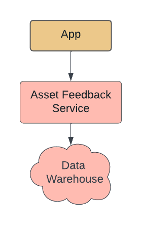

# AVA Discovery View: Surfacing Authentic Moments

By: [Hamid Shahid](https://www.linkedin.com/in/hamidshahid), [Laura Johnson](https://www.linkedin.com/in/ljworks34/), [Tiffany Low](https://www.linkedin.com/in/tiffany-low/)

## Synopsis

At Netflix, we have created millions of artwork to represent our titles. Each artwork tells a story about the title it represents. From our [testing on promotional assets](https://netflixtechblog.com/selecting-the-best-artwork-for-videos-through-a-b-testing-f6155c4595f6), we know which of these assets have performed well and which ones haven’t. Through this, our teams have developed an intuition of what visual and thematic artwork characteristics work well for what genres of titles. A piece of promotional artwork may resonate more in certain regions, for certain genres, or for fans of particular talent. The complexity of these factors makes it difficult to determine the best creative strategy for upcoming titles.

Our assets are often created by selecting static image frames directly from our source videos. To improve it, we decided to invest in creating a [Media Understanding Platform](./building-a-media-understanding-platform-for-ml-innovations-9bef9962dcb7.md), which enables us to extract meaningful insights from media that we can then surface in our creative tools. In this post, we will take a deeper look into one of these tools, AVA Discovery View.

## Intro to AVA Discovery View

AVA is an internal tool that surfaces still frames from video content. The tool provides an efficient way for creatives (photo editors, artwork designers, etc.) to pull moments from video content that authentically represent the title’s narrative themes, main characters, and visual characteristics. These still moments are used by multiple teams across Netflix for artwork (on and off the Netflix platform), Publicity, Marketing, Social teams, and more.

Stills are used to merchandise & publicize titles authentically, providing a diverse set of entry points to members who may watch for different reasons. For example, for our hit title “_Wednesday”_, one member may watch it because they love mysteries, while another may watch because they love coming-of-age stories or goth aesthetics. Another member may be drawn by talent. It’s a creative’s job to select frames with all these entry points in mind. Stills may be enhanced and combined to create a more polished piece of artwork or be used as is. For many teams and titles, Stills are essential to Netflix’s promotional asset strategy.

Watching every moment of content to find the best frames and select them manually takes a lot of time, and this approach is often not scalable. While frames can be saved manually from the video content, AVA goes beyond providing the functionality to surface authentic frames — it suggests the best moments for creatives to use: enter AVA Discovery View.

## Example of AVA Discovery View

AVA’s imagery-harvesting algorithms pre-select and group relevant frames into categories like _Storylines & Tones_, _Prominent Characters,_ and _Environments_.

Let’s look deeper at how different facets of a title are shown in one of Netflix’s biggest hits — “_Wednesday”_.

### Storyline / Tone

The title _“Wednesday”_ involves a character with supernatural abilities sleuthing to solve a mystery. The title has a dark, imaginative tone with shades of wit and dry humor. The setting is an extraordinary high school where teenagers of supernatural abilities are enrolled. The main character is a teenager and has relationship issues with her parents.

The paragraph above provides a short glimpse of the title and is similar to the briefs that our creatives have to work with. Finding authentic moments from this information to build the base of the artwork suite is not trivial and has been very time-consuming for our creatives.

This is where AVA Discovery View comes in and functions as a creative assistant. Using the information about the storyline and tones associated with a title, it surfaces key moments, which not only provide a nice visual summary but also provide a quick landscape view of the title’s main narrative themes and its visual language.

*Storyline & Tone suggestions*

Creatives can click on any storyline to see moments that best reflect that storyline and the title’s overall tone. For example, the following images illustrate how it displays moments for the “imaginative” tone.

### Prominent Characters

Talent is a major draw for our titles, and our members want to see who is featured in a title to choose whether or not they want to watch that title. Getting to know the prominent characters for a title and then finding the best possible moments featuring them used to be an arduous task.

With the AVA Discovery View, all the prominent characters of the title and their best possible shots are presented to the creatives. They can see how much a character is featured in the title and find shots containing multiple characters and the best possible stills for the characters themselves.

### Sensitivities

We don’t want the Netflix home screen to shock or offend audiences, so we aim to avoid artwork with violence, nudity, gore or similar attributes.

To help our creatives understand content sensitivities, AVA Discovery View lists moments where content contains gore, violence, intimacy, nudity, smoking, etc.

*Sensitive Moments*

### Environments

The setting and the filming location often provide great genre cues and form the basis of great-looking artwork. Finding moments from a virtual setting in the title or the actual filming location required a visual scan of all episodes of a title. Now, AVA Discovery View shows such moments as suggestions to the creatives.

For example, for the title “_Wednesday”_, the creatives are presented with “Nevermore Academy” as a suggested environment

*Suggested Environment — Nevermore Academy*

## Challenges

### Algorithm Quality

AVA Discovery View included several different algorithms at the start, and since its release, we have expanded support to additional algorithms. Each algorithm needed a process of evaluation and tuning to get great results in AVA Discovery View.

**For Visual Search**

- We found that the model was influenced by the text present in the image. For example, stills of title credits would often get picked up and highly recommended to users. We added a step where such stills with text results would be filtered out and not present in the search.
- We also found that users preferred results that had a confidence threshold cutoff applied to them.

**For Prominent Characters**

- **We found that our current algorithm model did not handle animated faces well. As a result, we often find that poor or no suggestions are returned for animated content.**

**For Sensitive Moments**

- We found that setting a high confidence threshold was helpful. The algorithm was originally developed to be sensitive to bloody scenes, and when applied to scenes of cooking and painting, often flagged as false positives.

One challenge we encountered was the repetition of suggestions. Multiple suggestions from the same scene could be returned and lead to many visually similar moments. Users preferred seeing only the best frames and a diverse set of frames.

- We added a ranking step to some algorithms to mark frames too visually similar to higher-ranked frames. These duplicate frames would be filtered out from the suggestions list.
- However, not all algorithms can take this approach. We are exploring using scene boundary algorithms to group similar moments together as a single recommendation.

### Suggestion Ranking

AVA Discovery View presents multiple levels of algorithmic suggestions, and a challenge was to help users navigate through the best-performing suggestions and avoid selecting bad suggestions.

- The suggestion categories are presented based on our users’ workflow relevance. We show Storyline/Tone, Prominent Characters, Environments, then Sensitivities.
- Within each suggestion category, we display suggestions ranked by the number of results and tie break along the confidence threshold.

### Algorithm Feedback

As we launched the initial set of algorithms for AVA Discovery View, our team interviewed users about their experiences. We also built mechanisms within the tool to get explicit and implicit user feedback.

**Explicit Feedback**

- For each algorithmic suggestion presented to a user, users can click a thumbs up or thumbs down to give direct feedback.

**Implicit Feedback**

- We have tracking enabled to detect when an algorithmic suggestion has been utilized (downloaded or published for use on Netflix promotional purposes).
- This implicit feedback is much easier to collect, although it may not work for all algorithms. For example, suggestions from Sensitivities are meant to be content watch-outs that should not be used for promotional purposes. As a result, this row does poorly on implicit feedback as we do not expect downloads or publish actions on these suggestions.

This feedback is easily accessible by our algorithm partners and used in training improved versions of the models.

### Intersection Queries across Multiple Algorithms

Several media understanding algorithms return clip or short-duration video segment suggestions. We compute the timecode intersections against a set of known high-quality frames to surface the best frame within these clips.

We also rely on intersection queries to help users narrow a large set of frames to a specific moment. For example, returning stills with two or more prominent characters or filtering only indoor scenes from a search query.

## Technical Architecture

### Discovery View Plugin Architecture

*Discovery View Plugin Architecture*

We built Discovery View as a pluggable feature that could quickly be extended to support more algorithms and other types of suggestions. Discovery View is available via Studio Gateway for AVA UI and other front-end applications to leverage.

### Unified Interface for Discovery

All Discovery View rows implement the same interface, and it’s simple to extend it and plug it into the existing view.

**Scalable Categories  
**In the Discovery View feature, we dynamically hide categories or recommendations based on the results of algorithms. Categories can be hidden if no suggestions are found. On the other hand, for a large number of suggestions, only top suggestions are retrieved, and users have the ability to request more.

**Graceful Failure Handling  
**We load Discovery View suggestions independently for a responsive user experience.

### Asset Feedback MicroService

*Asset Feedback MicroService*

We identified that Asset Feedback is a functionality that is useful elsewhere in our ecosystem as well, so we decided to create a separate microservice for it. The service serves an important function of getting feedback about the quality of stills and ties them to the algorithms. This information is available both at individual and aggregated levels for our algorithm partners.

## Media Understanding Platform

AVA Discovery View relies on the Media Understanding Platform (MUP) as the main interface for algorithm suggestions. The key features of this platform are

### Uniform Query Interface

Hosting all of the algorithms in AVA Discovery View on MUP made it easier for product integration as the suggestions could be queried from each algorithm similarly

### Rich Query Feature Set

We could test different confidence thresholds per algorithm, intersect across algorithm suggestions, and order suggestions by various fields.

### Fast Algo Onboarding

Each algorithm took fewer than two weeks to onboard, and the platform ensured that new titles delivered to Netflix would automatically generate algorithm suggestions. Our team was able to spend more time evaluating algorithm performance and quickly iterate on AVA Discovery View.

To learn more about MUP, please see a previous blog post from our team: [Building a Media Understanding Platform for ML Innovations](./building-a-media-understanding-platform-for-ml-innovations-9bef9962dcb7.md).

## Impact

Discovering authentic moments in an efficient and scalable way has a huge impact on Netflix and its creative teams. AVA has become a place to gain title insights and discover assets. It provides a concise brief on the main narratives, the visual language, and the title’s prominent characters. An AVA user can find relevant and visually stunning frames quickly and easily and leverage them as a context-gathering tool.

## Future Work

To improve AVA Discovery View, our team needs to balance the number of frames returned and the quality of the suggestions so that creatives can build more trust with the feature.

### Eliminating Repetition

AVA Discovery View will often put the same frame into multiple categories, which results in creatives viewing and evaluating the same frame multiple times. How can we solve for an engaging frame being a part of multiple groupings without bloating each grouping with repetition?

### Improving Frame Quality

We’d like to only show creatives the best frames from a certain moment and work to eliminate frames that have either poor technical quality (a poor character expression) or poor editorial quality (not relevant to grouping, not relevant to narrative). Sifting through frames that aren’t up to quality standards creates user fatigue.

### Building User Trust

Creatives don’t want to wonder whether there’s something better outside an AVA Discovery View grouping or if anything is missing from these suggested frames.

When looking at a particular grouping (like “_Wednesday”’s_ _Solving a Mystery_ or _Gothic_), creatives need to trust that it doesn’t contain any frames that don’t belong there, that these are the best quality frames, and that there are no better frames that exist in the content that isn’t included in the grouping. Suppose a creative is leveraging AVA Discovery View and doing separate manual work to improve frame quality or check for missing moments. In that case, AVA Discovery View hasn’t yet fully optimized the user experience.

## Acknowledgment

Special thanks to [Abhishek Soni](https://www.linkedin.com/in/abhisheks0ni/), [Amir Ziai](https://www.linkedin.com/in/amirziai/), [Andrew Johnson](https://www.linkedin.com/in/andrea-johnson-01535946/), [Ankush Agrawal](https://www.linkedin.com/in/ankushagrawal94/), [Aneesh Vartakavi](https://www.linkedin.com/in/aneeshvartakavi/), [Audra Reed](https://www.linkedin.com/in/audra-reed-83a0007/), [Brianda Suarez](https://www.linkedin.com/in/briandasg/), [Faraz Ahmad](https://www.linkedin.com/in/farazamiruddin/), [Faris Mustafa](https://www.linkedin.com/in/farisito/), [Fifi Maree](https://www.linkedin.com/in/fifi-mar%C3%A9e/), [Guru Tahasildar](https://www.linkedin.com/in/gurutahasildar/), [Gustavo Carmo](https://www.linkedin.com/in/gucarmo/), [Haley Jones Phillips](https://www.linkedin.com/in/haleyjonesphillips/), [Janan Barge](https://www.linkedin.com/in/jananbarge/), [Karen Williams](https://www.linkedin.com/in/karenannwilliams/), [Laura Johnson](https://www.linkedin.com/in/ljworks34/), [Maria Perkovic](https://www.linkedin.com/in/maria-perkovic/), [Meenakshi Jindal](https://www.linkedin.com/in/meenakshijindal/), [Nagendra Kamath](https://www.linkedin.com/in/nagendrak/), [Nicola Pharoah](https://www.linkedin.com/in/nicolapharoah/), [Qiang Liu](https://www.linkedin.com/in/qiang-liu-7a18b32a/), [Samuel Carvajal](https://www.linkedin.com/in/samuel-carvajal/), [Shervin Ardeshir](https://www.linkedin.com/in/shervin-ardeshir/), [Supriya Vadlamani](https://www.linkedin.com/in/supriya-vadlamani/), [Varun Sekhri](https://www.linkedin.com/in/varun-sekhri-087a213/), and [Vitali Kauhanka](https://www.linkedin.com/in/vitalikauhanka/) for making it all possible.

---
**Tags:** Distributed Systems · Media Search · Computer Vision · Machine Learning
