# AVIF for Next-Generation Image Coding

By Aditya Mavlankar, Jan De Cock¹, Cyril Concolato, Kyle Swanson, Anush Moorthy and Anne Aaron

## TL; DR

We need an alternative to JPEG that a) is widely supported, b) has better compression efficiency and c) has a wider feature set. We believe [AV1 Image File Format](https://aomediacodec.github.io/av1-avif/) (AVIF) has the potential. Using the [framework](https://github.com/Netflix/image_compression_comparison) we have open sourced, AVIF compression efficiency can be seen at work and compared against a whole range of image codecs that came before it.

## Image compression at Netflix

Netflix is enjoyed by its members on a variety of devices — smart TVs, phones, tablets, personal computers and streaming devices connected to TV screens. The user interface (UI), intended for browsing the catalog and serving up recommendations, is rich in images and graphics across all device categories. Shown below are screenshots of the Netflix app on iOS as an example.


*Screenshots showing the Netflix UI on iOS (iPhone 7) at the time of this writing.*

Image assets might be [based on still frames from the title](https://netflixtechblog.com/ava-the-art-and-science-of-image-discovery-at-netflix-a442f163af6), special on-set photography or a combination thereof. Assets could also stem from art generated during the production of the feature.

As seen above, image assets typically have _gradients, text _and_ graphics_, for example the Netflix symbol or other title-specific symbols such as “The Witcher” insignia, composited on the image. Such special treatments lead to a variety of peculiarities which do not necessarily arise in natural images. Hard edges, including those with chroma differences on either side of the edge, are common and require good detail preservation, since they typically occur at salient locations and convey important information. Further, there is typically a character or a face in salient locations with a smooth, uncluttered background. Again, preservation of detail on the character’s face is of primary importance. In some cases, the background is textured and complex, exhibiting a wide range of frequencies.

After an image asset is ingested, the compression pipeline kicks in and prepares compressed image assets meant for delivering to devices. The goal is to have the compressed image look as close to the original as possible while reducing the number of bytes required. Given the image-heavy nature of the UI, compressing these images well is of primary importance. **This involves picking, among other things, the right combination of color subsampling, codec, encoder parameters and encoding resolution.**

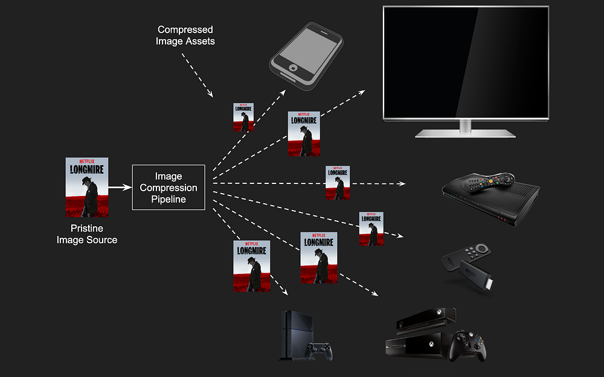
*Compressed image assets destined for various client devices and various spaces in the UI are created from corresponding “pristine” image sources.*

Let us take [color subsampling](https://en.wikipedia.org/wiki/Chroma_subsampling) as an example. Choosing 420 subsampling, over the original 444 format, halves the number of samples (counting across all 3 color planes) that need to be encoded while relying on the fact that the human visual system is more sensitive to luma than chroma. However, 420 subsampling can introduce color bleeding and jaggies in locations with color transitions. Below we toggle between the original source in 444 and the source converted to 420 subsampling. The toggling shows loss introduced just by the color subsampling, even before the codec enters the picture.


*Toggling between the original source image with 444 subsampling and after converting to 420 subsampling. Showing the top part of the artwork only. The reader may zoom in on the webpage to view jaggies around the Netflix logo appearing due to 420 subsampling.*

Nevertheless, there are source images where the loss due to 420 subsampling is not obvious to human perception and in such cases it can be advantageous to use 420 subsampling. Ideally, a codec should be able to support both subsampling formats. However, there are a few codecs that only support 420 subsampling — [webp](https://developers.google.com/speed/webp), discussed below, is one such popular codec.

## Brief overview of image coding formats

The [JPEG format](https://jpeg.org/jpeg/index.html) was introduced in 1992 and is widely popular. It supports various color subsamplings including 420, 422 and 444. JPEG can ingest RGB data and transform it to a luma-chroma representation before performing lossy compression. The discrete cosine transform (DCT) is employed as the decorrelating transform on 8x8 blocks of samples. This is followed by quantization and entropy coding. However, JPEG is restricted to 8-bit imagery and lacks support for alpha channel. The more recent [JPEG-XT](https://jpeg.org/jpegxt/) standard extends JPEG to higher bit-depths, support for alpha channel, lossless compression and more in a backwards compatible way.

The [JPEG 2000 format](https://jpeg.org/jpeg2000/index.html), based on the discrete wavelet transform (DWT), was introduced as a successor to JPEG in the year 2000. It brought a whole range of additional features such as spatial scalability, region of interest coding, range of supported bit-depths, flexible number of color planes, lossless coding, etc. With the motion extension, it was accepted as the [video coding standard for digital cinema](https://xkcd.com/2254/) in 2004.

The [webp](https://gigaom.com/2014/07/19/the-story-of-webp-how-google-wants-to-speed-up-the-web-one-image-at-a-time/) format was introduced by Google around 2010. Google added decoding support on Android devices and Chrome browser and also released libraries that developers could add to their apps on other platforms, for example iOS. Webp is based on intra-frame coding from the [VP8](https://en.wikipedia.org/wiki/VP8) video coding format. Webp does not have all the flexibilities of JPEG 2000. It does, however, support lossless coding and also a lossless alpha channel, making it a more efficient and faster alternative to [PNG](https://www.w3.org/TR/2003/REC-PNG-20031110/) in certain situations.

High-Efficiency Video Coding ([HEVC](https://www.itu.int/rec/T-REC-H.265)) is the successor of H.264, a.k.a. Advanced Video Coding ([AVC](https://www.itu.int/rec/T-REC-H.264/en)) format. HEVC intra-frame coding can be encapsulated in the High-Efficiency Image File Format (HEIF). This format is most notably used by [Apple devices to store recorded imagery](https://support.apple.com/en-us/HT207022).

Similarly, AV1 Image File Format ([AVIF](https://aomediacodec.github.io/av1-avif/)) allows encapsulating AV1 intra-frame coded content, thus taking advantage of excellent compression gains achieved by AV1 over predecessors. We touch upon some appealing technical features of AVIF in the next section.

The JPEG committee is pursuing a coding format called [JPEG XL](https://jpeg.org/jpegxl/index.html) which includes features aimed at helping the transition from legacy JPEG format. Existing JPEG files can be losslessly transcoded to JPEG XL while achieving file size reduction. Also included is a lightweight conversion process back to JPEG format in order to serve clients that only support legacy JPEG.

## AVIF technical features

Although modern video codecs were developed with primarily video in mind, the intraframe coding tools in a video codec are not significantly different from image compression tooling. Given the huge compression gains of modern video codecs, they are compelling as image coding formats. There is a potential benefit in reusing the hardware in place for video compression/decompression. Image decoding in hardware may not be a primary motivator, given the peculiarities of OS dependent UI composition, and architectural implications of moving uncompressed image pixels around.

In the area of image coding formats, the Moving Picture Experts Group (MPEG) has standardized a codec-agnostic and generic image container format: ISO/IEC 23000–12 standard (a.k.a. HEIF). HEIF has been used to store most notably HEVC-encoded images (in its HEIC variant) but is also capable of storing AVC-encoded images or even JPEG-encoded images. The Alliance for Open Media (AOM) has recently extended this format to specify the storage of AV1-encoded images in its AVIF format. The base HEIF format offers typical features expected from an image format such as: support for any image codec, ability to use a lossy or a lossless mode for compression, support for varied subsampling and bit-depths, etc. Furthermore, the format also allows the storage of a series of animated frames (offering an efficient and long-awaited alternative to animated GIFs), and the ability to specify an alpha channel (which sees tremendous use in UIs). Further, since the HEIF format borrows learnings from next-generation video compression, the format allows for preserving metadata such as color gamut and high dynamic range (HDR) information.

## Image compression comparison framework

We have open sourced a Docker based [framework](https://github.com/Netflix/image_compression_comparison) for comparing various image codecs. Salient features include:

1. Encode orchestration (with parallelization) and insights generation using Python 3
2. Easy reproducibility of results and
3. Easy control of target quality range(s).

Since the framework allows one to specify a target quality (using a certain metric) for target codec(s), and stores these results in a local database, one can easily utilize the Bjontegaard-Delta (BD) rate to compare across codecs since the target points can be restricted to a useful or meaningful quality range, instead of blindly sweeping across the encoder parameter range (such as a quality factor) with fixed parameter values and landing on arbitrary quality points.

An an example, below are the calls that would produce compressed images for the choice of codecs at the specified SSIM and VMAF values, with the desired tolerance in target quality:

```
main(metric='ssim', target_arr=[0.92, 0.95, 0.97, 0.99], target_tol=0.005, db_file_name='encoding_results_ssim.db')
main(metric='vmaf', target_arr=[75, 80, 85, 90, 95], target_tol=0.5, db_file_name='encoding_results_vmaf.db')
```

For the various codecs and configurations involved in the ensuing comparison, the reader can view the actual command lines in the shared [repository](https://github.com/Netflix/image_compression_comparison). We have attempted to get the best compression efficiency out of every codec / configuration compared here. The reader is free to experiment with changes to encoding commands within the framework. Furthermore, newer versions of respective software implementations might have been released compared to versions used at the time of gathering below results. For example, a newer software version of Kakadu demo apps is available compared to the one in the [framework](https://github.com/Netflix/image_compression_comparison) snapshot on github used at the time of gathering below results.

## Visual examples

This is the section where we get to admire the work of the compression community over the last 3 decades by looking at visual examples comparing JPEG and the state-of-the-art.

The encoded images shown below are illustrative and meant to compare visual quality at various target bitrates. Please note that the quality of the illustrative encodes is not representative of the high quality bar that Netflix employs for streaming image assets on the actual service, and is meant to be purely educative in nature.

Shown below is one original source image from the Kodak dataset and the corresponding result with **_JPEG 444 @ 20,429 bytes_** and with **_AVIF 444 @ 19,788 bytes_**. The JPEG encode shows very obvious blocking artifacts in the sky, in the pond as well as on the roof. The AVIF encode is much better, with less blocking artifacts, although there is some blurriness and loss of texture on the roof. It is still a remarkable result, given the compression factor of around **_59x_** (original image has dimensions 768x512, thus requiring 768x512x3 bytes compared to the 20k bytes of the compressed image).


*An original image from the Kodak dataset*

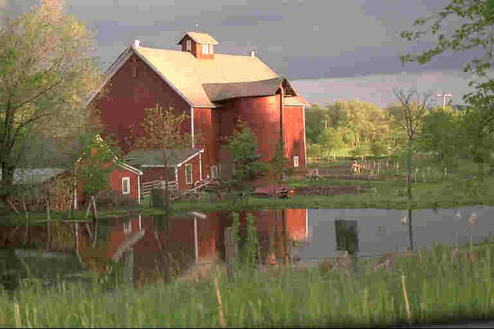
*JPEG 444 @ 20,429 bytes*


*AVIF 444 @ 19,788 bytes*

For the same source, shown below is the comparison of **_JPEG 444 @ 40,276 bytes_** and **_AVIF 444 @ 39,819 bytes_**. The JPEG encode still has visible blocking artifacts in the sky, along with ringing around the roof edges and chroma bleeding in several locations. The AVIF image however, is now comparable to the original, with a compression factor of **_29x_**.

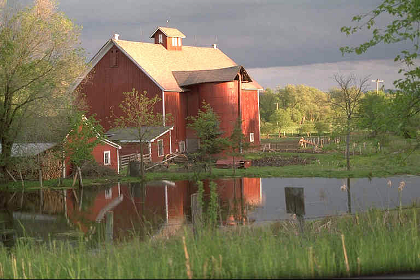
*JPEG 444 @ 40,276 bytes*


*AVIF 444 @ 39,819 bytes*

Shown below is another original source image from the Kodak dataset and the corresponding result with **_JPEG 444 @ 13,939 bytes_** and with **_AVIF 444 @ 4,176 bytes_**. The JPEG encode shows blocking artifacts around most edges, particularly around the slanting edge as well as color distortions. The AVIF encode looks “cleaner” even though it is one-third the size of the JPEG encode. It is not a perfect rendition of the original, but with a compression factor of **_282x_**, this is commendable.


*Another original source image from the Kodak dataset*

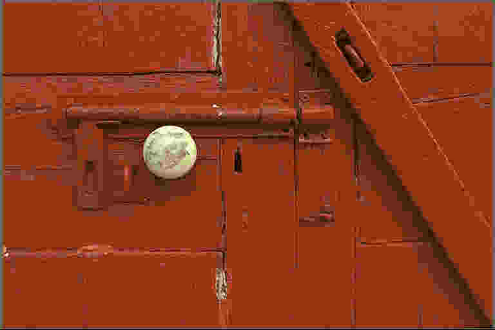
*JPEG 444 @ 13,939 bytes*

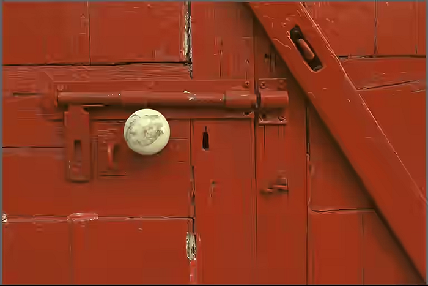
*AVIF 444 @ 4,176 bytes*

Shown below are results for the same image with slightly higher bit-budget; **_JPEG 444 @ 19,787 bytes_** versus **_AVIF 444 @ 20,120 bytes_**. The JPEG encode still shows blocking artifacts around the slanting edge whereas the AVIF encode looks nearly identical to the source.

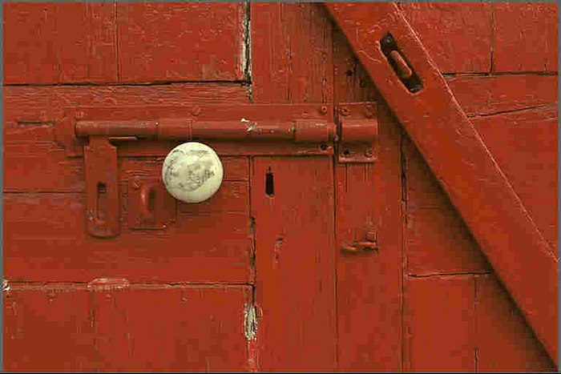
*JPEG 444 @ 19,787 bytes*

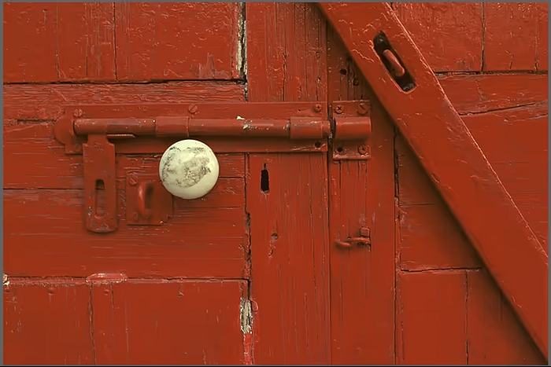
*AVIF 444 @ 20,120 bytes*

Shown below is an original image from the Netflix (internal) 1142x1600 resolution “boxshots-1” dataset. Followed by **_JPEG 444 @ 69,445 bytes_** and **_AVIF 444 @ 40,811 bytes_**. Severe banding and blocking artifacts along with color distortions are visible in the JPEG encode. Less so in the AVIF encode which is actually 29kB smaller.


*An original source image from the Netflix (internal) boxshots-1 dataset*


*JPEG 444 @ 69,445 bytes*


*AVIF 444 @ 40,811 bytes*

Shown below are results for the same image with slightly increased bit-budget. **_JPEG 444 @ 80,101 bytes_** versus **_AVIF 444 @ 85,162 bytes_**. The banding and blocking is still visible in the JPEG encode whereas the AVIF encode looks very close to the original.


*JPEG 444 @ 80,101 bytes*


*AVIF 444 @ 85,162 bytes*

Shown below is another source image from the same boxshots-1 dataset along with **_JPEG 444 @ 81,745 bytes_** versus **_AVIF 444 @ 76,087 bytes_**. Blocking artifacts overall and mosquito artifacts around text can be seen in the JPEG encode.


*Another original source image from the Netflix (internal) boxshots-1 dataset*


*JPEG 444 @ 81,745 bytes*


*AVIF 444 @ 76,087 bytes*

Shown below is another source image from the boxshots-1 dataset along with **_JPEG 444 @ 80,562 bytes_** versus **_AVIF 444 @ 80,432 bytes_**. There is visible banding, blocking and mosquito artifacts in the JPEG encode whereas the AVIF encode looks very close to the original source.


*Another original source image from the Netflix (internal) boxshots-1 dataset*


*JPEG 444 @ 80,562 bytes*


*AVIF 444 @ 80,432 bytes*

## Overall results

Shown below are results over public datasets as well as Netflix-internal datasets. The reference codec used is JPEG from the JPEG-XT reference software, using the standard quantization matrix defined in Annex K of the JPEG standard. Following are the codecs and/or configurations tested and reported against the baseline in the form of BD rate.

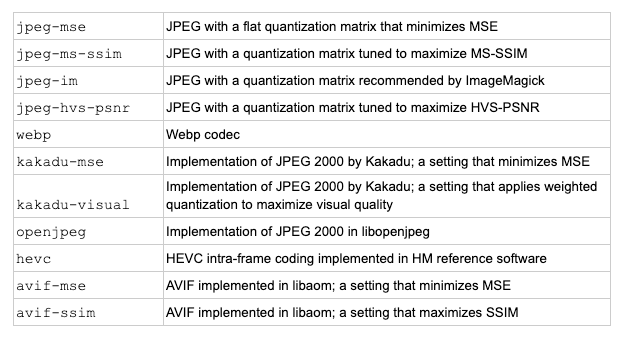

The encoding resolution in these experiments is the same as the source resolution. For 420 subsampling encodes, the quality metrics were computed in 420 subsampling domain. Likewise, for 444 subsampling encodes, the quality metrics were computed in 444 subsampling domain. Along with BD rates associated with various quality metrics, such as [SSIM](https://www.cns.nyu.edu/~lcv/ssim/), [MS-SSIM](https://ece.uwaterloo.ca/~z70wang/publications/msssim.html), [VIF](https://live.ece.utexas.edu/research/Quality/VIF.htm) and [PSNR](https://en.wikipedia.org/wiki/Peak_signal-to-noise_ratio), we also show rate-quality plots using SSIM as the metric.

### Kodak dataset; 24 images; 768x512 resolution

We have uploaded the [source](http://r0k.us/graphics/kodak/) images in PNG format [here](https://drive.google.com/drive/folders/1VK12pBFnYJzJRD1k8uo38yammO-_XtkO?usp=sharing) for easy reference. We give the necessary attribution to Kodak as the source of this dataset.

Given a quality metric, for each image, we consider two separate rate-quality curves. One curve associated with the baseline (JPEG) and one curve associated with the target codec. We compare the two and compute the BD-rate which can be interpreted as the average percentage rate reduction for the same quality over the quality region being considered. A negative value implies rate reduction and hence is better compared to the baseline. As a last step, we report the arithmetic mean of BD rates over all images in the dataset. We also highlight the best performer in the tables below.

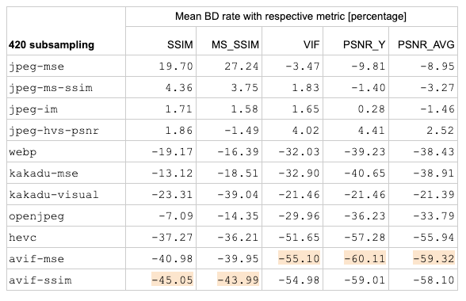

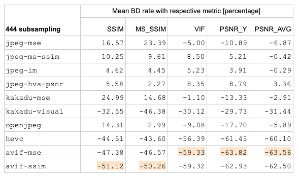

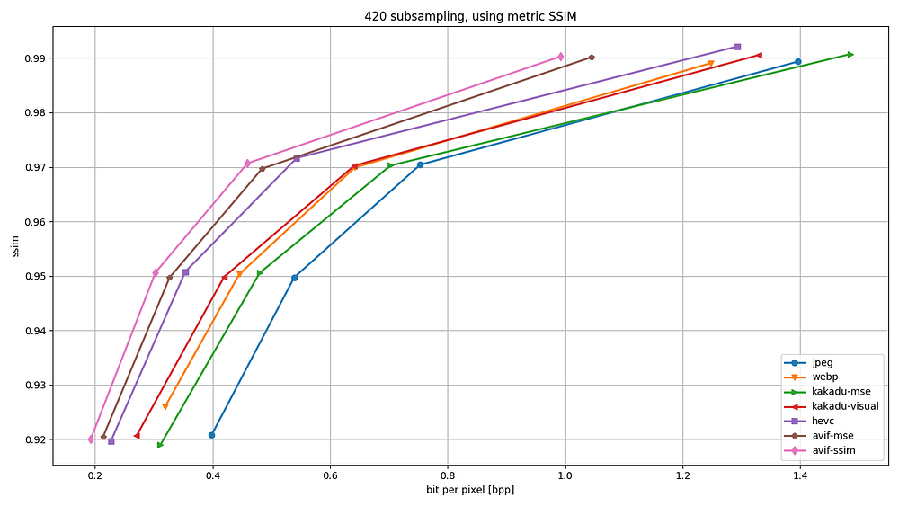

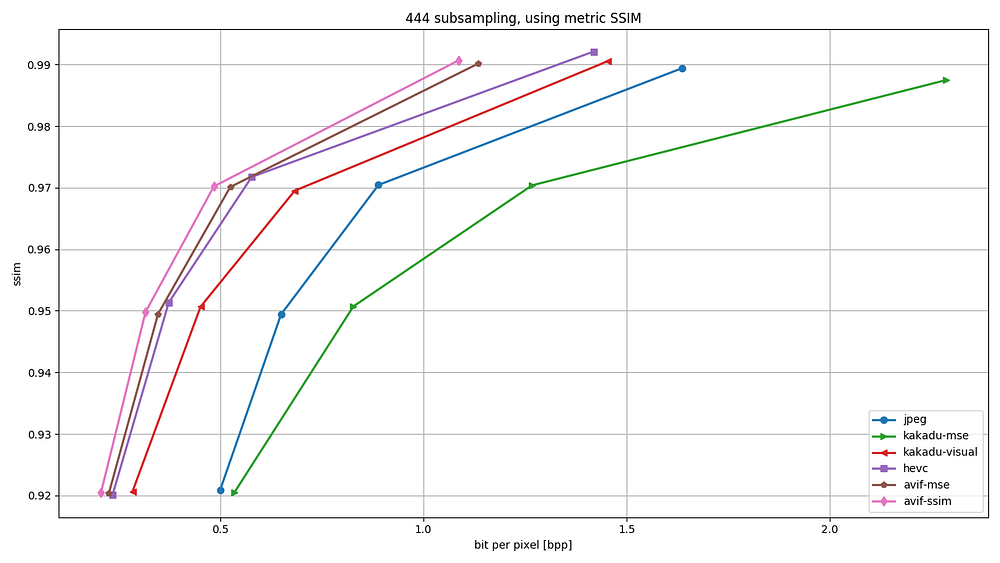

### CLIC dataset; 303 images; 2048x1320 resolution

We selected a subset of images from the dataset made public as part of the [workshop and challenge on learned image compression (CLIC)](https://www.compression.cc/), held in conjunction with CVPR. We have uploaded our selected 303 source images in PNG format [here](https://drive.google.com/drive/folders/1VK12pBFnYJzJRD1k8uo38yammO-_XtkO?usp=sharing) for easy reference with appropriate attribution to CLIC.

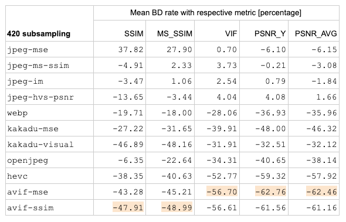

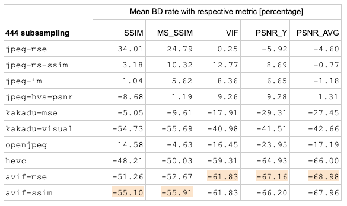

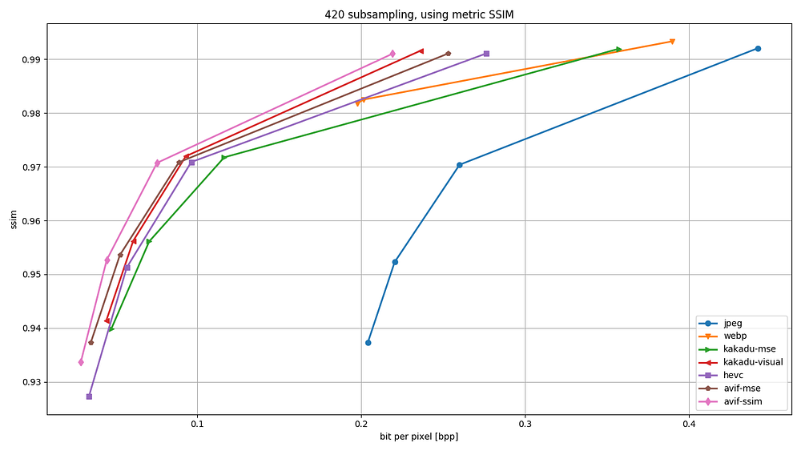

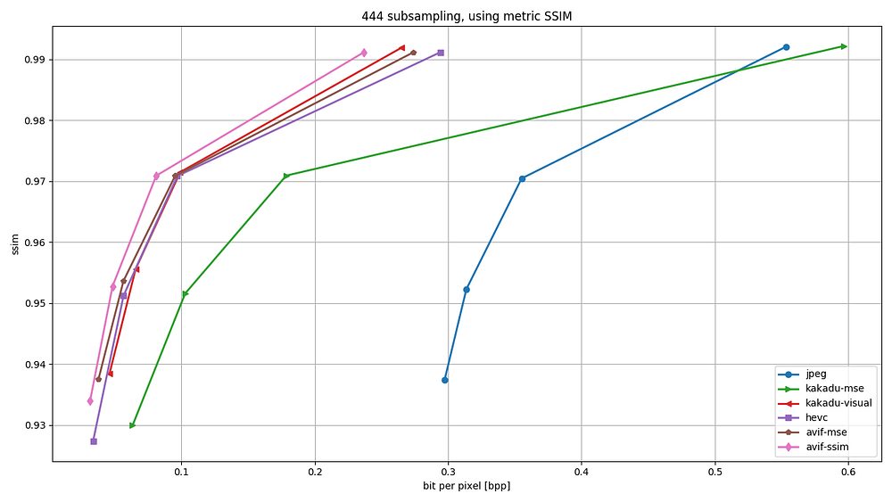

### Billboard dataset (Netflix-internal); 223 images; 2048x1152 resolution

Billboard images generally occupy a larger canvas than the thumbnail-like boxshot images and are generally horizontal. There is room to overlay text or graphics on one of the sides, either left or right, with salient characters/scenery/art being located on the other side. An example can be seen below. The billboard source images are internal to Netflix and hence do not constitute a public dataset.


*A sample original source image from the billboard dataset*

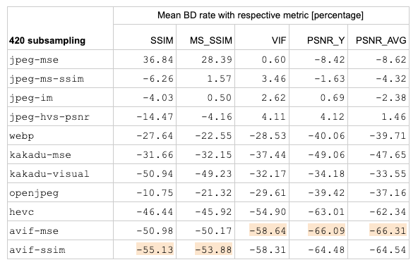

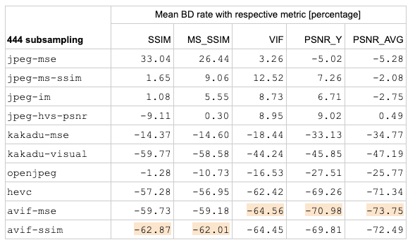

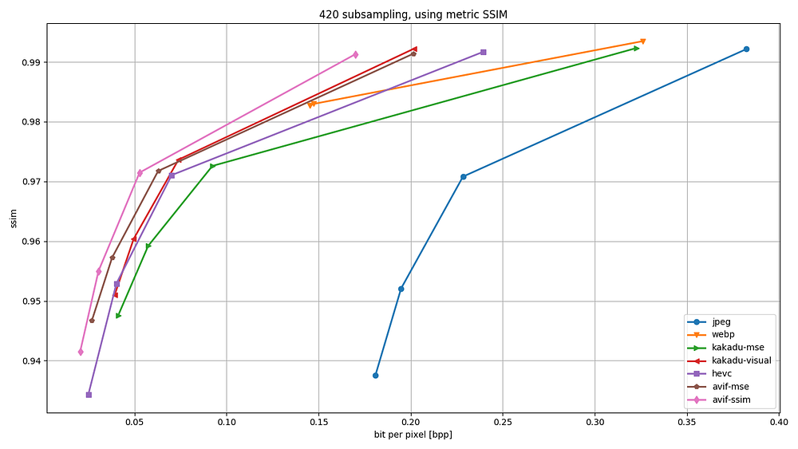

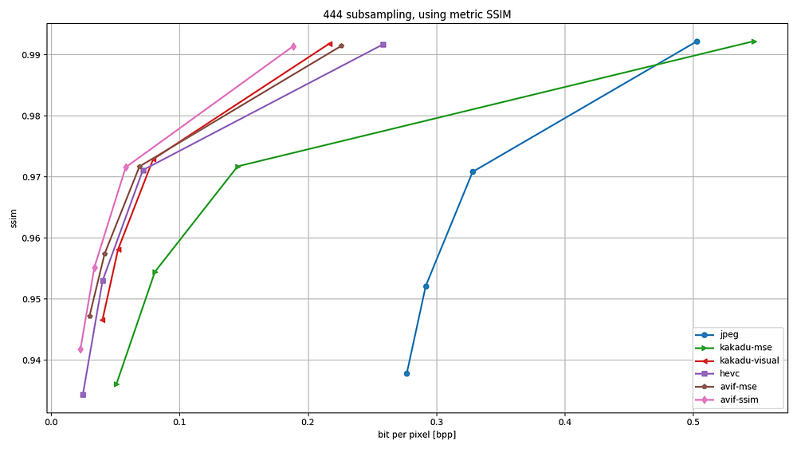

### Boxshots-1 dataset (Netflix-internal); 100 images; 1142x1600 resolution

Unlike billboard images, boxshot images are vertical and typically boxshot images representing different titles are displayed side-by-side in the UI. Examples from this dataset are showcased in the section above on visual examples. The boxshots-1 source images are internal to Netflix and hence do not constitute a public dataset.

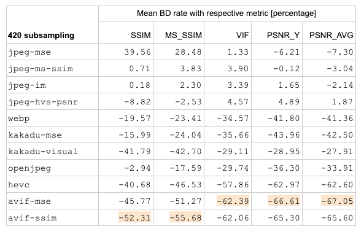

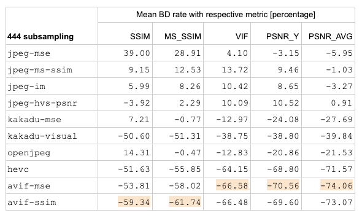

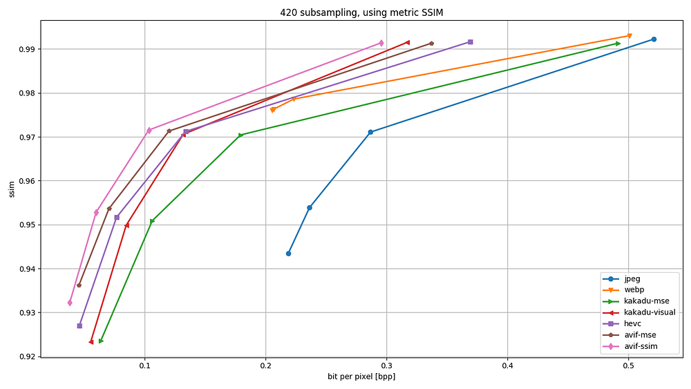

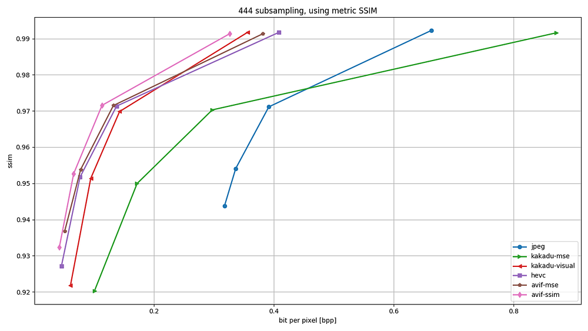

### Boxshots-2 dataset (Netflix-internal); 100 images; 571x800 resolution

The boxshots-2 dataset also has vertical box art but of lower resolution. The boxshots-2 source images are internal to Netflix and hence do not constitute a public dataset.

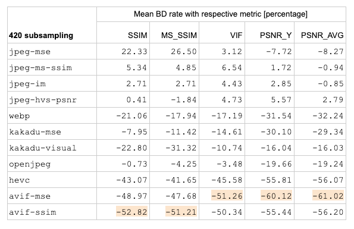

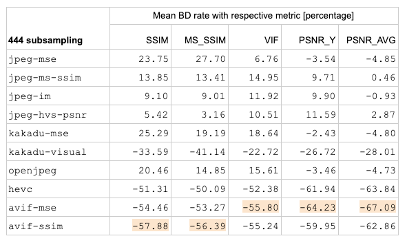

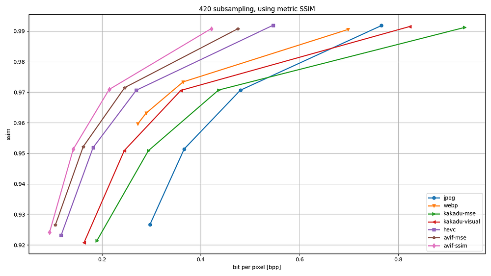

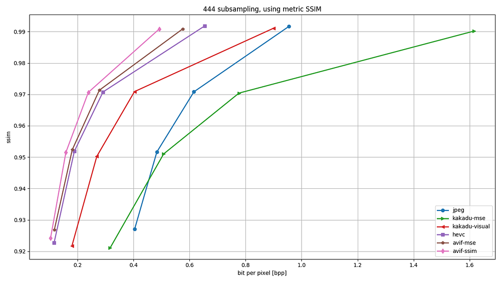

At this point, it might be prudent to discuss the omission of [VMAF](https://netflixtechblog.com/vmaf-the-journey-continues-44b51ee9ed12) as a quality metric here. In [previous work](https://ieeexplore.ieee.org/abstract/document/8833510) we have shown that for JPEG-like distortions and datasets similar to “boxshots” and “billboards”, VMAF has high correlation with perceived quality. However, VMAF, as of today, is a metric trained and developed to judge encoded videos rather than static images. The range of distortions associated with the range of image codecs in our tests is broader than what was considered in the VMAF development process and to that end, it may not be an accurate measure of image quality for those codecs. Further, today’s VMAF model is not designed to capture chroma artifacts and hence would be unable to distinguish between 420 and 444 subsampling, for instance, apart from other chroma artifacts (this is also true of some other measures we’ve used, but given the lack of alternatives, we’ve leaned on the side of using the most well tested and documented image quality metrics). This is not to say that VMAF is grossly inaccurate for image quality, but to say that we would not use it in our evaluation of image compression algorithms with such a wide diversity of codecs at this time. We have some exciting upcoming work to improve the accuracy of VMAF for images, across a variety of codecs, and resolutions, including chroma channels in the score. Having said that, the code in the repository computes VMAF and the reader is encouraged to try it out and see that AVIF also shines judging by VMAF as is today.

PSNR does not have as high correlation with perceptual quality over a wide quality range. However, if encodes are made with a high PSNR target then one overspends bits but can rest assured that a high PSNR score implies closeness to the original. With perceptually driven metrics, we sometimes see failure manifest in rare cases where the score is undeservingly high but visual quality is lacking.

## Interesting observation regarding subsampling

In addition to above quality calculations, we have the following observation which reveals an encouraging trend among modern codecs. After performing an encode with 420 subsampling, let’s assume we decode the image, up-convert it to 444 subsampling and then compute various metrics by comparing against the original source in 444 format. We call this configuration “444u” to distinguish from above cases where “encode-subsampling” and “quality-computation-subsampling” match. Among the chosen metrics, PSNR_AVG is one which takes all 3 channels (1 luma and 2 chroma) into account. With an older codec like JPEG, the bit-budget is spread thin over more samples while encoding 444 subsampling compared to encoding 420 subsampling. This shows as poorer PSNR_AVG for encoding JPEG with 444 subsampling compared to 420 subsampling, as shown below. However, given a rate target, with modern codecs like HEVC and AVIF, it is simply better to encode 444 subsampling over a wide range of bitrates.

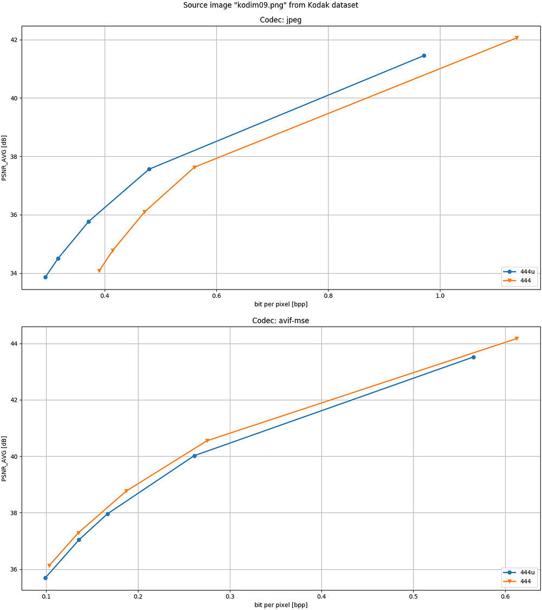
*It is simply better to encode with 444 subsampling with a modern codec such as AVIF judging by PSNR_AVG as the metric*

We see that with modern codecs we yield a higher PSNR_AVG when encoding 444 subsampling than 420 subsampling over the entire region of “practical” rates, even for the other, more practical, datasets such as boxshots-1. Interestingly, with JPEG, we see a crossover; i.e., after crossing a certain rate, it starts being more efficient to encode 444 subsampling. Such [crossovers](https://ieeexplore.ieee.org/document/7532319) are analogous to rate-quality curves crossing over when encoding over [multiple spatial resolutions](https://netflixtechblog.com/per-title-encode-optimization-7e99442b62a2). Shown below are rate-quality curves for two different source images from the boxshots-1 dataset, comparing JPEG and AVIF in both 444u and 444 configurations.

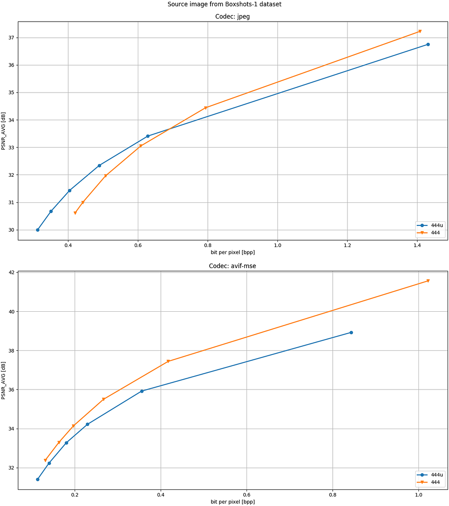
*It is simply better to encode with 444 subsampling with a modern codec such as AVIF judging by PSNR_AVG as the metric*

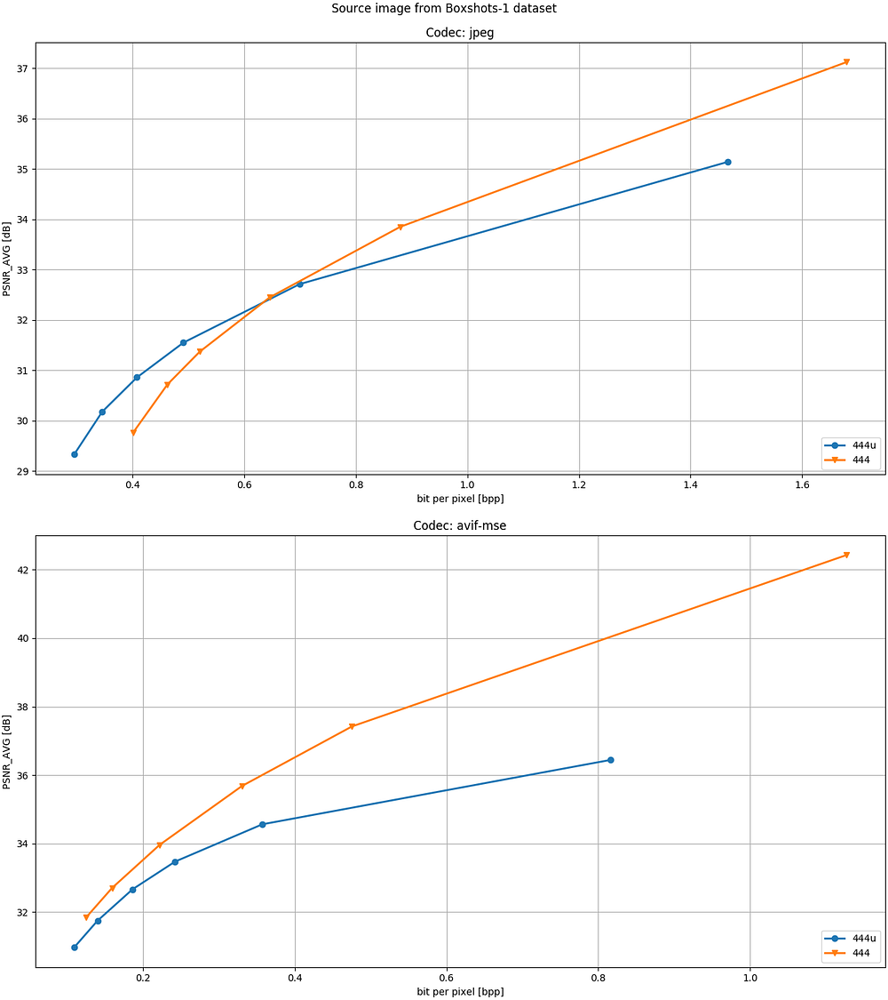
*It is simply better to encode with 444 subsampling with a modern codec such as AVIF judging by PSNR_AVG as the metric*

## AVIF support and next steps

Although AVIF provides superior compression efficiency, it is still at an early deployment stage. Various tools exist to produce and consume AVIF images. The Alliance for Open Media is notably developing an open-source library, called [libavif](https://github.com/AOMediaCodec/libavif), that can encode and decode AVIF images. The goal of this library is to ease the integration in software from the image community. Such integration has already started, for example, in various browsers, such as Google Chrome, and we expect to see broad support for AVIF images in the near future. Major efforts are also ongoing, in particular from the [dav1d](https://code.videolan.org/videolan/dav1d) team, to make AVIF image decoding as fast as possible, including for 10-bit images. It is conceivable that we will soon test AVIF images on Android following on the heels of our [recently announced AV1 video adoption efforts on Android](./netflix-now-streaming-av1-on-android-d5264a515202.md).

The datasets used above have standard dynamic range (SDR) 8-bit imagery. At Netflix, we are also working on HDR images for the UI and are planning to use AVIF for encoding these HDR image assets. This is a continuation of our [previous efforts](https://netflixtechblog.com/enhancing-the-netflix-ui-experience-with-hdr-1e7506ad3e8) where we experimented with JPEG 2000 as the compression format for HDR images and we are looking forward to the superior compression gains afforded by AVIF.

## Acknowledgments

We would like to thank Marjan Parsa, Pierre Lemieux, Zhi Li, Christos Bampis, Andrey Norkin, Hunter Ford, Igor Okulist, Joe Drago, Benbuck Nason, Yuji Mano, Adam Rofer and Jeff Watts for all their contributions and collaborations.

¹as part of his work while he was affiliated with Netflix

---
**Tags:** Encoding · Image · Netflix · Image Processing · Av1
