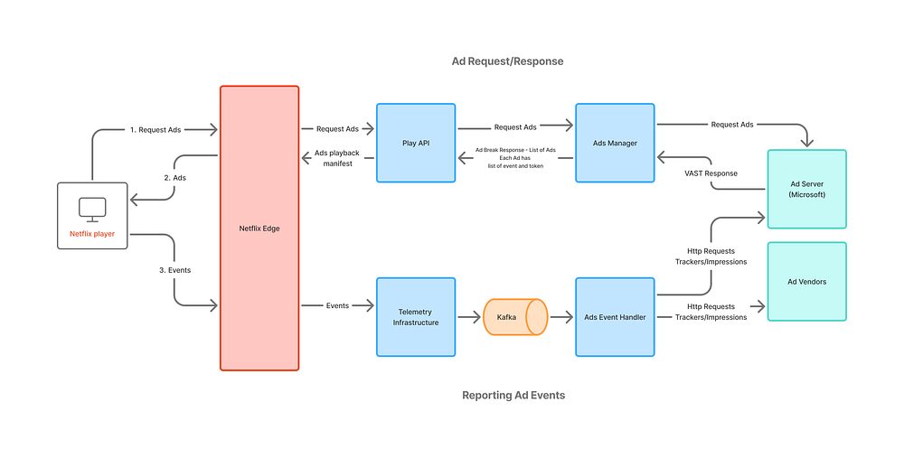
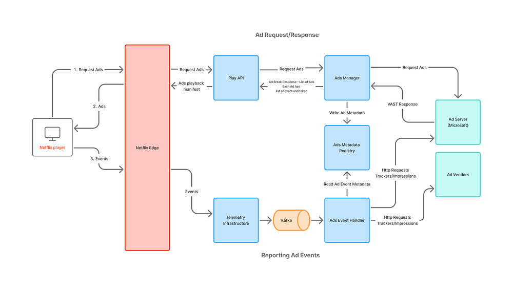
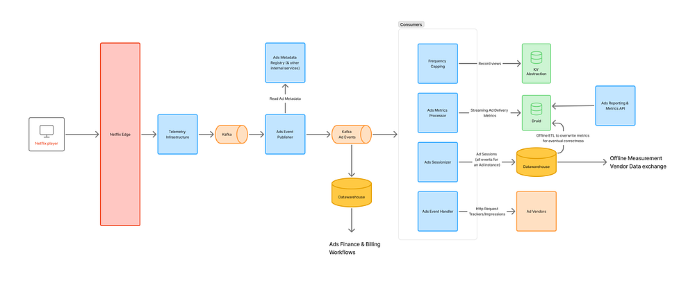

# Behind the Scenes: Building a Robust Ads Event Processing Pipeline

[Kinesh Satiya](https://www.linkedin.com/in/kineshsatiya/)

### Introduction

In a digital advertising platform, a robust feedback system is essential for the lifecycle and success of an ad campaign. This system comprises of diverse sub-systems designed to monitor, measure, and optimize ad campaigns. At Netflix, we embarked on a journey to build a robust event processing platform that not only meets the current demands but also scales for future needs. This blog post delves into the architectural evolution and technical decisions that underpin our Ads event processing pipeline.

Ad serving acts like the “brain” — making decisions, optimizing delivery and ensuring right Ad is shown to the right member at the right time. Meanwhile, ad events, after an Ad is rendered, function like “heartbeats”, continuously providing real-time feedback (oxygen/nutrients) that fuels better decision-making, optimizations, reporting, measurement, and billing. Expanding on this analogy:

- Just as the brain relies on continuous blood flow, ad serving depends on a steady stream of ad events to adjust next ad serving decision, frequency capping, pacing, and personalization.
- If the nervous system stops sending signals (ad events stop flowing), the brain (ad serving) lacks critical insights and starts making poor decisions or even fails.
- The healthier and more accurate the event stream (just like strong heart function), the better the ad serving system can adapt, optimize, and drive business outcomes.

Let’s dive into the journey of building this pipeline.

### The Pilot

In November 2022, we launched a brand [new basic ads plan](https://about.netflix.com/en/news/announcing-basic-with-ads-us), in partnership with Microsoft. The software systems extended the existing Netflix playback systems to play ads. Initially, the system was designed to be simple, secure, and efficient, with an underlying ethos of device-originated and server-proxied operations. The system consisted of three main components: the Microsoft Ad Server, Netflix Ads Manager, and Ad Event Handler. Each ad served required tracking to ensure the feedback loop functioned effectively, providing the external ad server with insights on impressions, frequency capping (advertiser policy that limits the number of times a user sees a specific ad), and monetization processes.

Key features of this system include:

1. **Client Request: **Client devices request for ads during an ad break from Netflix playback systems, which is then decorated with information by ads manager to request ads from the ad server.
2. **Server-Side Ad Insertion:** The Ad Server sends ad responses using the VAST (Video Ad Serving Template) format.
3. **Netflix Ads Manager:** This service parses VAST documents, extracts tracking event information, and creates a simplified response structure for Netflix playback systems and client devices.   
 — The tracking information is packed into a structured protobuf data model.  
 — This structure is encrypted to create an opaque token.  
 — The final response, informs the client devices, when to send an event and the corresponding token.
4. **Client Device:** During ad playback, client devices send events accompanied by a token. The Netflix telemetry system then enqueues all these events in Kafka for asynchronous processing.
5. **Ads Event Handler:** This component is a Kafka consumer, that reads/decrypts the event payload and forwards the tracking information encoded back to the ad server and other vendors.

*Fig 1: Basic Ad Event Handling System*

There is an [excellent prior blog](./ensuring-the-successful-launch-of-ads-on-netflix-f99490fdf1ba.md) post that explains how this systems was tested end-to-end at scale. This system design allowed us to quickly add new integrations for verification with vendors like DV, IAS and Nielsen for measurement.

### The Expansion

As we continued to expand our third-party (3P) advertising vendors for measurement, tracking and verification, we identified a critical trend: growth in the volume of data encapsulated within opaque tokens. These tokens, which are cached on client devices, present a risk of elevated memory usage, potentially impacting device performance. We also anticipated increase in third-party tracking URLs, metadata needs, and more event types as our business added new capabilities.

To strategically address these challenges, we introduced a new persistence layer using [Key-Value abstraction](./introducing-netflixs-key-value-data-abstraction-layer-1ea8a0a11b30.md), between ad serving and event handling system: Ads Metadata Registry. This transient storage service stores metadata for each Ad served, and upon callback, event handler would read the tracking information to relay information to the vendors. The contract between the client device and Ads systems continues to use the opaque token per event, but now, instead of tracking information, it contains reference identifiers — Ad ID, the corresponding metadata record ID in the registry and the event name. This approach future proofed our systems to handle any growth in data that needs to pass from ad serving to event handling systems.

*Fig 2: Storage service between Ad Serving & Reporting*

### The Evolution

In January of 2024, we decided to invest in in-house advertising technology platform. This implied that the event processing pipeline had to evolve significantly — attain parity with existing offerings and continue to support new product launches with rapid iterations using in-house Netflix Ad Server. This required re-evaluation of the entire architecture across all of Ads engineering teams.

First, we made an inventory of the use-cases that would need to be supported through ad events.

1. We’d need to start supporting frequency capping in-house for all ads through Netflix Ad server.
2. Incorporate pricing information for impressions to set the stage for billing events, which are used to charge advertisers.
3. A robust reporting system to share campaign reports with advertisers, combined with metrics data collection, helps assess the delivery and effectiveness of the campaign.
4. Scale event handler to perform tracking information look-ups across different vendors.

Next, we examined upcoming launches, such as Pause/Display ads, to gain deeper insights into our strategic initiatives. We recognized that Display Ads would utilize a distinct logging framework, suggesting that different upstream pipelines might deliver ad telemetry. However, the downstream use-cases were expected to remain largely consistent. Additionally, by reviewing the goals of our telemetry teams, we saw large initiatives aimed at upgrading the platform, indicating potential future migrations.

Keeping the above insights & challenges in mind,

- We planned a centralized ad event collection system. This centralized service would consolidate common operations like decryption of tokens, enrichment, hashing identifiers into a single step execution and provide a single unified data contract to consumers that is highly extensible (like being agnostic to ad server & ad media).
- We proposed moving all consumers of ad telemetry downstream of the centralized service. This creates a clean separation between upstream systems and consumers in Ads Engineering.
- In the initial development phase of our advertising system, a crucial component was the creation of ad sessions based on individual ad events. This system was constructed using ad playback telemetry, which allowed us to gather essential metrics from these ad sessions. A significant decision in this plan was to position the ad sessionization process downstream of the raw ad events.
- The proposal also recommended moving all our Ads data processing pipelines for reporting/analytics/metrics for Ads using the data published by the centralized system.

Putting together all the components in our vision -

*Fig 3: Ad Event processing pipeline*

Key components on event processing pipeline -

**Ads Event Publisher:** This centralized system is responsible for collecting ads telemetry and providing unified ad events to the ads engineering teams. It supports various functions such as measurement, finance/billing, reporting, frequency capping, and maintaining an essential feedback loop back to the ad server.

**Realtime Consumers**

1. **Frequency Capping: **This system tracks impressions for each campaign, profile, and any other frequency capping parameters set up for the campaign. It is utilized by the Ad Server during each ad decision to ensure ads are served with frequency limits.
2. **Ads Metrics: **This component is a Flink job that transforms raw data to a set of dimensions and metrics, subsequently writing to Apache Druid OLAP database. The streaming data is further backed by an offline process that corrects any inaccuracy during streaming ingestion and providing accurate metrics. It provides real-time metrics to assess the delivery health of campaigns and applies budget capping functionality.
3. **Ads Sessionizer: **An Apache Flink job that consolidates all events related to a single ad into an Ad Session. This session provides real-time information about ad playback, offering essential business insights and reporting. It is a crucial job that supports all downstream analytical and reporting processes.
4. **Ads Event Handler: **This service continuously sends information to ad vendors by reading tracking information from ad events, ensuring accurate and timely data exchange.

**Billing/Revenue: **These are offline workflows designed to curate impressions, supporting billing and revenue recognition processes.

**Ads Reporting & Metrics: **This service powers reporting module for our account managers and provides a centralized metrics API that help assess the delivery of a campaign.

This was a massive multi-quarter effort across different engineering teams. With extensive planning (kudos to our TPM team!) and coordination, we were able to iterate fast, build several services and execute the vision above, to power our in-house ads technology platform.

### Conclusion

These systems have significantly accelerated our ability to launch new capabilities for the business.

- Through our partnership with Microsoft, Display Ad events were integrated into the new pipeline for reusability and ensuring when launching through Netflix ads systems, all use-cases were covered.
- Programmatic buying capabilities now support the exchange of numerous trackers and dynamic bid prices on impression events.
- Sharing opt-out signals helps ensure privacy and compliance with GDPR regulations for Ads business in Europe, supporting accurate reporting and measurement.
- New event types like Ad clicks and scanning of QR codes events also flow through the pipeline, ensuring all metrics and reporting are tracked consistently.

**Key Takeways**

- **Strategic, incremental evolution:** The development of our ads event processing systems has been a carefully orchestrated journey. Each iteration was meticulously planned by addressing existing challenges, anticipating future needs, and showcasing teamwork, planning, and coordination across various teams. These pillars have been fundamental to the success of this journey.
- **Data contract:** A clear data contract has been pivotal in ensuring consistency in interpretation and interoperability across our systems. By standardizing the data models, and establishing a clear data exchange between ad serving, and centralized event collection, our teams have been able to iterate at exceptional speed and continue to deliver many launches on time.
- **Separation of concerns: **Consumers are relieved from the need to understand each source of ad telemetry or manage updates and migrations. Instead, a centralized system handles these tasks, allowing consumers to focus on their core business logic.

We have an exciting list of projects on the horizon. These include managing ad events from ads on Netflix live streams, de-duplication processes, and enriching data signals to deliver enhanced reporting and insights. Additionally, we are advancing our Native Ads strategy, integrating Conversion API for improved conversion tracking, among many others.

This is definitely not a season finale; it’s just the beginning of our journey to create a best-in-class ads technology platform. We warmly invite you to share your thoughts and comments with us. If you’re interested in learning more or becoming a part of this innovative journey, [Ads Engineering is hiring](https://jobs.netflix.com/)!

### Acknowledgements

_A special thanks to our amazing colleagues and teams who helped build our foundational post-impression system: _[_Simon Spencer_](https://www.linkedin.com/in/simonspencer1/)_, _[_Priyankaa Vijayakumar,_](https://www.linkedin.com/in/priyankaavj/)_ _[_Indrajit Roy Choudhury_](https://www.linkedin.com/in/indrajit-roy-choudhury-5b011754/)_; Ads TPM team — _[_Sonya Bellamy_](https://www.linkedin.com/in/sonyabellamy/)_; the Ad Serving Team —_[_ Andrew Sweeney_](https://www.linkedin.com/in/andrewjsweeney/)_, _[_Tim Zheng_](https://www.linkedin.com/in/tim-z-b9112034/), [_Haidong Tang_](https://www.linkedin.com/in/haidongt/)_ and _[_Ed Barker_](https://www.linkedin.com/in/edhbarker/)_; the Ads Data Engineering Team — _[_Sonali Sharma_](https://www.linkedin.com/in/sonalisharma/)_, _[_Harsha Arepalli_](https://www.linkedin.com/in/harshavardhan-arepalli-3a9b0992/)_, and _[_Wini Tran_](https://www.linkedin.com/in/winifredtran/)_; Product Data Systems — _[_David Klosowski;_](https://www.linkedin.com/in/d3cay/)_ and the entire Ads Reporting and Measurement team!_
