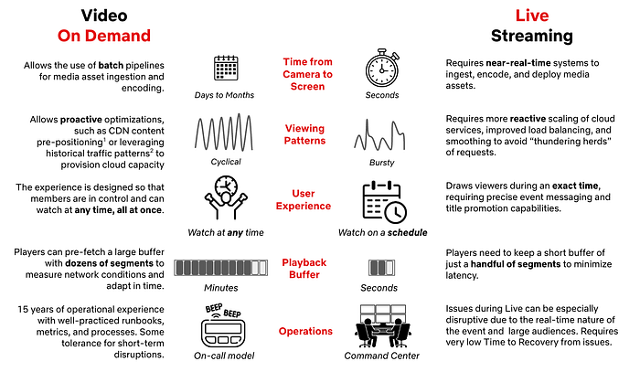
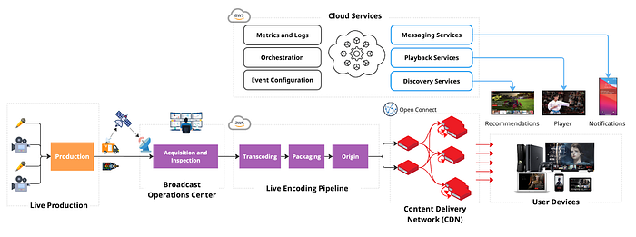
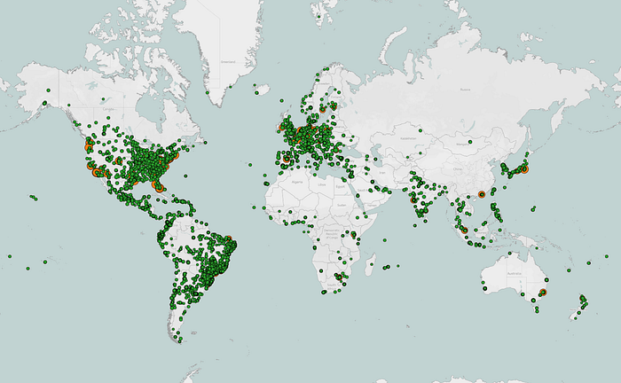
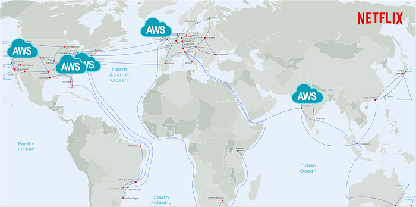
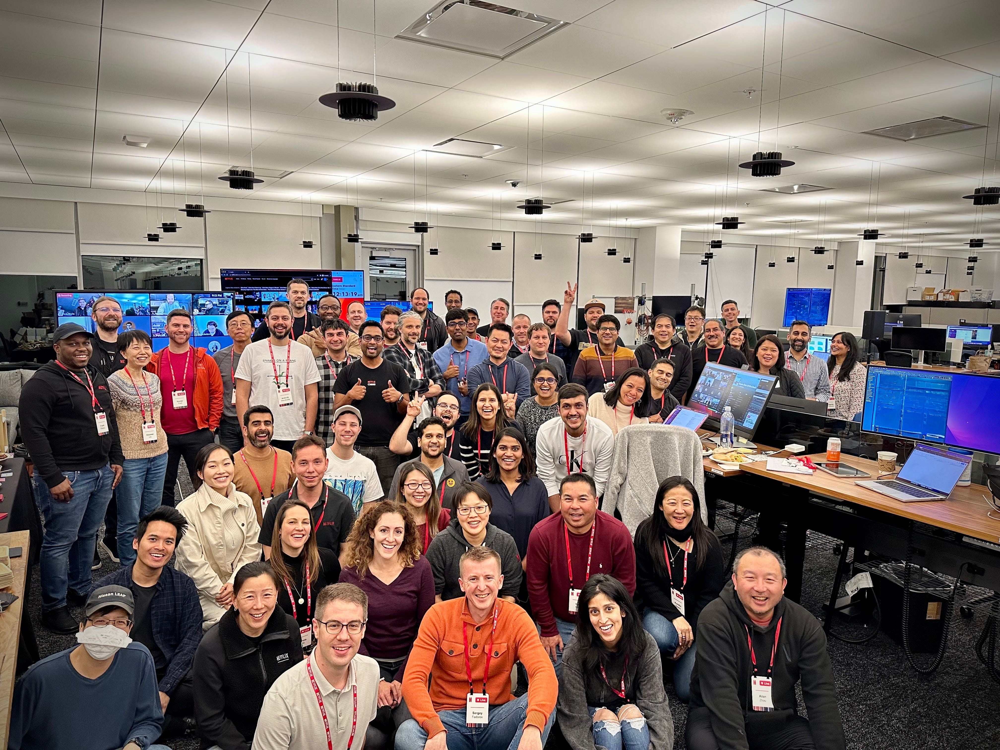
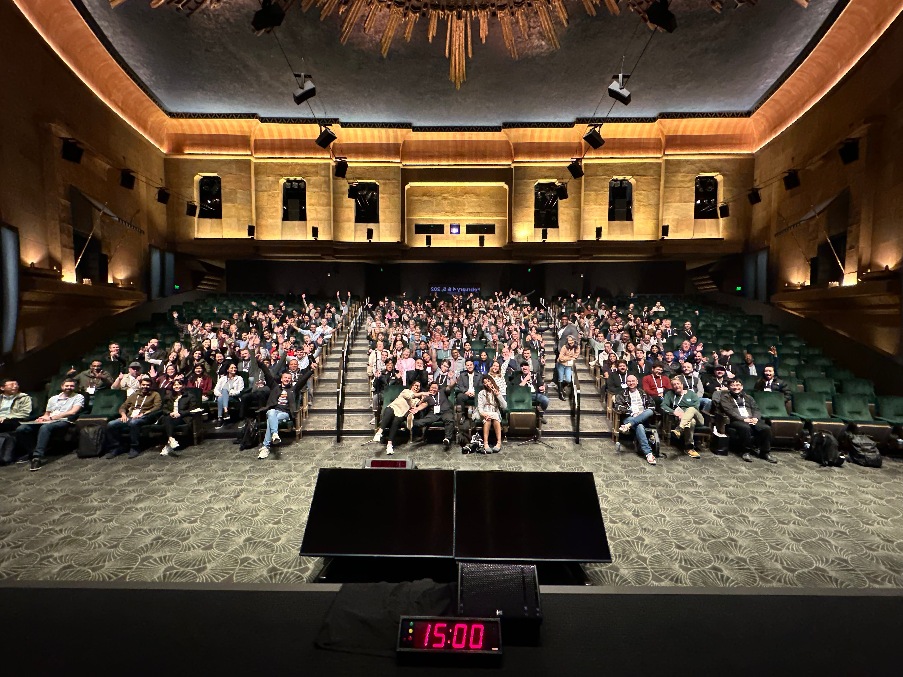
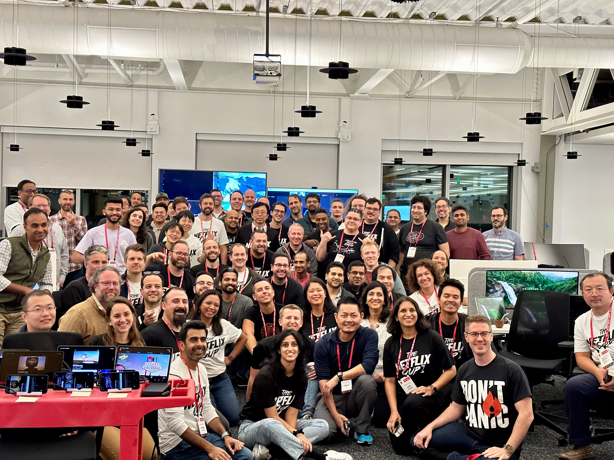
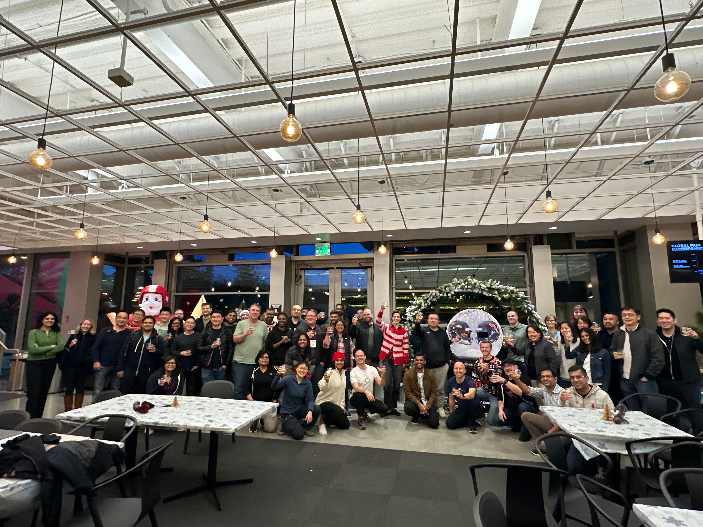

# Behind the Streams: Three Years Of Live at Netflix. Part 1.

By [Sergey Fedorov](https://www.linkedin.com/in/sfedov/), [Chris Pham](https://www.linkedin.com/in/phamchristopher/), [Flavio Ribeiro](https://www.linkedin.com/in/flavioribeiro/), [Chris Newton](https://www.linkedin.com/in/chrisnewton2/), and [Wei Wei](https://www.linkedin.com/in/wei-wei-1571794/)

Many great ideas at Netflix begin with a question, and three years ago, we asked one of our boldest yet: if we were to entertain the world through Live — a format almost as old as television itself — how would _we_ do it?

What began with an engineering plan to pave the path towards our first Live comedy special, [Chris Rock: Selective Outrage](https://www.netflix.com/title/80167499), has since led to hundreds of Live events ranging from the biggest [comedy shows](https://www.netflix.com/tudum/articles/greatest-roast-of-all-time-tom-brady-live) and [NFL Christmas Games](https://about.netflix.com/en/news/nfl-christmas-day-games-on-netflix-average-over-30-million-global-viewers) to record-breaking [boxing fights](https://about.netflix.com/en/news/jake-paul-vs-mike-tyson-over-108-million-live-global-viewers) and becoming the [home of WWE](https://about.netflix.com/en/news/netflix-to-become-new-home-of-wwe-raw-beginning-2025).

In our series _Behind the Streams_ — where we take you through the technical journey of our biggest bets — we will do a multiple part deep-dive into the architecture of Live and what we learned while building it. Part one begins with the foundation we set for Live, and the critical decisions we made that influenced our approach.

## | But First: What Makes Live Streaming Different?

While Live as a television format is not new, the streaming experience we intended to build required capabilities we did not have at the time. Despite 15 years of on-demand streaming under our belt, Live introduced new considerations influencing architecture and technology choices:

*References: 1. Content Pre-Positioning on Open Connect, 2.Load-Balancing Netflix Traffic at Global Scale*

This means that we had a lot to build in order to make Live work well on Netflix. That starts with making the right choices regarding the fundamentals of our Live Architecture.

## | Key Pillars of Netflix Live Architecture

Our Live Technology needed to extend the same promise to members that we’ve made with on-demand streaming: **great quality** on as **many devices** as possible **without interruptions**. Live is one of many entertainment formats on Netflix, so we also needed to seamlessly blend Live events into the user experience, all while scaling to over 300 million global subscribers.

When we started, we had **nine months** until the first launch. While we needed to execute quickly, we also wanted to **architect for future growth** in both **magnitude** and **multitude** of events. As a key principle, we leveraged our unique position of building support for a single product — Netflix — and having control over the full Live lifecycle, from Production to Screen.

**Dedicated Broadcast Facilities to Ingest Live Content from Production**

Live events can happen anywhere in the world, but not every location has Live facilities or great connectivity. To ensure secure and reliable live signal transport, we leverage distributed and highly connected broadcast operations centers, with specialized equipment for signal ingest and inspection, closed-captioning, graphics and advertisement management. We prioritized **repeatability**, conditioning engineering to launch live events consistently, reliably, and cost-effectively, leaning into **automation** wherever possible. As a result, we have been able to reduce the event-specific setup to the transmission between production and the Broadcast Operations Center, reusing the rest across events.

**Cloud-based Redundant Transcoding and Packaging Pipelines**

The feed received at the Broadcast Center contains a fully produced program, but still needs to be encoded and packaged for streaming on devices. We chose a Cloud-based approach to allow for **dynamic scaling**, **flexibility** in configuration, and **ease of integration** with our Digital Rights Management (DRM), content management, and content delivery services already deployed in the cloud. We leverage AWS Elemental MediaConnect and AWS Elemental MediaLive to acquire feeds in the cloud and transcode them into various video quality levels with bitrates tailored per show. We built a **custom packager** to better integrate with our delivery and playback systems. We also built a **custom Live Origin** to ensure strict read and write SLAs for Live segments.

**Scaling Live Content Delivery to millions of viewers with Open Connect CDN**

In order for the produced media assets to be streamed, they need to be transferred from a few AWS locations, where Live Origin is deployed, to hundreds of millions of devices worldwide. We leverage Netflix’s CDN, [Open Connect](https://www.theverge.com/22787426/netflix-cdn-open-connect), to scale Live asset delivery. Open Connect servers are placed close to the viewers at **over 6K locations** and connected to AWS locations via a **dedicated Open Connect Backbone network**.

*18K+ servers in 6K+ locations, in Internet Exchanges, or embedded into ISP networks*

*Open Connect Backbone connects servers in Internet Exchange locations to 5 AWS regions*

By enabling Live delivery on Open Connect, we build on top of $1B+ in Netflix investments over the last 12 years focused on scaling the network and optimizing the performance of delivery servers. **By sharing capacity across on-demand and Live viewership we improve utilization, and by caching past Live content on the same servers used for on-demand streaming, we can easily enable catch-up viewing.**

**Optimizing Live Playback for Device Compatibility, Scale, Quality, and Stability**

To make Live accessible to the majority of our customers without upgrading their streaming devices, we settled on using **HTTPS**-based Live Streaming. **While UDP-based protocols can provide additional features like ultra-low latency, HTTPS has ubiquitous support among devices and compatibility with delivery and encoding systems.** Furthermore, we use **AVC** and **HEVC** video codecs, transcode with multiple quality levels up **from SD to 4K**, and use a **2-second segment** duration to balance compression efficiency, infrastructure load, and latency. While prioritizing streaming quality and playback stability, we have also achieved industry standard latency from camera to device, and continue to improve it.

To configure playback, the device player receives a playback manifest at the play start. The manifest contains items like the encoding bitrates and CDN servers players should use. **We deliver the manifest from the cloud instead of the CDN, as it allows us to personalize the configuration for each device.** To reference segments of the stream, the manifest includes a segment template that is used by devices to map a wall-clock time to URLs on the CDN. Using a segment template vs periodic polling for manifest updates minimizes network dependencies, CDN server load, and overhead on resource-constrained devices, like smart TVs, thus improving both scalability and stability of our system. While streaming, the player monitors network performance and dynamically chooses the bitrate and CDN server, maximizing streaming quality while minimizing rebuffering.

**Run Discovery and Playback Control Services in the Cloud**

So far, we have covered the streaming path from Camera to Device. To make the stream fully work, we also need to orchestrate across all systems, and ensure viewers can find and start the Live event. This functionality is performed by **dozens of Cloud services**, with functions like playback configuration, personalization, or metrics collection. These services tend to receive disproportionately **higher loads around Live event start time**, and Cloud deployment provides flexibility in dynamically scaling compute resources. Moreover, as Live demand tends to be localized, we are able to balance load across **multiple AWS regions**, better utilizing our global footprint. Deployment in the cloud also allows us to build a user experience where we embed Live content into a broader selection of entertainment options in the UI, like on-demand titles or Games.

**Centralize Real-time Metrics in the Cloud with Specialized Tools and Facilities**

With control over ingest, encoding pipelines, the Open Connect CDN, and device players, we have nearly **end-to-end observability** into the Live workflow. During Live, we collect system and user metrics in real-time (e.g., where members see the title on Netflix and their quality of experience), alerting us to poor user experiences or degraded system performance. Our real-time monitoring is built using a mix of internally developed tools, such as [Atlas](https://netflix.github.io/atlas-docs/), [Mantis](https://netflix.github.io/mantis/), and [Lumen](./lumen-custom-self-service-dashboarding-for-netflix-8c56b541548c.md), and open-source technologies, such as Kafka and [Druid](./how-netflix-uses-druid-for-real-time-insights-to-ensure-a-high-quality-experience-19e1e8568d06.md), processing up to **38 million events per second** during some of our largest live events while providing critical metrics and operational insights in a matter of seconds. Furthermore, we set up dedicated **“Control Center” facilities**, which bring key metrics together to the operational team that monitors the event in real-time.

## | Our key learnings so far

Building new functionality always brings fresh challenges and opportunities to learn, especially with a system as complex as Live. Even after three years, we’re still learning every day how to deliver Live events more effectively. Here are a few key highlights:

**Extensive testing: **Prior to Live we heavily relied on the predictable flow of on-demand traffic for pre-release canaries or A/B tests to validate deployments. But Live traffic was not always available, especially not at the scale representative of a big launch. As a result, we spent considerable effort to:

1. Generate internal “test streams,” which engineers use to run **integration**, **regression**, or **smoke tests** as part of the development lifecycle.
2. Build synthetic **load testing** capabilities to stress test cloud and CDN systems. We use 2 approaches, allowing us to generate up to **100K starts-per-second**:  
 — Capture, modify, and replay past Live production traffic, representing a diversity of user devices and request patterns.  
 — Virtualize Netflix devices and generate traffic against CDN or Cloud endpoints to test the impact of the latest changes across all systems.
3. **Run automated ******failure injection******, forcing missing or corrupted segments from the encoding pipeline, loss of a cloud region, network drop, or server timeouts**.

**Regular practice: **Despite rigorous pre-release testing, nothing beats a production environment, especially when operating at scale. We learned that having a regular schedule with diverse Live content is essential to making improvements while balancing the risks of member impact. We run[ A/B tests](./decision-making-at-netflix-33065fa06481.md), perform [chaos testing](https://netflixtechblog.com/chap-chaos-automation-platform-53e6d528371f), operational exercises, and train operational teams for upcoming launches.

**Viewership predictions:** We use prediction-based techniques to pre-provision Cloud and CDN capacity, and share forecasts with our ISP and Cloud partners ahead of time so they can plan network and compute resources. Then we complement them with reactive scaling of cloud systems powering sign-up, log-in, title discovery, and playback services to account for viewership exceeding our predictions. We have found success with forward-looking real-time viewership predictions _during_ a live event, allowing us to take steps to mitigate risks earlier, before more members are impacted.

**Graceful degradation: **Despite our best efforts, we can (and did!) find ourselves in a situation where viewership exceeded our predictions and provisioned capacity. In this case, we developed a number of levers to continue streaming, even if it means gradually removing some nice-to-have features. For example, we use [service-level prioritized load shedding](./enhancing-netflix-reliability-with-service-level-prioritized-load-shedding-e735e6ce8f7d.md) to prioritize live traffic over non-critical traffic (like pre-fetch). Beyond that, we can lighten the experience, like dialing down personalization, disabling bookmarks, or lowering the maximum streaming quality. Our load tests include scenarios where we under-scale systems to validate desired behavior.

**Retry storms: **When systems reach capacity, our key focus is to avoid cascading issues or further overloading systems with retries.** **Beyond system retries, users may retry manually — we’ve seen a 10x increase in traffic load due to stream restarts after viewing interruptions of as little as 30 seconds. We spent considerable time understanding device retry behavior in the presence of issues like network timeouts or missing segments. As a result, we implemented strategies like server-guided backoff for device retries, absorbing spikes via prioritized traffic shedding at Cloud Edge Gateway, and re-balancing traffic between cloud regions.

**Contingency planning: **“_Everyone has a plan until they get punched in the mouth_” is very relevant for Live. When something breaks, there is practically no time for troubleshooting. For large events, we set up **in-person launch rooms** with engineering owners of critical systems. For quick detection and response, we developed a small set of metrics as early indicators of issues, and have extensive runbooks for common operational issues. We don’t learn on launch day; instead, launch teams practice failure response via **Game Day exercises ahead of time**. Finally, our runbooks extend beyond engineering, covering escalation to executive leadership and coordination across functions like Customer Service, Production, Communications, or Social.

Our commitment to enhancing the member experience doesn’t end at the “Thanks for Watching!” screen. Shortly after each live stream, we dive into metrics to identify areas for improvement. Our Data & Insights team conducts comprehensive analyses, A/B tests, and consumer research to ensure the next event is even more delightful for our members. We leverage insights on member behavior, preferences, and expectations to refine the Netflix product experience and optimize our Live technology — like reducing latency by ~10 seconds through A/B tests, without affecting quality or stability.

## | What’s next on our Live journey?

Despite three years of effort, we are far from done! In fact, we are just getting started, actively building on the learnings shared above to deliver more joy to our members with Live events. To support the growing number of Live titles and new formats, like [FIFA WWC in 2027](https://www.netflix.com/tudum/articles/womens-world-cup-netflix), we keep building our broadcast and delivery infrastructure and are actively working to further improve the Live experience.

In this post, we’ve provided a broad overview and have barely scratched the surface. In the upcoming posts, we will dive deeper into key pillars of our Live systems, covering our encoding, delivery, playback, and user experience investments in more detail.

_Part 2 of the series, covering details of the Live Streaming Pipeline from ingestion to origin, is available _[_here_](https://netflixtechblog.medium.com/building-a-reliable-cloud-live-streaming-pipeline-for-netflix-8627c608c967)_._

Getting this far would not have been possible without the hard work of dozens of teams across Netflix, who collaborate closely to design, build, and operate Live systems: Operations and Reliability, Encoding Technologies, Content Delivery, Device Playback, Streaming Algorithms, UI Engineering, Search and Discovery, Messaging, Content Promotion and Distribution, Data Platform, Cloud Infrastructure, Tooling and Productivity, Program Management, Data Science & Engineering, Product Management, Globalization, Consumer Insights, Ads, Security, Payments, Live Production, Experience and Design, Product Marketing and Customer Service, amongst many others.

---
**Tags:** Live Streaming · Architecture · Netflix
