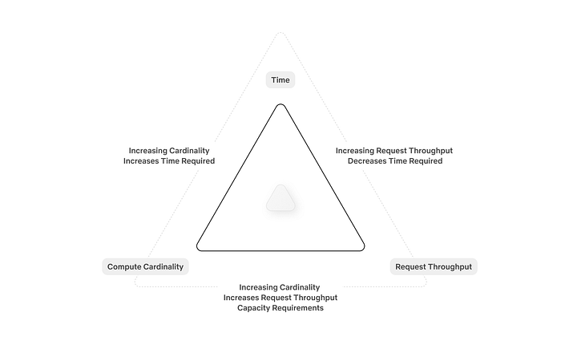
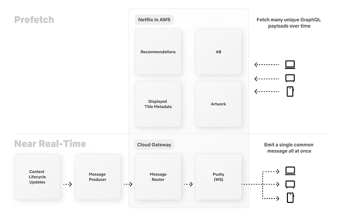
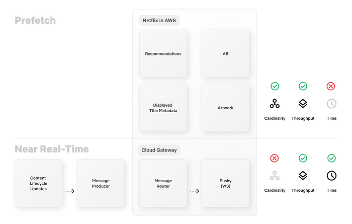
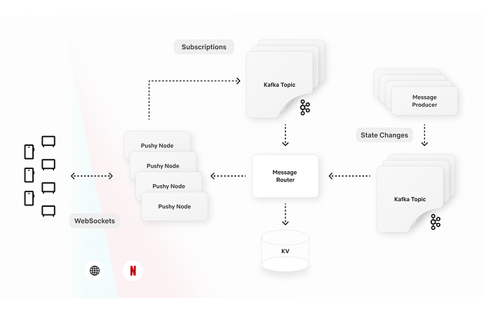
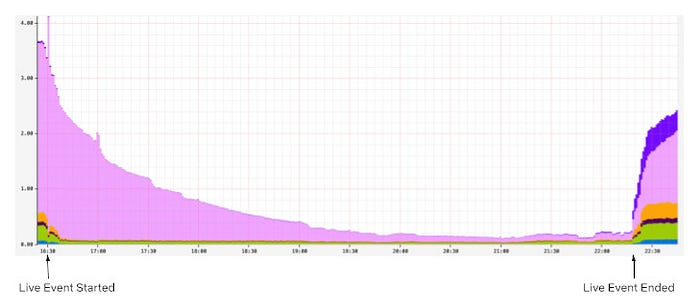

# Behind the Streams: Real-Time Recommendations for Live Events Part 3

By: [Kris Range](https://www.linkedin.com/in/krisrange/), [Ankush Gulati](https://www.linkedin.com/in/gulatiankush/), [Jim Isaacs](https://www.linkedin.com/in/jimpisaacs/), [Jennifer Shin](https://www.linkedin.com/in/jennifer-s-0019a516/), [Jeremy Kelly](https://www.linkedin.com/in/jeremy-kelly-526a30180/), [Jason Tu](https://www.linkedin.com/in/jason-t-26850b26/)

_This is part 3 in a series called “Behind the Streams”. Check out _[_part 1_](./behind-the-streams-live-at-netflix-part-1-d23f917c2f40.md)_ and _[_part 2_](./building-a-reliable-cloud-live-streaming-pipeline-for-netflix-8627c608c967.md)_ to learn more._

Picture this: It’s seconds before the biggest fight night in Netflix history. Sixty-five million fans are waiting, devices in hand, hearts pounding. The countdown hits zero. What does it take to get everyone to the action on time, every time? At Netflix, we’re used to on-demand viewing where everyone chooses their own moment. But with live events, millions are eager to join in at once. Our job: make sure our members never miss a beat.

When Live events break streaming records [¹](https://about.netflix.com/en/news/60-million-households-tuned-in-live-for-jake-paul-vs-mike-tyson) [²](https://about.netflix.com/en/news/netflix-nfl-christmas-gameday-reaches-65-million-us-viewers) [³](https://about.netflix.com/en/news/over-41-million-global-viewers-on-netflix-watch-terence-crawford-defeat), our infrastructure faces the ultimate stress test. Here’s how we engineered a discovery experience for a global audience excited to see a knockout.

## Why are Live Events Different?

Unlike Video on Demand (VOD), members want to catch live events as they happen. There’s something uniquely exciting about being part of the moment. That means we only have a brief window to recommend a Live event at just the right time. Too early, excitement fades; too late, the moment is missed. Every second counts.

To capture that excitement, we enhanced our recommendation delivery systems to serve real-time suggestions, providing members richer and more compelling signals to hit play in the moment when it matters most. The challenge? Sending dynamic, timely updates concurrently to over a hundred million devices worldwide without creating a [thundering herd effect](https://en.wikipedia.org/wiki/Thundering_herd_problem) that would overwhelm our cloud services. Simply scaling up linearly isn’t efficient and reliable. For popular events, it could also divert resources from other critical services. We needed a smarter and more scalable solution than just adding more resources.

## Orchestrating the moment: Real-time Recommendations

With millions of devices online and live event schedules that can shift in real time, the challenge was to keep everyone perfectly in sync. We set out to solve this by building a system that doesn’t just react, but adapts by dynamically updating recommendations as the event unfolds. We identified the need to balance three constraints:

- **Time**: the duration required to coordinate an update.
- **Request throughput**_: _the capacity of our cloud services to handle requests.
- **Compute cardinality**: the variety of requests necessary to serve a unique update.

*Visualizing constraints for real-time updates*

We solved this constraint optimization problem by splitting the real-time recommendations into two phases: **prefetching** and **real-time broadcasting**. First, we prefetch the necessary data ahead of time, distributing the load over a longer period to avoid traffic spikes. When the Live event starts or ends, we broadcast a low cardinality message to all connected devices, prompting them to use the prefetched data locally. The timing of the broadcast also adapts when event times shift to preserve accuracy with the production of the Live event. By combining these two phases, we’re able to keep our members’ devices in sync and solve the thundering herd problem. To maximize device reach, especially for those with unstable networks, we use “at least once” broadcasts to ensure every device gets the latest updates and can catch up on any previously missed broadcasts as soon as they’re back online.

The first phase optimizes **request throughput **and **compute cardinality** by prefetching materialized recommendations, displayed title metadata, and artwork for a Live event. As members naturally browse their devices before the event, this data is prepopulated and stored locally in device cache, awaiting the notification trigger to serve the recommendations instantaneously. By distributing these requests naturally over time ahead of the event, we can eliminate any related traffic spikes and avoid the need for large-scale, real-time system scaling.

*A phased approach, smoothing traffic requests over time with a real-time low-cardinality broadcast*

The second phase optimizes** request throughput **and** time **to update** **devices by broadcasting a low-cardinality, real-time message to all connected devices at critical moments in a Live event’s lifecycle. Each broadcast payload includes a **state key** and a **timestamp**. The state key indicates the current stage of the Live event, allowing devices to use their pre-fetched data to update cached responses locally without additional server requests. The timestamp ensures that if a device misses a broadcast due to network issues, it can catch up by replaying missed updates upon reconnecting. This mechanism guarantees devices receive updates at least once, significantly increasing delivery reliability even on unstable networks.

*A phased approach optimizes each constraint to ensure we can deliver for the big moment!*

> Moment in Numbers: During peak load, we have successfully delivered updates at multiple stages of our events to over 100 million devices in under a minute.

## Under the Hood: How It Works

With the big picture in mind, let’s examine how these pieces interact in practice.

In the diagram below, the Message Producer microservice centralizes all of the business logic. It continuously monitors live events for setup and timing changes. When it detects an update, it schedules broadcasts to be sent at precisely the right moment. The Message Producer also standardizes communication by providing a concise GraphQL schema for both device queries and broadcast payloads.

Rather than sending broadcasts directly to devices via WebSocket, the Message Producer hands them off to the Message Router. The Message Router is part of a robust two-tier pub/sub architecture built on proven technologies like [Pushy](./pushy-to-the-limit-evolving-netflixs-websocket-proxy-for-the-future-b468bc0ff658.md) (our WebSocket proxy), Apache Kafka, and [Netflix’s KV key-value store](./introducing-netflixs-key-value-data-abstraction-layer-1ea8a0a11b30.md). The Message Router tracks subscriptions at the Pushy node granularity, while Pushy nodes map the subscriptions to individual connections, creating a low-latency fanout that minimizes compute and bandwidth requirements.

Devices interface with our GraphQL [Domain Graph Service (DGS)](https://netflix.github.io/dgs/). These schemas offer multiple query interfaces for prefetching, allowing devices to tailor their requests to the specific experience being presented. Each response adheres to a consistent API that resolves to a map of stage keys, enabling fast lookups and keeping business logic off the device. Our broadcast schema specifies WebSocket connection parameters, the current event stage, and the timestamp of the last broadcast message. When a device receives a broadcast, it injects the payload directly into its cache, triggering an immediate update and re-render of the interface.

## Balancing the Moment: Throughput Management

In addition to building the new technology to support real-time recommendations, we also evaluated our existing systems for potential traffic hotspots. Using high-watermark traffic projections for live events, we generated synthetic traffic to simulate game-day scenarios and observed how our online services handled these bursts. Through this process, several common patterns emerged:

**Breaking the Cache Synchrony**

Our game-day simulations revealed that while our approach mitigated the immediate thundering herd risks driven by member traffic during the events, live events introduced unexpected mini thundering herds in our systems hours before and after the actual events. The surge of members joining just in time for these events led to concentrated cache expirations and recomputations, which created traffic spikes well outside the event window that we did not anticipate. This was not a problem for VOD content because the member traffic patterns are a lot smoother. We found that fixed TTLs caused cache expirations and refresh-traffic spikes to happen all at once. To address this, we added jitter to server and client cache expirations to spread out refreshes and smooth out traffic spikes.

**Adaptive Traffic Prioritization**

While our services already leverage traffic prioritization and partitioning based on factors such as request type and device type, live events introduced a distinct challenge. These events generated brief traffic bursts that were intensely spiky and placed significant strain on our systems. Through simulations, we recognized the need for an additional event-driven layer of traffic management.

To tackle this, we improved our traffic sharding strategies by using event-based signals. This enabled us to route live event traffic to dedicated clusters with more aggressive scaling policies. We also added a dynamic traffic prioritization ruleset that activates whenever we see high requests per second (RPS) to ensure our systems can handle the surge smoothly. During these peaks, we aggressively deprioritize non-critical server-driven updates so that our systems can devote resources to the most time-sensitive computations. This approach ensures smooth performance and reliability when demand is at its highest.

*Snapshot of non-critical traffic volume decline (in %) for a member-facing service during a live event — achieved via aggressive de-prioritization*

## Looking Ahead

When we set out to build a seamlessly scalable scheduled viewing experience, our goal was to create a dynamic and richer member experience for live content. Popular live events like the Crawford v. Canelo fight and the NFL Christmas games truly put our systems to the test. Along the way, we also uncovered valuable learnings that continue to shape our work. Our attempts to deprioritize traffic to other non-critical services caused unexpected call patterns and spikes in traffic elsewhere. Similarly, in hindsight, we also learned that the high traffic volume from popular events caused excessive non-essential logging and was putting unnecessary pressure on our ingestion pipelines.

None of this work would have been possible without our stunning colleagues at Netflix who collaborated across multiple functions to architect, build, and test these approaches, ensuring members can easily access events at the right moment: UI Engineering, Cloud Gateway, Data Science & Engineering, Search and Discovery, Evidence Engineering, Member Experience Foundations, Content Promotion and Distribution, Operations and Reliability, Device Playback, Experience and Design and Product Management.

As Netflix’s content offering expands to include new formats like live titles, free-to-air linear content, and games, we’re excited to build on what we’ve accomplished and look ahead to even more possibilities. Our roadmap includes extending the capabilities we developed for scheduled live viewing to these emerging formats. We’re also focused on enhancing our engineering tooling for greater visibility into operations, message delivery, and error handling to help us continue to deliver the best possible experience for our members.

## Join Us for What’s Next

We’re just scratching the surface of what’s possible as we bring new live experiences to members around the world.** If you are looking to solve interesting technical challenges in a ****[unique culture](https://jobs.netflix.com/culture)****, then ****[apply](https://jobs.netflix.com/)**** for a role that captures your curiosity.**

---

_Look out for future blog posts in our “Behind the Streams” series, where we’ll explore the systems that ensure viewers can watch live streams once they manage to find and play them._

---
**Tags:** Live Streaming · Architecture · Netflix · Distributed Systems
