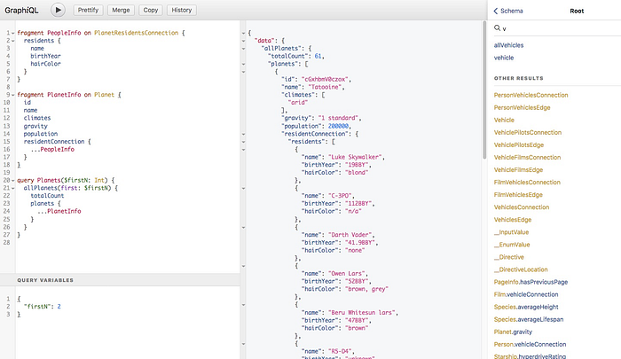
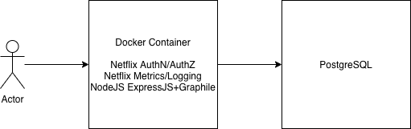
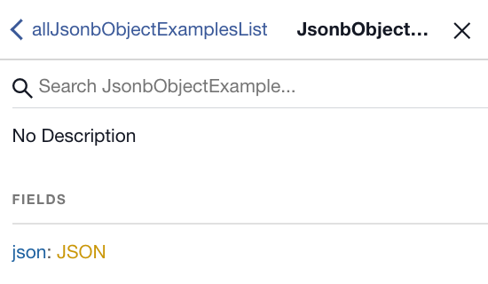
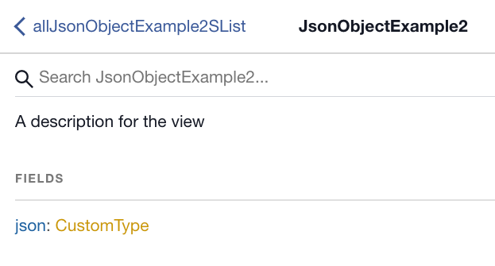
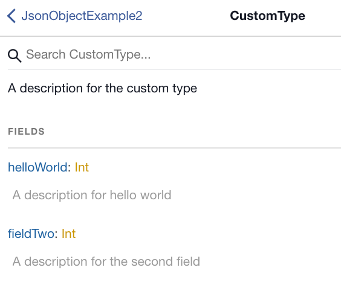

# Beyond REST

> Rapid Development with GraphQL Microservices

_by _[_Dane Avilla_](https://www.linkedin.com/in/daneavilla/)

The entertainment industry has struggled with COVID-19 restrictions impacting productions around the globe. Since early 2020, Netflix has been iteratively developing systems to provide internal stakeholders and business leaders with up-to-date tools and dashboards with the latest information on the pandemic. These software solutions allow executive leadership to make the most informed decisions possible regarding if and when a given physical production can safely begin creating compelling content across the world. One approach that is gaining mind-share within [Netflix Studio Engineering](./netflix-studio-engineering-overview-ed60afcfa0ce.md) is the concept of [_GraphQL_ _microservices_](https://dev.to/mrfrontend/graphql-microservices-architecture-by-apollo-1m75)_ _(GQLMS) as a backend platform facilitating rapid application development.

**Many organizations are embracing GraphQL as a way to unify their enterprise-wide data model and provide a single entry point for navigating a sea of structured data with its network of related entities.** Such efforts are laudable but often entail multiple calendar quarters of coordination between internal organizations followed by the development and integration of all relevant entities into a single monolithic graph.

In contrast to this “One Graph to Rule Them All” approach, GQLMS leverage GraphQL simply as an enriched API specification for building [CRUD](https://en.wikipedia.org/wiki/Create,_read,_update_and_delete) applications. Our experience using GQLMS for rapid proof-of-concept applications confirmed two theories regarding the advertised benefits of GraphQL:

- The [GraphiQL](https://github.com/graphql/graphiql) IDE displays any available GraphQL documentation right alongside the schema, dramatically improving developer ergonomics for API consumers (in contrast to the best-in-class [Swagger UI](https://swagger.io/tools/swagger-ui/)).
- GraphQL’s strong type system and polyglot client support mean API providers do not need to concern themselves with generating, versioning, and maintaining language-specific API clients (such as those generated with the excellent [Swagger Codegen](https://swagger.io/tools/swagger-codegen/)). Consumers of GraphQL APIs can simply leverage the open-source GraphQL client of their preference.


*GraphiQL: Auto-generated test GUI for the Star Wars API*

Our experience has led to an architecture with a number of best-practices for teams interested in GQLMS as a platform for rapid development.



### Graphile

During early GraphQL exploration efforts, Netflix engineers became aware of the [Graphile](https://graphile.org/) library for presenting PostgreSQL database objects (tables, views, and functions) as a GraphQL API. Graphile supports [smart comments](https://www.graphile.org/postgraphile/smart-comments/#gatsby-focus-wrapper) allowing control of various features by tagging database tables, views, columns, and types with specifically formatted PostgreSQL comments. Documentation can even be embedded in the database comments such that it displays in the GraphQL schema generated by Graphile.

We hypothesized that a [Docker](https://www.docker.com/why-docker) container running a very simple NodeJS web server with the Graphile library (and some additional Netflix internal components for security, logging, metrics, and monitoring) could provide a “better REST than REST” or “REST++” platform for rapid development efforts. Using Docker we defined a lightweight, stand-alone container that allowed us to package the Graphile library and its supporting code into a self-contained bundle that any team can use at Netflix with no additional coding required. Simply pull down the defined Docker base image and run it with the appropriate database connection string. This approach proved to be very successful and yielded several insights into the use of Graphile.

Specifically:

- Use database views as an “API layer” to preserve flexibility in order to allow modifying tables without changing an existing GraphQL schema (built on the database views).
- Use PostgreSQL [Composite Types](https://www.postgresql.org/docs/11/rowtypes.html) when taking advantage of PostgreSQL [Aggregate Functions](https://www.postgresql.org/docs/9.5/functions-aggregate.html).
- Increase flexibility by allowing GraphQL clients to have “full access” to the auto-generated GraphQL queries and mutations generated by Graphile (exposing CRUD operations on _all_ tables & views); then later in the development process, remove schema elements that did not end up being used by the UI before the app goes into production.

### Database views as API

We decided to put the data tables in one PostgreSQL schema and then define views on those tables in another schema, with the Graphile web app connecting to the database using a dedicated PostgreSQL user role. This ended up achieving several different goals:

- Underlying tables could be changed independently of the views exposed in the GraphQL schema.
- Views could do basic formatting (like rendering TIMESTAMP fields as ISO8601 strings).
- All permissions on the underlying table had to be explicitly granted for the web application’s PostgreSQL user, avoiding unexpected write access.
- Tables and views could be modified within a single transaction such that the changes to the exposed GraphQL schema happened atomically.

On this last point: changing a table column’s type would break the associated view, but by wrapping the change in a transaction, the view could be dropped, the column could be updated, and then the view could be re-created before committing the transaction. We run Graphile with `[pgWatch](https://www.graphile.org/postgraphile/usage-library/#api-postgraphilepgconfig-schemaname-options)` enabled, so as soon as any updates were made to the database, the GraphQL schema immediately updated to reflect the change.

### PostgreSQL composite types

Graphile does an excellent job reading the PostgreSQL _database_ schema and transforming tables and basic views into a _GraphQL_ schema, but our experience revealed limitations in how Graphile describes nested types when PostgreSQL [Aggregate Functions](https://www.postgresql.org/docs/9.5/functions-aggregate.html) or [JSON Functions](https://www.postgresql.org/docs/9.5/functions-json.html) exist within a view. Native PostgreSQL functions such as `json_build_object` will be translated into a GraphQL `JSON` type, which is simply a `String`, devoid of any internal structure. For example, take this simplistic view returning a `JSON` object:

```
postgres_test_db=# create view postgraphile.json_object_example as
  select json_build_object(‘hello world’::text, 1, ‘2’::text, 3)
  as json;
postgres_test_db=# select * from postgraphile.json_object_example;
          json
— — — — — — — — — — — — -
{“hello world”: 1, “2”: 3}
(1 row)
```

In the generated schema, the data type is `JSON`:



The internal structure of the `json` field (the `hello world` and `2` sub-fields) is opaque in the generated GraphQL schema.

To further describe the internal structure of the `json` field — exposing it within the generated schema — define a composite type, and create the view such that it returns that type:

```
postgres_test_db=# CREATE TYPE postgraphile.custom_type AS (
  "hello world" integer,
  "2" integer
);
```

Next, create a function that returns that type:

```
postgres_test_db=# CREATE FUNCTION postgraphile.custom_type(
  "hello world" integer,
  "2" integer
)
RETURNS postgraphile.custom_type
AS 'select $1, $2'
LANGUAGE SQL;
```

Finally, create a view that returns that type:

```
postgres_test_db=# create view postgraphile.json_object_example2 as
  select postgraphile.custom_type(1, 3)
  as json;
postgres_test_db=# select * from postgraphile.json_object_example2;
 json
— — — -
(1,3)
(1 row)
```

At first glance, that does not look very useful, but hold that thought: before viewing the generated schema, define comments on the view, custom type, and fields of the custom type to take advantage of Graphile’s smart comments:

```
postgres_test_db=# comment on
  type postgraphile.custom_type
  is E’A description for the custom type’;
postgres_test_db=# comment on
  view postgraphile.json_object_example2
  is E’A description for the view’;
postgres_test_db=# comment on
  column postgraphile.custom_type.”hello world”
  is E’A description for hello world’;
postgres_test_db=# comment on
  column postgraphile.custom_type.field_2
  is E’@name field_two\nA description for the second field’;
```

Now, when the schema is viewed, the `json` field no longer shows up with opaque type `JSON`, but with `CustomType`:



(also note that the comment made on the view — `A description for the view` — shows up in the documentation for the query field).

Clicking `CustomType` displays the fields of the custom type, along with their comments:



Notice that in the custom type, the second field was named `field_2`, but the Graphile smart comment renames the field to `field_two` and subsequently gets camel-cased by Graphile to `fieldTwo`. Also, the descriptions for both fields display in the generated GraphQL schema.

### Allow “full access” to the Graphile-generated schema (during development)

Initially, the proposal to use Graphile was met with vigorous [dissent](https://jobs.netflix.com/culture) when discussed as an option in a “one schema to rule them all” architecture. Legitimate concerns about security (how does this integrate with our [IAM](https://en.wikipedia.org/wiki/Identity_management) infrastructure to enforce row-level access controls within the database?) and performance (how do you limit queries to avoid DDoSing the database by selecting all rows at once?) were raised about providing open access to database tables with a SQL-like query interface. However, in the context of GQLMS for rapid development of internal apps by small teams, having the default Graphile behavior of making all columns available for filtering allowed the UI team to rapidly iterate through a number of new features without needing to involve the backend team. This is in contrast to other development models where the UI and backend teams first agree on an initial API contract, the backend team implements the API, the UI team consumes the API and then the API contract evolves as the needs of the UI change during the development life cycle.

Initially, the overall app’s performance was poor as the UI often needed multiple queries to fetch the desired data. However, once the app’s behavior had been fleshed out, we quickly created new views satisfying each UI interaction’s needs such that each interaction only required a single call. Because these requests run on the database in native code, we could perform sophisticated queries and achieve high performance through the appropriate use of indexes, denormalization, clustering, etc.

Once the “public API” between the UI and backend solidified, we “hardened” the GraphQL schema, removing all unnecessary queries (created by Graphile’s default settings) by marking tables and views with the smart comment `@omit`. Also, the default behavior is for Graphile to generate mutations for tables and views, but the smart comment `@omit create,update,delete` will remove the mutations from the schema.

### Conclusion

For those taking a [schema-first](https://blog.mirumee.com/schema-first-graphql-the-road-less-travelled-cf0e50d5ccff) approach to their GraphQL API development, the automatic GraphQL schema generation capabilities of Graphile will likely unacceptably restrict schema designers. Graphile may be difficult to integrate into an existing enterprise IAM infrastructure if fine-grained access controls are required. And adding custom queries and mutations to a Graphile-generated schema (i.e. to expose a gRPC service call needed by the UI) is something we currently do not support in our Docker image. However, we recently became aware of Graphile’s [makeExtendSchemaPlugin](https://www.graphile.org/postgraphile/make-extend-schema-plugin/), which allows custom types, queries, and mutations to be merged into the schema generated by Graphile.

That said, the successful implementation of an internal app over 4–6 weeks with limited initial requirements and an _ad hoc _distributed team (with no previous history of collaboration) raised a large amount of interest throughout the Netflix Studio. Other teams within Netflix are finding the GQLMS approach of:

1) using standard GraphQL constructs and utilities to expose the database-as-API

2) leveraging custom PostgreSQL types to craft a GraphQL schema

3) increasing flexibility by auto-generating a large API from a database

4) and exposing additional custom business logic and data types alongside those generated by Graphile

to be a viable solution for internal CRUD tools that would historically have used REST. Having a standardized Docker container hosting Graphile provides teams the necessary infrastructure by which they can quickly iterate on the prototyping and rapid application development of new tools to solve the ever-changing needs of a global media studio during these challenging times.

---
**Tags:** GraphQL · Graphql Vs Rest · Rest · Microservices · Rapid Prototyping
