# Bringing 4K and HDR to Anime at Netflix with Sol Levante

_By Haruka Miyagawa & Kylee Peña_

Some might dismiss them as simple cartoons, but anime’s diverse and fantastical stories, vibrant style, and delicate lines are an art form that has evolved and grown in popularity, variety and sophistication over the last fifty years. From its likely roots in colorful painted lanterns in the early 20th century, to gaining mainstream status in Japan in the 1970s, viewers now have hundreds of anime series and films to choose from all over the world.

Our Creative Technologies team wanted to elevate the technical quality of anime’s visuals, discover what new creative opportunities that would introduce, and to learn what it would take to increase anime’s resolution from HD to 4K and introduce the wider color palette of high dynamic range (HDR) to artists’ toolsets. When 4K entered the conversation, most animators in Japan asked for one thing: a bigger piece of paper! But the artists at Production I.G. saw the future in digital. A bigger, more colorful collaboration was born — and the resulting short, _Sol Levant_e, is now available for streaming on Netflix in 4K Dolby Vision and Atmos!

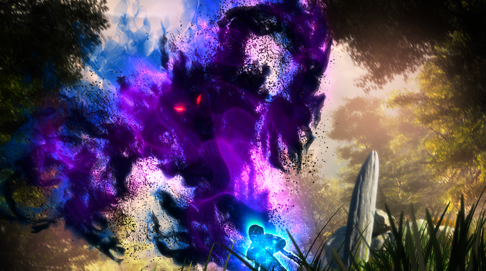

The Creative Technologies team at Netflix focuses on how we can improve our content creation practices for the long term, and works with various partners on research and development to bring these improvements to real world workflows. Combining high quality and longevity with an authentic presentation experience is a part of our team’s core mission, as is opening up new creative opportunities. Given the rapid adoption of consumer 4K HDR capable devices, it’s easy to imagine that it will be the primary viewing experience in five years.

We’ve had great success _remastering_ titles like _Knights of Sidonia_, _Flavours of Youth_ and _Godzilla_ from SDR to HDR over the last few years. But what if we increase the resolution and create anime with HDR in mind _from conception_? How would creative decisions change? What creative and technical challenges would pop up? How would the budget and timeline be impacted? And what new creative opportunities would emerge?

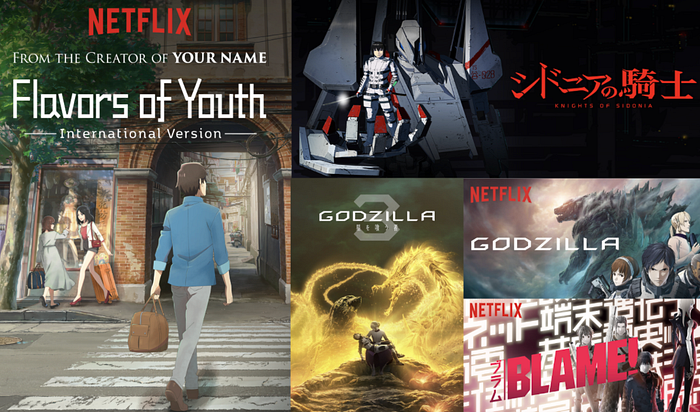

Known for projects like _Ghost in the Shell_ and the anime portion of _Kill Bill_, Production I.G. in Tokyo brought an experienced crew who felt comfortable working in digital from scratch and wanted to answer these questions too. Our combined curiosity led to the creation of an experimental 4K HDR Immersive Audio anime short called _Sol Levante_. [In order to help the industry better understand 4K HDR and immersive audio in anime, [we’ve released the raw materials used in _Sol Levante_ for download and experimentation.](http://download.opencontent.netflix.com/?prefix=SolLevante%2F)]

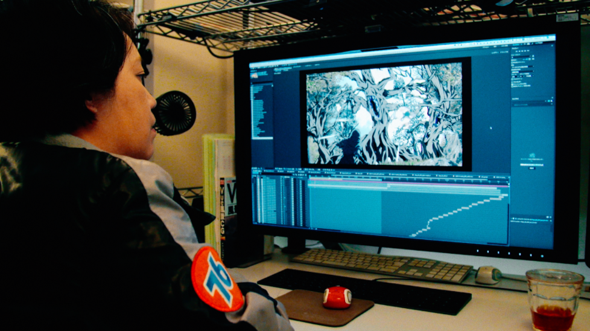

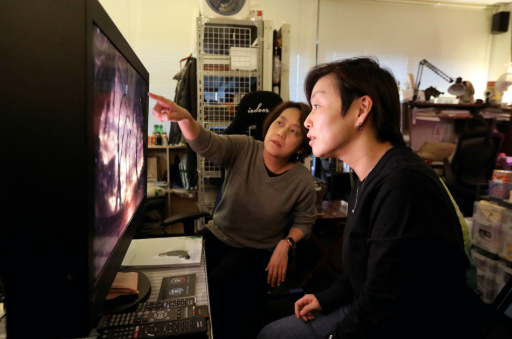
*(L) Director Akira Saitoh working in After Effects (R) Akira and Haruka working together*

## The Current State of Anime: Business

While the incredible stories in today’s anime will never become obsolete, the anime workflow developed in Japan hasn’t changed much over the years. To recognize why this experiment was necessary on a small scale, it’s important to understand the reality of creating anime in Japan.

Since the turn of the century, the anime industry has shifted from the traditional system of an anime studio owning most or all of the copyright to the current business model of a “Production Committee” system. While it became easier to create content for the studio thanks to all the financial support, more stakeholders are involved which creates a lot more complexity.

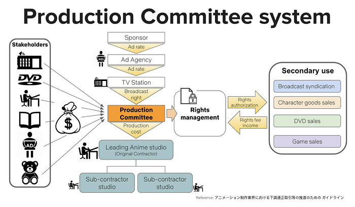

Some or all of the production is subcontracted to multiple companies and freelancers in many cascading tiers. With so many subcontractors involved, it’s hard to align everyone with changes in technology and new creative opportunities. The number of freelancers depends on each project, but those who are working at home have limited equipment compared to those working at studios.

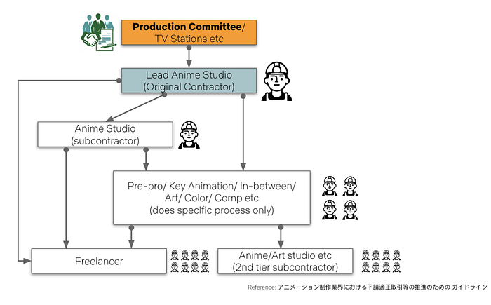

## The Current State of Anime: Production

In addition to the complexities of the studio system, there are challenges to be faced when trying to make the production workflow of anime more innovative. While “3D CG” anime is becoming more popular — shows like _Saint Seiya and Ultraman_ that are generated entirely on computers by 3D artists — most anime titles are still hand drawn. Some artists simply prefer the feel of a piece of paper, or haven’t had the time and money to invest in the equipment needed to even try digital, such as a new computer. The pipeline that follows after the drawing phase is already digital, but it requires major equipment upgrades to support a larger resolution. There’s also a lack of teachers with the experience or tools to teach the next generation of digital animators. This produces a lack of staff who are willing and able to work digitally in the drawing phase.

Anime for broadcast is usually created at 1280x720, or “Half HD”. Only some high-end shows are in full 1080 HD. To move to 4K, digital becomes a necessity because when hand drawings are completed, they’re scanned. But if the typically-sized piece of paper is scanned at a higher DPI, unwanted detail is blown up in the pencil lines. Therefore, a bigger piece of paper is required to increase the resolution with pencil-drawn anime!

Color management — a process that helps to achieve predictable and consistent color at each stage of production and post — is also rare in anime workflows. With a few exceptions, everything is created in an sRGB color space — the most common color gamut used in computer graphics applications. For feature films, animators usually create in sRGB and then the post house applies a 3D LUT to transform to P3, thereby preserving the sRGB look in a P3 colorspace.

In addition, you might be surprised to read that Japanese broadcasters set the color temperature at 9300K, much bluer than the 6500K that dominates as a standard elsewhere in the world. In fact, many of the licensed anime shows on Netflix were converted to D65 BT.1886 at the very end of post production to meet our spec and look accurate on our streaming service — as the creatives intended!

Understanding the challenges involved with moving anime from a piece of paper to a fully digital workflow, Creative Technologies worked closely with Production I.G. to try to anticipate some of the hurdles that were to come. But it was only when the team started to put digital pen to tablet that the findings began to take shape.

## Sol Levante: Pre-Production Findings

The current anime production process usually means about 1 ½ to 2 years of work from writing to delivery for a 12 episode broadcast series. For _Sol Levante_, director Akira Saitoh spent two weeks storyboarding the 3 minute short movie. She tried to “stage the light” by hitting many different colors from scene to scene, making the story start at dawn, go through a dark day, night, and end with the sunrise. According to Akira, it was a lot of fun and she excitedly created animatics without knowing what issues would stand in the way of production.

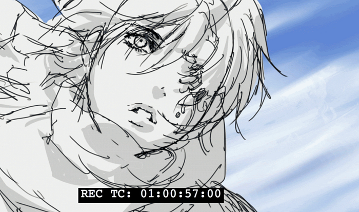
*One of Akira’s storyboards*

When Akira considered 4K and the increase in resolution, she balanced carefully between shots with simple lines and shots with intricate details. In many shots, she created a world that has enough density to overwhelm audiences, retaining fine details you can see even after zooming.

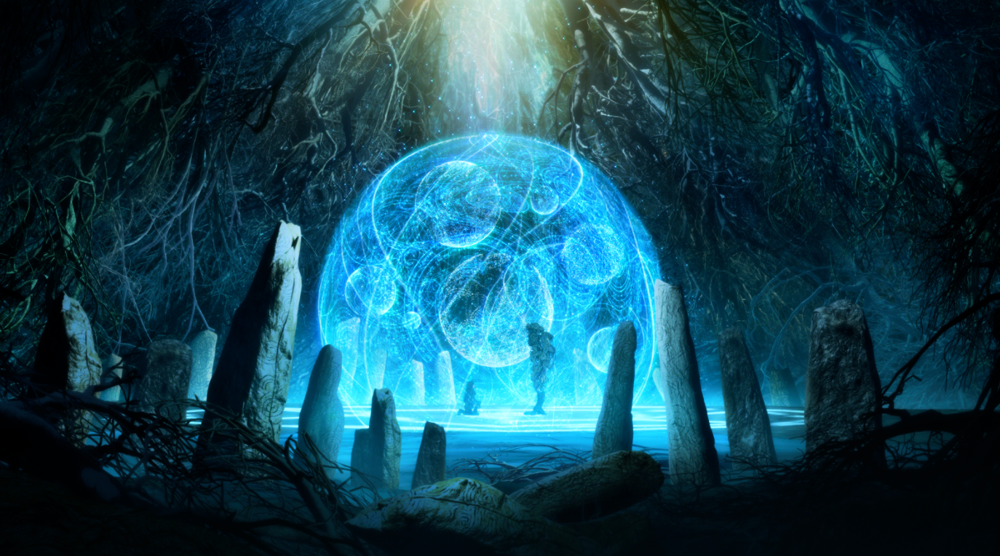

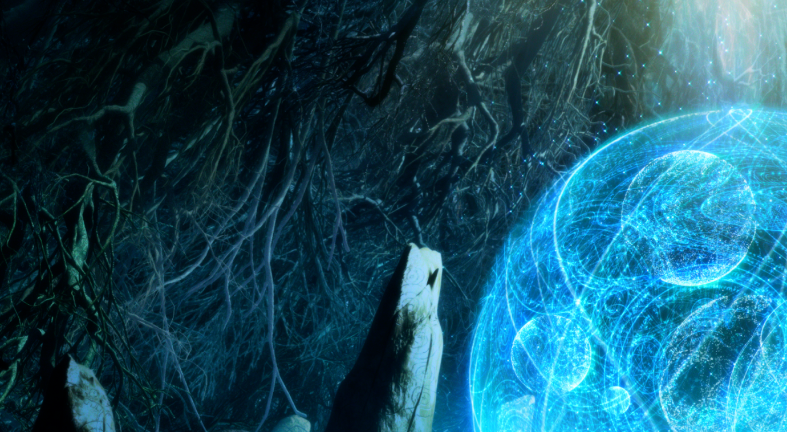

For the character design phase, animator Hisashi Ezura spent lots of time adjusting the thickness of the line because of the wider dynamic range. Having an outline on characters is unique in anime, but using the typical line thickness for SDR became too sharp and looked fake in HDR. He adjusted the pen pressure to have a bit softer touch than usual.

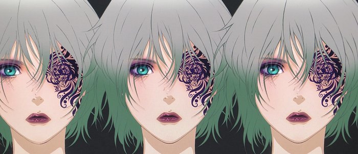
*A test image to check line thickness*

In the color design phase, the team initially thought 300 nits would be good enough for pre-production. However, once they saw the impact of 1000 nits on an Eizo CG3145 monitor, they felt the gap between the two was huge and 300 nits didn’t provide the color designer a full palette. Since color decisions are made in pre-production for anime, it was very important for Production I.G. color designer Miho Tanaka to look at an actual mastering monitor at 1000 nits at this point.

Establishing the skin tone was also a challenge. Shadow color in particular needed careful adjustment as it could easily make the overall appearance of the face very different, and impact the character design. Miho spent lots of her time making the character look pretty at all times of the day. For dark scenes, HDR made it easier to create colors because it didn’t get “muddy”, and the line kept its sharpness. Without enough dynamic range, it’s hard to retain thin lines like eyelashes. HDR allows for distinct color separations instead of ones that blur in a way that is undesirable.

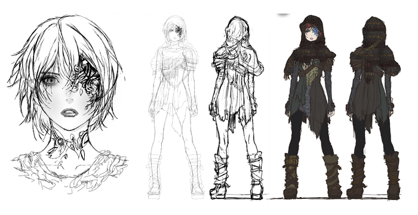

During the look development, other challenges and opportunities emerged. Thanks to HDR, the typical VFX effect to make eyes appear to sparkle could be replaced by simply using colors differently. By adding simple bright lines on the lips, they become glossy. The director received all this feedback and adjusted her designs and colors.

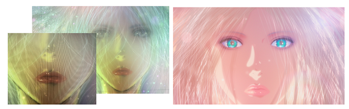
*(L) Test Image (R) Final Image*

One of the biggest challenges during pre-production were the limitations in design and drawing tools in HDR. The user interface of graphics software was far too bright to view consistently at 1000 nits, and the background needed to be changed to grey (180) instead of white (255) during preview on an HDR monitor. Inside many graphics tools, 16 bit output is still not fully supported — a critical requirement for HDR. And when selecting color swatches, the color picker in design software would look different on SDR and HDR monitors, leading to difficulty in accurately selecting colors.

Challenges with 4K also emerged at this stage. When artists drew lines, limitations on resolution for their screen or tablet required them to scale up and check their work repeatedly. When fully zoomed out, the lines were too thin to recognize minute details.

## Sol Levante: Production Findings

Pre-production went smoothly in our collaboration with Production IG. The real challenges began to emerge in the production phase.

To start, the team had to go through a lot of experimentation to establish the right signal flow and set-up the proper color profiles and view color correctly on each display depending on the software. The team needed to have multiple monitors for each artist to show SDR and HDR, and to continue to support the SDR projects they continued to work on in the studio. Management of color in animation is a challenge across many productions globally. This was a particularly complex project, but Junichiro Aki and Katsushi Eda and color management specialist Masakazu Morinaka created a system that worked.

For _Sol Levante_, everything was created digitally. Aside from using Procreate on the iPad for the pre-production drawing and ideation phases, Production I.G. used ClipStudio for in-betweening, Vue for background and a few select elements, Retas Stylus for color, Photoshop, and After Effects. Animators experimented with Toon Boom Harmony, which is well-known for “cut out” animation, a technique widely used outside Japan.

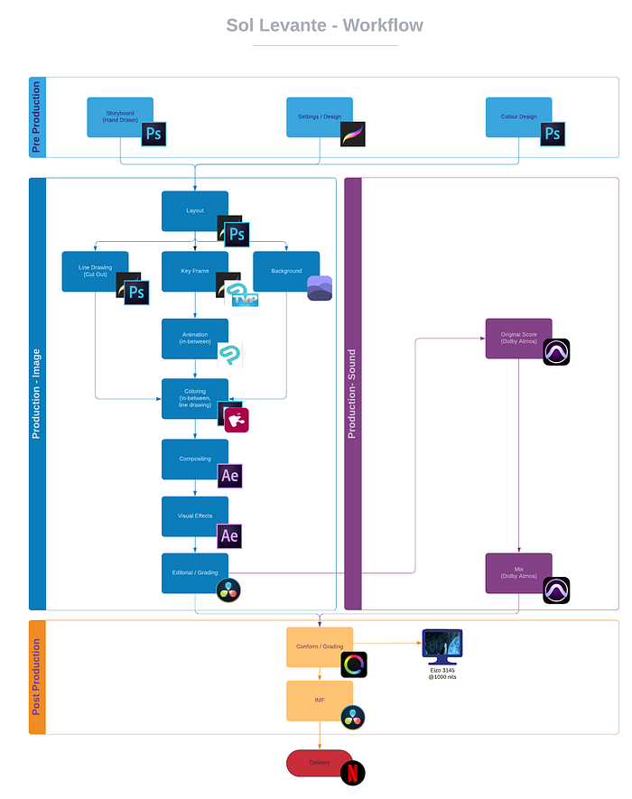
*Sol Levante’s workflow diagram: click to expand*

Right away, the team realized some anime techniques they had relied upon for years wouldn’t work with the additional brightness and color gamut. For example, “white out” is a common effect in anime: a fade to 100% white as a storytelling technique. The white was far too overpowering in HDR, so they chose to add a white layer on top of the existing color instead. Every time they found something that couldn’t work as expected, they found another way to accomplish the same feeling.

The biggest impact 4K had on the workflow was when rendering final shots with compositions that contained images much bigger than 4K to allow for panning. In fact, the rendering problems at this resolution caused such an issue that the entire project was delayed for months. Some of these issues were caused by hardware configurations that needed to be adjusted for the 4K pipeline, while others were rooted in the design of software and how it utilized system resources. Redesigning software to better handle system resources continues to be a major problem for software manufacturers to solve.

Digital drawings also retain delicate lines because there’s no need to scan paper for digitization. Compared to paper, the animator wasn’t as conscious about the canvas size. He also made a “settings sheet” to limit the level of detail for characters and accessories under certain conditions. The amount of detail is related to the size of the character on the screen. This needs to be refined to decide to add additional detail in 4K resolution, or to not spend time on detail that won’t be seen.

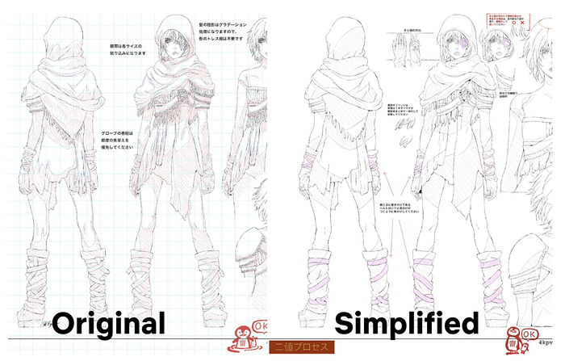
*Production I.G.’s settings sheet*

As Production I.G. continued to work on _Sol Levante_, the team decided to outsource some of the “in-between” animation work — generating the intermediate frames between two images — to other companies (a common practice in anime production). It was difficult to accomplish this since a typical response from these subcontractors was to refuse new ideas like a digital workflow, which would require investment in equipment and retraining staff to adopt these new tools. Additionally, since Production I.G. found that working on an HDR monitor at 1000 nits was absolutely necessary for color decisions, line work, or compositing, the persistent shortage of HDR monitors — particularly affordable monitors — in the post production market has a major impact on the ability to decide to work in HDR from the beginning.

Ultimately, Production I.G. was able to get enough subcontractors on board with a fully digital workflow with one exception: timesheets used for timing out the drawings and making indications for in-betweens, camera movements, and other technical information. This became the only paper in Sol Levante’s entire pipeline.

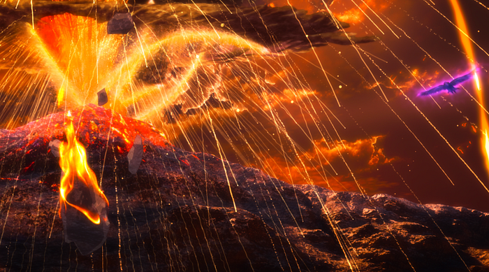

Final color grading is not usually part of the finishing process for anime, but for _Sol Levante_ the animators worked with a 10,000 nit image container (PQ) yet displayed it on a 1000 nit monitor, so a “trim” pass was necessary to finalize the visible range and look. During the grading session, the colorist and director discovered opportunities to enhance the final anime by changing some initial color choices and allowing elements to stand out from the background. For example, the colorist adjusted the color of the lightning on one frame to make it stand out more, and added film grain on the volcano eruption to give it more texture.

Since the full range of PQ was utilized in production, the colorist had more freedom and “headroom” to adjust during grading, and the archived project has greater flexibility for remastering in the future. While relying on original color is traditional, this showed Production I.G. that there are more creative decisions that can be made throughout the pipeline.

One of the director’s greatest learnings throughout the entire production was that **the studio in charge really needs to take the lead and provide a fixed workflow and tools to the subcontractors instead of endless options.** Things can’t change unless big studios team up with manufacturers to push the transition to digital.

## The Sound of Anime: Immersive Audio

Unique to the world of anime is a soundscape unlike any other content type. Music and sound are critical to a storytelling experience, and _Sol Levante_ was the perfect opportunity to showcase this in an experience that blended immersive audio with the experiment of 4K and HDR in anime. Our team believes immersive sound mixing is the natural next step in the evolution of audio because of what it brings to the quality and creative opportunity of a story. Blending 4K, HDR, and immersive audio would make Akira’s world truly alive. And it could be done while using all the same tools mixers are already used to using.

Mixing in Dolby Atmos, sound mixer Will Files and sound designer Matt Yocum collaborated with director Akira to create the sound of her world. Getting involved early in the process while animations were still being completed, Haruka helped to translate Akira’s ideas from Japanese to English while maintaining the creative nuance and meaning.

In one instance, Matt added a raven sound behind the shot of hundreds of birds flying upward, and received feedback from Akira to try a sound from a bird native to Japan instead. Matt created something brand new from the native bird, developing an effect that wouldn’t have existed without this global collaboration.

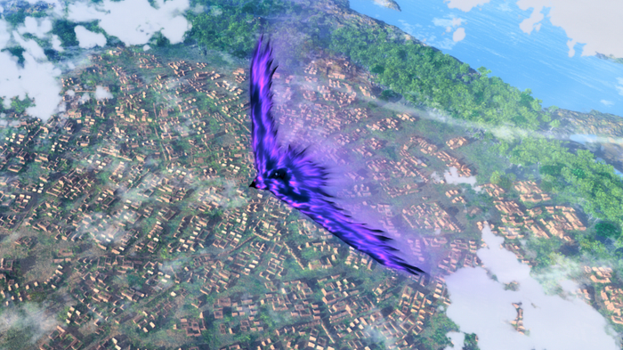

Using Dolby Atmos inside Pro Tools, Will brought contrast to the sound mix and wove in composer Emily Rice’s original orchestral score which had been recorded on a Schoeps ORTF 3D microphone during the scoring session. By moving sounds around the room, to the ceiling and the floor and back again, the sound and music tell the drama of _Sol Levante_ without dialog.

Immersive audio mixing is still a new concept for many mixers, including those in Japan where there aren’t yet enough updated rooms to support playback across many shows. However, mixing in Dolby Atmos allows the creative team to create one single mix that can be used to derive all others, from 7.1,5.1 to Stereo, which makes it an ideal archival format, and a great way to bring a new dimension to anime.

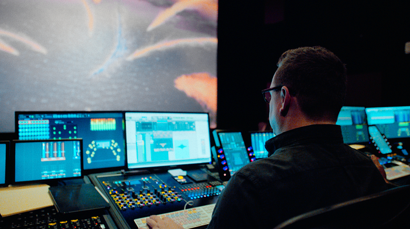
*Sound Supervisor and Re-recording Mixer Will Files working with Dolby Atmos*

## The Future of Anime Production: What’s Next?

The gorgeous world of _Sol Levante_ was a culmination of art, technology, and curiosity. Given all that we’ve learned in this two year collaboration with Production I.G., we want to start a conversation with animators and creatives about evolving technologies, partner with manufacturers to better support the anime industry, and work with anime studios to apply our findings to their productions.** In order to help the industry better understand 4K HDR and immersive audio in anime, **[**we’ve released raw materials used in _Sol Levante_ for download and experimentation**](http://download.opencontent.netflix.com/?prefix=SolLevante%2F)**. **Subscribers can watch _Sol Levante_ on Netflix today. It’s best enjoyed on an HDR configured device with a premium subscription.

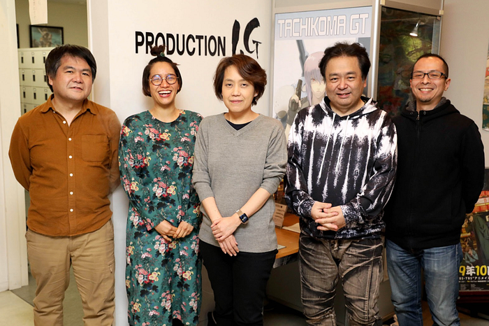
*(From Left) Production I.G.’s Katsushi Eda, Miho Tanaka, Akira Saitoh, Hisashi Ezura, Masakazu Morinaka*

Director Akira Saitoh told us that “4K HDR is like getting wings and an engine to see a new horizon where a new era is rising. We keep challenging ourselves and being innovative for the future.” There have been many challenges for this project, but Akira believes 4K HDR is the only way for them to continue being a top runner of content creation.

However, the current reality is that these technical challenges _do_ persist, especially for moving from HD to 4K. We encourage creatives to push the boundaries of resolution to serve their story. We want to create content in the format that viewers will be consuming it, and we want that content to look great for as long as possible. But we can’t ignore the fact that for anime, the tools and equipment are still not prepared for a 4K workflow without a major overhaul. There is more to do and learn, and the Creative Technologies team is engaging with software and hardware manufacturers to share these learnings and try to accelerate improvement in the industry.

For HDR**, the adjustment is much easier because the challenges are simpler to solve. T**here are already software manufacturers making changes to account for the issues faced on _Sol Levant_e, like the color picker’s different visual representation across monitors and a searingly bright UI. The biggest hurdle that remains across the industry is the lack of affordable HDR monitors. After all, even with an HDR color picker, you need the monitor to see what color you are picking. Once they become more plentiful, it’s only a matter of time before HDR is common in anime.

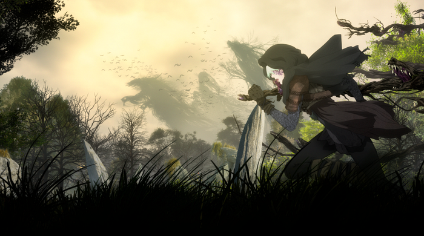

> **“At the end, who doesn’t want a bigger house?”**

This is what animator Hisashi Ezura told us about working in HDR, and the analogy made Haruka laugh because the Japanese are well known for living in small apartments and always wanting to have a big house — but it’s a dream. For him, this dream came true for his work. And now that he can achieve things he never thought possible by using HDR, he’ll never go back.

In Italian, _Sol Levante_ means “sun rising from east”, a metaphor for Japan. Akira chose this title because to her, the theme of the project was _the beginning — _the beginning of something new for Japan’s animators. As the last shot in the film is the dawn, so too is this the dawn of new creative technology for anime!

**_[_**[**_Download the image and sound assets_**](http://download.opencontent.netflix.com/?prefix=SolLevante%2F)**_ for Sol Levante including TIFF sequence and IMF, selected After Effects projects, ProTools sessions, animatic and storyboard, and more.]_**

---
**Tags:** Anime · Hdr · 4k · Netflix · Animation
