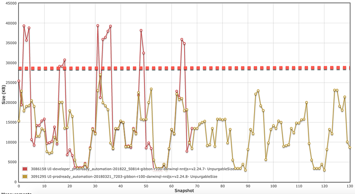
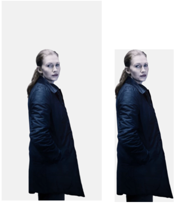
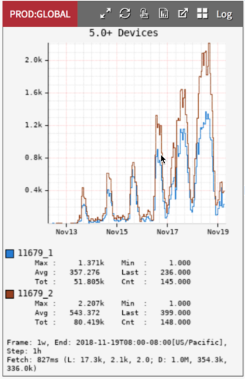
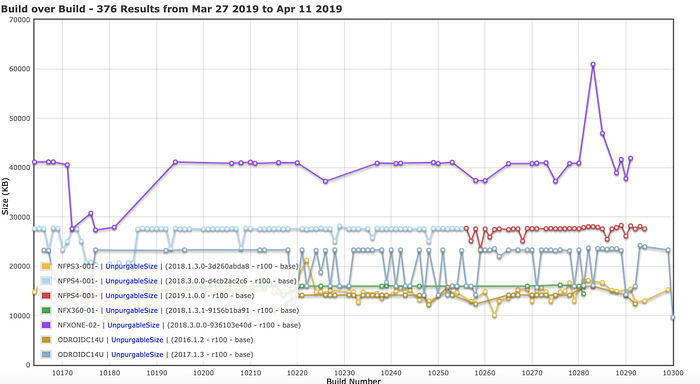
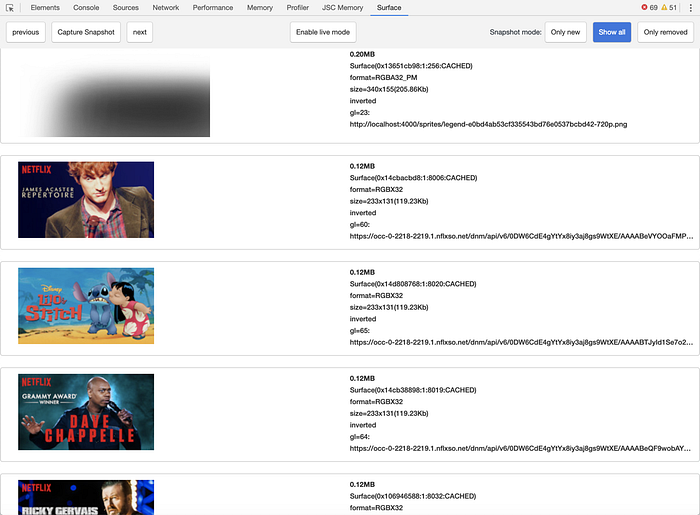

# Bringing Rich Experiences to Memory-Constrained TV Devices

By Jason Munning, Archana Kumar, Kris Range

Netflix has over 148M paid members streaming on more than half a billion devices spanning over 1,900 different types. In the TV space alone, there are hundreds of device types that run the Netflix app. We need to support the same rich Netflix experience on not only high-end devices like the PS4 but also memory and processor-constrained consumer electronic devices that run a similar chipset as was used in an iPhone 3Gs.

In a [previous post](https://medium.com/@Netflix_Techblog/building-the-new-netflix-experience-for-tv-920d71d875de), we described how our TV application consists of a C++ SDK installed natively on the device, an updatable JavaScript user interface (UI) layer, and a custom rendering layer known as Gibbon. We ship the same UI to thousands of different devices in order to deliver a consistent user experience. As UI engineers we are excited about delivering creative and engaging experiences that help members choose the content they will love so we are always trying to push the limits of our UI.

In this post, we will discuss the development of the Rich Collection row and the iterations we went through to be able to support this experience across the majority of the TV ecosystem.

## Rich Collection Row

One of our most ambitious UI projects to date on the TV app is the animated Rich Collection Row. The goal of this experience from a UX design perspective was to bring together a tightly-related set of original titles that, though distinct entities on their own, also share a connected universe. We hypothesized this design would net a far greater visual impact than if the titles were distributed individually throughout the page. We wanted the experience to feel less like scrolling through a row and more like exploring a connected world of stories.

For the collections below, the row is composed of characters representing each title in a collected universe overlaid onto a shared, full-bleed background image which depicts the shared theme for the collection. When the user first scrolls down to the row, the characters are grouped into a lineup of four. The name of the collection animates in along with the logos for each title while a sound clip plays which evokes the mood of the shared world. The characters slide off screen to indicate the first title is selected. As the user scrolls horizontally, characters slide across the screen and the shared backdrop scrolls with a parallax effect. For some of the collections, the character images themselves animate and a full-screen tint is applied using a color that is representative of the show’s creative (see “Character Images” below).

Once the user pauses on a title for more than two seconds, the trailer for that title cross-fades with the background image and begins playing.

## Development

As part of developing this type of UI experience on any platform, we knew we would need to think about creating smooth, performant animations with a balance between quality and download size for the images and video previews, all without degrading the performance of the app. Some of the [metrics we use to measure performance](https://medium.com/netflix-techblog/crafting-a-high-performance-tv-user-interface-using-react-3350e5a6ad3b) on the Netflix TV app include animation frames per second (FPS), key input responsiveness (the amount of time before a member’s key press renders a change in the UI), video playback speed, and app start-up time.

UI developers on the Netflix TV app also need to consider some challenges that developers on other platforms often are able to take for granted. One such area is our graphics memory management. While web browsers and mobile phones have gigabytes of memory available for graphics, our devices are constrained to mere MBs. Our UI runs on top of a custom rendering engine which uses what we call a “surface cache” to optimize our use of graphics memory.

## Surface Cache

Surface cache is a reserved pool in main memory (or separate graphics memory on a minority of systems) that the Netflix app uses for storing textures (decoded images and cached resources). This benefits performance as these resources do not need to be re-decoded on every frame, saving CPU time and giving us a higher frame-rate for animations.

Each device running the Netflix TV application has a limited surface cache pool available so the rendering engine tries to maximize the usage of the cache as much as possible. This is a positive for the end experience because it means more textures are ready for re-use as a customer navigates around the app.

The amount of space a texture requires in surface cache is calculated as:

**width * height * 4 bytes/pixel** (for rgba)

Most devices currently run a 1280 x 720 Netflix UI. A full-screen image at this resolution will use 1280 * 720 * 4 = 3.5MB of surface cache. The majority of legacy devices run at 28MB of surface cache. At this size, you could fit the equivalent of 8 full-screen images in the cache. Reserving this amount of memory allows us to use transition effects between screens, layering/parallax effects, and to pre-render images for titles that are just outside the viewport to allow scrolling in any direction without images popping in. Devices in the Netflix TVUI ecosystem have a range of surface cache capacity, anywhere from 20MB to 96MB and we are able to enable/disable rich features based on that capacity.

When the limit of this memory pool is approached or exceeded, the Netflix TV app tries to free up space with resources it believes it can purge (i.e. images no longer in the viewport). If the cache is over budget with surfaces that cannot be purged, devices can behave in unpredictable ways ranging from application crashes, displaying garbage on the screen, or drastically slowing down animations.

## Surface Cache and the Rich Collection Row

From developing previous rich UI features, we knew that surface cache usage was something to consider with the image-heavy design for the Rich Collection row. We made sure to test memory usage early on during manual testing and did not see any overages so we checked that box and proceeded with development. When we were approaching code-complete and preparing to roll out this experience to all users we ran our new code against our memory-usage automation suite as a sanity check.

The chart below shows an end-to-end automated test that navigates the Netflix app, triggering playbacks, searches, etc to simulate a user session. In this case, the test was measuring surface cache after every step. The red line shows a test run with the Rich Collection row and the yellow line shows a run without. The dotted red line is placed at 28MB which is the amount of memory reserved for surface cache on the test device.

*Automation run showing surface cache size vs test step*

Uh oh! We found some massive peaks (marked in red) in surface cache that exceeded our maximum recommended surface cache usage of 28MB and indicated we had a problem. Exceeding the surface cache limit can have a variety of impacts (depending on the device implementation) to the user from missing images to out of memory crashes. Time to put the brakes on the rollout and debug!

## Assessing the Problem

The first step in assessing the problem was to drill down into our automation results to make sure they were valid. We re-ran the automation tests and found the results were reproducible. We could see the peaks were happening on the home screen where the Rich Collection row was being displayed. It was odd that we hadn’t seen the surface cache over budget (SCOB) errors while doing manual testing.

To close the gap we took a look at the configuration settings we were using in our automation and adjusted them to match the settings we use in production for real devices. We then re-ran the automation and still saw the peaks but in the process we discovered that the issue seemed to only present itself on devices running a version of our SDK from 2015. The manual testing hadn’t caught it because we had only been manually testing surface cache on more recent versions of the SDK. Once we did manual testing on our older SDK version we were able to reproduce the issue in our development environment.

*An example console output showing surface cache over budget errors*

During brainstorming with our platform team, we came across an internal bug report from 2017 that described a similar issue to what we were seeing — surfaces that were marked as purgeable in the surface cache were not being fully purged in this older version of our SDK. From the ticket we could see that the inefficiency was fixed in the next release of our SDK but, because not all devices get Netflix SDK updates, the fix could not be back-ported to the 2015 version that had this issue. Considering that a significant share of our actively-used TV devices are running this 2015 version and won’t be updated to a newer SDK, we knew we needed to find a fix that would work for this specific version — a similar situation to the pre-2000 world before browsers auto-updated and developers had to code to specific browser versions.

## Finding a Solution

The first step was to take a look at what textures were in the surface cache (especially those marked as un-purgeable) at the time of the overage and see where we might be able to make gains by reducing the size of images. For this we have a debug port that allows us to inspect which images are in the cache. This shows us information about the images in the surface cache including url. The links can then be hovered over to show a small thumbnail of the image.

From snapshots such as this one we could see the Rich Collection row alone filled about 15.3MB of surface cache which is >50% of the 28MB total graphics memory available on devices running our 2015 SDK.

The largest un-purgeable images we found were:

- Character images (6 * 1MB)
- Background images for the parallax background (2 * 2.9MB)
- Unknown — a full screen blank white rectangle (3.5MB)

## Character Images

Some of our rich collections featured the use of animated character assets to give an even richer experience. We created these assets using a Netflix-proprietary animation format called a Scriptable Network Graphic (SNG) which was first supported in 2017 and is similar to an animated PNG. The SNG files have a relatively large download size at ~1.5MB each. In order to ensure these assets are available at the time the rich collection row enters the viewport, we preload the SNGs during app startup and save them to disk. If the user relaunches the app in the future and receives the same collection row, the SNG files can be read from the disk cache, avoiding the need to download them again. Devices running an older version of the SDK fallback to a static character image.

*Marvel Collection row with animated character images*

At the time of the overage we found that** **six character images were present in the cache — four on the screen and two preloaded off of the screen. Our first savings came from only preloading one image for a total of five characters in the cache. Right off the bat this saved us almost 7% in surface cache with no observable impact to the experience.

Next we created cropped versions of the static character images that did away with extra transparent pixels (that still count toward surface cache usage!). This required modifications to the image pipeline in order to trim the whitespace but still maintain the relative size of the characters — so the relative heights of the characters in the lineup would still be preserved. The cropped character assets used only half of the surface cache memory of the full-size images and again had no visible impact to the experience.

*Full-size vs cropped character image*

## Parallax Background

In order to achieve the illusion of a continuously scrolling parallax background, we were using two full screen background images essentially placed side by side which together accounted for ~38% of the experience’s surface cache usage. We worked with design to create a new full-screen background image that could be used for a fallback experience (without parallax) on devices that couldn’t support loading both of the background images for the parallax effect. Using only one background image saved us 19% in surface cache for the fallback experience.

## Unknown Widget

After trial and error removing React components from our local build and inspecting the surface cache we found that the unknown widget that showed as a full screen blank white rectangle in our debug tool was added by the full-screen tint effect we were using. In order to apply the tint, the graphics layer essentially creates a full screen texture that is colored dynamically and overlaid over the visible viewport. Removing the tint overlay saved us 23% in surface cache.

Removing the tint overlay and using a single background image gave us a fallback experience that used 42% less surface cache than the full experience.

*Marvel Collection row fallback experience with static characters, no full-screen tint, and single background*

When all was said and done, the surface cache usage of the fallback experience (including fewer preloaded characters, cropped character images, a single background, and no tint overlay) clocked in at about 5MB which gave us a total savings of almost 67% over our initial implementation.

We were able to target this fallback experience to devices running the 2015 and older SDK, while still serving the full rich experience (23% lower surface cache usage than the original implementation) to devices running the new SDKs.

## Rollout

At this point our automation was passing so we began slowly rolling out this experience to all members. As part of any rollout, we have a dashboard of near real-time metrics that we monitor. To our chagrin we saw that another class of devices — those running the 2017 SDK — also were reporting higher SCOB errors than the control.

*Total number of SCOB errors vs time*

Thanks to our work on the fallback experience we were able to change the configuration for this class of devices on the fly to serve the fallback experience (without parallax background and tint). We found if we used the fallback experience we could still get away with using the animated characters. So yet another flavor of the experience was born.

## Improvements and Takeaways

At Netflix we strive to move fast in innovation and learn from all projects whether they are successes or failures. From this project, we learned that there were gaps in our understanding of how our underlying graphics memory worked and in the tooling we used to monitor that memory. We kicked off an effort to understand this graphics memory space at a low level and compiled a set of best practices for developers beginning work on a project. We also documented a set of tips and tools for debugging and optimizing surface cache should a problem arise.

As part of that effort, we expanded our suite of build-over-build automated tests to increase coverage across our different SDK versions on real and reference devices to detect spikes/regressions in our surface cache usage.

*Surface cache usage per build*

We began logging SCOB errors with more detail in production so we can target the specific areas of the app that we need to optimize. We also are now surfacing surface cache errors as notifications in the dev environment so developers can catch them sooner.

And we improved our surface cache inspector tool to be more user friendly and to integrate with our Chrome DevTools debugger:

*New internal tool for debugging surface cache*

## Conclusion

As UI engineers on the TVUI platform at Netflix, we have the challenge of delivering ambitious UI experiences to a highly fragmented ecosystem of devices with a wide range of performance characteristics. It’s important for us to reach as many devices as possible in order to give our members the best possible experience.

The solutions we developed while scaling the Rich Collection row have helped inform how we approach ambitious UI projects going forward. With our optimizations and fallback experiences we were able to almost double the number of devices that were able to get the Rich Collection row.

We are now more thoughtful about designing fallback experiences that degrade gracefully as part of the initial design phase instead of just as a reaction to problems we encounter in the development phase. This puts us in a position of being able to scale an experience very quickly with a set of knobs and levers that can be used to tune an experience for a specific class of devices.

Most importantly, we received feedback that our members enjoyed our Rich Collection row experience — both the full and fallback experiences — when we rolled them out globally at the end of 2018.

If this interests you and want to help build the future UIs for discovering and watching shows and movies, [join our team](https://jobs.netflix.com/jobs/866978)!

---
**Tags:** Javascript Development · Graphics · Front End Development · Netflix · User Interface Design
