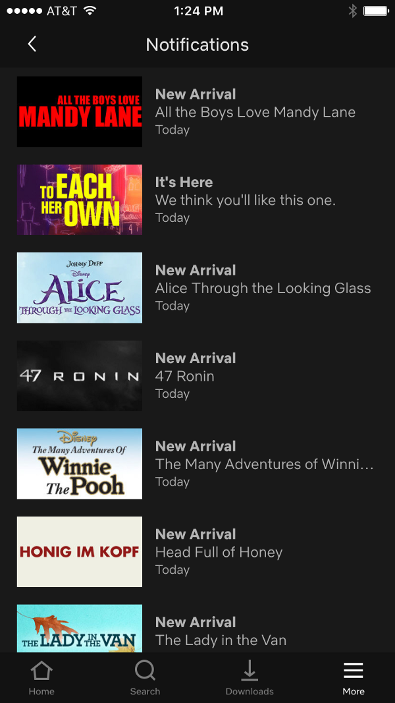
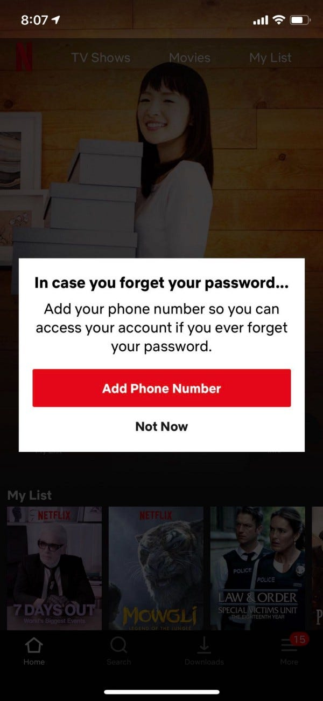
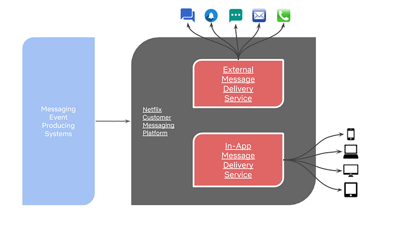
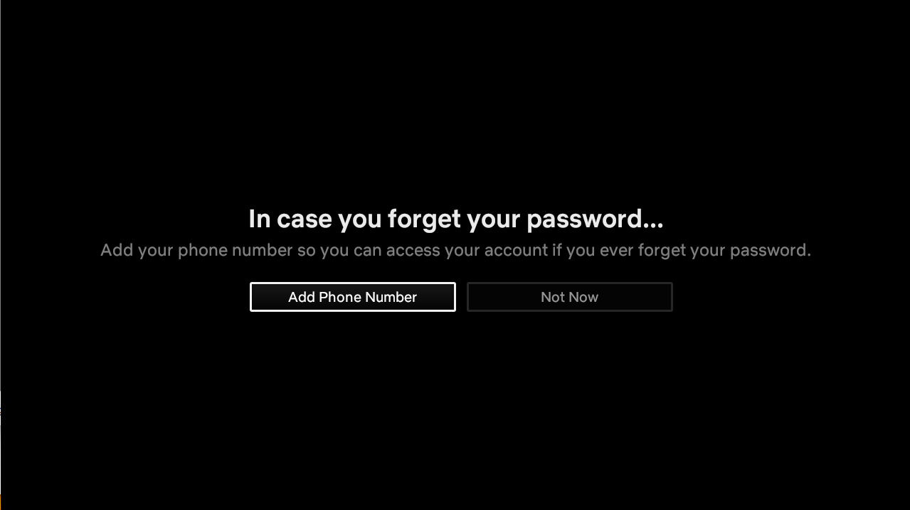
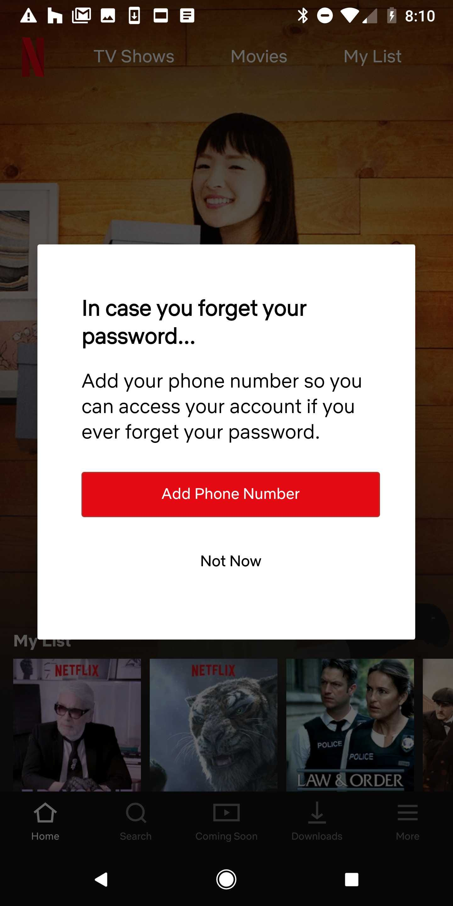
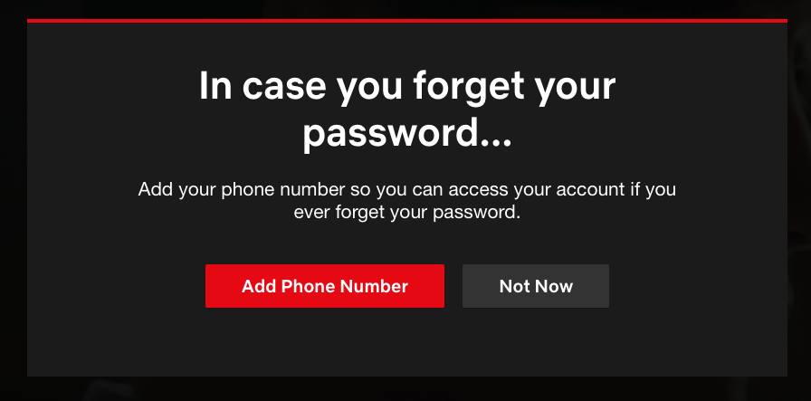

# Building a Cross-platform In-app Messaging Orchestration Service

> George Abraham, Devika Chawla, Chris Beaumont, and Daniel Huang.

Thoughtful, relevant, and timely messaging is an integral part of a customer’s Netflix experience. The Netflix Messaging Engineering team builds the platform and the messages to communicate with Netflix customers.


---

## Messages in the Netflix App

In-app messages at Netflix fall broadly into two channels — Notifications and Alerts. Notifications are content recommendations that show up in the Notification Center within the Netflix app. Alerts are typically account related messages that are designed to draw the customer’s attention to take some action and show up on the main screen. This blog post will focus on the Alerts channel.




*Left: Notification Center on the Netflix iOS app. Right: An in-app Alert on the Netflix iOS app.*


---

## Some History

It is worth spending some time painting a picture of the landscape that we evolved from. In the early days, account-related Alerts were served only on the Netflix website app. All the logic around presenting an Alert was implemented in the website codebase. The UI handled business logic around priority, customer state validation, timing, etc. A few years ago, the Netflix website was undergoing a major re-architecture. We simplified the ecosystem and built an in-app messaging service that handled the complexity of messaging orchestration by taking ownership of dimensions like

- Timing — when to show a message
- Frequency — how often to show a message
- Device Eligibility — which devices to show the message
- Population Segment — which profiles to show the message

This freed up UI platforms to focus their attention on core UI innovation.


---

## Initial Goals

Our primary goals at project inception were the following:

1. Continue to support in-app Alert messaging in the new Website architecture (i.e remain backward compatible)
2. Transfer business logic around messaging orchestration from the UI tier to the in-app messaging service
3. Support cross-platform messaging
4. Minimize time spent on running and productizing messaging A/B tests.


---

## Messaging Architecture Overview

Messaging infrastructures services are implemented in Java and like most Netflix services are deployed to AWS on clusters of EC2 instances in multiple AWS regions.


*A simplified view of the messaging platform*

Events are consumed by the messaging platform where they are transformed into fully formed messages that are routed to either the external message delivery service or the in-app message delivery service.

For external channels, a message is created by calling other Netflix services for relevant information, assembled in the appropriate format and delivered right away to the external service (e.g. Apple Push Notification Service for iOS push notifications).

For the in-app channels, a message skeleton is stored in the service where it resides until a customer logs into the Netflix app — at which point the message is validated, assembled, and delivered to the device to be displayed.


---

## In-app Messaging Service

At Netflix, member UI teams are organized by the platform that they work on (Android, iOS, TV, Website, etc). Each platform technology stack is different and the treatment of an Alert on each platform looks significantly different. Creating custom payload contracts for each platform would be an inefficient and error-prone solution. It would also hinder our velocity to test messaging experiences across platforms.







*A mock Netflix Alert on various Netflix devices — clockwise from top: TV, iOS, Web, Android*

### Design Based Payload Contract

We settled on a custom JSON payload contract that has pieces that are common to all the UIs but also accounted for differences in the design. We structured it in a way that UI platforms can implement the rendering of an in-app Alert without having to know anything about the specific message type. From the UI standpoint — there is **an** Alert to be shown.

```
{
   "templateId": "standard", 
   "template": { }, 
   "attributes": { }
}
```

**The Template Identifier**

The _templateId_ is an identifier that lets the UI platform decide how to render the Alert. In simple terms — the design that should be used to render this Alert. In this example, the payload indicates to use the _standard_ design. Design elements such as color, font, etc. are not prescribed since they are baked into the rendering logic that UI platforms use when they recognize the _standard_ templateId.


---

**The Template**

The _template_ field contains the payload that describes the various elements of the Alert for the specific _templateId_. Each field within the _template_ corresponds to an element of the Alert with appropriate copy and attributes.

```
{
   "template": {
      "title": { 
         "copy": [] 
      },
      "body": {
         "copy": []
      },
      "ctas": [
         {},{},{}
      ]
   },
   "footer": {
      "copy": [ ]
   }
}
```


---

**Copy**

The messaging service also took responsibility for delivering the localized strings for the Alert to the device. This allowed us to create more complex messaging experiences for customers that were not possible before. For instance, the in-app messaging service is now able to intelligently adjust the copy, cadence, etc. associated with a message based on user interaction across platforms. Because the messaging service hosts the strings on the service — we are also not tied to release cycles of each UI platform.

The payload also allows for basic markups such as boldface, newline, and links, since these are typically used within the copy itself. This approach provides reasonable customization of commonly used copy elements across platforms but keeps the messaging system out of the path of design innovations in the UI. Most importantly, this approach also accounts for differences in the technology stack in each UI platform.

```
"copy" : [ {
      "elementType" : "TEXT",
      "content" : "This is an example " 
  }, {
      "elementType" : "BOLD",
      "content" : "Netflix Alert Message"
   }, {
      "elementType" : "TEXT",
      "content" : "."
   }]
}
```


---

**Calls to Action**

Calls to action (CTAs) include both copy and action attributes

```
{
   "actionType": "BACKGROUND_SERVICE_CALL",
   "action": "DISMISS_ALERT",
   "ctaType" : "BUTTON",
   "copy": [], 
   "isSelected": true,
   "ctaFeedback": { } 
}
```

An _actionType_ is a top-level category to denote what type of action should be taken when a customer clicks the CTA. Some clicks result in a redirect to another flow in the app while others may result in a call to backend service to update something.

The _action_ describes the specific action to be taken when a customer clicks on the CTA. For instance, one _action_ could redirect the user to the **plan selection** flow whereas another could redirect the customer to the **change email** flow.

For designs that support multiple CTAs — the payload dictates which CTA to highlight by default with the _isSelected_ flag.

Each CTA also contains a feedback field that is posted back to the service in its entirety. The contents of the feedback are not inspected by the UI platform, it is simply a passthrough that is used by the in-app messaging service to implement the orchestration features of the service.

```
{
   "ttl": 3600,
   "feedbackType": "cta",
   "cta": "DISMISS_ALERT", 
   "trackingInfo": {
      "messageGuid": "786DECAE429EEB029EEE057191675F6764555F12",
      "eventGuid": "D6AC068F169C0E616E99AF1C72F1AD8264555F12",
      "renderGuid": "85661FCF-0857-42A7-AA0E-559A26A5723B_R",
      "messageName": "EXAMPLE_ALERT",
      "messageId": 1234,
      "locale": "en-GB",
      "abTestId": 2222,
      "abTestCell": 2,
      "templateId": "standard",
   }
}
```

In the feedback call to the service, the UI platform also passes additional context that the messaging service is not privy to — like UI platform, device id, application version, etc.

**The data here allows the service to perform orchestration features like changing the behavior of subsequent impressions of the Alert based on the customer’s prior interactions. For instance — we can suppress the Alert for a day on all devices if a customer clicked on DISMISS on any device. Or, we can choose to show a follow-up Alert using a less interruptive design with different copy limited to certain devices.**


---

**Attributes**

The _attributes_ field contains information to help UI platforms drive the rendering and user experience of the Alert. These are typically platform-specific attributes — such as blacklisted pages for an Alert on the website. For instance, we don’t want to show an “Add Your Phone Number” Alert on the Add Phone page.

The attributes section also contains a feedback field that is posted back to the service once the Alert is rendered. This feedback allows the in-app messaging service to change the behavior based on just the impression of the Alert even if the customer did not click a CTA.


---

## Challenges

One of the main challenges we faced when starting down this path was that messaging engineers had little to no knowledge about UI platforms and the nuances among them. We had to learn to account for differences such as message fetching patterns, testing infrastructure, bandwidth, refresh times, etc. We also evolved our payload from a one size fits all approach to a more balanced one by taking on some of the complexity and managing the nuances by implementing a UI-centric design based payload.

Another challenge was around test automation. Our early days were filled with running manual tests because we didn’t have the infrastructure in place to integrate with UI automation frameworks. In the past year, our investment in test automation has resulted in shortening the time taken for validating changes.

Finally, localization QC was a challenge because we didn’t have the tooling in place to take screenshots across the various UIs for a message. We now have a workflow that allows the localization team to generate Alert screenshots for all languages and devices.


---

## Wins

The in-app messaging service has opened up avenues to run more A/B tests than was possible before.

- We now build cross-platform experiences so that customers can get a consistent messaging experience on all devices.
- We have reduced the development time for messaging experimentation because resources and context for these projects are contained within the messaging team.
- We run omnichannel messaging tests that incorporate other messaging channels such as email, push notifications, etc.
- We run experiments using levers such as timing, channel selection, frequency, etc. since the in-app messaging service is integrated into the Netflix customer messaging platform.


---

## Looking Ahead

As Netflix grows around the world, it’s increasingly beneficial and convenient to communicate with our customers inside the Netflix app. From account related messages to onboarding, and more — we are continually evolving our message portfolio.

One area where we are looking to reduce overall development time is around how UI platforms handle interaction with CTAs. Currently, for CTAs that result in a background service call, the UI platform maintains the code that is hosted in the[ Netflix API Platform](https://medium.com/netflix-techblog/engineering-trade-offs-and-the-netflix-api-re-architecture-64f122b277dd). It was the path of least resistance when we started since most platforms were already integrated with backend systems. As our systems grow and become more complex, making changes to these flows will become harder.

We are evolving the service to a completely federated architecture for in-app messaging orchestration where UI platforms will need to interface only with the in-app messaging service eliminating the need for them to create and maintain integrations with backend services for each kind of CTA. At that point, as far as the UI platform is concerned — the payload contract for the Alert will specify what information needs to be passed back to the messaging service which will handle all the downstream calls, provide fallbacks, etc.

**To learn more about our small, impactful, and collaborative team — including open roles check out the **[**Messaging At Netflix**](https://sites.google.com/netflix.com/messaging)** site.**

---
**Tags:** Messaging · In App Messaging · Product Development · Product Design · Software Development
