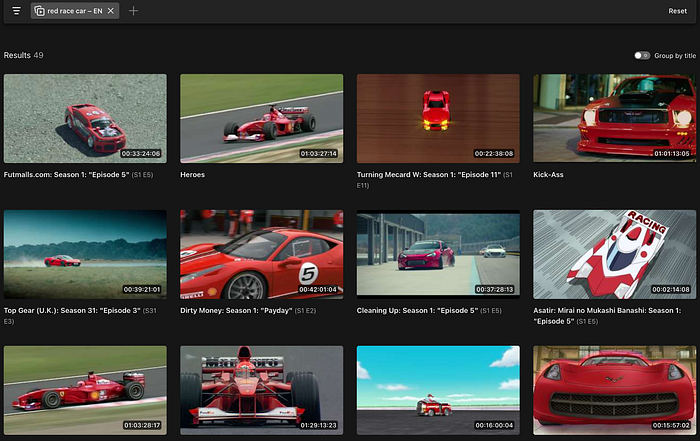
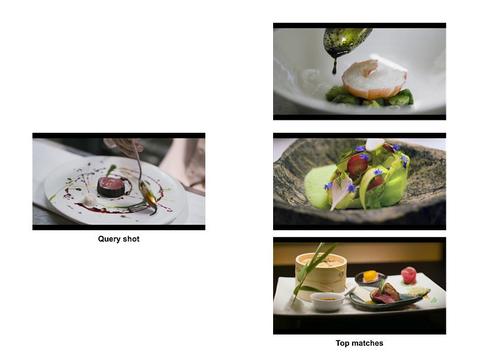
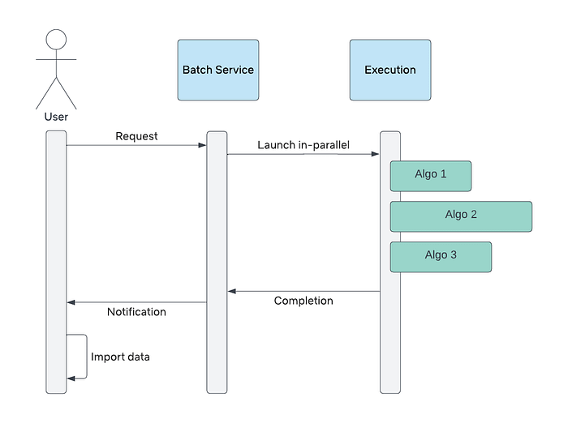
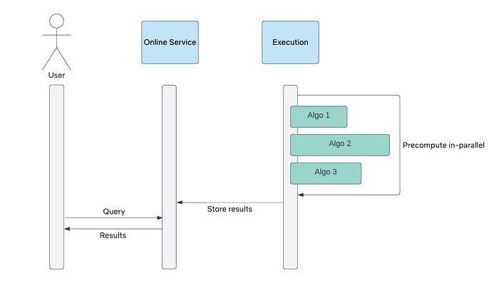
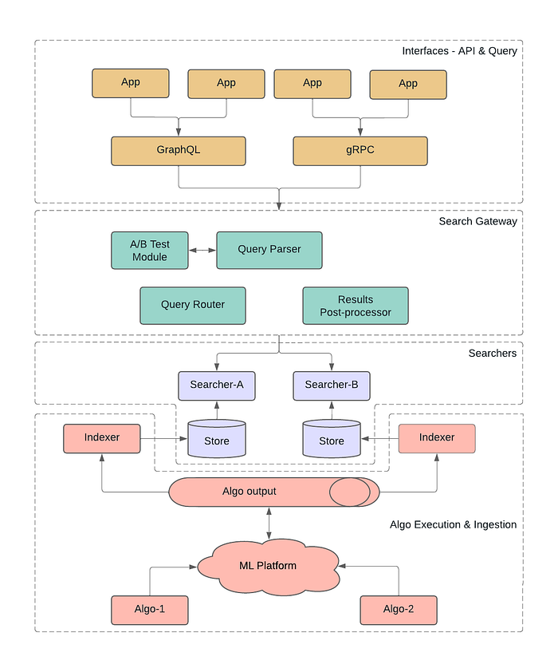

# Building a Media Understanding Platform for ML Innovations

By [Guru Tahasildar](https://www.linkedin.com/in/gurutahasildar/), [Amir Ziai](https://www.linkedin.com/in/amirziai/), [Jonathan Solórzano-Hamilton](https://www.linkedin.com/in/peachpie/), [Kelli Griggs](https://www.linkedin.com/in/kelli-griggs-32990125/), [Vi Iyengar](https://www.linkedin.com/in/vi-pallavika-iyengar-144abb1b/)

## Introduction

Netflix leverages machine learning to create the best media for our members. Earlier we shared the details of one of these [algorithms](./match-cutting-at-netflix-finding-cuts-with-smooth-visual-transitions-31c3fc14ae59.md), introduced how our platform team is evolving the [media-specific machine learning ecosystem](./scaling-media-machine-learning-at-netflix-f19b400243.md), and discussed how data from these algorithms gets stored in our [annotation service](./scalable-annotation-service-marken-f5ba9266d428.md).

Much of the ML literature focuses on model training, evaluation, and scoring. In this post, we will explore an understudied aspect of the ML lifecycle: integration of model outputs into applications.

*An example of using Machine Learning to find shots of Eleven in Stranger Things and surfacing the results in studio application for the consumption of Netflix video editors.*

Specifically, we will dive into the architecture that powers search capabilities for studio applications at Netflix. We discuss specific problems that we have solved using Machine Learning (ML) algorithms, review different pain points that we addressed, and provide a technical overview of our new platform.

## Overview

At Netflix, we aim to bring joy to our members by providing them with the opportunity to experience outstanding content. There are two components to this experience. First, we must provide the content that will bring them joy. Second, we must make it effortless and intuitive to choose from our library. We must quickly surface the most stand-out highlights from the titles available on our service in the form of images and videos in the member experience.

Here is an example of such an asset created for one of our titles:

These multimedia assets, or “supplemental” assets, don’t just come into existence. Artists and video editors must create them. We build creator tooling to enable these colleagues to focus their time and energy on creativity. Unfortunately, much of their energy goes into labor-intensive pre-work. A key opportunity is to automate these mundane tasks.

## Use cases

### Use case #1: Dialogue search

Dialogue is a central aspect of storytelling. One of the best ways to tell an engaging story is through the mouths of the characters. Punchy or memorable lines are a prime target for trailer editors. The manual method for identifying such lines is a watchdown (aka breakdown).

An editor watches the title start-to-finish, transcribes memorable words and phrases with a timecode, and retrieves the snippet later if the quote is needed. An editor can choose to do this quickly and only jot down the most memorable moments, but will have to rewatch the content if they miss something they need later. Or, they can do it thoroughly and transcribe the entire piece of content ahead of time. In the words of one of our editors:

> Watchdowns / breakdown are very repetitive and waste countless hours of creative time!

Scrubbing through hours of footage (or dozens of hours if working on a series) to find a single line of dialogue is profoundly tedious. In some cases editors need to search across many shows and manually doing it is not feasible. But what if scrubbing and transcribing dialogue is not needed at all?

Ideally, we want to enable dialogue search that supports the following features:

- Search across one title, a subset of titles (e.g. all dramas), or the entire catalog
- Search by character or talent
- Multilingual search

### Use case #2: Visual search

A picture is worth a thousand words. Visual storytelling can help make complex stories easier to understand, and as a result, deliver a more impactful message.

Artists and video editors routinely need specific visual elements to include in artworks and trailers. They may scrub for frames, shots, or scenes of specific characters, locations, objects, events (e.g. a car chasing scene in an action movie), or attributes (e.g. a close-up shot). What if we could enable users to find visual elements using natural language?

Here is an example of the desired output when the user searches for “red race car” across the entire content library.

*User searching for “red race car”*

### Use case #3: Reverse shot search

Natural-language visual search offers editors a powerful tool. But what if they already have a shot in mind, and they want to find something that just _looks_ similar? For instance, let’s say that an editor has found a visually stunning shot of a plate of food from [Chef’s Table](https://www.netflix.com/title/80007945), and she’s interested in finding similar shots across the entire show.

*User provides a query shot to find other similar shots.*

## Prior engineering work

### Approach #1: on-demand batch processing

Our first approach to surface these innovations was a tool to trigger these algorithms on-demand and on a per-show basis. We implemented a batch processing system for users to submit their requests and wait for the system to generate the output. Processing took several hours to complete. Some ML algorithms are computationally intensive. Many of the samples provided had a significant number of frames to process. A typical 1 hour video could contain over 80,000 frames!

After waiting for processing, users downloaded the generated algo outputs for offline consumption. This limited pilot system greatly reduced the time spent by our users to manually analyze the content. Here is a visualization of this flow.

*On-demand batch processing system flow*

### Approach #2: enabling online request with pre-computation

After the success of this approach we decided to add online support for a couple of algorithms. For the first time, users were able to discover matches across the entire catalog, oftentimes finding moments they never knew even existed. They didn’t need any time-consuming local setup and there was no delays since the data was already pre-computed.

*Interactive system with pre-computed data flow*

The following quote exemplifies the positive reception by our users:

> “We wanted to find all the shots of the dining room in a show. In seconds, we had what normally would have taken 1–2 people hours/a full day to do, look through all the shots of the dining room from all 10 episodes of the show. Incredible!”  
> [Dawn Chenette](https://www.linkedin.com/in/dawn-ec/), Design Lead

This approach had several benefits for product engineering. It allowed us to transparently update the algo data without users knowing about it. It also provided insights into query patterns and algorithms that were gaining traction among users. In addition, we were able to perform a handful of A/B tests to validate or negate our hypotheses for tuning the search experience.

## Pain points

Our early efforts to deliver ML insights to creative professionals proved valuable. At the same time we experienced growing engineering pains that limited our ability to scale.

Maintaining disparate systems posed a challenge. They were first built by different teams on different stacks, so maintenance was expensive. Whenever ML researchers finished a new algorithm they had to integrate it separately into each system. We were near the breaking point with just two systems and a handful of algorithms. We knew this would only worsen as we expanded to more use cases and more researchers.

The online application unlocked the interactivity for our users and validated our direction. However, it was not scaling well. Adding new algos and onboarding new use cases was still time consuming and required the effort of too many engineers. These investments in one-to-one integrations were volatile with implementation timelines varying from a few weeks to several months. Due to the bespoke nature of the implementation, we lacked catalog wide searches for all available ML sources.

In summary, this model was a tightly-coupled application-to-data architecture, where machine learning algos were mixed with the backend and UI/UX software code stack. To address the variance in the implementation timelines we needed to standardize how different algorithms were integrated — starting from how they were executed to making the data available to all consumers consistently. As we developed more media understanding algos and wanted to expand to additional use cases, we needed to invest in system architecture redesign to enable researchers and engineers from different teams to innovate independently and collaboratively. Media Search Platform (MSP) is the initiative to address these requirements.

Although we were just getting started with _media-search_, search itself is not new to Netflix. We have a mature and robust search and recommendation functionality exposed to millions of our subscribers. We knew we could leverage learnings from our colleagues who are responsible for building and innovating in this space. In keeping with our “[highly aligned, loosely coupled](https://jobs.netflix.com/culture)” culture, we wanted to enable engineers to onboard and improve algos quickly and independently, while making it easy for Studio and product applications to integrate with the media understanding algo capabilities.

**Making the platform modular, pluggable and configurable was key to our success**. This approach allowed us to keep the distributed ownership of the platform. It simultaneously provided different specialized teams to contribute relevant components of the platform. We used services already available for other use cases and extended their capabilities to support new requirements.

Next we will discuss the system architecture and describe how different modules interact with each other for end-to-end flow.

## Architecture

*System Architecture*

Netflix engineers strive to iterate rapidly and prefer the “MVP” (minimum viable product) approach to receive early feedback and minimize the upfront investment costs. Thus, we didn’t build all the modules completely. We scoped the pilot implementation to ensure immediate functionalities were unblocked. At the same time, we kept the design open enough to allow future extensibility. We will highlight a few examples below as we discuss each component separately.

### Interfaces - API & Query

Starting at the top of the diagram, the platform allows apps to interact with it using either gRPC or GraphQL interfaces. Having diversity in the interfaces is essential to meet the app-developers where they are. At Netflix, gRPC is predominantly used in backend-to-backend communication. With active GraphQL tooling provided by our developer productivity teams, GraphQL has become a de-facto choice for UI — backend integration. You can find more about what the team has built and how it is getting used in [these blog posts](https://netflixtechblog.com/tagged/graphql). In particular, we have been relying on [Domain Graph Service](./open-sourcing-the-netflix-domain-graph-service-framework-graphql-for-spring-boot-92b9dcecda18.md) Framework for this project.

During the query schema design, we accounted for future use cases and ensured that it will allow future extensions. We aimed to keep the schema generic enough so that it hides implementation details of the actual search systems that are used to execute the query. Additionally it is intuitive and easy to understand yet feature rich so that it can be used to express complex queries. Users have flexibility to perform multimodal search with input being a simple text term, image or short video. As discussed earlier, search could be performed against the entire Netflix catalog, or it could be limited to specific titles. Users may prefer results that are organized in some way such as group by a movie, sorted by timestamp. When there are a large number of matches, we allow users to paginate the results (with configurable page size) instead of fetching all or a fixed number of results.

### Search Gateway

The client generated input query is first given to the Query processing system. Since most of our users are performing targeted queries such as — search for dialogue “friends don’t lie” (from the above example), today this stage performs lightweight processing and provides a hook to integrate A/B testing. In the future we plan to evolve it into a “query understanding system” to support free-form searches to reduce the burden on users and simplify client side query generation.

The query processing modifies queries to match the target data set. This includes “embedding” transformation and translation. For queries against embedding based data sources it transforms the input such as text or image to corresponding vector representation. Each data source or algorithm could use a different encoding technique so, this stage ensures that the corresponding encoding is also applied to the provided query. One example why we need different encoding techniques per algorithm is because there is different processing for an image — which has a single frame while video — which contains a sequence of multiple frames.

With global expansion we have users where English is not a primary language. All of the text-based models in the platform are trained using English language so we translate non-English text to English. Although the translation is not always perfect it has worked well in our case and has expanded the eligible user base for our tool to non-English speakers.

Once the query is transformed and ready for execution, we delegate search execution to one or more of the searcher systems. First we need to federate which query should be routed to which system. This is handled by the Query router and Searcher-proxy module. For the initial implementation we have relied on a single searcher for executing all the queries. Our extensible approach meant the platform could support additional searchers, which have already been used to prototype new algorithms and experiments.

A search may intersect or aggregate the data from multiple algorithms so this layer can fan out a single query into multiple search executions. We have implemented a “searcher-proxy” inside this layer for each supported searcher. Each proxy is responsible for mapping input query to one expected by the corresponding searcher. It then consumes the raw response from the searcher before handing it over to the Results post-processor component.

The Results post-processor works on the results returned by one or more searchers. It can rank results by applying custom scoring, populate search recommendations based on other similar searches. Another functionality we are evaluating with this layer is to dynamically create different _views_ from the same underlying data.

For ease of coordination and maintenance we abstracted the query processing and response handling in a module called — Search Gateway.

### Searchers

As mentioned above, query execution is handled by the searcher system. The primary searcher used in the current implementation is called [_Marken_ — scalable annotation service](./scalable-annotation-service-marken-f5ba9266d428.md) built at Netflix. It supports different categories of searches including full text and embedding vector based similarity searches. It can store and retrieve temporal (timestamp) as well as spatial (coordinates) data. This service leverages Cassandra and Elasticsearch for data storage and retrieval. When onboarding embedding vector data we performed an extensive benchmarking to evaluate the available datastores. One takeaway here is that even if there is a datastore that specializes in a particular query pattern, for ease of maintainability and consistency we decided to not introduce it.

We have identified a handful of common schema types and standardized how data from different algorithms is stored. Each algorithm still has the flexibility to define a custom schema type. We are actively innovating in this space and recently added capability to intersect data from different algorithms. This is going to unlock creative ways of how the data from multiple algorithms can be superimposed on each other to quickly get to the desired results.

### Algo Execution & Ingestion

So far we have focused on how the data is queried but, there is an equally complex machinery powering algorithm execution and the generation of the data. This is handled by our dedicated media ML Platform team. The team specializes in building a suite of [media-specific machine learning](./scaling-media-machine-learning-at-netflix-f19b400243.md) tooling. It facilitates seamless access to media assets (audio, video, image and text) in addition to media-centric feature storage and compute orchestration.

For this project we developed a custom sink that indexes the generated data into Marken according to predefined schemas. Special care is taken when the data is backfilled for the first time so as to avoid overwhelming the system with huge amounts of writes.

Last but not the least, our UI team has built a configurable, extensible library to simplify integrating this platform with end user applications. Configurable UI makes it easy to customize query generation and response handling as per the needs of individual applications and algorithms. The future work involves building native widgets to minimize the UI work even further.

## Summary

The media understanding platform serves as an abstraction layer between machine learning algos and various applications and features. The platform has already allowed us to seamlessly integrate search and discovery capabilities in several applications. We believe future work in maturing different parts will unlock value for more use cases and applications. We hope this post has offered insights into how we approached its evolution. We will continue to share our work in this space, so stay tuned.

Do these types of challenges interest you? If yes, we’re always looking for [engineers](https://jobs.netflix.com/search?q=software+engineer) and [machine learning practitioners](https://jobs.netflix.com/search?q=%22machine+learning%22) to join us.

## Acknowledgements

Special thanks to [Vinod Uddaraju](https://www.linkedin.com/in/vinodvarmauddaraju/), [Fernando Amat Gil](https://www.linkedin.com/in/fernando-amat-6110931/), [Ben Klein](https://www.linkedin.com/in/benjamin-klein-usa/), [Meenakshi Jindal](https://www.linkedin.com/in/meenakshijindal/), [Varun Sekhri](https://www.linkedin.com/in/varun-sekhri-087a213/), [Burak Bacioglu](https://www.linkedin.com/in/burakbacioglu/), [Boris Chen](https://www.linkedin.com/in/boris-chen-b921a214/), [Jason Ge](https://www.linkedin.com/in/jasonge27/), [Tiffany Low](https://www.linkedin.com/in/tiffany-low/), [Vitali Kauhanka](https://www.linkedin.com/in/vitalikauhanka/), [Supriya Vadlamani](https://www.linkedin.com/in/supriya-vadlamani/), [Abhishek Soni](https://www.linkedin.com/in/abhisheks0ni/), [Gustavo Carmo](https://www.linkedin.com/in/gucarmo/), [Elliot Chow](https://www.linkedin.com/in/ellchow/), [Prasanna Padmanabhan](https://www.linkedin.com/in/prasannapadmanabhan/), [Akshay Modi](https://www.linkedin.com/in/akshay-naresh-modi/), [Nagendra Kamath](https://www.linkedin.com/in/nagendrak/), [Wenbing Bai](https://www.linkedin.com/in/wenbingbai/), [Jackson de Campos](https://www.linkedin.com/in/jacksondecampos/), [Juan Vimberg](https://www.linkedin.com/in/jivimberg/), [Patrick Strawderman](https://www.linkedin.com/in/patrickstrawderman/), [Dawn Chenette](https://www.linkedin.com/in/dawn-ec/), [Yuchen Xie](https://www.linkedin.com/in/yuchen-xie-788a3818/), [Andy Yao](https://www.linkedin.com/in/yaoandy/), and [Chen Zheng](https://www.linkedin.com/in/chen-zheng-a70434/) for designing, developing, and contributing to different parts of the platform.

---
**Tags:** Machine Learning · Distributed Systems · Search · Media
