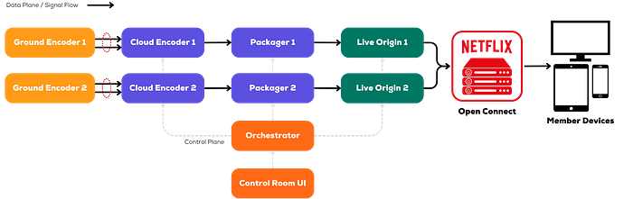
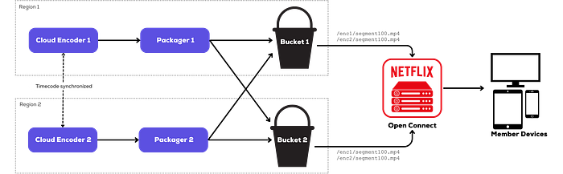
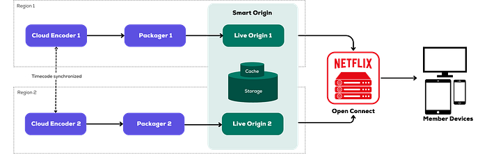
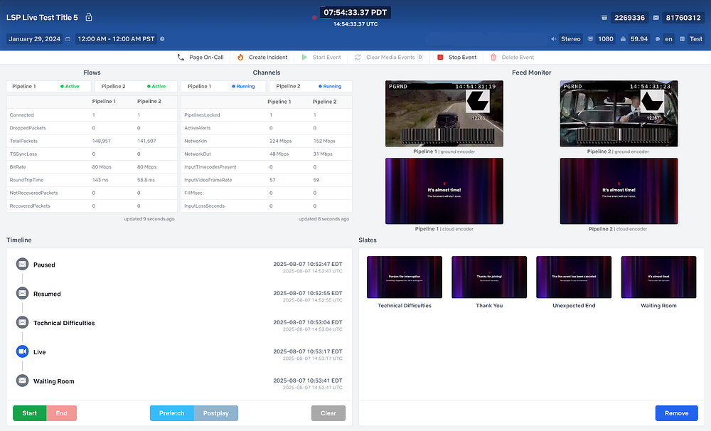

# Behind the Streams: Building a Reliable Cloud Live Streaming Pipeline for Netflix. Part 2.

By [Allison Deal](https://www.linkedin.com/in/allison-deal/), [Cyril Concolato](https://www.linkedin.com/in/cyril-concolato-567a522/), [Flavio Ribeiro](https://www.linkedin.com/in/flavioribeiro/), [Hunter Ford](https://www.linkedin.com/in/hunterford/), [Mariana Afonso](https://www.linkedin.com/in/marianafafonso/), [Thomas Symborski](https://www.linkedin.com/in/thomas-symborski-b4216728/), [Xiaomei Liu](https://www.linkedin.com/in/xiaomei-liu-b475711/)

_This is part 2 in a series called “Behind the Streams”. You can find part 1 _[_here_](./behind-the-streams-live-at-netflix-part-1-d23f917c2f40.md)_._

### Setting the Context

When Netflix started exploring live streaming, the goal was ambitious: deliver a live experience that could reach as many Netflix-supported devices as possible, and meet or exceed industry standards for quality and latency. However, the path to achieving this was anything but straightforward, as it required balancing execution speed, reliability, and broad device compatibility on day one.

While many of our cross-functional teammates were committed to bringing live events to members, there were still many unknowns. These challenges were compounded by the absence of existing broadcast infrastructure for acquiring, inspecting, processing, and delivering live feeds. Therefore, we needed to build foundational capabilities from scratch, including designing reliable methods to transport live signals from event venues to the cloud.

To manage these unknowns, we prioritized solutions that were either already part of the Netflix paved path or were familiar to our teams. Our focus was on building a robust and flexible pipeline that could adapt as live evolved. This approach allowed us to experiment, iterate, and ultimately lay the groundwork for delivering high-quality live events to a global audience.

### Acquiring Feeds in the Cloud

One of the first crucial decisions we faced was how to proceed without an existing broadcast infrastructure. There was no clear understanding of how or where the live broadcast signals would be delivered. We chose to build our acquisition and processing capabilities directly in the cloud, operating under the assumption that live signal feeds from shows would, in some way, be delivered into this cloud environment. Our team’s extensive experience with transmission protocols and a deep understanding of their reliability capabilities informed our initial approach, a pragmatic choice that enabled us to move quickly and uphold the reliability standards our members expect.

For our inaugural [live comedy special](https://www.netflix.com/tudum/articles/chris-rock-live-standup-special), we engineered on-site connectivity to ensure a flawless stream. To reach our cloud encoders, we provisioned two diverse dedicated internet access (DIA) circuits from the venue, sending UHD mezzanine feeds at 50 Mb/s using HEVC to maximize quality within our bandwidth budget.

While this direct venue-to-cloud path delivered the first few shows, it exposed scalability limits. We realized growth required decoupling contribution from venue variability in favor of a more consistent approach. We adopted a hub-and-spoke model that aggregates production feeds at a well-connected broadcast facility before cloud ingestion.

Another part of the cloud ingest strategy is to ensure multiple levels of redundancy and to eliminate single points of failure. Cloud ingest operates in two separate regions, each receiving feeds through two distinct, managed direct network paths rather than the open Internet. This setup delivers the live feed as four independent streams, ensuring multiple layers of protection against network issues, outages, or equipment failures. At the core of this redundancy is SMPTE 2022–7 seamless protection switching, which merges dual paths at the packet level and automatically selects the best packets in real time. If one path experiences packet loss or degradation, the system instantly switches to the alternate path without any impact on downstream encoding. In practice, this has worked flawlessly, maintaining signal quality even during packet loss or complete path failures. To scale this architecture, we use AWS Elemental MediaConnect for managed video transport, handling 2022–7 processing, redundancy, and failover. Its integration with our cloud encoding services streamlines operations and provides essential monitoring tools.

### Encoding and Creating Distribution Bitrates in the Cloud

Once the contribution feed arrives in the cloud, it enters the next stage, which we call the live streaming pipeline. The feed must be encoded and packaged for client consumption. The cloud encoder is responsible for producing segmented streams featuring adaptive bitrate ladders, ensuring optimal quality for a variety of internet connections and devices. To ensure the best encoding quality, the Netflix Video Algorithms team meticulously optimizes the video bitrate ladders based on resolution, frame rate, and content complexity to provide the best video quality for members. For events with high motion like WWE, the team will allocate a higher bitrate to ensure members get a high quality experience, similar to what we provide in SVOD.

To accommodate a wide variety of devices, including legacy types that may not support modern encoding formats, the encoder is configured to simultaneously produce multiple video and audio formats. For video, both AVC and HEVC are supported. For audio, HE-AAC and Dolby Digital Plus 5.1 are supported at various bitrates. Additionally, multiple audio languages are streamed to support Netflix’s global reach. For the delivery of closed captions, both WebVTT and TTML/IMSC are produced.

Our design facilitates the resilient, dual pipeline architecture and enables smooth pipeline switchover through a feature called “epoch locking”. The architecture adheres to the standard-based approach outlined in ISO/IEC 23009–9, Dynamic Adaptive Streaming over HTTP (DASH) — Part 9: Redundant Encoding and Packaging for Segmented Live Media (REaP).

A key aspect of the REaP design is that the two pipelines produce interchangeable segments without direct communication of the components in the different pipelines, allowing the origin or downstream components to select between them. To achieve this, a constant average segment duration is configured for both the encoder and the packager. The contribution encoder embeds timecode into each video frame using SEI (Supplemental Enhancement Information) messages. This conveys UTC timing information for each frame to the cloud encoding pipeline. To enable seamless switchover, the cloud encoder deterministically maps frames with timecodes to output segments.

### The Live Packager

We opted to develop our own packager. This decision allowed us to best utilize Netflix’s existing streaming system components and maintain stream level compatibility to devices, crucial for meeting our ambitious launch timeline and achieving broad device coverage goals.

Netflix’s streaming service supports millions of devices across hundreds of categories, vendors, and hardware and software versions. Ensuring streaming format compatibility with these devices has required many years of dedicated effort, involving adjustments to streaming formats and extensive large-scale field tests. The packager is responsible for system-level bitstream compatibility. To enable our live streaming functionality to achieve compatibility with Netflix-supported devices without repeating time-consuming field tests, leveraging the battle-hardened packaging formula of the SVOD packager in the Live packager represented the most viable solution.

In addition to video and audio streaming formats, Netflix devices consume plain text segments, using either the IMSC standard or WebVTT. The absence of support for customized caption formats in third-party packaging solutions further necessitated building an in-house live packager.

Lastly, a crucial function of the packager is the Digital Rights Management (DRM) protection of the streams. Netflix SVOD packager is fully integrated with the Netflix security backend for encryption key generation, segment encryption, and packager security authentication. A live packager can readily leverage these existing DRM components from the SVOD packager, creating effective solutions and expediting time to market.

In [part 1 of this series](./behind-the-streams-live-at-netflix-part-1-d23f917c2f40.md), we introduced Netflix’s use of personalized manifests and segment templates with a constant 2-second segment duration. This template approach also adapts the personalized manifest to support live streaming without a major architecture change to the playAPI backend systems. The live packager is tasked with generating the segment template metadata and submitting it to Netflix’s PlayAPI backend systems for the creation of client-facing manifests.

Ultimately, the Netflix live packager, through its functions of stream adaptation and compatibility, DRM protection, and live streaming segment template generation, enables successful live streaming sessions by minimizing architectural changes required in other parts of the system. The live packager also establishes a platform for innovation and lays the groundwork for future advanced features.

### The Live Origin Launch and Evolution

For live streaming, origin servers act as the initial source for a content distribution network. Low-latency, scalable, and reliable storage and distribution capabilities are essential to the success of large-scale live streaming.

Netflix’s live-streaming pipeline initially relied on static storage buckets within the AWS cloud. To ensure dual-pipeline redundancy, we set up two buckets — one in each AWS region. For added resilience, the packager in each region published segments to both buckets, a process we referred to as cross-publishing. This approach provided four potential candidates for each segment. CDN nodes could then apply their own prioritization and fallback logic to select the optimal candidate for delivery, further enhancing streaming redundancy and reliability.

The static bucket-based origin presented immediate challenges. The primary concerns were origin storage performance and reliability. As a generic storage solution, the static bucket was not optimized for live streaming and lacked the required availability and performance SLAs. Specifically, segment publishing experienced high latency variation. Given a constant segment duration of 2 seconds, high latencies in the order of seconds significantly impaired live streaming performance. Furthermore, with concurrent live events and high request rates hitting the origin per event (exceeding 100 RPS), segment publishing frequently encountered throttling failures. Even with dual publishing by the packager partially mitigating reliability issues when one bucket was available, simultaneous publishing failures still occurred across both regions.

The implementation of a redundant dual pipeline results in two distinct versions of each segment or manifest. Should one pipeline experience an interruption in segment or manifest generation, the CDN can opt to distribute an available alternative. However, situations frequently arise where one version is viable while the other contains defects that lead to client playback disruptions. Unfortunately, the CDN cannot differentiate the two unique candidates with static buckets.

This prompted us to design an origin layer equipped with media-aware functionalities, which significantly enhanced streaming quality by enabling the selection of optimal candidates from the streaming pipelines. By integrating intelligence into the live origin, we also unlocked new opportunities to improve CDN operations for live streaming — such as implementing advanced TTL cache control and efficiently propagating streaming metadata. These benefits motivated us to develop the Netflix live origin service with a high-level architecture focused on scalability, high performance, media awareness, and optimization for live streaming. Netflix’s data platform offers powerful storage solutions, such as [the key-value datastore](./introducing-netflixs-key-value-data-abstraction-layer-1ea8a0a11b30.md) platform. Partnering with the Data Storage team, we built the Netflix live origin and enhanced our storage solution to cover for the exciting live streaming use case.

### Orchestrating it All

With a small engineering team supporting the initial live Netflix launch, we prioritized workflow automation wherever possible. We developed an orchestration system that dynamically configures live encoding pipelines based on specific content and production requirements and specifications.

This enabled us to seamlessly launch our first live comedy special. As we expanded our content slate to include sports, reality, and awards shows, we utilized this orchestration service to create customized encoding pipelines for each event. For example, we streamed our first comedy show, Chris Rock: Selective Outrage, to users in UHD at 30 fps. More recently, we used the same orchestration service to configure back-to-back NFL Christmas Gameday streams in HD at 59.94 fps. These events featured four audio languages, were ad-supported, and automatically transitioned users seamlessly between games. With this orchestration, we can provide high-quality experiences for members while minimizing operational overhead.

Our cloud pipeline encompasses ingest, encoders, packagers, origin, and monitoring services. By using our orchestration system to configure and provision each of these components, we significantly reduce the risk of human error and allow our teams to focus on higher-level monitoring, rapid response, and feature development, rather than tedious, yet critical, setup tasks. To mitigate single points of failure in our workflow, we create redundant encoding pipelines in distinct geographic regions for each event. Using the orchestration service to do this gives us flexibility to spin up resources in specific regions based on the production location and confidence that all pipeline configurations are identical and generate interchangeable media segments. The service automatically provisions and deprovisions encoding instances based on the live event schedule, which optimizes resources and, in turn, costs. We also use our orchestrator to spin up test events with varying configurations, including new bitrate ladders, video codecs, and new cloud pipeline components such as our own closed-captions service. We utilize these custom configurations to facilitate encoding experiments and validate new formats and features before their production rollout.

A handful of real-time operations are also managed through the orchestrator, including setting live lookback and DVR windows, timing the transition of users between live events, and manual encoder operations used for incident mitigation.

The orchestration system implementation utilizes a hub-and-spoke architectural model to create and control live events. The central entity manages resources, permissions, and storage. Each individual component, including encoder, packager, origin, etc. is represented as a spoke that is responsible for a specific set of tasks. The service manages pipeline and component states through a combination of pub-sub and polling mechanisms. To ensure reliability, the control plane spans multiple geographic regions, with each individual regional deployment capable of orchestrating resources across the entire global infrastructure.

### How do we operate this all?

In the early days of Live, the developers (authors of this blog post) were operating our systems during Live events before we formalized our Live Operations teams. Off-the-shelf tools could not scale for the live events we had in production, so we created a solution of our own: a UI that would interact with our orchestration layer to control and poll the status of event resources, which we call “Control Room.”

Control Room provides a unified dashboard where operators monitor and control our redundant, dual-region architecture. Each event progresses through three distinct phases: pre-event setup, encoding (including live on-air), and post-event cleanup. At this point in time, our SVOD metadata was extremely mature, and we were able to leverage aspects of it early on. However, the live event schedule was a new concept. Until we had time to mature this concept, all of the setup and teardown was done manually through the Control Room before and after the event.

During the transmission window (the time that covers the broadcast and additional time beforehand to perform signal validation checks), operators initiate the encoding pipeline through Control Room with a single action that coordinates resources across both regions. The dashboard populates with live feeds from venue contribution encoders and our cloud encoders in each region. Operators can monitor critical metrics, and the interface provides quick access to manual failover controls — if one region experiences issues, operators can redirect traffic to the healthy pipeline within a few seconds.

Control Room provides the interface for operators to control the state of the Live title on Netflix, throughout its lifecycle, from start to finish (or transition to another show). This ensures the member experience aligns with the actual production timeline, adapting to the dynamic nature of live events.

Similarly, at the show’s conclusion, operators must gracefully transition viewers out of the stream. **Since live events don’t have predetermined endpoints, this requires manual intervention.** The operator initiates the end sequence through Control Room, which signals clients to exit the player and accurately marking the end of the DVR window for future on-demand viewing.

While our orchestration service handles the complex configuration and provisioning automatically, Control Room gives our human operators the visibility and control they need to ensure each live event delivers the quality experience Netflix members expect. As we’ve scaled from a handful of comedy specials to a full slate of live programming, Control Room has evolved from a simple button interface to a comprehensive operations tool for live operations.

---

_Look out for future blog posts in our “Behind the Streams” series, where we’ll explore the systems that ensure viewers can watch live streams produced by our Live Streaming Pipeline on the Netflix service._

---
**Tags:** Live Streaming · Encoding · Live · Distributed Systems · AWS
