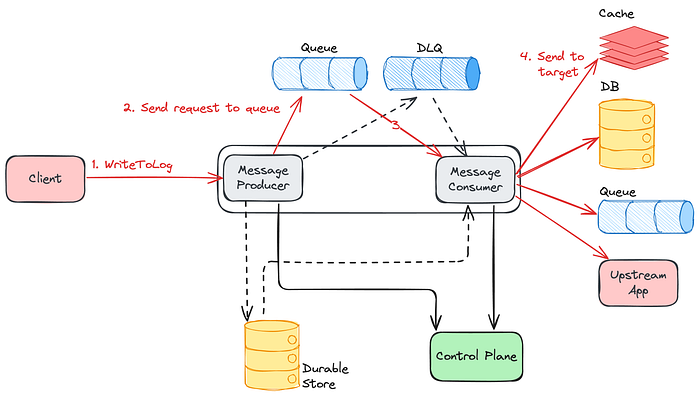
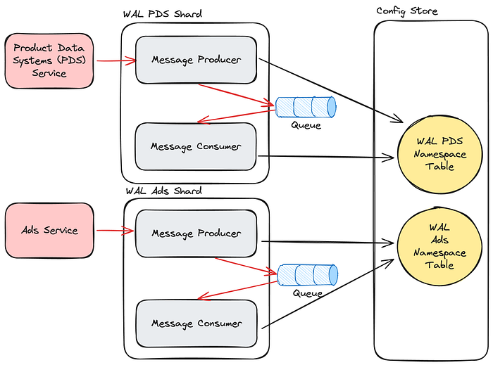
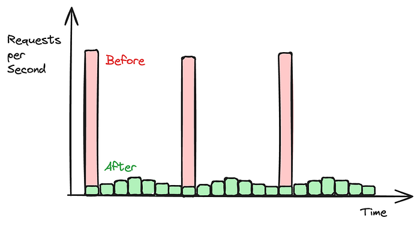
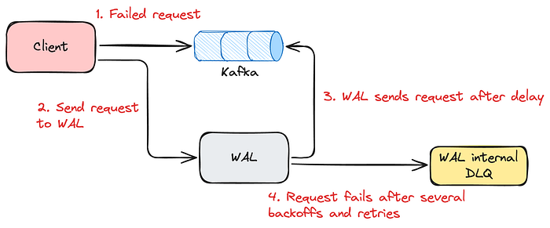
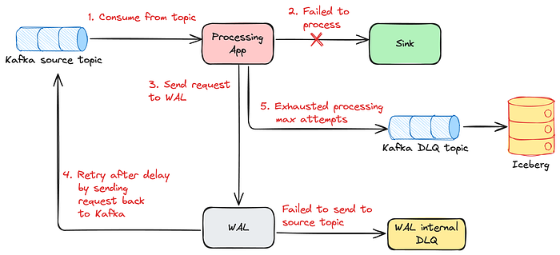
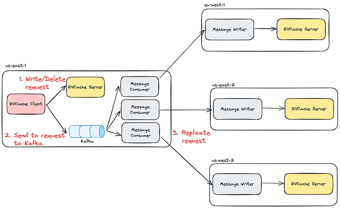
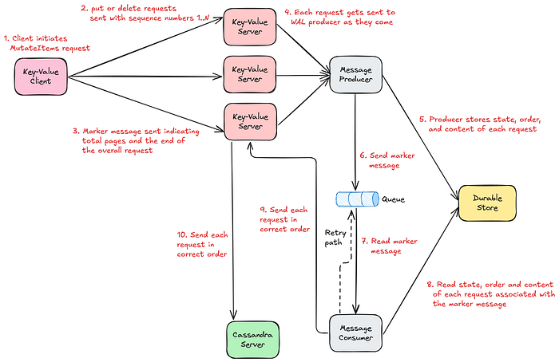
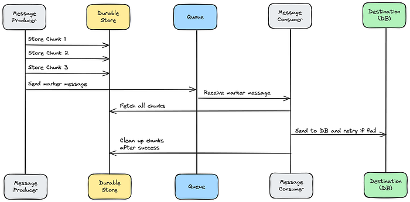

# Building a Resilient Data Platform with Write-Ahead Log at Netflix

By [Prudhviraj Karumanchi](https://www.linkedin.com/in/prudhviraj9), [Samuel Fu](https://www.linkedin.com/in/samuelfu/), [Sriram Rangarajan](https://www.linkedin.com/in/sriram-rangarajan-35169715/), [Vidhya Arvind](https://www.linkedin.com/in/vidhya-arvind-11908723), [Yun Wang](https://www.linkedin.com/in/yunwang-io/), [John Lu](https://www.linkedin.com/in/john-l-693b7915a/)

## Introduction

Netflix operates at a massive scale, serving hundreds of millions of users with diverse content and features. Behind the scenes, ensuring data consistency, reliability, and efficient operations across various services presents a continuous challenge. At the heart of many critical functions lies the concept of a Write-Ahead Log (WAL) abstraction. At Netflix scale, every challenge gets amplified. Some of the key challenges we encountered include:

- Accidental data loss and data corruption in databases
- System entropy across different datastores (e.g., writing to Cassandra and Elasticsearch)
- Handling updates to multiple partitions (e.g., building secondary indices on top of a NoSQL database)
- Data replication (in-region and across regions)
- Reliable retry mechanisms for** **real time data pipeline at scale
- Bulk deletes to database causing OOM on the Key-Value nodes

All the above challenges either resulted in production incidents or outages, consumed significant engineering resources, or led to bespoke solutions and technical debt. During one particular incident, a developer issued an ALTER TABLE command that led to data corruption. **Fortunately, the data was fronted by a cache, so the ability to extend cache TTL quickly together with the app writing the mutations to Kafka allowed us to recover.** Absent the resilience features on the application, there would have been permanent data loss. As the data platform team, we needed to provide resilience and guarantees to protect not just this application, but all the critical applications we have at Netflix.

Regarding the retry mechanisms for real time data pipelines, Netflix operates at a massive scale where failures (network errors, downstream service outages, etc.) are inevitable. We needed a reliable and scalable way to retry failed messages, without sacrificing throughput.

With these problems in mind, we decided to build a system that would solve all the aforementioned issues and continue to serve the future needs of Netflix in the online data platform space. Our Write-Ahead Log (WAL) is a distributed system that captures data changes, provides strong durability guarantees, and reliably delivers these changes to downstream consumers. This blog post dives into how Netflix is building a generic WAL solution to address common data challenges, enhance developer efficiency, and power high-leverage capabilities like secondary indices, enable cross-region replication for non-replicated storage engines, and support widely used patterns like delayed queues.

## API

Our API is intentionally simple, exposing just the essential parameters. WAL has one main API endpoint, _WriteToLog_, abstracting away the internal implementation and ensuring that users can onboard easily.

```
rpc WriteToLog (WriteToLogRequest) returns (WriteToLogResponse) {...}

/**
  * WAL request message
  * namespace: Identifier for a particular WAL
  * lifecycle: How much delay to set and original write time 
  * payload: Payload of the message
  * target: Details of where to send the payload 
  */
message WriteToLogRequest {
  string namespace = 1;
  Lifecycle lifecycle = 2;
  bytes payload = 3;
  Target target = 4;
}

/**
  * WAL response message
  * durable: Whether the request succeeded, failed, or unknown
  * message: Reason for failure
  */
message WriteToLogResponse {
  Trilean durable = 1;
  string message = 2;
}
```

A _namespace_ defines where and how data is stored, providing logical separation while abstracting the underlying storage systems. Each _namespace_ can be configured to use different queues: Kafka, SQS, or combinations of multiple. _Namespace_ also serves as a central configuration of settings, such as backoff multiplier or maximum number of retry attempts, and more. This flexibility allows our Data Platform to route different use cases to the most suitable storage system based on performance, durability, and consistency needs.

WAL can assume different _personas_ depending on the namespace configuration.

### Persona #1 (Delayed Queues)

**In the example configuration below, the Product Data Systems (PDS) ****_namespace_**** uses SQS as the underlying message queue, enabling delayed messages. PDS uses Kafka extensively, and failures (network errors, downstream service outages, etc.) are inevitable. We needed a reliable and scalable way to retry failed messages, without sacrificing throughput. That’s when PDS started leveraging WAL for delayed messages**.

```
"persistenceConfigurations": {
  "persistenceConfiguration": [
  {
    "physicalStorage": {
      "type": "SQS",
    },
    "config": {
      "wal-queue": [
        "dgwwal-dq-pds"
      ],
      "wal-dlq-queue": [
        "dgwwal-dlq-pds"
      ],
      "queue.poll-interval.secs": 10,
      "queue.max-messages-per-poll": 100
    }
  }
  ]
}
```

### Persona #2 (Generic Cross-Region Replication)

Below is the namespace configuration for cross-region replication of [EVCache](https://netflixtechblog.com/caching-for-a-global-netflix-7bcc457012f1) using WAL, which replicates messages from a source region to multiple destinations. It uses Kafka under the hood.

```
"persistence_configurations": {
  "persistence_configuration": [
  {
    "physical_storage": {
      "type": "KAFKA"
    },
    "config": {
      "consumer_stack": "consumer",
      "context": "This is for cross region replication for evcache_foobar",
      "target": {
        "euwest1": "dgwwal.foobar.cluster.eu-west-1.netflix.net",
        "type": "evc-replication",
        "useast1": "dgwwal.foobar.cluster.us-east-1.netflix.net",
        "useast2": "dgwwal.foobar.cluster.us-east-2.netflix.net",
        "uswest2": "dgwwal.foobar.cluster.us-west-2.netflix.net"
      },
      "wal-kafka-dlq-topics": [],
      "wal-kafka-topics": [
        "evcache_foobar"
      ],
      "wal.kafka.bootstrap.servers.prefix": "kafka-foobar"
    }
  }
  ]
}
```

### Persona #3 (Handling multi-partition mutations)

Below is the namespace configuration for supporting _mutateItems_ API in [Key-Value](./introducing-netflixs-key-value-data-abstraction-layer-1ea8a0a11b30.md), where multiple write requests can go to different partitions and have to be eventually consistent. A key detail in the below configuration is the presence of Kafka and durable_storage. These data stores are required to facilitate two phase commit semantics, which we will discuss in detail below.

```
"persistence_configurations": {
  "persistence_configuration": [
  {
    "physical_storage": {
      "type": "KAFKA"
    },
    "config": {
      "consumer_stack": "consumer",
      "contacts": "unknown",
      "context": "WAL to support multi-id/namespace mutations for dgwkv.foobar",
      "durable_storage": {
        "namespace": "foobar_wal_type",
        "shard": "walfoobar",
        "type": "kv"
      },
      "target": {},
      "wal-kafka-dlq-topics": [
        "foobar_kv_multi_id-dlq"
      ],
      "wal-kafka-topics": [
        "foobar_kv_multi_id"
      ],
      "wal.kafka.bootstrap.servers.prefix": "kaas_kafka-dgwwal_foobar7102"
    }
  }
  ]
}
```

An important note is that requests to WAL support at-least once semantics due to the underlying implementation.

## Under the Hood

The core architecture consists of several key components working together.

**Message Producer and Message Consumer separation:** The message producer receives incoming messages from client applications and adds them into the queue, while the message consumer processes messages from the queue and sends them to the targets. Because of this separation, other systems can bring their own pluggable producers or consumers, depending on their use cases. WAL’s control plane allows for a pluggable model, which, depending on the use-case, allows us to switch between different message queues.

**SQS and Kafka with a dead letter queue by default**: Every WAL _namespace_ has its own message queue and gets a dead letter queue (DLQ) by default, because there can be transient errors and hard errors. Application teams using [Key-Value](./introducing-netflixs-key-value-data-abstraction-layer-1ea8a0a11b30.md) abstraction simply need to toggle a flag to enable WAL and get all this functionality without needing to understand the underlying complexity.

- **Kafka-backed namespaces**: handle standard message processing
- **SQS-backed namespaces**: support delayed queue semantics (we added custom logic to go beyond the standard defaults enforced in terms of delay, size limits, etc)
- **Complex multi-partition scenarios:** use queues and durable storage

**Target Flexibility**: The messages added to WAL are pushed to the target datastores. Targets can be Cassandra databases, Memcached caches, Kafka queues, or upstream applications. Users can specify the target via namespace configuration and in the API itself.


*Architecture of WAL*

## Deployment Model

WAL is deployed using the [Data Gateway infrastructure](https://netflixtechblog.medium.com/data-gateway-a-platform-for-growing-and-protecting-the-data-tier-f1ed8db8f5c6). This means that WAL deployments automatically come with mTLS, connection management, authentication, runtime and deployment configurations out of the box.

Each data gateway abstraction (including WAL) is deployed as a _shard_. A _shard_ is a physical concept describing a group of hardware instances. Each use case of WAL is usually deployed as a separate _shard_. For example, the Ads Events service will send requests to WAL _shard A_, while the Gaming Catalog service will send requests to WAL _shard _B, allowing for separation of concerns and avoiding noisy neighbour problems.

Each _shard_ of WAL can have multiple _namespaces_. A _namespace_ is a logical concept describing a configuration. Each request to WAL has to specify its _namespace_ so that WAL can apply the correct configuration to the request. Each _namespace_ has its own configuration of queues to ensure isolation per use case. If the underlying queue of a WAL _namespace_ becomes the bottleneck of throughput, the operators can choose to add more queues on the fly by modifying the _namespace_ configurations. The concept of _shards_ and _namespaces_ is shared across all Data Gateway Abstractions, including [Key-Value](./introducing-netflixs-key-value-data-abstraction-layer-1ea8a0a11b30.md), [Counter](./netflixs-distributed-counter-abstraction-8d0c45eb66b2.md), [Timeseries](./introducing-netflix-timeseries-data-abstraction-layer-31552f6326f8.md), etc. The _namespace_ configurations are stored in a globally replicated Relational SQL database to ensure availability and consistency.


*Deployment model of WAL*

Based on certain CPU and network thresholds, the Producer group and the Consumer group of each _shard_ will (separately) automatically scale up the number of instances to ensure the service has low latency, high throughput and high availability. WAL, along with other abstractions, also uses the [Netflix adaptive load shedding libraries](https://netflixtechblog.medium.com/performance-under-load-3e6fa9a60581) and Envoy to automatically shed requests beyond a certain limit. WAL can be deployed to multiple regions, so each region will deploy its own group of instances.

## Solving different flavors of problems with no change to the core architecture

The WAL addresses multiple data reliability challenges with no changes to the core architecture:

**Data Loss Prevention:** In case of database downtime, WAL can continue to hold the incoming mutations. When the database becomes available again, replay mutations back to the database. The tradeoff is eventual consistency rather than immediate consistency, and no data loss.

**Generic Data Replication:** For systems like EVCache (using Memcached) and RocksDB that do not support replication by default, WAL provides systematic replication (both in-region and across-region). The target can be another application, another WAL, or another queue — it’s completely pluggable through configuration.

**System Entropy and Multi-Partition Solutions: **Whether dealing with writes across two databases (like Cassandra and Elasticsearch) or mutations across multiple partitions in one database, the solution is the same — write to WAL first, then let the WAL consumer handle the mutations. No more asynchronous repairs needed; WAL handles retries and backoff automatically.

**Data Corruption Recovery:** In case of DB corruptions, restore to the last known good backup, **then replay mutations from WAL omitting the offending write/mutation.**

There are some major differences between using WAL and directly using Kafka/SQS. WAL is an abstraction on the underlying queues, so the underlying technology can be swapped out depending on use cases with no code changes. WAL emphasizes an easy yet effective API that saves users from complicated setups and configurations. We leverage the control plane to pivot technologies behind WAL when needed without app or client intervention.

## WAL usage at Netflix

### Delay Queue

The most common use case for WAL is as a Delay Queue. If an application is interested in sending a request at a certain time in the future, it can offload its requests to WAL, which guarantees that their requests will land after the specified delay.

Netflix’s Live Origin processes and delivers Netflix live stream video chunks, storing its video data in a Key-Value _abstraction_ backed by Cassandra and EVCache. When Live Origin decides to delete certain video data after an event is completed, it issues delete requests to the Key-Value abstraction. However, the large amount of delete requests in a short burst interfere with the more important real-time read/write requests, causing performance issues in Cassandra and timeouts for the incoming live traffic. To get around this, Key-Value issues the delete requests to WAL first, with a random delay and jitter set for each delete request. WAL, after the delay, sends the delete requests back to Key-Value. Since the deletes are now a flatter curve of requests over time, Key-Value is then able to send the requests to the datastore with no issues.


*Requests being spread out over time through delayed requests*

Additionally, WAL is used by many services **that utilize Kafka** to stream events, including Ads, Gaming, Product Data Systems, etc. Whenever Kafka requests fail for any reason, the client apps will send WAL a request to retry the kafka request with a delay. This abstracts away the backoff and retry layer of Kafka for many teams, increasing developer efficiency.


*Backoff and delayed retries for clients producing to Kafka*


*Backoff and delayed retries for clients consuming from Kafka*

### Cross-Region Replication

WAL is also used for global cross-region replication. The architecture of WAL is generic and allows any datastore/applications to onboard for cross-region replication. Currently, the largest use case is [EVCache](https://netflixtechblog.com/caching-for-a-global-netflix-7bcc457012f1), and we are working to onboard other storage engines.

EVCache is deployed by clusters of Memcached instances across multiple regions, where each cluster in each region shares the same data. Each region’s client apps will write, read, or delete data from the EVCache cluster of the same region. To ensure global consistency, the EVCache client of one region will **replicate write and delete requests to all other regions**. To implement this, the EVCache client that originated the request will send the request to a WAL corresponding to the EVCache cluster and region.

Since the EVCache client acts as the message producer group in this case, WAL only needs to deploy the message consumer groups. From there, the multiple message consumers are set up to each target region. **They will read from the Kafka topic, and send the replicated write or delete requests to a Writer group** in their target region. The Writer group will then go ahead and replicate the request to the EVCache server in the same region.


*EVCache Global Cross-Region Replication Implemented through WAL*

The biggest benefits of this approach, compared to our legacy architecture, is being able to migrate from multi-tenant architecture to single tenant architecture for the most latency sensitive applications. For example, Live Origin will have its own dedicated Message Consumer and Writer groups, while a less latency sensitive service can be multi-tenant. This helps us reduce the blast radius of the issues and also prevents noisy neighbor issues.

### Multi-Table Mutations

WAL is used by [Key-Value](./introducing-netflixs-key-value-data-abstraction-layer-1ea8a0a11b30.md) service to build the MutateItems API. WAL enables the API’s multi-table and multi-id mutations by implementing 2-phase commit semantics under the hood. For this discussion, we can assume that Key-Value service is backed by Cassandra, and each of its _namespaces_ represents a certain table in a Cassandra DB.

When a Key-Value client issues a MutateItems request to Key-Value server, the request can contain multiple PutItems or DeleteItems requests. Each of those requests can go to different ids and _namespaces_, or Cassandra tables.

```
message MutateItemsRequest {
 repeated MutationRequest mutations = 1;
 message MutationRequest {
  oneof mutation {
    PutItemsRequest put = 1;
    DeleteItemsRequest delete = 2;
  }
 }
}
```

The MutateItems request operates on an eventually consistent model. When the Key-Value server returns a success response, it guarantees that every operation within the MutateItemsRequest will eventually complete successfully. Individual put or delete operations may be partitioned into smaller chunks based on request size, meaning a single operation could spawn multiple chunk requests that must be processed in a specific sequence.

Two approaches exist to ensure Key-Value client requests achieve success. The synchronous approach involves client-side retries until all mutations complete. However, this method introduces significant challenges; datastores might not natively support transactions and provide no guarantees about the entire request succeeding. Additionally, when more than one replica set is involved in a request, latency occurs in unexpected ways, and the entire request chain must be retried. Also, partial failures in synchronous processing can leave the database in an inconsistent state if some mutations succeed while others fail, requiring complex rollback mechanisms or leaving data integrity compromised. The asynchronous approach was ultimately adopted to address these performance and consistency concerns.

Given Key-Value’s stateless architecture, the service cannot maintain the mutation success state or guarantee order internally. Instead, it leverages a Write-Ahead Log (WAL) to guarantee mutation completion. For each MutateItems request, Key-Value forwards individual put or delete operations to WAL as they arrive, with each operation tagged with a sequence number to preserve ordering. **After transmitting all mutations, Key-Value sends a completion marker indicating the full request has been submitted**.

The WAL producer receives these messages and persists the content, state, and ordering information to a durable storage. The message producer then forwards only the completion marker to the message queue. The message consumer retrieves these markers from the queue and reconstructs the complete mutation set by reading the stored state and content data, ordering operations according to their designated sequence. Failed mutations trigger re-queuing of the completion marker for subsequent retry attempts.


*Architecture of Multi-Table Mutations through WAL*


*Sequence diagram for Multi-Table Mutations through WAL*

## Closing Thoughts

Building Netflix’s generic Write-Ahead Log system has taught us several key lessons that guided our design decisions:

**Pluggable Architecture is Core: **The ability to support different targets, whether databases, caches, queues, or upstream applications, through configuration rather than code changes has been fundamental to WAL’s success across diverse use cases.

**Leverage Existing Building Blocks: **We had control plane infrastructure, Key-Value abstractions, and other components already in place. Building on top of these existing abstractions allowed us to focus on the unique challenges WAL needed to solve.

**Separation of Concerns Enables Scale:** By separating message processing from consumption and allowing independent scaling of each component, we can handle traffic surges and failures more gracefully.

**Systems Fail — Consider Tradeoffs Carefully: **WAL itself has failure modes, including traffic surges, slow consumers, and non-transient errors. We use abstractions and operational strategies like data partitioning and backpressure signals to handle these, but the tradeoffs must be understood.

## Future work

- We are planning to add secondary indices in Key-Value service leveraging WAL.
- WAL can also be used by a service to guarantee sending requests to multiple datastores. For example, a database and a backup, or a database and a queue at the same time etc.

## Acknowledgements

Launching WAL was a collaborative effort involving multiple teams at Netflix, and we are grateful to everyone who contributed to making this idea a reality. We would like to thank the following teams for their roles in this launch.

- Caching team — Additional thanks to [Shih-Hao Yeh](https://www.linkedin.com/in/shihhaoyeh/), [Akashdeep Goel](https://www.linkedin.com/in/akashdeepgoel/) for contributing to cross region replication for KV, EVCache etc. and owning this service.
- Product Data System team — [Carlos Matias Herrero](https://www.linkedin.com/in/carlos-jmh/), [Brandon Bremen](https://www.linkedin.com/in/bbremen/) for contributing to the delay queue design and being early adopters of WAL giving valuable feedback.
- KeyValue and Composite abstractions team — [Raj Ummadisetty](https://www.linkedin.com/in/rummadis/) for feedback on API design and mutateItems design discussions. [Rajiv Shringi](https://www.linkedin.com/in/rajiv-shringi/)** **for feedback on API design.
- Kafka and Real Time Data Infrastructure teams — [Nick Mahilani](https://www.linkedin.com/in/nickmahilani/) for feedback and inputs on integrating the WAL client into Kafka client. [Sundaram Ananthanarayan](https://www.linkedin.com/in/sundaram-ananthanarayanan-97b8b545/) for design discussions around the possibility of leveraging Flink for some of the WAL use cases.
- [Joseph Lynch](https://jolynch.github.io/) for providing strategic direction and organizational support for this project.

---
**Tags:** Distributed Systems · Database · Message Queue · Reliability · Software Architecture
