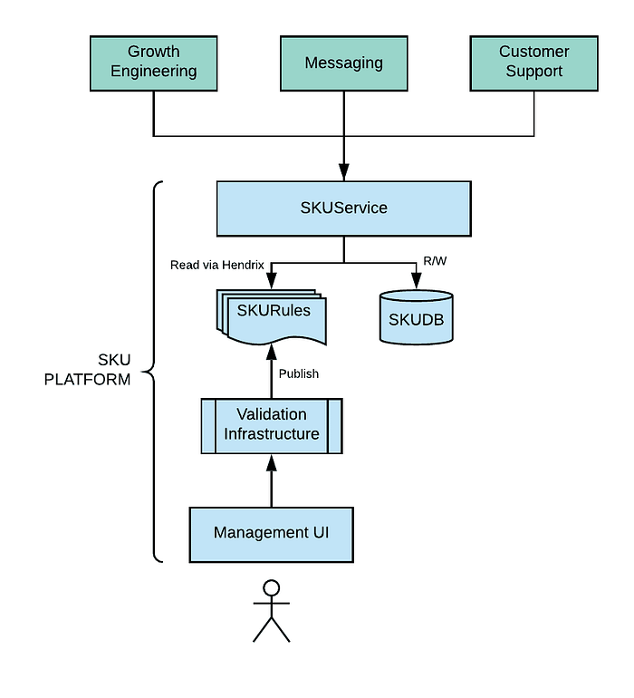
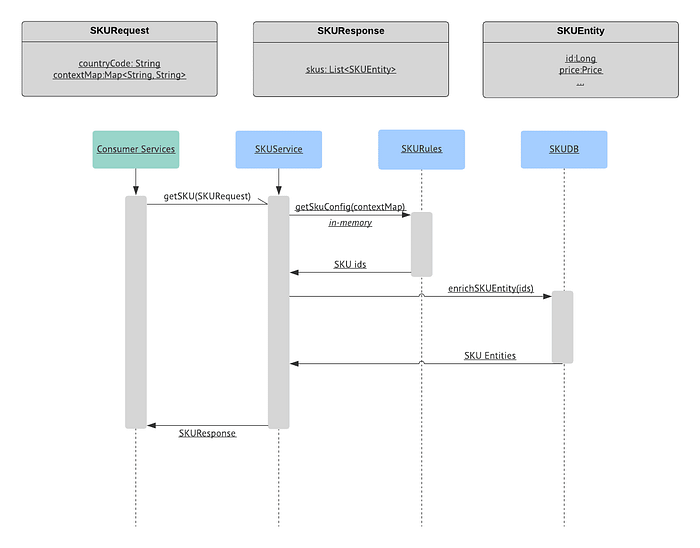
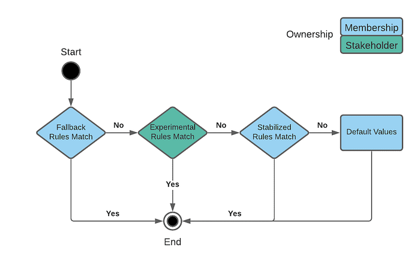
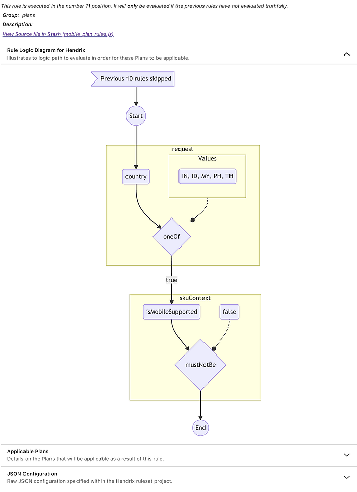
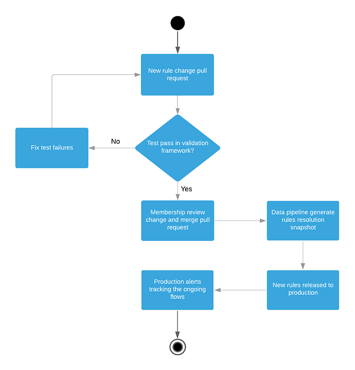

# Building a Rule-Based Platform to Manage Netflix Membership SKUs at Scale

By [Budhaditya Das](https://www.linkedin.com/in/budhash/), [Wallace Wang](https://www.linkedin.com/in/xinyuwan/), and [Scott Yao](https://www.linkedin.com/in/yaoruhao/)

At Netflix, we aspire to entertain the world. From mailing DVDs in the US to a global streaming service with over 200 million subscribers across 190 countries, we have come a long way. For the longest time, Netflix had three plans (basic/standard/premium) with a single 30-day free trial offer at signup. As we expand offerings rapidly across the globe, our ideas and strategies around plans and offers are evolving as well. For example, the [mobile plan launch](https://about.netflix.com/en/news/netflix-launches-mobile-plan-for-india) in India and Southeast Asia was a huge success. We are inspired to provide the best offer and plan setup tailored to our customers’ needs to make their choice easier to start a membership.

Membership Engineering at Netflix is responsible for the plan and pricing configurations for every market worldwide. Our team is also the primary source of truth for various offers and promotions. Internally, we use the term SKU (Stock Keeping Unit) to represent these entities. The original SKU catalog is a logic-heavy client library packaged with complex metadata configuration files and consumed by various services. However, with our rapid product innovation speed, the whole approach experienced significant challenges:

- **Business Complexity:** The existing SKU management solution was designed years ago when the engagement rules were simple — three plans and one offer homogeneously applied to all regions. As the business expanded globally, the complexity around pricing, plans, and offers increased exponentially.
- **Operational Efficiency:** The majority of the changes require metadata configuration files and library code changes, usually taking days of testing and service release to adopt the updates.
- **Reliability: **It is exceptionally challenging to effectively gauge the impact of metadata changes in the current form. With 50+ services consuming the SKU catalog library, a small change could inadvertently result in a significant outage with a global blast radius. Additionally, the business implications for pricing-related errors are enormous.
- **Maintainability: **With the increase in ongoing experimentation around SKUs, the configuration files have exploded exponentially. Besides, the mixed-use of the metadata files and business logic code adds another layer of maintenance complexity.

To solve the challenges mentioned above and meet our rapidly evolving business needs, we re-architected the legacy SKU catalog from the ground up and partnered with the Growth Engineering team to build [a scalable SKU platform](https://netflixtechblog.medium.com/growth-engineering-at-netflix-creating-a-scalable-offers-platform-69330136dd87). This re-design enabled us to reposition the SKU catalog as an extensible, scalable, and robust rule-based “self-service” platform. It was a massive but necessary undertaking to ensure that Netflix is ready for the next phase of rapid global growth and business challenges.

## A Platform Based on Rules

Our initial use case analysis highlighted that most of the change requests were related to enhancing, configuring, or tweaking existing SKU entities to enable business teams to carry out plans or offer related A/B experiments across various geo-locations. Most of these changes are mechanical and amenable to the “self-service” model. This critical insight helped us re-envision the SKU catalog as a seamless, scalable platform that empowers our stakeholders to make rapid changes with confidence while the platform ensures suitable guardrails for data accuracy and integrity. With that idea in mind, we defined the core principles of the new SKU Platform:

- **Ownership Clarity**: Membership Engineering team owns the SKU catalog data and provides a platform for stakeholders to configure SKUs based on their needs.
- **Self Service**: SKU changes need to be flexibly configurable, validated comprehensively, and released rapidly. In comparison, the API interface for consumer services should be consistent and static regardless of the business requirement iteration.
- **Auditability**: SKU changes workflow would require engineers’ review and approval. Bad changes can quickly revert to mitigate issues and provide history for auditing.
- **Observability**: SKU resolution insight is critical and helpful for engineers to diagnose what went wrong in the change lifecycle.

Building a scalable SKU catalog platform that allowed for rapid changes with the minimal intervention was challenging. **We realized that abstracting out the business rules into a “rules engine” would enable us to achieve our stated goals**. After evaluating multiple open-source and commercial rule evaluation frameworks, we chose our internal Rules Management and Evaluation Framework — Hendrix. Hendrix is a simple interpreted language that expresses how configuration values should be computed. These expressions (rules) are evaluated in the current request session context and can access data such as A/B test assignments, necessary member information, customized input, etc. We’ll skip over Hendrix’s specific details and focus on the SKU platform adoption in this article for brevity.

The adoption of an externalized rule evaluation engine was a major game-changer. It allowed us to remove boilerplate code and took us a step forward in becoming a true self-service platform. The rules, now encoded in JSON, were easy to generate, manage and modify via automated means. It eliminated many complex conditional branching logic, making the core codebase simple and easy to enhance. Most importantly, it allowed runtime and quick business logic changes in production without code change deployments. Overall, it simplified SKU selections and increased our testing and product delivery confidence. Here is a snippet of the mobile plan availability rule:

```
{
    parameter: "plans",
    default: [Basic, Standard, Premium],
    values: 
        {
            feature: "mobilePlanLaunched",
            value: [Mobile, Basic, Standard, Premium],
        },
    ],
},
{
    feature: "mobilePlanLaunched",
    requirements: [
        {
            type: "request",
            key: "country",
            oneOf: ["IN", "ID", "MY", "PH", "TH"],
        },
    ],
},
```

In addition to the rule engine, the following components make up the core building blocks of the new SKU platform:

- **Service Layer — SKUService:** A service layer replaced the original SKU catalog client library to provide a unified interface for consumers to access the SKU catalog.
- **Persistence Layer — SKUDB:** SKU catalog data was migrated from the metadata configuration files to a relational database. Adding and updating entities is audited and tightly controlled via “privileged” APIs exposed by the service layer.
- **Business Rules — SKURules:** Various business rules are defined as Hendrix expressions. For example, our business requirements dictate that a mobile plan should be available for specific markets only, while the rest of the world receives the default set of plans. These rule definitions are hosted in a separate git repository and Hendrix module within SKUService load and refresh it periodically. The changes are administered by the regular git pull request flow and guarded by the validation infrastructure.
- **Observability/Validation Guardrails:** A comprehensive validation infrastructure designed to ensure that SKURules changes are accurate and do not break existing behavior.
- **Self Service Management UI:** A straightforward visualization tool for rules management and are in the process of supporting direct rules editing.



The new SKU flow for consumer services is simple, generic, and easy to maintain with business rules isolated in SKURules. Consumers pass a map of context to be used as rules evaluation criteria. Rule owners are responsible for making sure the requirements match the rule definition and request context. By choosing a generalized context map, we keep the API interface consistent regardless of the rules change. In-memory rules evaluation returns a list of SKU ids, which hibernates with the SKUDB query for the full entity metadata.



## Managing Rules at Scale

As the platform evolved from code towards externalized rules to manage business flows, we realized that maintaining an ever-growing set of volatile rule configurations at Netflix scale was a critical challenge:

- Debugging is difficult when navigating through an ever-increasing set of rules.
- The impact of changing an existing rule is tricky to measure due to the nature that Hendrix evaluates rules based on first-match. There is always a possibility of prior rules taking precedence over the later ones if the changes are not handled carefully.
- Rules naturally have different lifecycles and impacts. Some are short-lived with specific targeted audiences (for most of our A/B tests) compared to the stabilized ones with an enormous impact on our broader member base.
- Rules’ ownership needed to be defined clearly for long-term maintenance health.

To manage the complexity of rules and the associated lifecycle, we introduced the concept of rules categorization. Based on our use case, we classified our rules into three groups:

### Fallback

Fallback rules will execute first and short circuit the evaluation. It should easily understand, with no experimental information and domain-specific context.

Most restricted access and owned by the Membership Engineering team. Since this will impact all later rules, adding rules to this category should be cautious and thoroughly reviewed.

### Experimental

Evaluate right after fallback rules, solely serving our A/B tests. Frequent changes are expected to these rules from different stakeholders. Experimental rules can eventually transform into stabilized rules if we decide to ship them.

Stakeholders take ownership of this rule group to initiate fast iteration of product experimentations.

### Stabilized

Evaluate at last after fallback and experimental rules. Rarely changed but with a more significant impact on our member base.

Membership Engineering team owns this group to ensure the stability of our broadest SKU offering.



The diagram above demonstrates the rules evaluation order for each group. Categorizing the rules allowed the platform to streamline complex configuration and lifecycle management, enabling our stakeholders to make frequent experimentation changes with confidence.

As we adopted more rules into Hendrix, we recognized that understanding the JSON format structure was not straightforward. To overcome this challenge, our tools team built a UI to visualize the rules configuration. It significantly improved the overall experience of understanding and debugging rules. Here is a sample visualization of our mobile plan availability rules:



Visualization is just the first step in our endeavor to make this a truly self-service platform. The long-term goal is to support complete rule lifecycle management (edition/auditing/validation) via the UI tool.

## Build Confidence with Validation Infrastructure

The move towards a rule-based platform shifted a lot of assumptions around change management and deployment. The legacy paradigm involved a fixed process in applying code changes and service release can take a couple of days. With the introduction of external rules, the platform enabled our stakeholders to make near-real-time changes to business flows. It reduces the turnaround time from days to a few hours.

But with great power comes great responsibility. Ensuring the SKU catalog and the associated rules’ correctness is exceptionally critical for the platform’s long-term stability. Errors in pricing will have a direct impact on our members. To protect the integrity of rules and empower stakeholders to make changes, we built a comprehensive infrastructure that implements a series of validation and verification guardrails. The primary goals of the validation infrastructure are as follows:

- **Rule change release workflow**: Establish a scalable workflow to ensure rule changes get the expected outcome from the beginning of the pull request to the final deployment stage.
- **Snapshot and auditability**: Expose mechanisms to capture a holistic snapshot of SKU rules resolution for auditing.
- **Production alerts**: Create an exhaustive set of alerts to detect anomalies and react to them quickly.

Rules are just another representation of code, so the best practices that apply to code management should also apply to rules. For each rule change pull request, we also require the author to include unit-tests to ensure correctness and prevent future changes from breaking the current one unnoticed. Unit-tests are categorized with the same rules group concept. Below is an example from the stabilized rules test that mobile plan is available in India:

```
{
    test: "testMobilePlanAvailableIndia",
    context: {
      request: [
        {
          key: "country",
          value: "IN",
        },
      ],
    },
    assertions: {
      plans: [Mobile, Basic, Standard, Premium],
    },
  },
```

The second component of the validation infrastructure is the audit framework by leveraging our big data platform. Every rule change triggers a pipeline (spark job) that takes a snapshot of various SKUs’ current state with the latest rules. The framework carries out a differential analysis against the preceding version of the snapshot to quickly identify unintended bugs in rule changes. Additionally, the results are stored in a Hive table for auditing purposes.

The last and the most crucial piece of the validation ecosystem are the production alerts. These alerts are built around Netflix’s vast real-time monitoring infrastructure and focus on ensuring that our members, across the world, are getting the expected SKUs. These alerts enable us to quickly flag anomalous trends and notify on-call engineers for speedy resolution. It provides an additional safety layer, which is critical, given the platform’s size and complexity.

With the validation infrastructure providing enhanced reliability for the SKU platform, both Membership engineers and stakeholders can confidently change SKU rules. The diagram below summarizes the complete SKU rule change release workflow.



## What’s Next?

We had tremendous success with the new rule-based SKU platform. Engineering efficiency took a significant boost that sped up the operation from weeks of collaboration to few days of effort for AB experiment and product launch. Stakeholders are empowered to make changes to rules reliably thanks to the comprehensive validation infrastructure. Moreover, we are committed to more platform enhancements like better rules debugging experience, one-stop UI for rules management, and continuously evaluating other membership domains’ opportunities to adopt rule-based solutions.

If you have experience or planning to build a rule-based application, we’d love to hear it. We value knowledge sharing, and it’s the drive for industry innovation. Please check our [website](https://sites.google.com/netflix.com/revenue-growth-eng/home) to learn more about our work building a subscription business at Netflix Scale. Lastly, if you are interested in joining us, [Membership Engineering](https://jobs.netflix.com/jobs/870195) and [Revenue Growth Tools](https://jobs.netflix.com/jobs/53821786) are hiring!

---
**Tags:** Membership Engineering · Rule Based Platform · Netflix Engineering
