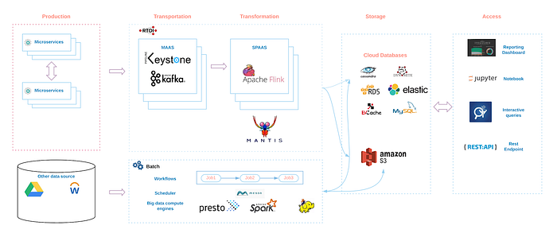
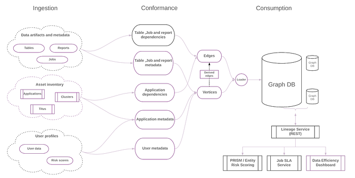

# Building and Scaling Data Lineage at Netflix to Improve Data Infrastructure Reliability, and Efficiency

By: [Di Lin](https://www.linkedin.com/in/di-lin-b3b37b26/), [Girish Lingappa](https://www.linkedin.com/in/girish-lingappa-309aa24/), [Jitender Aswani](https://www.linkedin.com/in/jitenderaswani/)

**Imagine **yourself in the role of a data-inspired decision maker staring at a metric on a dashboard about to make a critical business decision but pausing to ask a question — “Can I run a check myself to understand what data is behind this metric?”

Now, imagine yourself in the role of a software engineer responsible for a micro-service which publishes data consumed by few critical customer facing services (e.g. billing). You are about to make structural changes to the data and want to know who and what downstream to your service will be impacted.

Finally, imagine yourself in the role of a data platform reliability engineer tasked with providing advanced lead time to data pipeline (ETL) owners by proactively identifying issues upstream to their ETL jobs. You are designing a learning system to forecast Service Level Agreement (SLA) violations and would want to factor in all upstream dependencies and corresponding historical states.

At Netflix, user stories centered on understanding data dependencies shared above and countless more in Detection & Data Cleansing, Retention & Data Efficiency, Data Integrity, Cost Attribution, and Platform Reliability subject areas inspired Data Engineering and Infrastructure (DEI) team to envision a comprehensive data lineage system and embark on a development journey a few years ago. We adopted the following mission statement to guide our investments:

> **“Provide a complete and accurate data lineage system enabling decision-makers to win moments of truth.”**

In the rest of this blog, we will a) touch on the complexity of Netflix cloud landscape, b) discuss lineage design goals, ingestion architecture and the corresponding data model, c) share the challenges we faced and the learnings we picked up along the way, and d) close it out with “what’s next” on this journey.

## Netflix Data Landscape

Freedom & Responsibility (F&R) is the lynchpin of Netflix’s [culture](https://jobs.netflix.com/culture) empowering teams to move fast to deliver on innovation and operate with freedom to satisfy their mission. Central engineering teams provide paved paths (secure, vetted and supported options) and guard rails to help reduce variance in choices available for tools and technologies to support the development of scalable technical architectures. Nonetheless, Netflix data landscape (see below) is complex and many teams collaborate effectively for sharing the responsibility of our data system management. Therefore, building a complete and accurate data lineage system to map out all the data-artifacts (including in-motion and at-rest data repositories, Kafka topics, apps, reports and dashboards, interactive and ad-hoc analysis queries, ML and experimentation models) is a monumental task and requires a scalable architecture, robust design, a strong engineering team and above all, amazing cross-functional collaboration.

*Data Landscape*

## Design Goals

At the project inception stage, we defined a set of design goals to help guide the architecture and development work for data lineage to deliver a complete, accurate, reliable and scalable lineage system mapping Netflix’s diverse data landscape. Let’s review a few of these principles:

- **Ensure data integrity** — Accurately capture the relationship in data from disparate data sources to establish trust with users because without absolute trust lineage data may do more harm than good.
- **Enable seamless integration — **Design the system to integrate with a growing list of data tools and platforms including the ones that do not have the built-in meta-data instrumentation to derive data lineage from.
- **Design a flexible data model_ _**— Represent a wide range of data artifacts and relationships among them using a generic data model to enable a wide variety of business use cases.

## Ingestion-at-scale

The data movement at Netflix does not necessarily follow a single paved path since engineers have the freedom to choose (and the responsibility to manage) the best available data tools and platforms to achieve their business goals. As a result, a single consolidated and centralized source of truth does not exist that can be leveraged to derive data lineage truth. Therefore, the ingestion approach for data lineage is designed to work with many disparate data sources.

Our data ingestion approach, in a nutshell, is classified broadly into two buckets — push or pull. Today, we are operating using a pull-heavy model. In this model, we scan system logs and metadata generated by various compute engines to collect corresponding lineage data. For example, we leverage [inviso](https://medium.com/netflix-techblog/inviso-visualizing-hadoop-performance-f834175c6df8) to list pig jobs and then [lipstick](https://medium.com/netflix-techblog/introducing-lipstick-on-a-pache-pig-f17e0a4e0c89) to fetch tables and columns from these pig scripts. For spark compute engine, we leverage spark plan information and for Snowflake, admin tables capture the same information. In addition, we derive lineage information from scheduled ETL jobs by extracting workflow definitions and runtime metadata using [Meson](https://medium.com/netflix-techblog/meson-workflow-orchestration-for-netflix-recommendations-fc932625c1d9) scheduler APIs.

In the push model paradigm, various platform tools such as the data transportation layer, reporting tools, and Presto will publish lineage events to a set of lineage related Kafka topics, therefore, making data ingestion relatively easy to scale improving scalability for the data lineage system.

## Data Enrichment

The lineage data, when enriched with entity metadata and associated relationships, become more valuable to deliver on a rich set of business cases. We leverage [Metacat](https://medium.com/netflix-techblog/metacat-making-big-data-discoverable-and-meaningful-at-netflix-56fb36a53520) data, our internal metadata store and service, to enrich lineage data with additional table metadata. We also leverage metadata from another internal tool, [Genie](https://medium.com/netflix-techblog/evolving-the-netflix-data-platform-with-genie-3-598021604dda), internal job and resource manager, to add job metadata (such as job owner, cluster, scheduler metadata) on lineage data. The ingestions (ETL) pipelines transform enriched datasets to a common data model (design based on a graph structure stored as vertices and edges) to serve lineage use cases. The lineage data along with the enriched information is accessed through many interfaces using SQL against the warehouse and Gremlin and a REST Lineage Service against a graph database populated from the lineage data discussed earlier in this paragraph.

## Challenges

We faced a diverse set of challenges spread across many layers in the system. Netflix’s diverse data landscape made it challenging to capture all the right data and conforming it to a common data model. In addition, the ingestion layer designed to address several ingestions patterns added to operational complexity. Spark is the primary big-data compute engine at Netflix and with pretty much every upgrade in Spark, the spark plan changed as well springing continuous and unexpected surprises for us.

We defined a generic data model to store lineage information and now conforming the entity and associated relationships from various data sources to this data model. We are loading the lineage data to a graph database to enable seamless integration with a REST data lineage service to address business use cases. To improve data accuracy, we decided to leverage AWS S3 access logs to identify entity relationships not been captured by our traditional ingestion process.

We are continuing to address the ingestion challenges by adopting a system level instrumentation approach for spark, other compute engines, and data transport tools. We are designing a CRUD layer and exposing it as REST APIs to make it easier for anyone to publish lineage data to our pipelines.

We are taking a mature and comprehensive data lineage system and now extending its coverage far beyond traditional data warehouse realms with a goal to build universal data lineage to represent all the data artifacts and corresponding relationships. We are tackling a bunch of very interesting known unknowns with exciting initiatives in the field of data catalog and asset inventory. Mapping micro-services interactions, entities from real time infrastructure, and ML infrastructure and other non traditional data stores are few such examples.

## Lineage Architecture and Data Model

*Data Flow*

As illustrated in the diagram above, various systems have their own independent data ingestion process in place leading to many different data models that store entities and relationships data at varying granularities. This data needed to be stitched together to accurately and comprehensively describe the Netflix data landscape and required a set of conformance processes before delivering the data for a wider audience.

During the conformance process, the data collected from different sources is transformed to make sure that all entities in our data flow, such as tables, jobs, reports, etc. are described in a consistent format, and stored in a generic data model for further usage.

Based on a standard data model at the entity level, we built a generic relationship model that describes the dependencies between any pair of entities. Using this approach, we are able to build a unified data model and the repository to deliver the right leverage to enable multiple use cases such as data discovery, SLA service and Data Efficiency.

## Current Use Cases

Big Data Portal, a visual interface to data management at Netflix, has been the primary consumer of lineage data thus far. Many features benefit from lineage data including ranking of search results, table column usage for downstream jobs, deriving upstream dependencies in workflows, and building visibility of jobs writing to downstream tables.

Our most recent focus has been on powering (a) a data lineage service (REST based) leveraged by SLA service and (b) the data efficiency (to support data lifecycle management) use cases. SLA service relies on the job dependencies defined in ETL workflows to alert on potential SLA misses. This service also proactively alerts on any potential delays in few critical reports due to any job delays or failures anywhere upstream to it.

The data efficiency use cases leverages visibility on entities and their relationships to drive cost and attribution gains, auto cleansing of unused data in the warehouse .

## What’s next?

Our journey on extending the value of lineage data to new frontiers has just begun and we have a long way to go in achieving the overarching goal of providing universal data lineage representing all entities and corresponding relationships for all data at Netflix. In the short to medium term, we are planning to onboard more data platforms and leverage graph database and a lineage REST service and GraphQL interface to enable more business use cases including improving developer productivity. We also plan to increase our investment in data detection initiatives by integrating lineage data and detection tools to efficiently scan our data to further improve data hygiene.

Please share your experience by adding your comments below and stay tuned for more on data lineage at Netflix in the follow up blog posts. .

**_Credits:_** We want to extend our sincere thanks to many esteemed colleagues from the data platform (part of Data Engineering and Infrastructure org) team at Netflix who pioneered this topic before us and who continue to extend our thinking on this topic with their valuable insights and are building many useful services on lineage data.

We will be at [Strata San Francisco on March 27th in room 2001](https://conferences.oreilly.com/strata/strata-ca/public/schedule/detail/73025) delivering a tech session on this topic, please join us and share your experiences.

**If you would like to be part of our small, impactful, and collaborative team — come **[**join us**](https://jobs.lever.co/netflix/e8f4481e-86e7-4a80-ab6c-ae581bc3a7d1)**.**

---
**Tags:** Big Data
