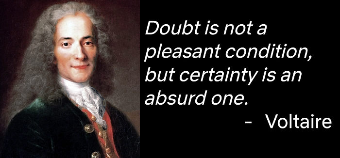
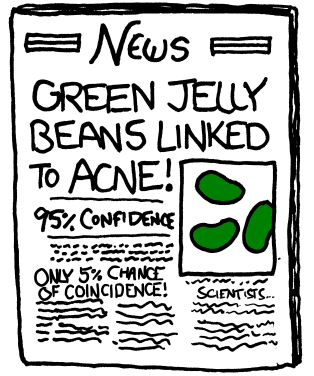

# Building confidence in a decision

[_Martin Tingley_](https://www.linkedin.com/in/martintingley/)_ with _[_Wenjing Zheng_](https://www.linkedin.com/in/wenjing-zheng/)_, _[_Simon Ejdemyr_](https://www.linkedin.com/in/simon-ejdemyr-22b920123/)_, _[_Stephanie Lane_](https://www.linkedin.com/in/stephanielane1/)_, _[_Michael Lindon_](https://www.linkedin.com/in/michaelslindon/)_, and _[_Colin McFarland_](https://www.linkedin.com/in/mcfrl/)

_This is the fifth post in a multi-part series on how Netflix uses A/B tests to inform decisions and continuously innovate on our products. Need to catch up? Have a look at _[_Part 1_](./decision-making-at-netflix-33065fa06481.md)_ (Decision Making at Netflix), _[_Part 2_](./what-is-an-a-b-test-b08cc1b57962.md)_ (What is an A/B Test?), _[_Part 3_](./interpreting-a-b-test-results-false-positives-and-statistical-significance-c1522d0db27a.md)_ (False positives and statistical significance), and _[_Part 4_](./interpreting-a-b-test-results-false-negatives-and-power-6943995cf3a8.md)_ (False negatives and power). Subsequent posts will go into more details on experimentation across Netflix, how Netflix has invested in infrastructure to support and scale experimentation, and the importance of developing a culture of experimentation within an organization._

In Parts [3](./interpreting-a-b-test-results-false-positives-and-statistical-significance-c1522d0db27a.md) (False positives and statistical significance) and [4](./interpreting-a-b-test-results-false-negatives-and-power-6943995cf3a8.md) (False negatives and power), we discussed the core statistical concepts that underpin A/B tests: false positives, statistical significance and p-values, as well as false negatives and power. Here, we’ll get to the hard part: how do we use test results to support decision making in a complex business environment?

The unpleasant reality about A/B testing is that no test result is a certain reflection of the underlying truth. As we discussed in previous posts, good practice involves first setting and understanding the false positive rate, and then designing an experiment that is well powered so it is likely to detect true effects of reasonable and meaningful magnitudes. These concepts from statistics help us reduce and understand error rates and make good decisions in the face of uncertainty. But there is still no way to know whether the result of a _specific_ experiment is a false positive or a false negative.

*Figure 1: Inspiration from Voltaire.*

In using A/B testing to evolve the Netflix member experience, we’ve found it critical to look beyond just the numbers, including the p-value, and to interpret results with strong and sensible judgment to decide if there’s compelling evidence that a new experience is a “win” for our members. These considerations are aligned with the American Statistical Association’s 2016 [Statement on Statistical Significance and P-Values](https://www.tandfonline.com/doi/pdf/10.1080/00031305.2016.1154108?needAccess=true), where the following three direct quotes (bolded) all inform our experimentation practice.

**_“Proper inference requires full reporting and transparency.” _**As discussed in [Part 3:](./interpreting-a-b-test-results-false-positives-and-statistical-significance-c1522d0db27a.md)** **(False positives and statistical significance), by convention we run experiments at a 5% false positive rate. In practice, then, if we run twenty experiments (say to evaluate if each of [twenty colors of jelly beans are linked to acne](https://xkcd.com/882/)) we’d expect at least one significant result — even if, in truth, the null hypothesis is true in each case and there is no actual effect. This is the [Multiple Comparisons Problem](https://en.wikipedia.org/wiki/Multiple_comparisons_problem), and there are a number of approaches to controlling the overall false positive rate that we’ll not cover here. Of primary importance, though, is to report and track not only results from tests that yield significant results — but also those that do not.

*Figure 2: All you need to know about false positives, in cartoon form.*

**_“A p-value, or statistical significance, does not measure the size of an effect or the importance of a result.” _**In [Part 4](./interpreting-a-b-test-results-false-negatives-and-power-6943995cf3a8.md) (False negatives and power), we talked about the importance, in the experimental design phase, of powering A/B tests to have a high probability of detecting reasonable and meaningful metric movements. Similar considerations are relevant when interpreting results. Even if results are statistically significant (p-value < 0.05), the estimated metric movements may be so small that they are immaterial to the Netflix member experience, and we are better off investing our innovation efforts in other areas. Or the costs of scaling out a new feature may be so high relative to the benefits that we could better serve our members by not rolling out the feature and investing those funds in improving different areas of the product experience.

**_“Scientific conclusions and business or policy decisions should not be based only on whether a p-value passes a specific threshold.”_** The remainder of this post gives insights into practices we use at Netflix to arrive at decisions, focusing on how we holistically evaluate evidence from an A/B test.

### Building a data-driven case

One practical way to evaluate the evidence in support of a decision is to think in terms of constructing a legal case in favor of the new product experience: is there enough evidence to “convict” and conclude, beyond that 5% reasonable doubt, that there is a true effect that benefits our members? To help build that case, here are some helpful questions that we ask ourselves in interpreting test results:

- **Do the results align with the hypothesis?** If the hypothesis was about optimizing compute resources for back-end infrastructure, and results showed a major and statistically significant increase in user satisfaction, we’d be skeptical. The result may be a false positive — or, more than likely, the result of a bug or error in the execution of the experiment ([Twyman’s Law](https://en.wikipedia.org/wiki/Twyman%27s_law)). Sometimes surprising results are correct, but more often than not they are either the result of implementation errors or false positives, motivating us to dig deep into the data to identify root causes.
- **Does the metric story hang together? **In [Part 2 ](./what-is-an-a-b-test-b08cc1b57962.md)(What is an A/B Test?), we talked about the importance of describing the causal mechanism through which a change made to the product impacts both secondary metrics and the primary decision metric specified for the test. In evaluating test results, it’s important to look at changes in these secondary metrics, which are often specific to a particular experiment, to assess if any changes in the primary metric follow the hypothesized causal chain. With the Top 10 experiment, for example, we’d check if inclusion in the Top 10 list increases title-level engagement, and if members are finding more of the titles they watch from the home page versus other areas of the product. Increased engagement with the Top 10 titles and more plays coming from the home page would help build our confidence that it is in fact the Top 10 list that is increasing overall member satisfaction. In contrast, if our primary member satisfaction metric was up in the Top 10 treatment group, but analysis of these secondary metrics showed no increase in engagement with titles included in the Top 10 list, we’d be skeptical. Maybe the Top 10 list isn’t a great experience for our members, and its presence drives more members off the home page, increasing engagement with the Netflix search experience — which is so amazing that the result is an increase in overall satisfaction. Or maybe it’s a false positive. In any case, movements in secondary metrics can cast sufficient doubt that, despite movement in the primary decision metric, we are unable to confidently conclude that the treatment is activating the hypothesized causal mechanism.
- **Is there additional supporting or refuting evidence, such as consistent patterns across similar variants of an experience**? It’s common to test a number of variants of an idea within a single experiment. For example, with something like the Top 10 experience, we may test a number of design variants and a number of different ways to position the Top 10 row on the homepage. If the Top 10 experience is great for Netflix members, we’d expect to see similar gains in both primary and secondary metrics across many of these variants. Some designs may be better than others, but seeing broadly consistent results across the variants helps build that case in favor of the Top 10 experience. If, on the other hand, we test 20 design and positioning variants and only one yields a significant movement in the primary decision metric, we’d be much more skeptical. After all, with that 5% false positive rate, we expect on average one significant result from random chance alone.
- **Do results repeat**? Finally, the surest way to build confidence in a result is to see if results repeat in a follow-up test. If results of an initial A/B test are suggestive but not conclusive, we’ll often run a follow-up test that hones in on the hypothesis based on learnings generated from the first test. With something like the Top 10 test, for example, we might observe that certain design and row positioning choices generally lead to positive metric movements, some of which are statistically significant. We’d then refine these most promising design and positioning variants, and run a new test. With fewer experiences to test, we can also increase the allocation size to gain more power. Another strategy, useful when the product changes are large, is to gradually roll out the winning treatment experience to the entire user or member based to confirm benefits seen in the A/B test, and to ensure there are no unexpected deleterious impacts. **In this case, instead of rolling out the new experience to all users at once, we slowly ramp up the fraction of members receiving the new experience, and observe differences with respect to those still receiving the old experience.**

### Connections with decision theory

In practice, each person has a different framework for interpreting the results of a test and making a decision. Beyond the data, each individual brings, often implicitly, prior information based on their previous experiences with similar A/B tests, as well as a loss or utility function based on their assessment of the potential benefits and consequences of their decision. There are ways to formalize these human judgements about estimated risks and benefits using [decision theory](https://en.wikipedia.org/wiki/Expected_utility_hypothesis), including [Bayesian decision theory](https://en.wikipedia.org/wiki/Bayes_estimator). These approaches involve formally estimating the utility of making correct or incorrect decisions (e.g., the cost of rolling out a code change that doesn’t improve the member experience). If, at the end of the experiment, we can also estimate the probability of making each type of mistake for each treatment group, we can make a decision that maximizes the expected utility for our members.

Decision theory couples statistical results with decision-making and is therefore a compelling alternative to p-value-based approaches to decision making. However, decision-theoretic approaches can be difficult to generalize across a broad range of experiment applications, due to the nuances of specifying utility functions. Although imperfect, the [frequentist](https://en.wikipedia.org/wiki/Frequentist_inference) approach to hypothesis testing that we’ve outlined in this series, with its focus on p-values and statistical significance, is a broadly and readily applicable framework for interpreting test results.

Another challenge in interpreting A/B test results is rationalizing through the movements of multiple metrics (primary decision metric and secondary metrics). A key challenge is that the metrics themselves are often not independent (i.e. metrics may generally move in the same direction, or in opposite directions). Here again, more advanced concepts from statistical inference and decision theory are applicable, and at Netflix we are engaged in research to bring more quantitative approaches to this multimetric interpretation problem. Our approach is to include in the analysis information about historical metric movements using [Bayesian inference](https://en.wikipedia.org/wiki/Bayesian_inference) — more to follow!

Finally, it’s worth noting that different types of experiments warrant different levels of human judgment in the decision making process. For example, Netflix employs a [form of A/B testing](./safe-updates-of-client-applications-at-netflix-1d01c71a930c.md) to ensure safe deployment of new software versions into production. Prior to releasing the new version to all members, we first set up a small A/B test, with some members receiving the previous code version and some the new, to ensure there are no bugs or unexpected consequences that degrade the member experience or the performance of our infrastructure. For this use case, the goal is to automate the deployment process and, using frameworks like regret minimization, the test-based decision making as well. In success, we save our developers time by automatically passing the new build or flagging metric degradations to the developer.

### Summary

Here we’ve described how to build the case for a product innovation through careful analysis of the experimental data, and noted that different types of tests warrant differing levels of human input to the decision process.

Decision making under uncertainty, including acting on results from A/B tests, is difficult, and the tools we’ve described in this series of posts can be hard to apply correctly. But these tools, including the p-value, have withstood the test of time, as reinforced in 2021 by the [American Statistical Association president’s task force statement on statistical significance and replicability](https://projecteuclid.org/journals/annals-of-applied-statistics/volume-15/issue-3/The-ASA-presidents-task-force-statement-on-statistical-significance-and/10.1214/21-AOAS1501.full): _“the use of p-values and significance testing, properly applied and interpreted, are important tools that should not be abandoned. . . . [they] increase the rigor of the conclusions drawn from data.”_

The notion of publicly sharing and debating results of key product tests is ingrained in the Experimentation Culture at Netflix, which we’ll discuss in the last installment of this series. But [up next](./experimentation-is-a-major-focus-of-data-science-across-netflix-f67923f8e985.md), we’ll talk about the different areas of experimentation across Netflix, and the different roles that focus on experimentation. Follow the[ Netflix Tech Blog](http://netflixtechblog.com/) to stay up to date.

---
**Tags:** Ab Testing · Experimentation · Causal Inference · Decision Making
