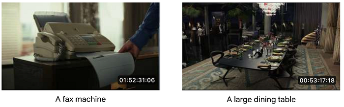
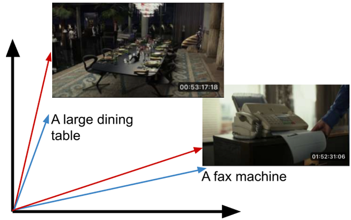
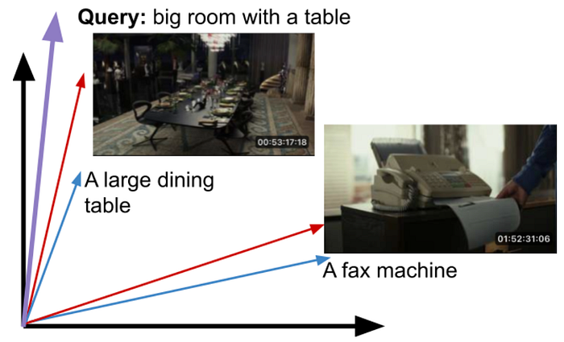

# Building In-Video Search

[Boris Chen](https://www.linkedin.com/in/boris-chen-b921a214/), [Ben Klein](https://www.linkedin.com/in/benjamin-klein-usa/), [Jason Ge](https://www.linkedin.com/in/jasonge27/), [Avneesh Saluja](https://www.linkedin.com/in/avneesh/), [Guru Tahasildar](https://www.linkedin.com/in/gurutahasildar/), [Abhishek Soni](https://www.linkedin.com/in/abhisheks0ni/), [Juan Vimberg](https://www.linkedin.com/in/jivimberg/), [Gustavo Carmo](https://www.linkedin.com/in/gucarmo/), [Meenakshi Jindal](https://www.linkedin.com/in/meenakshijindal), [Elliot Chow](https://www.linkedin.com/in/ellchow/), [Amir Ziai](https://www.linkedin.com/in/amirziai/), [Varun Sekhri](https://www.linkedin.com/in/varun-sekhri-087a213/), [Santiago Castro](https://www.linkedin.com/in/santiagocastroserra/), [Keila Fong](https://www.linkedin.com/in/keilafong/), [Kelli Griggs](https://www.linkedin.com/in/kelli-griggs-32990125/), [Mallia Sherzai](https://www.linkedin.com/in/mallia-sherzai-8a92862/), [Robert Mayer](https://www.linkedin.com/in/mayerr/), [Andy Yao](https://www.linkedin.com/in/yaoandy/), [Vi Iyengar](https://www.linkedin.com/in/vi-pallavika-iyengar-144abb1b/), [Jonathan Solorzano-Hamilton](https://www.linkedin.com/in/peachpie/), [Hossein Taghavi](https://www.linkedin.com/in/mhtaghavi/), [Ritwik Kumar](https://www.linkedin.com/in/ritwik-kumar/)

## Introduction

Today we’re going to take a look at the behind the scenes technology behind how Netflix creates great trailers, Instagram reels, video shorts and other promotional videos.

Suppose you’re trying to create the trailer for the action thriller _The Gray Man_, and you know you want to use a shot of a car exploding. You don’t know if that shot exists or where it is in the film, and you have to look for it it by scrubbing through the whole film.

*Exploding cars — The Gray Man (2022)*

Or suppose it’s Christmas, and you want to create a great instagram piece out all the best scenes across Netflix films of people shouting “Merry Christmas”! Or suppose it’s Anya Taylor Joy’s birthday, and you want to create a highlight reel of all her most iconic and dramatic shots.

Creating these involves sifting through hundreds of thousands of movies and TV shows to find the right line of dialogue or the appropriate visual elements (objects, scenes, emotions, actions, etc.). We have built an internal system that allows someone to perform in-video search across the entire Netflix video catalog, and we’d like to share our experience in building this system.

## Building in-video search

To build such a visual search engine, we needed a machine learning system that can understand visual elements. Our early attempts included object detection, but found that general labels were both too limiting and too specific, yet not specific enough. Every show has special objects that are important (e.g. Demogorgon in Stranger Things) that don’t translate to other shows. The same was true for action recognition, and other common image and video tasks.

### The Approach

We learned that **contrastive learning** works well for our objectives when applied to image and text pairs, as these models can effectively learn joint embedding spaces between the two modalities. This approach is also able to learn about objects, scenes, emotions, actions, and more in a single model. We also found that extending contrastive learning to videos and text provided a substantial improvement over frame-level models.

In order to train the model on internal training data (video clips with aligned text descriptions), we implemented a scalable version on [Ray Train](https://docs.ray.io/en/latest/train/train.html) and switched to a [more performant video decoding library](https://github.com/dmlc/decord). Lastly, the embeddings from the video encoder exhibit strong zero or few-shot performance on multiple video and content understanding tasks at Netflix and are used as a starting point in those applications.

The recent success of large-scale models that jointly train image and text embeddings has enabled new use cases around multimodal retrieval. These models are trained on large amounts of image-caption pairs via in-batch contrastive learning. For a (large) batch of `N` examples, we wish to maximize the embedding (cosine) similarity of the `N` correct image-text pairs, while minimizing the similarity of the other `N²-N` paired embeddings. This is done by treating the similarities as logits and minimizing the symmetric cross-entropy loss, which gives equal weighting to the two settings (treating the captions as labels to the images and vice versa).

Consider the following two images and captions:

*Images are from Glass Onion: A Knives Out Mystery (2022)*

Once properly trained, the embeddings for the corresponding images and text (i.e. captions) will be close to each other and farther away from unrelated pairs.

*Typically embedding spaces are hundred/thousand dimensional.*

At query time, the input text query can be mapped into this embedding space, and we can return the closest matching images.

*The query may have not existed in the training set. Cosine similarity can be used as a similarity measure.*

While these models are trained on image-text pairs, we have found that they are an excellent starting point to learning representations of video units like shots and scenes. As videos are a sequence of images (frames), additional parameters may need to be introduced to compute embeddings for these video units, although we have found that for shorter units like shots, an unparameterized aggregation like averaging (mean-pooling) can be more effective. To train these parameters as well as fine-tune the pretrained image-text model weights, we leverage in-house datasets that pair shots of varying durations with rich textual descriptions of their content. This additional adaptation step improves performance by 15–25% on video retrieval tasks (given a text prompt), depending on the starting model used and metric evaluated.

On top of video retrieval, there are a wide variety of video clip classifiers within Netflix that are trained specifically to find a particular attribute (e.g. closeup shots, caution elements). Instead of training from scratch, we have found that using the shot-level embeddings can give us a significant head start, even beyond the baseline image-text models that they were built on top of.

Lastly, shot embeddings can also be used for video-to-video search, a particularly useful application in the context of trailer and promotional asset creation.

## Engineering and Infrastructure

Our trained model gives us a text encoder and a video encoder. Video embeddings are precomputed on the shot level, stored in our [media feature store](./scaling-media-machine-learning-at-netflix-f19b400243.md), and replicated to an elastic search cluster for real-time nearest neighbor queries. Our media feature management system automatically triggers the video embedding computation whenever new video assets are added, ensuring that we can search through the latest video assets.

The embedding computation is based on a large neural network model and has to be run on GPUs for optimal throughput. However, shot segmentation from a full-length movie is CPU-intensive. To fully utilize the GPUs in the cloud environment, **we first run shot segmentation in parallel on multi-core CPU machines**, store the result shots in S3 object storage encoded in video formats such as mp4. During GPU computation, we stream mp4 video shots from S3 directly to the GPUs using a data loader that performs prefetching and preprocessing. This approach ensures that the GPUs are efficiently utilized during inference, thereby increasing the overall throughput and cost-efficiency of our system.

At query time, a user submits a text string representing what they want to search for. For visual search queries, we use the text encoder from the trained model to extract a text embedding, which is then used to perform appropriate nearest neighbor search. Users can also select a subset of shows to search over, or perform a catalog wide search, which we also support.

If you’re interested in more details, see our other post covering the [Media Understanding Platform](./building-a-media-understanding-platform-for-ml-innovations-9bef9962dcb7.md).

## Conclusion

Finding a needle in a haystack is hard. We learned from talking to video creatives who make trailers and social media videos that being able to find needles was key, and a big pain point. The solution we described has been fruitful, works well in practice, and is relatively simple to maintain. Our search system allows our creatives to iterate faster, try more ideas, and make more engaging videos for our viewers to enjoy.

We hope this post has been interesting to you. If you are interested in working on problems like this, Netflix is always [hiring](https://jobs.netflix.com/) great researchers, engineers and creators.

---
**Tags:** Machine Learning · Data Science · Video Editing · Streaming · Media
