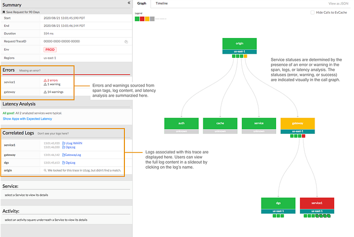
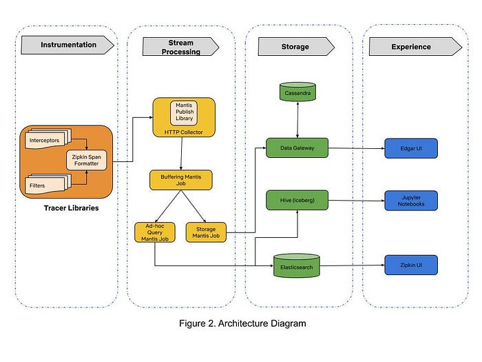
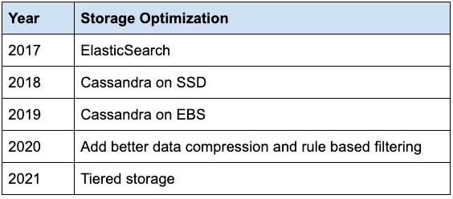

# Building Netflix’s Distributed Tracing Infrastructure

_by_ [Maulik Pandey](https://www.linkedin.com/in/maulikpandey/)

Our Team — [Kevin Lew](https://www.linkedin.com/in/kevin-lew-298155/), [Narayanan Arunachalam](https://www.linkedin.com/in/narayanan-a-0744291/), [Elizabeth Carretto](https://www.linkedin.com/in/elizabethcarretto/), [Dustin Haffner](https://www.linkedin.com/in/dustin-haffner-55534aab/), Andrei Ushakov, [Seth Katz](https://www.linkedin.com/in/katzseth22202/), [Greg Burrell](https://www.linkedin.com/in/greg-burrell-67ab273/), [Ram Vaithilingam](https://www.linkedin.com/in/ramvaith/), [Mike Smith](https://www.linkedin.com/in/kerumai/) and [Maulik Pandey](https://www.linkedin.com/in/maulikpandey/)

_“_[_@Netflixhelps_](https://twitter.com/Netflixhelps)_ Why doesn’t Tiger King play on my phone?” — a Netflix member via Twitter_

This is an example of a question our on-call engineers need to answer to help resolve a member issue — which is difficult when troubleshooting distributed systems. Investigating a video streaming failure consists of inspecting all aspects of a member account. In our previous [blog post](./edgar-solving-mysteries-faster-with-observability-e1a76302c71f.md) we introduced Edgar, our troubleshooting tool for streaming sessions. Now let’s look at how we designed the tracing infrastructure that powers Edgar.

## Distributed Tracing: the missing context in troubleshooting services at scale

Prior to Edgar, our engineers had to sift through a mountain of metadata and logs pulled from various Netflix microservices in order to understand _a specific_ streaming failure experienced by any of our members. Reconstructing a streaming session was a tedious and time consuming process that involved tracing all interactions (requests) between the Netflix app, our Content Delivery Network (CDN), and backend microservices. The process started with manual pull of member account information that was part of the session. The next step was to put all puzzle pieces together and hope the resulting picture would help resolve the member issue. We needed to increase engineering productivity via distributed request tracing.

If we had an ID for each streaming session then distributed tracing could easily reconstruct session failure by providing service topology, retry and error tags, and latency measurements for all service calls. We could also get contextual information about the streaming session by joining relevant traces with account metadata and service logs. This insight led us to build Edgar: a distributed tracing infrastructure and user experience.

*Figure 1. Troubleshooting a session in Edgar*

When we started building Edgar four years ago, there were very few open-source distributed tracing systems that satisfied our needs. Our tactical approach was to use Netflix-specific libraries for collecting traces from Java-based streaming services until open source tracer libraries matured. By 2017, open source projects like [Open-Tracing](https://opentracing.io/) and [Open-Zipkin](https://github.com/openzipkin) were mature enough for use in polyglot runtime environments at Netflix. We chose Open-Zipkin because it had better integrations with our Spring Boot based Java runtime environment. We use [Mantis](./open-sourcing-mantis-a-platform-for-building-cost-effective-realtime-operations-focused-5b8ff387813a.md) for processing the stream of collected traces, and we use Cassandra for storing traces. Our distributed tracing infrastructure is grouped into three sections: tracer library instrumentation, stream processing, and storage. Traces collected from various microservices are ingested in a stream processing manner into the data store. The following sections describe our journey in building these components.

## Trace Instrumentation: how will it impact our service?

That is the first question our engineering teams asked us when integrating the tracer library. It is an important question because tracer libraries intercept all requests flowing through mission-critical streaming services. Safe integration and deployment of tracer libraries in our polyglot runtime environments was our top priority. We earned the trust of our engineers by developing empathy for their operational burden and by focusing on providing efficient tracer library integrations in runtime environments.

Distributed tracing relies on propagating context for local interprocess calls (IPC) and client calls to remote microservices for any arbitrary request. Passing the request context captures causal relationships between microservices during runtime. We adopted Open-Zipkin’s [B3 HTTP header](https://github.com/openzipkin/b3-propagation) based context propagation mechanism. We ensure that context propagation headers are correctly passed between microservices across a variety of our “[paved road](https://netflixtechblog.com/how-we-build-code-at-netflix-c5d9bd727f15)” Java and Node runtime environments, which include both older environments with legacy codebases and newer environments such as Spring Boot. We execute the_ _[_Freedom & Responsibility _principle of our culture](https://jobs.netflix.com/culture) in supporting tracer libraries for environments like Python, NodeJS, and Ruby on Rails that are not part of the “paved road” developer experience. Our [_loosely coupled but highly aligned_](https://jobs.netflix.com/culture) engineering teams have the freedom to choose an appropriate tracer library for their runtime environment and have the responsibility to ensure correct context propagation and integration of network call interceptors.

Our runtime environment integrations inject infrastructure tags like service name, auto-scaling group (ASG), and container instance identifiers. Edgar uses this infrastructure tagging schema to query and join traces with log data for troubleshooting streaming sessions. Additionally, it became easy to provide deep links to different monitoring and deployment systems in Edgar due to consistent tagging. With runtime environment integrations in place, we had to set an appropriate trace data sampling policy for building a troubleshooting experience.

## Stream Processing: to sample or not to sample trace data?

This was the most important question we considered when building our infrastructure because data sampling policy dictates the amount of traces that are recorded, transported, and stored. **A lenient trace data sampling policy generates a large number of traces in each service container** and can lead to degraded performance of streaming services as more CPU, memory, and network resources are consumed by the tracer library. An additional implication of a lenient sampling policy is the need for scalable stream processing and storage infrastructure fleets to handle increased data volume.

We knew that a heavily sampled trace dataset is not reliable for troubleshooting because there is no guarantee that the request you want is in the gathered samples. We needed a thoughtful approach for collecting **all traces in the streaming microservices** while keeping low operational complexity of running our infrastructure.

Most distributed tracing systems enforce sampling policy at the request ingestion point in a microservice call graph. We took a [hybrid head-based sampling approach](https://github.com/openzipkin-contrib/zipkin-secondary-sampling/blob/master/docs/design.md) that allows for recording 100% of traces for a specific and configurable set of requests, while continuing to randomly sample traffic per the policy set at ingestion point. This flexibility allows tracer libraries to record 100% traces in our mission-critical streaming microservices while collecting minimal traces from auxiliary systems like offline batch data processing. Our engineering teams tuned their services for performance after factoring in increased resource utilization due to tracing. The next challenge was to stream large amounts of traces via a scalable data processing platform.

[Mantis](./open-sourcing-mantis-a-platform-for-building-cost-effective-realtime-operations-focused-5b8ff387813a.md) is our go-to platform for processing operational data at Netflix. We chose Mantis as our backbone to transport and process large volumes of trace data because we needed a backpressure-aware, scalable stream processing system.** Our trace data collection agent transports traces to Mantis job cluster via the ****[Mantis Publish library](https://netflix.github.io/mantis/internals/mantis-publish/)****.** We buffer spans for a time period in order to collect all spans for a trace in the first job. A second job taps the data feed from the first job, does tail sampling of data and writes traces to the storage system. This setup of [chained Mantis jobs](https://netflix.github.io/mantis/getting-started/concepts/#job-chaining) allows us to scale each data processing component independently. An additional advantage of using Mantis is the ability to perform real-time ad-hoc data exploration in [Raven](https://www.youtube.com/watch?v=uODxUJ5Jwis) using the [Mantis Query Language (MQL)](https://netflix.github.io/mantis/reference/mql/). However, having a scalable stream processing platform doesn’t help much if you can’t store data in a cost efficient manner.

## Storage: don’t break the bank!

We started with **Elasticsearch as our data store due to its flexible data model and querying capabilities.** As we onboarded more streaming services, the trace data volume started increasing exponentially. The increased operational burden of scaling ElasticSearch clusters due to high data write rate became painful for us. The data read queries took an increasingly longer time to finish because ElasticSearch clusters were using heavy compute resources for creating indexes on ingested traces. The high data ingestion rate eventually degraded both read and write operations. We solved this by migrating to [Cassandra](https://netflixtechblog.com/tagged/cassandra) as our data store for handling high data ingestion rates. Using simple lookup indices in Cassandra gives us the ability to maintain acceptable read latencies while doing heavy writes.

In theory, scaling up horizontally would allow us to handle higher write rates and retain larger amounts of data in Cassandra clusters. This implies that the cost of storing traces grows linearly to the amount of data being stored. We needed to ensure storage cost growth was _sub-linear_ to the amount of data being stored. In pursuit of this goal, we outlined following storage optimization strategies:

1. **Use cheaper ****[Elastic Block Store](https://aws.amazon.com/ebs/)**** (EBS) volumes instead of SSD instance stores in EC2.**
2. **Employ better compression technique to reduce trace data size.**
3. Store only relevant and interesting traces by using simple rules-based filters.

We were adding new Cassandra nodes whenever the EC2 SSD instance stores of existing nodes reached maximum storage capacity. The use of a cheaper EBS Elastic volume instead of an SSD instance store was an attractive option because AWS allows dynamic increase in EBS volume size without re-provisioning the EC2 node. This allowed us to increase total storage capacity without adding a new Cassandra node to the existing cluster. In 2019 our stunning colleagues in the Cloud Database Engineering (CDE) team benchmarked EBS performance for our use case and migrated existing clusters to use EBS Elastic volumes. By optimizing the Time Window Compaction Strategy (TWCS) parameters, they reduced the disk write and merge operations of Cassandra SSTable files, thereby reducing the EBS I/O rate. This optimization helped us reduce the data replication network traffic amongst the cluster nodes because SSTable files were created less often than in our previous configuration. Additionally, by enabling Zstd block compression on Cassandra data files, the size of our trace data files was reduced by half. With these optimized Cassandra clusters in place, it now costs us 71% less to operate clusters and we could store 35x more data than our previous configuration.

We observed that Edgar users explored less than 1% of collected traces. This insight leads us to believe that we can reduce write pressure and retain more data in the storage system if we drop traces that users will not care about. We currently use a simple rule based filter in our Storage Mantis job that retains interesting traces for very rarely looked service call paths in Edgar. The filter qualifies a trace as an interesting data point by inspecting all buffered spans of a trace for warnings, errors, and retry tags. This tail-based sampling approach reduced the trace data volume by 20% without impacting user experience. There is an opportunity to use machine learning based classification techniques to further reduce trace data volume.

While we have made substantial progress, we are now at another inflection point in building our trace data storage system. Onboarding new user experiences on Edgar could require us to store 10x the amount of current data volume. As a result, we are currently experimenting with a tiered storage approach for a new data gateway. This data gateway provides a querying interface that abstracts the complexity of reading and writing data from tiered data stores. Additionally, the data gateway routes ingested data to the Cassandra cluster and transfers compacted data files from Cassandra cluster to S3. We plan to retain the last few hours worth of data in Cassandra clusters and keep the rest in S3 buckets for long term retention of traces.

*Table 1. Timeline of Storage Optimizations*

## Secondary advantages

In addition to powering Edgar, trace data is used for the following use cases:

**Application Health Monitoring**

Trace data is a key signal used by [Telltale](./telltale-netflix-application-monitoring-simplified-5c08bfa780ba.md) in monitoring macro level application health at Netflix. Telltale uses the causal information from traces to infer microservice topology and correlate traces with time series data from [Atlas](https://netflixtechblog.com/introducing-atlas-netflixs-primary-telemetry-platform-bd31f4d8ed9a). This approach paints a richer observability portrait of application health.

**Resiliency Engineering**

Our chaos engineering team uses traces to verify that failures are correctly injected while our engineers [stress test](https://netflixtechblog.com/chap-chaos-automation-platform-53e6d528371f) their microservices via [Failure Injection Testing](https://netflixtechblog.com/fit-failure-injection-testing-35d8e2a9bb2) (FIT) platform.

**Regional Evacuation**

The Demand Engineering team leverages tracing to [improve the correctness of prescaling](./evolving-regional-evacuation-69e6cc1d24c6.md) during regional evacuations. Traces provide visibility into the types of devices interacting with microservices such that changes in demand for these services can be better accounted for when an AWS region is evacuated.

**Estimate infrastructure cost of running an A/B test**

The Data Science and Product team factors in the costs of running [A/B tests](https://netflixtechblog.com/its-all-a-bout-testing-the-netflix-experimentation-platform-4e1ca458c15) on microservices by analyzing traces that have relevant A/B test names as tags.

## What’s next?

The scope and complexity of our software systems continue to increase as Netflix grows. We will focus on following areas for extending Edgar:

- Provide a great developer experience for collecting traces across all runtime environments. With an easy way to to try out distributed tracing, we hope that more engineers instrument their services with traces and provide additional context for each request by tagging relevant metadata.
- Enhance our analytics capability for querying trace data to enable power users at Netflix in building their own dashboards and systems for narrowly focused use cases.
- Build abstractions that correlate data from metrics, logging, and tracing systems to provide additional contextual information for troubleshooting.

As we progress in building distributed tracing infrastructure, our engineers continue to rely on Edgar for troubleshooting streaming issues like “_Why doesn’t Tiger King play on my phone?”_. Our distributed tracing infrastructure helps in ensuring that Netflix members continue to enjoy a must-watch show like [Tiger King](https://www.netflix.com/title/81115994)!

_We are looking for stunning colleagues to join us on this journey of building distributed tracing infrastructure. If you are passionate about Observability then come _[_talk to us_](https://jobs.netflix.com/search?q=observability)_._

---
**Tags:** Distributed Tracing · Observability · Microservices · Netflix · Operational Insight
