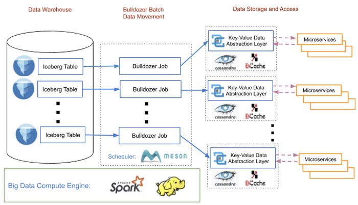
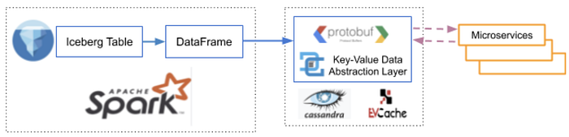
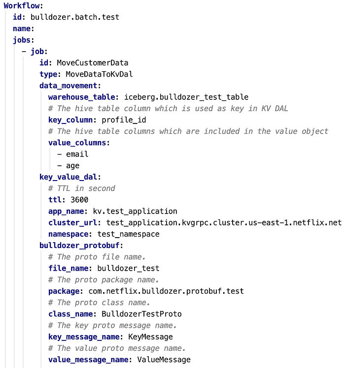
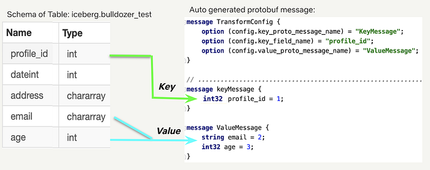
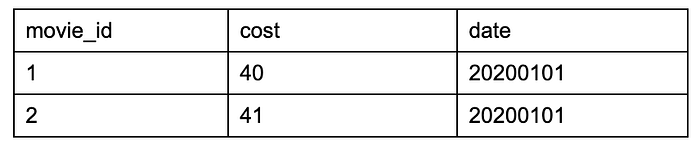
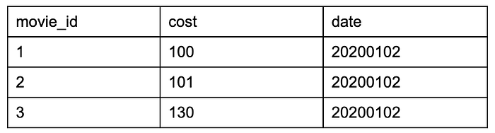
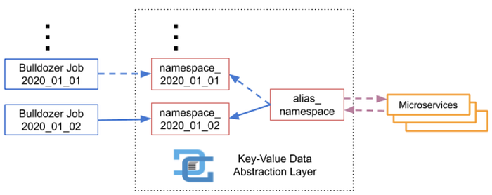
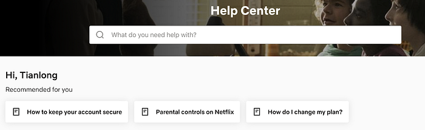

# Bulldozer: Batch Data Moving from Data Warehouse to Online Key-Value Stores

By [Tianlong Chen](https://www.linkedin.com/in/tianlong-chen-39189b7a/) and [Ioannis Papapanagiotou](https://www.linkedin.com/in/ipapapa/)

Netflix has more than 195 million subscribers that generate petabytes of data everyday. Data scientists and engineers collect this data from our subscribers and videos, and implement data analytics models to discover customer behaviour with the goal of maximizing user joy. Usually Data scientists and engineers write Extract-Transform-Load (ETL) jobs and pipelines using big data compute technologies, like [Spark](https://spark.apache.org/) or [Presto](https://prestodb.io/), to process this data and periodically compute key information for a member or a video. The processed data is typically stored as data warehouse tables in AWS S3. [Iceberg](https://iceberg.apache.org/) is widely adopted in Netflix as a data warehouse table format that addresses many of the usability and performance problems with Hive tables.

At Netflix, we also heavily embrace a microservice architecture that emphasizes separation of concerns. Many of these services often have the requirement to do a fast lookup for this fine-grained data which is generated periodically. For example, in order to enhance our user experience, one online application fetches subscribers’ preferences data to recommend movies and TV shows. The data warehouse is not designed to serve point requests from microservices with low latency. Therefore, we must efficiently move data from the data warehouse to a global, low-latency and highly-reliable key-value store. For how our machine learning recommendation systems leverage our key-value stores, please see more details on this [presentation](https://conf.slac.stanford.edu/xldb2018/sites/xldb2018.conf.slac.stanford.edu/files/Tues_11.15_IoannisPapa-Netflix-2018.pdf).

## What is Bulldozer

Bulldozer is a self-serve data platform that moves data efficiently from data warehouse tables to key-value stores in batches. It leverages Netflix [Scheduler](https://netflixtechblog.com/scheduling-notebooks-348e6c14cfd6) for scheduling the Bulldozer Jobs. Netflix Scheduler is built on top of [Meson](https://netflixtechblog.com/meson-workflow-orchestration-for-netflix-recommendations-fc932625c1d9) which is a general purpose workflow orchestration and scheduling framework to execute and manage the lifecycle of the data workflow. Bulldozer makes data warehouse tables more accessible to different microservices and reduces each individual team’s burden to build their own solutions. Figure 1 shows how we use Bulldozer to move data at Netflix.

*Figure 1. Moving data with Bulldozer at Netflix.*

As the paved path for moving data to key-value stores, Bulldozer provides a scalable and efficient no-code solution. Users only need to specify the data source and the destination cluster information in a [YAML](https://yaml.org/) file. **Bulldozer provides the functionality to auto-generate the data schema which is defined in a ****[protobuf](https://github.com/protocolbuffers/protobuf)**** file.** The protobuf schema is used for serializing and deserializing the data by Bulldozer and data consumers. Bulldozer uses [Spark](https://spark.apache.org/) to read the data from the data warehouse into [DataFrames](https://spark.apache.org/docs/latest/sql-programming-guide.html#datasets-and-dataframes), converts each data entry to a key-value pair using the schema defined in the protobuf and then delivers key-value pairs into a key-value store in batches.

Instead of directly moving data into a specific key-value store like [Cassandra](https://cassandra.apache.org/) or [Memcached](https://memcached.org/), Bulldozer moves data to a Netflix implemented**_ Key-Value Data Abstraction Layer _**(**KV DAL**). The KV DAL allows applications to use a well-defined and storage engine agnostic HTTP/gRPC key-value data interface that in turn decouples applications from hard to maintain and backwards-incompatible datastore APIs. By leveraging multiple shards of the KV DAL, Bulldozer only needs to provide one single solution for writing data to the highly abstracted key-value data interface, instead of developing different plugins and connectors for different data stores. Then the KV DAL handles writing to the appropriate underlying storage engines depending on latency, availability, cost, and durability requirements.

*Figure 2. How Bulldozer leverages Spark, Protobuf and KV DAL for moving the data.*

## Configuration-Based Bulldozer Job

For batch data movement in Netflix, we provide job templates in our [Scheduler](https://netflixtechblog.com/scheduling-notebooks-348e6c14cfd6) to make movement of data from all data sources into and out of the data warehouse. Templates are backed by [notebooks](https://netflixtechblog.com/notebook-innovation-591ee3221233). Our data platform provides the clients with a configuration-based interface to run a templated job with input validation.

We provide the job template **_MoveDataToKvDal_** for moving the data from the warehouse to one Key-Value DAL. Users only need to put the configurations together in a YAML file to define the movement job. The job is then scheduled and executed in Netflix Big Data Platform. This configuration defines what and where the data should be moved. Bulldozer abstracts the underlying infrastructure on how the data moves.

Let’s look at an example of a Bulldozer YAML configuration (Figure 3). Basically the configuration consists of three major domains: 1) **_data_movement_** includes the properties that specify what data to move. 2) **_key_value_dal_** defines the properties of where the data should be moved. 3) **_bulldozer_protobuf_** has the required information for protobuf file auto generation.

*Figure 3. An Exemplar Bulldozer Job YAML.*

In the _data_movement_ domain, the source of the data can be a warehouse table or a SQL query. Users also need to define the key and value columns to tell Bulldozer which column is used as the key and which columns are included in the value message. We will discuss more details about the schema mapping in the next **Data Model** section. In the _key_value_dal_ domain, it defines the destination of the data which is a **_namespace_** in the Key-Value DAL. One _namespace_ in a Key-Value DAL contains as many key-value data as required, it is the equivalent to a table in a database.

## Data Model

Bulldozer uses [protobuf](https://github.com/protocolbuffers/protobuf) for 1) representing warehouse table schema into a key-value schema; 2) serializing and deserializing the key-value data when performing write and read operations to KV DAL. In this way, it allows us to provide a more traditional typed record store while keeping the key-value storage engine abstracted.

Figure 4 shows a simple example of how we represent a warehouse table schema into a key-value schema. The left part of the figure shows the schema of the warehouse table while the right part is the protobuf message that Bulldozer auto generates based on the configurations in the YAML file. The field names should exactly match for Bulldozer to convert the structured data entries into the key-value pairs. In this case, _profile_id_ field is the key while _email_ and _age_ fields are included in the value schema. Users can use the protobuf schema _KeyMessage_ and _ValueMessage_ to deserialize data from Key-Value DAL as well.

*Figure 4. An Example of Schema Mapping.*

In this example, the schema of the warehouse table is flat, but sometimes the table can have nested structures. Bulldozer supports complicated schemas, like struct of struct type, array of struct, map of struct and map of map type.

## Data Version Control

Bulldozer jobs can be configured to execute at a desired frequency of time, like once or many times per day. Each execution moves the latest view of the data warehouse into a Key-Value DAL namespace. Each view of the data warehouse is a new version of the entire dataset. For example, the data warehouse has two versions of full dataset as of January 1st and 2nd, Bulldozer job is scheduled to execute daily for moving each version of the data.

*Figure 5. Dataset of January 1st 2020.*

*Figure 6. Dataset of January 2nd 2020.*

When Bulldozer moves these versioned data, it usually has the following requirements:

- **_Data Integrity_**. For one Bulldozer job moving one version of data, it should write the full dataset or none. Partially writing is not acceptable. For example above, if the consumer reads value for _movie_id: 1_ and _movie_id: 2_ after the Bulldozer jobs, the returned values shouldn’t come from two versions, like: (_movie_id: 1, cost 40_), (_movie_id: 2, cost 101_).
- **_Seamless to Data Consumer_**. Once a Bulldozer job finishes moving a new version of data, the data consumer should be able to start reading the new data automatically and seamlessly.
- **_Data Fallback_**. Normally, data consumers read only the latest version of the data, but if there’s some data corruption in that version, we should have a mechanism to fallback to the previous version.

Bulldozer leverages the KV DAL data namespace and namespace alias functionality to manage these versioned datasets. For each Bulldozer job execution, it creates a new namespace suffixed with the date and moves the data to that namespace. The data consumer reads data from an alias namespace which points to one of these version namespaces. Once the job moves the full data successfully, the Bulldozer job updates the alias namespace to point to the new namespace which contains the new version of data. The old namespaces are closed to reads and writes and deleted in the background once it’s safe to do so. As most key-value storage engines support efficiently deleting a namespace (e.g. truncate or drop a table) this allows us to cheaply recycle old versions of the data. There are also other systems in Netflix like [Gutenberg](./how-netflix-microservices-tackle-dataset-pub-sub-4a068adcc9a.md) which adopt a similar namespace alias approach for data versioning which is applied to terabyte datasets.

For example, in Figure 7 data consumers read the data through namespace: _alias_namespace_ which points to one of the underlying namespaces. On January 1st 2020, Bulldozer job creates _namespace_2020_01_01 _and moves the dataset, _alias_namespace_ points to _namespace_2020_01_01_. On January 2nd 2020, there’s a new version of data, bulldozer creates _namespace_2020_01_02 _, moves the new dataset and updates _alias_namespace_ pointing to _namespace_2020_01_02_. Both _namespace_2020_01_01 _and_ namespace_2020_01_02 _are transparent to the data consumers.

*Figure 7. An Example of How the Namespace Aliasing Works.*

The namespace aliasing mechanism ensures that the data consumer only reads data from one single version. If there’s a bad version of data, we can always swap the underlying namespaces to fallback to the old version.

## Production Usage

We released Bulldozer in production in early 2020. Currently, Bulldozer transfers billions of records from the data warehouse to key-value stores in Netflix everyday. The use cases include our members’ predicted scores data to help improve personalized experience (one example shows in Figure 8), the metadata of Airtable and Google Sheets for data lifecycle management, the messaging modeling data for messaging personalization and more.

*Figure 8. Personalized articles in Netflix Help Center powered by Bulldozer.*

## Stay Tuned

The ideas discussed here include only a small set of problems with many more challenges still left to be identified and addressed. Please share your thoughts and experience by posting your comments below and stay tuned for more on data movement work at Netflix.

## Acknowledgement

We would like to thank the following persons and teams for contributing to the Bulldozer project: Data Integration Platform Team ([Raghuram Onti Srinivasan](https://www.linkedin.com/in/raghuramos/), [Andreas Andreakis](https://www.linkedin.com/in/andreas-andreakis-b95606a1/), and [Yun Wang](https://www.linkedin.com/in/yunwang-io/)), Data Gateway Team ([Vinay Chella](https://www.linkedin.com/in/vinaychella/), [Joseph Lynch](https://www.linkedin.com/in/joseph-lynch-9976a431/), [Vidhya Arvind](https://www.linkedin.com/in/vidhya-a-11908723/) and [Chandrasekhar Thumuluru](https://www.linkedin.com/in/cthumuluru)), [Shashi Shekar Madappa](https://www.linkedin.com/in/shashishekar/) and [Justin Cunningham](https://www.linkedin.com/in/justincinmd/).

---
**Tags:** Data Movement · Data Warehouse · Key Value Store · Batch Processing · Etl
