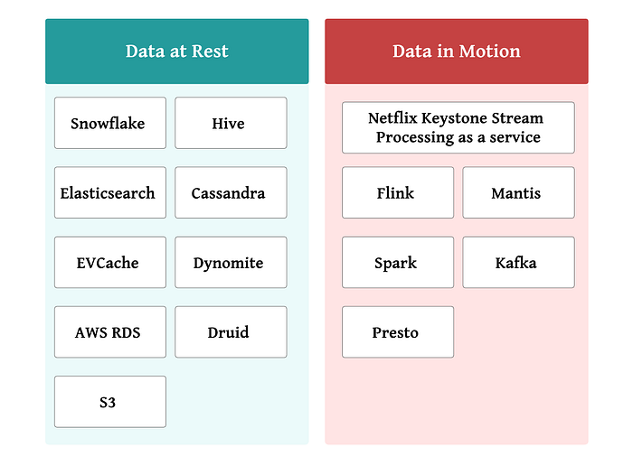
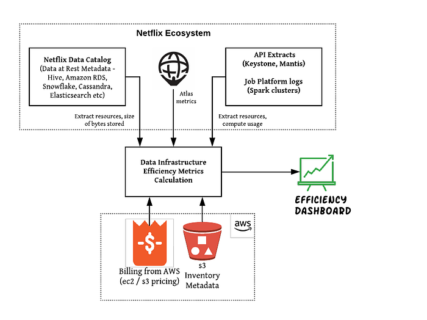
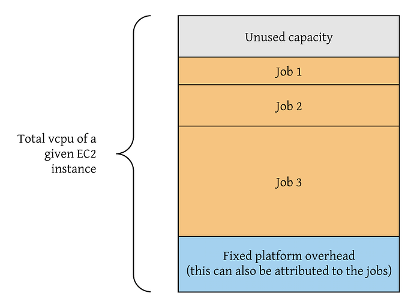
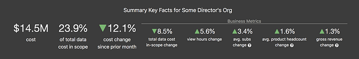
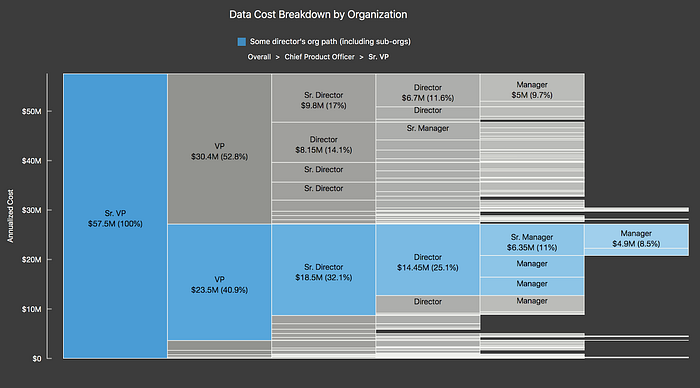
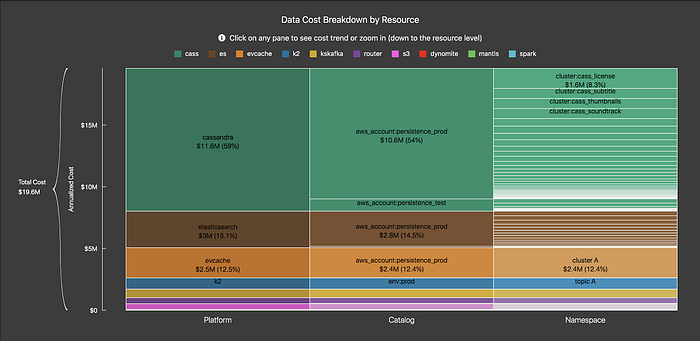
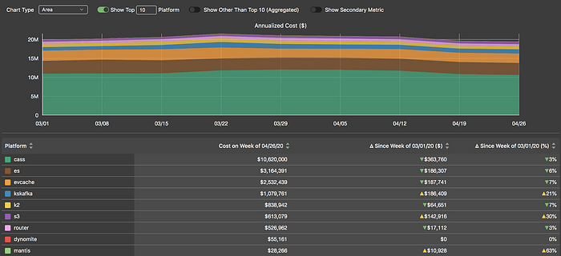
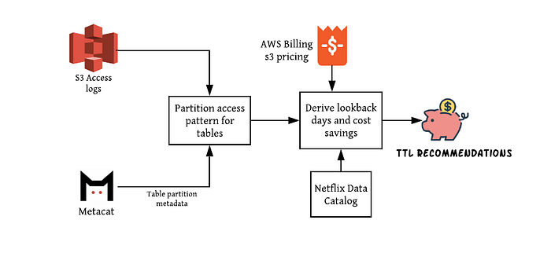
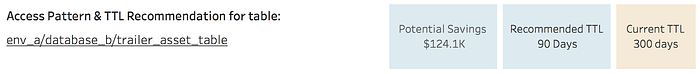
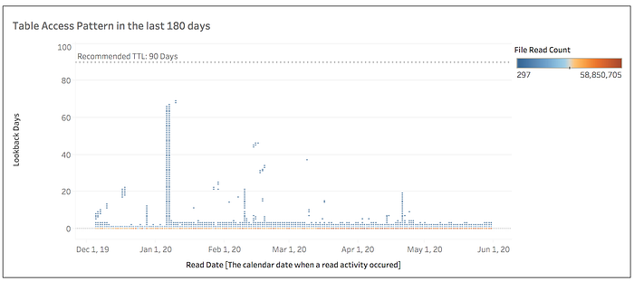

# Byte Down: Making Netflix’s Data Infrastructure Cost-Effective

By [Torio Risianto](https://www.linkedin.com/in/torio-risianto/), [Bhargavi Reddy](https://www.linkedin.com/in/bhargavi-reddy-dokuru-4aa2449a/), [Tanvi Sahni](https://www.linkedin.com/in/tanvi-sahni-71886519/), [Andrew Park](https://www.linkedin.com/in/cloudpark/)

## Background on data efficiency

At Netflix, we invest heavily in our data infrastructure which is composed of dozens of data platforms, hundreds of data producers and consumers, and petabytes of data.

At many other organizations, an effective way to manage data infrastructure costs is to set budgets and other heavy guardrails to limit spending. However, due to the highly distributed nature of our data infrastructure and our emphasis on [freedom and responsibility](https://jobs.netflix.com/culture), those processes are counter-cultural and ineffective.

Our efficiency approach, therefore, is to provide cost transparency and place the efficiency context as close to the decision-makers as possible. Our highest leverage tool is a custom dashboard that serves as a feedback loop to data producers and consumers — it is the single holistic source of truth for cost and usage trends for Netflix’s data users. This post details our approach and lessons learned in creating our data efficiency dashboard.

## Netflix’s data platform landscape

Netflix’s data platforms can be broadly classified as data at rest and data in motion systems. Data at rest stores such as S3 Data Warehouse, Cassandra, Elasticsearch, etc. physically store data and the infrastructure cost is primarily attributed to storage. Data in motion systems such as [Keystone](https://netflixtechblog.com/keystone-real-time-stream-processing-platform-a3ee651812a), [Mantis](https://netflixtechblog.com/stream-processing-with-mantis-78af913f51a6), Spark, Flink, etc. contribute to data infrastructure compute costs associated with processing transient data. Each data platform contains thousands of distinct data objects (i.e. resources), which are often owned by various teams and data users.



## Creating usage and cost visibility

To get a unified view of cost for each team, we need to be able to aggregate costs across all these platforms but also, retaining the ability to break it down by a meaningful resource unit (table, index, column family, job, etc).

### Data flow



```
S3 Inventory: Provides a list of objects and their corresponding metadata like the size in bytes for S3 buckets which are configured to generate the inventory lists.
Netflix Data Catalog (NDC): In-house federated metadata store which represents a single comprehensive knowledge base for all data resources at Netflix.
Atlas: Monitoring system which generates operational metrics for a system (CPU usage, memory usage, network throughput, etc.)
```

### Cost calculations and business logic

As the source of truth for cost data, [AWS billing](https://aws.amazon.com/aws-cost-management/aws-cost-and-usage-reporting/) is categorized by service (EC2, S3, etc) and can be allocated to various platforms based on AWS tags. However, this granularity is not sufficient to provide visibility into infrastructure costs by data resource and/or team. We have used the following approach to further allocate these costs:

**EC2-based platforms:** Determine bottleneck metrics for the platform, namely **CPU, memory, storage, IO, throughput**, or a combination. For example, Kafka data streams are typically network bound, whereas spark jobs are typically CPU and memory bound. Next, we identified the consumption of bottleneck metrics per data resource using Atlas, platform logs, and various REST APIs. Cost is allocated based on the consumption of bottleneck metrics per resource (e.g., % CPU utilization for spark jobs). The detailed calculation logic for platforms can vary depending on their architecture. The following is an example of cost attributions for jobs running in a CPU-bound compute platform:



**S3-based platforms**: We use AWS’s S3 Inventory (which has object level granularity) in order to map each S3 prefix to the corresponding data resource (e.g. hive table). We then translate storage bytes per data resource to cost based on S3 storage prices from AWS billing data.

### Dashboard view

**We use a ****[druid](https://druid.apache.org/)****-backed custom dashboard to relay cost context to teams.** The primary target audiences for our cost data are the engineering and data science teams as they have the best context to take action based on such information. In addition, we provide cost context at a higher level for engineering leaders. Depending on the use case, the cost can be grouped based on the data resource hierarchy or org hierarchy. Both snapshots and time-series views are available.

**_Note: The following snippets containing costs, comparable business metrics, and job titles do not represent actual data and are for ILLUSTRATIVE purposes only._**


*Illustrative summary facts showing annualized costs and comparable business metrics*


*Illustrative annualized data cost split by organization hierarchy*


*Illustrative annualized data cost split by resource hierarchy for a specific team*


*Illustrative time-series showing week over week cost (annualized) for a specific team by platform*

## Automated storage recommendations — Time to live (TTL)

In select scenarios where the engineering investment is worthwhile, we go beyond providing transparency and provide optimization recommendations. Since data storage has a lot of usage and cost momentum (i.e. save-and-forget build-up), we automated the analysis that determines the optimal duration of storage (TTL) based on data usage patterns. So far, we have enabled TTL recommendations for our S3 big data warehouse tables.

Our big data warehouse allows individual owners of tables to choose the length of retention. Based on these retention values, data stored in date- partitioned S3 tables are cleaned up by a data janitor process which drops partitions older than the TTL value on a daily basis. Historically most data owners did not have a good way of understanding usage patterns in order to decide optimal TTL.

### Data flow



```
S3 Access logs: AWS generated logging for any S3 requests made which provide detailed records about what S3 prefix was accessed, time of access, and other useful information.
Table Partition Metadata: Generated from an in-house metadata layer (Metacat) which maps a hive table and its partitions to a specific underlying S3 location and stores this metadata. This is useful to map the S3 access logs to the DW table which was accessed in the request.
Lookback days: Difference between the date partition accessed and the date when the partition was accessed.
```

### Cost calculations and business logic

The largest S3 storage cost comes from transactional tables, which are typically partitioned by date. Using S3 access logs and S3 prefix-to-table-partition mapping, we are able to determine which date partitions are accessed on any given day. Next, we look at access(read/write) activities in the last 180 days and identify the max lookback days. This maximum value of lookback days determines the ideal TTL of a given table. In addition, we calculate the potential annual savings that can be realized (based on today’s storage level) based on the optimal TTL.

### Dashboard view

From the dashboard, data owners can look at the detailed access patterns, recommended vs. current TTL values, as well as the potential savings.




*An illustrative example of a table with sub-optimal TTL*

## Communication and alerting users

Checking data costs should not be part of any engineering team’s daily job, especially those with insignificant data costs. To that regard, we invested in email push notifications to increase data cost awareness among teams with significant data usage. Similarly, we send automated TTL recommendations only for tables with material cost-saving potentials. Currently, these emails are sent monthly.

## Learnings and challenges

### Identifying and maintaining metadata of assets is critical for cost allocation

What is a resource? What is the complete set of data resources we own?  
These questions form the primary building blocks of cost efficiency and allocation. We are extracting metadata for a myriad of platforms across in-motion and at-rest systems as described earlier. Different platforms store their resource metadata in different ways. To address this, Netflix is building a metadata store called the Netflix Data Catalog (NDC). NDC enables easier data access and discovery to support data management requirements for both existing and new data. We use the NDC as the starting point for cost calculations. Having a federated metadata store ensures that we have a universally understood and accepted concept of defining what resources exist and which resources are owned by individual teams.

### Time trends are challenging

Time trends carry a much higher maintenance burden than point-in-time snapshots. In the case of data inconsistencies and latencies in ingestion, showing a consistent view over time is often challenging. Specifically, we dealt with the following two challenges:

- **Changes in resource ownership:** for a point-in-time snapshot view, this change should be automatically reflected. However, for a time series view, any change in the ownership should also be reflected in historical metadata as well.
- **Loss of state in case of data issues**: resource metadata is extracted from a variety of sources many of which are API extractions, it’s possible to lose state in case of job failures during data ingestion time. API extractions in general have drawbacks because the data is transient. It’s important to explore alternatives like pumping events to Keystone so that we can persist data for a longer period.

## Conclusion

When faced with a myriad of data platforms with a highly distributed, decentralized data user base, consolidating usage and cost context to create feedback loops via dashboards provide great leverage in tackling efficiency. When reasonable, creating automated recommendations to further reduce the efficiency burden is warranted — in our case, there was high ROI in data warehouse table retention recommendations. So far, these dashboards and TTL recommendations have contributed to over a 10% decrease in our data warehouse storage footprint.

## What’s next?

In the future, we plan to further push data efficiency by using different storage classes for resources based on usage patterns as well as identifying and aggressively deleting upstream and downstream dependencies of unused data resources.

_Interested in working with large scale data? Platform Data Science & Engineering is _[_hiring_](https://jobs.netflix.com/search?q=%22platform+data+science+%26+engineering%22&team=Data+Science+and+Engineering)_!_

---
**Tags:** Data · Data Infrastructure · Netflix · AWS · Data Engineering
