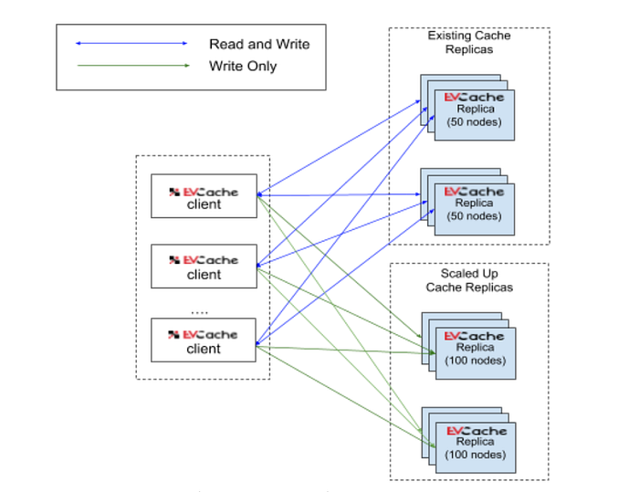
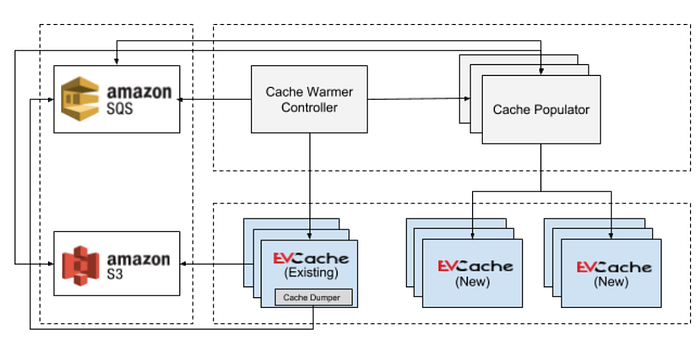
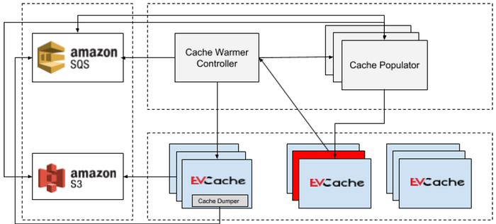
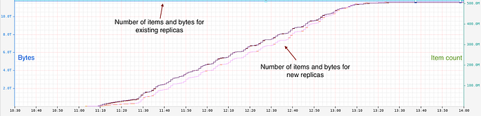
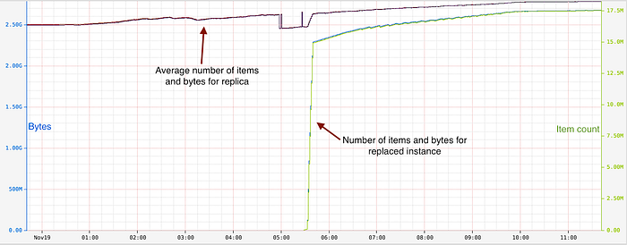

# Cache warming: Agility for a stateful service

by [Deva Jayaraman](https://www.linkedin.com/in/devananda-jayaraman-4991a02/), [Shashi Madappa](https://www.linkedin.com/in/shashishekar/), [Sridhar Enugula](https://www.linkedin.com/in/sridhar-enugula-96ab953/), and [Ioannis Papapanagiotou](https://www.linkedin.com/in/ipapapa/)

[EVCache](https://medium.com/netflix-techblog/announcing-evcache-distributed-in-memory-datastore-for-cloud-c26a698c27f7) has been a fundamental part of the Netflix platform (we call it Tier-1), holding Petabytes of data. Our caching layer serves multiple use cases from signup, personalization, searching, playback, and more. It is comprised of thousands of nodes in production and hundreds of clusters all of which must routinely scale up due to the increasing growth of our members. To address the high demand of our caching we have recently discussed the [Evolution of Application Data Caching: From RAM to SSD](https://medium.com/netflix-techblog/evolution-of-application-data-caching-from-ram-to-ssd-a33d6fa7a690).

The storage capacity of the cache can be increased by scaling out or scaling up (in some cases moving from RAM to SSD). Many services perform trillions of queries per day which stresses the network capacity of our caching infrastructure. When we needed to scale the cache either due to storage or network demand, our approach was to provision a new empty cache, dual-write to the existing cache and the new one, and then allow the data to expire in the older cluster after their Time to Live (TTL) value. This methodology worked well. But for every scale up activity, we had to pay the additional cost of keeping the old cluster and the newly scaled up cluster for the duration of the TTL. This approach didn’t suit well for clusters that had items with no expiration time or were not mutated in between. Also, natural warmup of data on nodes that are replaced in one or more replicas can cause cache misses.

*Fig.1 EVCache data path for new deployments*

To address the aforementioned problems, we introduced the **EVCache cache warmer infrastructure** with the following capabilities:

**Replica warmer**: a mechanism to copy data from one of the existing replicas to the new ones as quickly as possible without impacting the clients using the existing replicas.

**Instance warmer**: a mechanism to bootstrap a node after it has been replaced or terminated by using data from a replica not containing this node.

## Cache Warmer

The design goals for the cache warming system were to:

- Limit network impact on current EVCache clients
- Minimize the memory and disk usage on EVCache nodes
- Shorten the warm-up time
- Have no restrictions on when (Peak/Non-peak periods) to warm up

## Prior approaches

We experimented with several design approaches to address these requirements.

## Piggybacking on Replication

Netflix’s cloud deployment model is [active-active](https://medium.com/netflix-techblog/global-cloud-active-active-and-beyond-a0fdfa2c3a45) which means that we need to keep all EVCache clusters in sync across three AWS regions. We have built a custom Kafka based cross-region [replication system](https://medium.com/netflix-techblog/caching-for-a-global-netflix-7bcc457012f1). In our first iteration, we thought that we could use the queued up messages in Kafka to warm up the new replicas. However, one of the challenges with this approach is that we had to store the keys for the duration of the TTL (up to few weeks) thereby increasing the cost. We also had issues with key deduplication, especially with invalidation.

## Using Key Dumps

In this approach, we dumped keys and metadata from each node from an existing replica and uploaded them to S3. The key dump was based on Memcached’s [LRU crawler utility](https://github.com/memcached/memcached/wiki/ReleaseNotes1431). The key dump would then be consumed by the cache populator application. The cache populator application would download the key dump from S3, then fetch the data for each key from existing replicas and populate it to the new replicas.

While the data is being fetched by cache warmer from the existing replicas we noticed that the current clients were impacted as the cache warmer would have shared the same network infrastructure with the current clients. This had an impact on current operations. This would limit our ability to run cache warming during high peak hours and we had to introduce a rate limiter to avoid congesting the network used by the caches.

## Cache Warmer Design

The diagram below shows the architectural overview of our current cache warming system. It has three main blocks — _Controller_, _Dumper_ and _Populator_. For depiction purposes, we have not included the pieces responsible for deployment tasks such as create/destroy clusters and the config service which provides the environment for Netflix services.

*Fig.2 Cache Warmer Architecture*

The _Controller_ acts as the orchestrator. It is responsible for creating the environment, communication channel between the _Dumper_ and the _Populator,_ and clean up the resources. The _Dumper_ is part of the EVCache sidecar. The sidecar is a Tomcat service that runs alongside with memcached on each EVCache node and is responsible to produce dumps. The _Populator_ consumes the dumps produced by Dumper and populates it to the destination replicas.

## Cache Warmer Controller

The source of the data, i.e. the replica from where the data needs to be copied, can be either provided by the user or the _Controller_ will select the replica with the highest number of items. The _Controller_ will create a dedicated SQS queue which is used as a communication link between the _Dumper_ and the _Populator_. It then initiates the cache dump on the source replica nodes. While the dump is in progress, the _Controller_ will create a new _Populator_ cluster. The _Populator_ will get the configuration such as SQS queue name and other settings. The _Controller_ will wait until the SQS queue messages are consumed successfully by the _Populator_. Once the SQS queue is empty, it will destroy the _Populator_ cluster, SQS queue, and any other resources.

## The Dumper

To limit the impact on the existing clients that are accessing the EVCache replicas, we took the approach to dump the data on each EVCache node. Each node does the dumping of the data in two phases.

1. Enumerate the keys using memcached [LRU Crawler utility](https://github.com/memcached/memcached/wiki/ReleaseNotes1431) and dump the keys into many key-chunk files.
2. For each key in the key-chunk, the _Dumper_ will retrieve its value, and auxiliary data, and dump them into a local data-chunk file.

Once the max chunk size is reached, the data-chunk is uploaded to S3 and a message containing the S3 URI is written to the SQS queue. The metadata about the data-chunk such as the warm-up id, hostname, S3 URI, dump format, and the key count is kept along with the chunk in S3. This allows independent consumption of the data chunks. The configurable size of the data-chunks, allows them to be consumed as they become available thus not waiting for the entire dump to be completed. As there will be multiple key-chunks in each EVCache node, the data-dump can be done in parallel. The number of parallel threads depends on the available disk space, JVM heap size of the sidecar, and the CPU cores.

## The Populator

The _Populator_ is a worker that is tasked with populating the destination replicas. It gets the information about the SQS queue and destination replica (optional) through the [Archaius](http://netflix.github.io/archaius/) dynamic property which is set by the _Controller_. The _Populator_ will pull the message from the SQS queue. The message contains the S3 URI, it then downloads the data-chunk and starts populating the data on destination replica(s). The _Populator_ performs add operations (i.e insert keys only if they are not present) to prevent overwriting of keys that have been mutated while the warm-up was taking place.

The _Populator_ starts its job as soon as the data-dump is available. The _Populator_ cluster auto scales depending on available data chunks in SQS queue.

## Instance warmer

In a large EVCache deployment, it is common to have nodes being terminated or replaced by AWS due to hardware or other issues. This could cause latency spikes to the application because the EVCache client would need to fetch the missing data from other EVCache replicas. The application could see a drop in hit rate if nodes in multiple replicas are affected at the same time.

We can minimize the effect of node replacements or restarts if we can warm up the replaced or restarted instances very quickly. We were able to extend our cache warmer to achieve instance warming with few changes to the cache _Dumper_ and adding a signal from EVCache nodes to notify of restarts.

*Fig.3 Instance Warmer Architecture*

The diagram illustrates the architecture for instance warming, here we have three EVCache replicas. One of the nodes in replica, shown in the middle, is restarted indicated by red color and it needs to be warmed up.

When the _Controller_ receives a signal from an EVCache node on startup, it will check if any node in the reported replica has less than its fair share of times, if so it will trigger the warming process. The _Controller_ ensures not to use the reported replica as the source replica. EVCache uses consistent hashing with virtual nodes. The data on a restarted/replaced node is distributed across all nodes in the other replicas, therefore we need to dump data on all nodes. When the _Controller_ initiates dumping it will pass the specific nodes that need to be warmed up and the replica to which they belong to. The _Dumper_ will dump the data only for the keys which will be hashed to specific nodes. The _Populator _will then consume the data-chunks to populate the data to the specific replica as explained before.

The instance warming process is much lighter than the replica warming since we deal with a fraction of data on each node.

## In Practice

The cache warmer is being extensively used for scaling our caches if their TTL is greater than a few hours. This has been especially very useful when we scale our caches to handle the holiday traffic.

The chart below shows warming up of two new replicas from one of the two existing replicas. Existing replicas had about 500 million items and 12 Terabytes of data. The warm-up was completed in about 2 hours.

*Fig.4 Cache warmer in action*

The largest cache that we have warmed up is about 700 TB and 46 billion items. This cache had 380 nodes replicas. The cache copy took about 24 hours with 570 populator instances.

The instance warmer is being employed in production and it is warming up a few instances every day. Below chart is an example for instance warming, here an instance got replaced at around 5.27, it was warmed up in less than 15 minutes with about 2.2 GB of data and 15 million items. The average data size and item count for the replica are also shown in the chart.

*Fig.5 Instance warmer in action*

## Future enhancements

**Elastic scaling**: The auto instance warm-up mechanism described above opens up the possibility to in place scale out (or scale in) EVCache. This will save us cost and time for large EVCache deployments as it avoids the need to create a new replica and warm up. The main challenge is to reduce the impact on the existing clients due to changes in hashing and other administrative operations such as cleanup of orphaned keys.

**EBS storage**: The main bottleneck with current approach dealing with very huge cache is uploading and downloading data-chunks to and from S3. We observe that the S3 network bandwidth gets throttled after a certain period. An alternative better approach would be to use EBS backed storage to store and retrieve data-chunks. The idea is that the _Dumper_ on each node will be able to attach to an EBS volume and dump the data to a known location. The _Populator_ can attach the same EBS volume and do the addition to new replicas. We would need the ability for multiple instances to attach to the same EBS volume, if we want to run the _Dumper_ and the _Populator _concurrently, in order to do quick warm up.

**Adapting to other data stores**: Our team also support other in the memory high performant data store systems, such as Dynomite that fronts our Redis Infrastructure. We will be investigating whether some of the components could be leveraged for Dynomite’s horizontal scalability.

## Conclusion

In this blog, we discussed the architecture of our cache warming infrastructure. The flexible cache warming architecture allowed us to copy data from existing replicas to one more new replicas and warm up nodes that were terminated or replaced due to hardware issues. Our architecture also enabled us to control the pace of cache warmup due to the loose coupling between the cache _Dumper_ and _Populator_ and various configurable tune-up settings. We have been using cache warmer to scale & warm up the caches for a few months now and we plan to extend it to support other systems.

---
**Tags:** AWS · Cache · Netflixoss · Database · Evcache
