# CAMBI, a banding artifact detector

> by Joel Sole, Mariana Afonso, Lukas Krasula, Zhi Li, and Pulkit Tandon

**_Introducing the banding artifacts detector developed by Netflix aiming at further improving the delivered video quality_**

---

Banding artifacts can be pretty annoying. But, first of all, you may wonder, what is a banding artifact?

## Banding artifact?

You are at home enjoying a show on your brand-new TV. Great content delivered at excellent quality. But then, you notice some bands in an otherwise beautiful sunset scene. What was that? A sci-fi plot twist? Some device glitch? More likely, banding artifacts, which appear as false staircase edges in what should be smoothly varying image areas.

Bands can show up in the sky in that sunset scene, in dark scenes, in flat backgrounds... In any case, we don’t like them, nor should anybody be distracted from the storyline by their presence.

Just a subtle change in the video signal can cause banding artifacts. This slight variation in the value of some pixels disproportionately impacts the perceived quality. Bands are more visible (and annoying) when the viewing conditions are right: large TV with good contrast and a dark environment without screen reflections.

Some examples below. Since we don’t know where and when you are reading this blog post, we exaggerate the banding artifacts, so you get the gist. The first example is from the opening scene of one of our first shows. Check out the sky. Do you see the bands? The viewing environment (background brightness, ambient lighting, screen brightness, contrast, viewing distance) influences the bands’ visibility. You may play with those factors and observe how the perception of banding is affected.

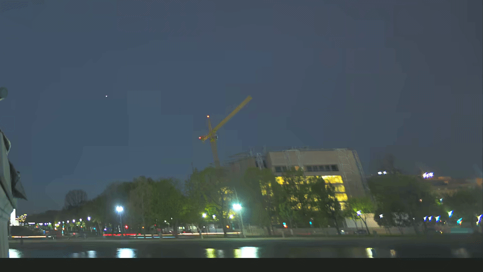

Banding artifacts are also found in compressed images, as in this one we have often used to illustrate the point:

Even _Voyager 1_ encountered banding along the way; [xkcd](https://xkcd.com/2414/) :-)

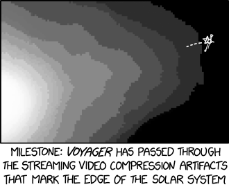

## How annoying is it?

We set up an experiment to measure the perceived quality in the presence of banding artifacts. We asked participants to rate the impact of the banding artifacts on a scale from 0 (unwatchable) to 100 (imperceptible) for a range of videos with different resolutions, bit-rates, and dithering. Participants rated 86 videos in total, all of them SDR. Most of the content was banding-prone, while some not. The collected mean opinion scores (MOS) covered the entire scale.

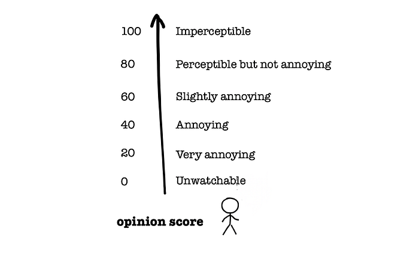

According to usual metrics, the videos in the experiment with perceptible banding should be mid to high-quality (i.e., PSNR>40dB and VMAF>80). However, the experiment scores show something entirely different, as we’ll see below.

## You can’t fix it if you don’t know it’s there

Netflix encodes video at scale. Likewise, video quality is assessed at scale within the encoding pipeline, not by an army of humans rating each video. This is where objective video quality metrics come in, as they automatically provide actionable insights into the actual quality of an encode.

**PSNR has been the primary video quality metric for decades**: it is based on the average pixel distance of the encoded video to the source video. In the case of banding, this distance is tiny compared to its perceptual impact. Consequently, there is little information about banding in the PSNR numbers. The data from the subjective experiment confirms this lack of correlation between PSNR and MOS:

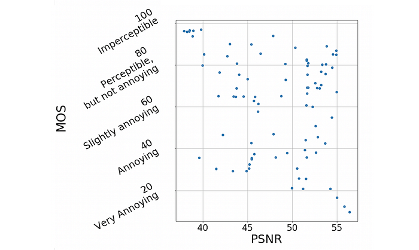

Another video quality metric is [VMAF](./toward-a-better-quality-metric-for-the-video-community-7ed94e752a30.md), which Netflix jointly developed with several collaborators and [open-sourced](https://github.com/Netflix/vmaf) on Github. VMAF has become a _de facto_ standard for evaluating the performance of encoding systems and driving encoding optimizations, being a crucial factor for the quality of Netflix encodes. However, VMAF does not specifically target banding artifacts. It was designed with our streaming use case in mind, in particular, to capture the video quality of movies and shows in the presence of encoding and scaling artifacts. VMAF works exceptionally well in the general case, but, like PSNR, lacks correlation with MOS in the presence of banding:

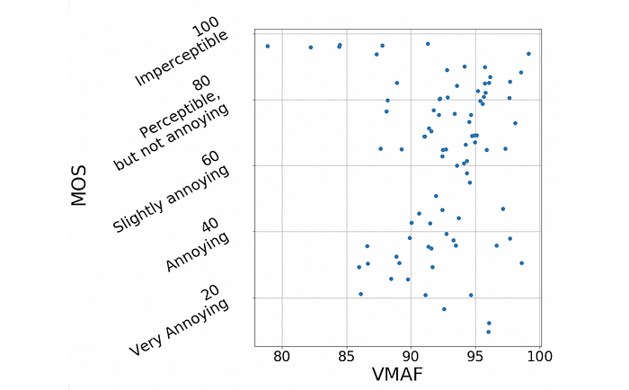

VMAF, PSNR, and other commonly used video quality metrics don’t detect banding artifacts properly and, if we can’t catch the issue, we cannot take steps to fix it. Ideally, our wish list for a banding detector would include the following items:

- High correlation with MOS for banding artifacts encountered in our video encoding pipeline
- Simple, intuitive, distortion-specific, and based on human visual system principles
- Consistent performance for banding in compressed video across the different resolutions, high qualities, and bit-depths delivered in our service
- Robust to dithering, which video pipelines commonly introduce

We didn’t find any algorithm in the literature that fit our purposes. So we set out to develop one.

## CAMBI

We hand-crafted in a traditional NNN (non-neural network) way an algorithm to meet our requirements. A white box solution derived from first principles with just a few, visually-motivated, parameters: the contrast-aware multiscale banding index (CAMBI).

A block diagram describing the steps involved in CAMBI is shown below. CAMBI operates as a no-reference banding detector taking a (distorted) video as an input and producing a banding visibility score as the output. The algorithm extracts pixel-level maps at multiple scales for frames of the encoded video. Subsequently, it combines these maps into a single index motivated by the human contrast sensitivity function (CSF).

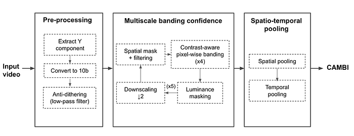

### Pre-processing

Each input frame goes through up to three pre-processing steps.

The first step extracts the luma component: although chromatic banding exists, like most past works, we assume that most of the banding can be captured in the luma channel. The second step is converting the luma channel to 10-bit (if the input is 8-bit).

Third, we account for the presence of dithering in the frame. Dithering is intentionally applied noise used to randomize quantization error that is shown to reduce banding visibility. To account for both dithered and non-dithered content, we use a 2×2 filter to smoothen the intensity values to replicate the low-pass filtering done by the human visual system.

### Multiscale Banding Confidence

We consider banding detection a contrast-detection problem, and hence banding visibility is majorly governed by the CSF. The CSF itself largely depends on the perceived contrast across a step and the spatial frequency of the steps. CAMBI explicitly accounts for the contrast across pixels by looking at the differences in pixel intensity and does this at multiple scales to account for spatial frequency. This is done by calculating pixel-wise banding confidence at different contrasts and scales, each referred to as a CAMBI map for the frame. The maximum computed contrast is one luma level in 8-bit and four luma levels in 10-bit content. Larger contrasts are not typical in video compression pipelines, but an algorithm parameter allows to tune the maximum contrast to account for other use cases.

Banding confidence computation also considers the sensitivity to change in brightness depending on the local brightness. At the end of this process, twenty CAMBI maps are obtained per frame capturing banding across four contrast steps and five scales.

### Spatio-Temporal Pooling

CAMBI maps are spatiotemporally pooled to obtain the final banding index. Spatial pooling is done based on the observation that CAMBI maps belong to the initial linear phase of the CSF. First, pooling is applied in the contrast dimension by keeping the maximum weighted contrast for each position. The result is five maps, one per scale. There is an example of such maps further down in this post.

Since regions with the poorest quality dominate the perceived quality of the video, only a percentage of the pixels, those with the most banding, is considered during spatial pooling for the maps at each scale. The resulting scores per scale are linearly combined with CSF-based weights to derive the CAMBI for each frame.

According to our experiments, CAMBI is temporally stable within a single video shot, so a simple average suffices as a temporal pooling mechanism across frames. However, note that this assumption breaks down for videos with multiple shots with different characteristics.

## CAMBI agrees with the subjective assessments

Our results show that CAMBI provides a high correlation with MOS while, as illustrated above, VMAF and PSNR have very little correlation. The table reports two correlation coefficients, namely Spearman Rank Order Correlation (SROCC) and Pearson’s Linear Correlation (PLCC):

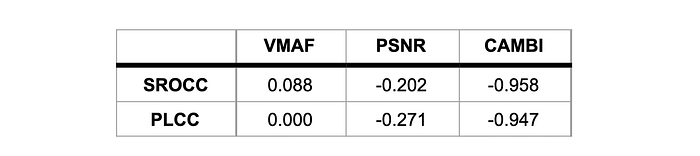

The following plot visualizes that CAMBI correlates well with subjective scores and that a CAMBI of around 5 is where banding starts to be slightly annoying. Note that, unlike the two quality metrics, CAMBI correlates inversely with MOS: the higher the CAMBI score is, the more perceptible the banding is, and thus the quality is lower.

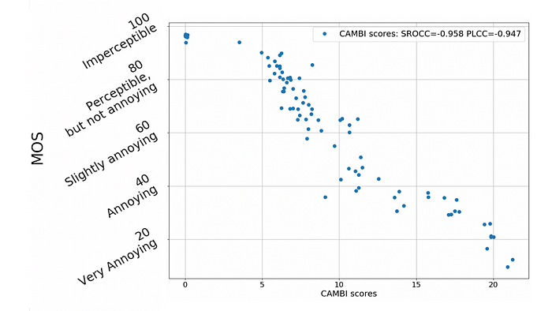

## Staring at the sunset

We use this sunset as an example of banding and how CAMBI scores it. Below we also show the same sunset with fake colors, so bands pop up even more.

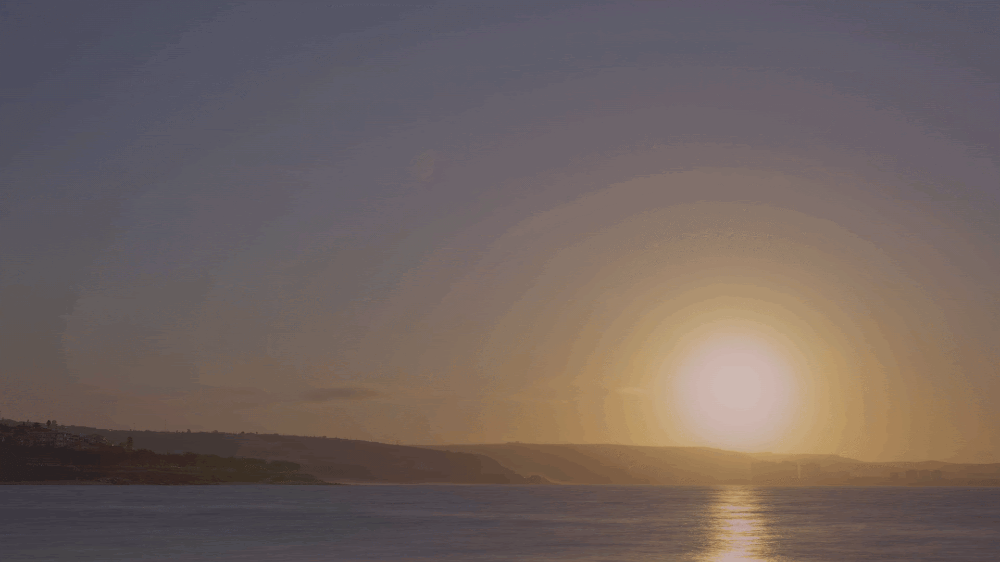

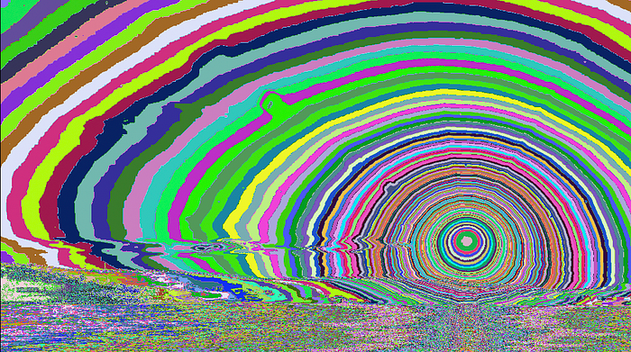

There is no banding on the sea part of the image. In the sky, the size of the bands increases as the distance from the sun increases. The five maps below, one per scale, capture the confidence of banding at different spatial frequencies. These maps are further spatially pooled, accounting for the CSF, giving a CAMBI score of 19 for the frame, which perceptually corresponds to somewhere between ‘_annoying_’ to ‘_very annoying_’ banding according to the MOS data.

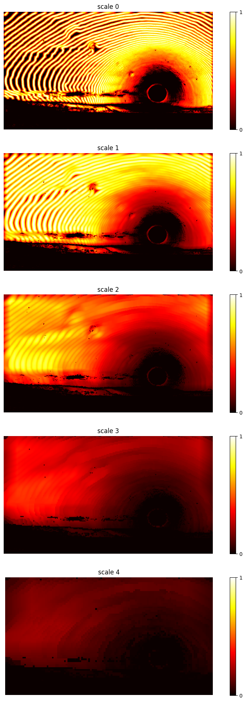

## Open-source and next steps

A banding detection mechanism robust to multiple encoding parameters can help identify the onset of banding in videos and serve as the first step towards its mitigation. In the future, we hope to leverage CAMBI to develop a new version of VMAF that can account for banding artifacts.

We open-sourced CAMBI as a new standalone feature in [libvmaf](https://github.com/Netflix/vmaf/blob/master/resource/doc/cambi.md). Similar to VMAF, CAMBI is an organic project expected to be gradually improved over time. We welcome any feedback and contributions.

## Acknowledgments

We want to thank Christos Bampis, Kyle Swanson, Andrey Norkin, and Anush Moorthy for the fruitful discussions and all the participants in the subjective tests that made this work possible.

---
**Tags:** Vmaf · Video Encoding · Video Quality · Netflix · Open Source
