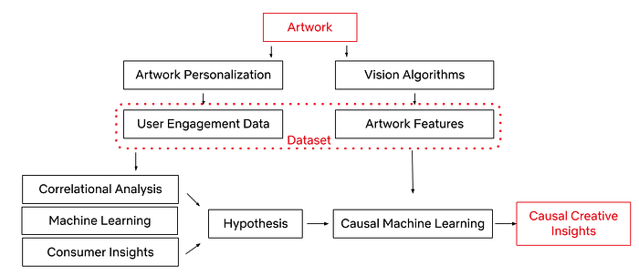
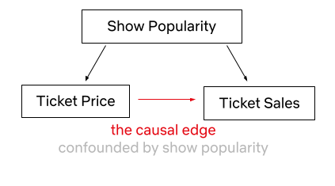
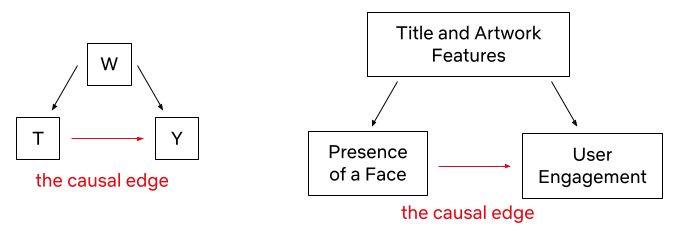
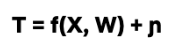
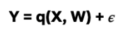
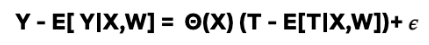
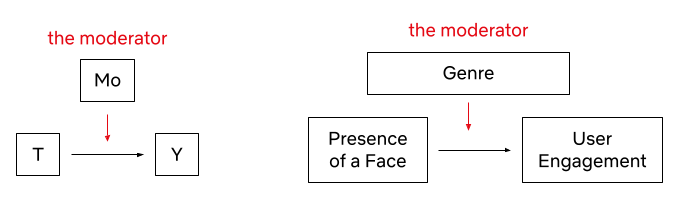
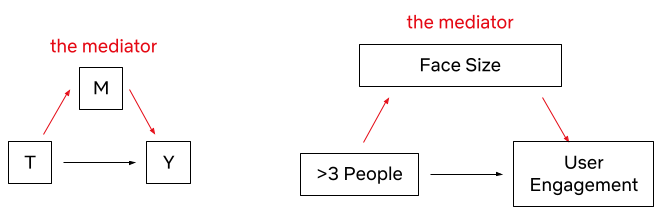

# Causal Machine Learning for Creative Insights

**A framework to identify the causal impact of successful visual components.**

By [Billur Engin](https://www.linkedin.com/in/billurengin/), [Yinghong Lan](https://www.linkedin.com/in/yinghong-lan-2368656b/), [Grace Tang](https://www.linkedin.com/in/tsmgrace/), [Cristina Segalin](https://www.linkedin.com/in/cristinasegalin/), [Kelli Griggs](https://www.linkedin.com/in/kelli-griggs-32990125/), [Vi Iyengar](https://www.linkedin.com/in/vi-pallavika-iyengar-144abb1b/)

**Introduction**

At Netflix, we want our viewers to easily find TV shows and movies that resonate and engage. Our creative team helps make this happen by designing promotional artwork that best represents each title featured on our platform. What if we could use machine learning and computer vision to support our creative team in this process? Through identifying the components that contribute to a successful artwork — one that leads a member to choose and watch it — we can give our creative team data-driven insights to incorporate into their creative strategy, and help in their selection of which artwork to feature.

We are going to make an assumption that the presence of a specific component will lead to an artwork’s success. We will discuss a causal framework that will help us find and summarize the successful components as creative insights, and hypothesize and estimate their impact.

**The Challenge**

Given Netflix’s vast and increasingly diverse catalog, it is a challenge to design experiments that both work within an A/B test framework and are representative of all genres, plots, artists, and more. In the past, we have attempted to design A/B tests where we investigate one aspect of artwork at a time, often within one particular genre. However, this approach has a major drawback: it is not scalable because we either have to label images manually or create new asset variants differing only in the feature under investigation. The manual nature of these tasks means that we cannot test many titles at a time. Furthermore, given the multidimensional nature of artwork, we might be missing many other possible factors that might explain an artwork’s success, such as figure orientation, the color of the background, facial expressions, etc. Since we want to ensure that our testing framework allows for maximum creative freedom, and avoid any interruption to the design process, we decided to try an alternative approach.

**Figure. **Given the multidimensional nature of artwork, it is challenging to design an A/B test to investigate one aspect of artwork at a given time. We could be missing many other possible factors that might explain an artwork’s success, such as figure orientation, the color of the background, facial expressions, etc.

**The Causal Framework**

Thanks to our [Artwork Personalization System](https://netflixtechblog.com/artwork-personalization-c589f074ad76) and vision algorithms (some of which are [exemplified here](https://netflixtechblog.com/ava-the-art-and-science-of-image-discovery-at-netflix-a442f163af6)), we have a rich dataset of promotional artwork components and user engagement data to build a causal framework. Utilizing this dataset, we have developed the framework to test creative insights and estimate their causal impact on an artwork’s performance via the dataset generated through our recommendation system. In other words, we can learn which attributes led to a title’s successful selection based on its artwork.

Let’s first explore the workflow of the causal framework, as well as the data and success metrics that power it.

We represent the success of an artwork with the take rate: the probability of an average user to watch the promoted title after seeing its promotional artwork, adjusted for the popularity of the title. Every show on our platform has multiple promotional artwork assets. Using Netflix’s [Artwork Personalization](https://netflixtechblog.com/artwork-personalization-c589f074ad76), we serve these assets to hundreds of millions of members everyday. To power this recommendation system, we look at user engagement patterns and see whether or not these engagements with artworks resulted in a successful title selection.

With the capability to annotate a given image (some of which are mentioned in [an earlier post](https://netflixtechblog.com/ava-the-art-and-science-of-image-discovery-at-netflix-a442f163af6#:~:text=editorial%20image%20candidates-,frame%20annotation,-As%20part%20of)), an artwork asset in this case, we use a series of computer vision algorithms to gather objective image metadata, latent representation of the image, as well as some of the contextual metadata that a given image contains. This process allows our dataset to consist of both the image features and user data, all in an effort to understand which image components lead to successful user engagement. We also utilize machine learning algorithms, consumer insights¹, and correlational analysis for discovering high-level associations between image features and an artwork’s success. **These statistically significant associations become our hypotheses for the next phase.**

Once we have a specific hypothesis, we can test it by deploying causal machine learning algorithms. This framework reduces our experimental effort to uncover causal relationships, while taking into account confounding among the high-level variables (i.e. the variables that may influence both the treatment / intervention and outcome).

**The Hypothesis and Assumptions**

We will use the following hypothesis in the rest of the script: _presence of a face in an artwork causally improves the asset performance_. (We know that [faces work well in artwork](https://about.netflix.com/en/news/the-power-of-a-picture#:~:text=emotions%20are%20an%20efficient%20way%20of%20conveying%20complex%20nuances), especially [images with an expressive facial emotion that’s in line with the tone of the title.](https://netflixtechblog.com/selecting-the-best-artwork-for-videos-through-a-b-testing-f6155c4595f6#:~:text=Unbreakable%20Kimmy%20Schmidt-,conclusion,-Over%20the%20course))

Here are two promotional artwork assets from _Unbreakable Kimmy Schmidt_. We know that the image on the left performed better than the image on the right. However, the difference between them is not only the presence of a face. There are many other variances, like the difference in background, text placement, font size, face size, etc. Causal Machine Learning makes it possible for us to understand an artwork’s performance based on the causal impact of its treatment.

To make sure our hypothesis is fit for the causal framework, it’s important we go over the _identification assumptions_.

- **Consistency:** The treatment component is sufficiently well-defined.

We use machine learning algorithms to predict whether or not the artwork contains a face. That’s why the first assumption we make is that our face detection algorithm is mostly accurate (~92% average precision).

- **Positivity / Probabilistic Assignment:** Every unit (an artwork) has some chance of getting treated.

We calculate the propensity score (the probability of receiving the treatment based on certain baseline characteristics) of having a face for samples with different covariates. If a certain subset of artwork (such as artwork from a certain genre) has close to a 0 or 1 propensity score for having a face, then we discard these samples from our analysis.

- **Individualistic Assignment / SUTVA (stable unit treatment value assumption):** The potential outcomes of a unit do not depend on the treatments assigned to others.

Creatives make the decision to create artwork with or without faces based on considerations limited to the title of interest itself. This decision is not dependent on whether other assets have a face in them or not.

- **Conditional exchangeability (Unconfoundedness):** There are no unmeasured confounders.

This assumption is by definition not testable. Given a dataset, we can’t know if there has been an unobserved confounder. However, we can test the sensitivity of our conclusions toward the violation of this assumption in various different ways.

**The Models**

Now that we have established our hypothesis to be a causal inference problem, we can focus on the Causal Machine Learning Application. **Predictive Machine Learning (ML) models are great at finding patterns and associations in order to predict outcomes, however they are not great at explaining cause-effect relationships, as their model structure does not reflect causality (the relationship between cause and effect)**. As an example, let’s say we looked at the price of Broadway theater tickets and the number of tickets sold. An ML algorithm may find a correlation between price increases and ticket sales. If we have used this algorithm for decision making, we could falsely conclude that increasing the ticket price leads to higher ticket sales if we do not consider the confounder of show popularity, which clearly impacts both ticket prices and sales. It is understandable that a Broadway musical ticket may be more expensive if the show is a hit, however simply increasing ticket prices to gain more customers is counter-intuitive.

Causal ML helps us estimate treatment effects from observational data, where it is challenging to conduct clean randomizations. Back-to-back publications on Causal ML, such as [Double ML](https://arxiv.org/abs/1608.00060), [Causal Forests](https://arxiv.org/abs/1510.04342), [Causal Neural Networks](https://arxiv.org/pdf/1906.02120.pdf), and many more, showcased a toolset for investigating treatment effects, via combining domain knowledge with ML in the learning system. Unlike predictive ML models, Causal ML explicitly controls for confounders, by modeling both treatment of interest as a function of confounders (i.e., propensity scores) as well as the impact of confounders on the outcome of interest. In doing so, Causal ML isolates out the _causal _impact of treatment on outcome. Moreover, the estimation steps of Causal ML are carefully set up to achieve better error bounds for the estimated treatment effects, another consideration often overlooked in predictive ML. Compared to more traditional Causal Inference methods anchored on linear models, Causal ML leverages the latest ML techniques to not only better control for confounders (when propensity or outcome models are hard to capture by linear models) but also more flexibly estimate treatment effects (when treatment effect heterogeneity is nonlinear). In short, by utilizing machine learning algorithms, Causal ML provides researchers with a framework for understanding causal relationships with flexible ML methods.

Y : outcome variable (take rate)  
T : binary treatment variable (presence of a face or not)  
W: a vector of covariates (features of the title and artwork)  
X ⊆ W: a vector of covariates (a subset of W) along which treatment effect heterogeneity is evaluated

Let’s dive more into the causal ML (Double ML to be specific) application steps for creative insights.

1. Build a propensity model to predict treatment probability (T) given the W covariates.

2. Build a potential outcome model to predict Y given the W covariates.

3. Residualization of

- The treatment (observed T — predicted T via propensity model)
- The outcome (observed Y — predicted Y via potential outcome model)

4. Fit a third model on the residuals to predict the average treatment effect (ATE) or conditional average treatment effect (CATE).

Where 𝜖 and η are stochastic errors and we assume that** E[ 𝜖|T,W] = 0** , **E[ η|W] = 0**.

For the estimation of the nuisance functions (i.e., the propensity score model and the outcome model), we have implemented the propensity model as a classifier (as we have a binary treatment variable — the presence of face) and the potential outcome model as a regressor (as we have a continuous outcome variable — adjusted take rate). We have used grid search for tuning the XGBoosting classifier & regressor hyperparameters. We have also used k-fold cross-validation to avoid overfitting. Finally, we have used a causal forest on the residuals of treatment and the outcome variables to capture the ATE, as well as CATE on different genres and countries.

**Mediation and Moderation**

ATE will reveal the impact of the treatment — in this case, having a face in the artwork — across the board. The result will answer the question of whether it is worth applying this approach for all of our titles across our catalog, regardless of potential conditioning variables e.g. genre, country, etc. Another advantage of our multi-feature dataset is that we get to deep dive into the relationships between attributes. To do this, we can employ two methods: mediation and moderation.

In their classic paper, [Baron & Kenny](https://www2.psych.ubc.ca/~schaller/528Readings/BaronKenny1986.pdf) define a moderator as “a qualitative (e.g., sex, race, class) or quantitative (e.g., level of reward) variable that affects the direction and/or strength of the relation between an independent or predictor variable and a dependent or criterion variable.”. We can investigate suspected moderators to uncover Conditional Average Treatment Effects (CATE). For example, we might suspect that the effect of the presence of a face in artwork varies across genres (e.g. certain genres, like nature documentaries, probably benefit less from the presence of a human face since titles in those genres tend to focus more on non-human subject matter). We can investigate these relationships by including an interaction term between the suspected moderator and the independent variable. If the interaction term is significant, we can conclude that the third variable is a moderator of the relationship between the independent and dependent variables.

Mediation, on the other hand, occurs when a third variable explains the relationship between an independent and dependent variable. To quote Baron & Kenny once more, “whereas moderator variables specify when certain effects will hold, mediators speak to how or why such effects occur.”

For example, we observed that the [presence of more than 3 people tends to negatively impact performance](https://about.netflix.com/en/news/the-power-of-a-picture#:~:text=dropped%20when%20it%20contained%20more%20than%203%20people). It could be that higher numbers of faces make it harder for a user to focus on any one face in the asset. However, since face count and face size tend to be negatively correlated (since we fit more information in an image of fixed size, each individual piece of information tends to be smaller), one could also hypothesize that the negative correlation with face count is not driven so much from the number of people featured in the artwork, but rather the size of each individual person’s face, which may affect how visible each person is. To test this, we can run a mediation analysis to see if face size is mediating the effect of face count on the asset’s performance.

The steps of the mediation analysis are as follows: We have already detected a correlation between the independent variable (number of faces) and the outcome variable (user engagement) — in other words, we observed that a higher number of faces is associated with lower user engagement. But, we also observe that the number of faces is negatively correlated with average face size — faces tend to be smaller when more faces are fit into the same fixed-size canvas. To find out the degree to which face size mediates the effect of face count, we regress user engagement on both average face size and the number of faces. If 1) face size is a significant predictor of engagement, and 2) the significance of the predictive contribution of the number of people drops, we can conclude that face size mediates the effect of the number of people in artwork user engagement. If the coefficient for the number of people is no longer significant, it shows that face size _fully_ mediates the effect of the number of faces on engagement.

In this dataset, we found that face size only partially mediates the effect of face count on asset effectiveness. This implies that both factors have an impact on asset effectiveness — fewer faces tend to be more effective even if we control for the effect of face size.

**Sensitivity Analysis**

As alluded to above, the conditional exchangeability assumption (unconfoundedness) is not testable by definition. It is thus crucial to evaluate how sensitive our findings and insights are to the violation of this assumption. Inspired by prior [work](https://medium.com/data-science-at-microsoft/causal-inference-part-3-of-3-model-validation-and-applications-c84764156a29), we conducted a suite of sensitivity analyses that stress-tested this assumption from multiple different angles. In addition, we leveraged ideas from academic research (most notably the [E-value](https://www.acpjournals.org/doi/abs/10.7326/m16-2607)) and concluded that our estimates are robust even when the unconfoundedness assumption is violated. We are actively working on designing and implementing a standardized framework for sensitivity analysis and will share the various applications in an upcoming blog post — stay tuned for a more detailed discussion!

Finally, we also compared our estimated treatment effects with known effects for specific genres that were derived with other different methods, validating our estimates with consistency across different methods

**Conclusion**

Using the causal machine learning framework, we can potentially test and identify the various components of promotional artwork and gain invaluable creative insights. With this post, we just started to scratch the surface of this interesting challenge. In the upcoming posts in this series, we will share alternative machine learning and computer vision approaches that can provide insights from a causal perspective. These insights will guide and assist our team of talented strategists and creatives to select and generate the most attractive artwork, leveraging the attributes that these models selected, down to a specific genre. Ultimately this will give Netflix members a better and more personalized experience.

If these types of challenges interest you, please let us know! We are always looking for great people who are inspired by causal inference, [machine learning](https://jobs.netflix.com/search?q=%22machine+learning%22), and [computer vision](https://jobs.netflix.com/search?q=%22computer+vision%22) to join our team.

**Contributions**

The authors contributed to the post as follows.

Billur Engin was the main driver of this blog post, she worked on the causal machine learning theory and its application in the artwork space. Yinghong Lan contributed equally to the causal machine learning theory. Grace Tang worked on the mediation analysis. Cristina Segalin engineered and extracted the visual features at scale from artworks used in the analysis. Grace Tang and Cristina Segalin initiated and conceptualized the problem space that is being used as the illustrative example in this post (studying factors affecting user engagement with a broad multivariate analysis of artwork features), curated the data, and performed initial statistical analysis and construction of predictive models supporting this work.

**Acknowledgments**

We would like to thank [Shiva Chaitanya](https://www.linkedin.com/in/shiva-chaitanya-05a93b5/) for reviewing this work, and a special thanks to [Shaun Wright](https://www.linkedin.com/in/shaun-wright-28b74248/) , [Luca Aldag](https://www.linkedin.com/in/luca-aldag/), [Sarah Soquel Morhaim](https://www.linkedin.com/in/sarah-soquel-morhaim-3875831a3/), and [Anna Pulid](https://www.linkedin.com/in/anna-pulido-61025063/)o who helped make this possible.

**Footnotes**

¹The Consumer Insights team at Netflix seeks to understand members and non-members through a wide range of quantitative and qualitative research methods.

---
**Tags:** Causal Inference · Causality · Creative Production · Computer Vision · Machine Learning
