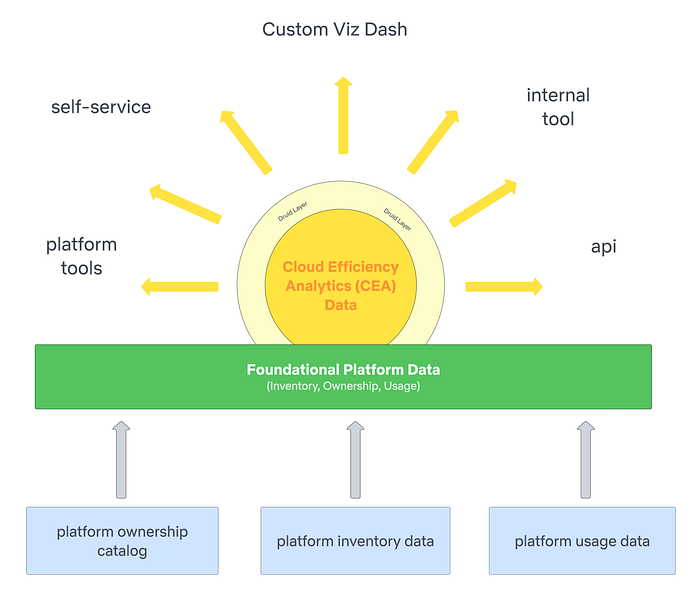
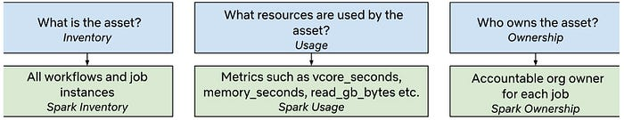
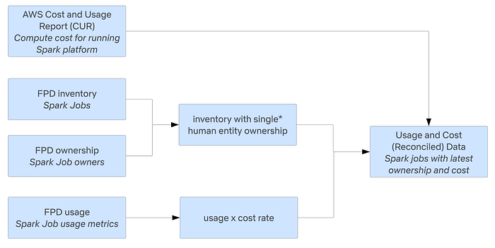

# Cloud Efficiency at Netflix

**By** [J Han](https://www.linkedin.com/in/jhan-104105?utm_source=share&utm_campaign=share_via&utm_content=profile), [Pallavi Phadnis](https://www.linkedin.com/in/pallavi-phadnis-75280b20/)

## Context

**At Netflix, we use Amazon Web Services (AWS) for our cloud infrastructure needs, such as compute, storage, and networking to build and run the streaming platform that we love.** Our ecosystem enables engineering teams to run applications and services at scale, utilizing a mix of open-source and proprietary solutions. In turn, our self-serve platforms allow teams to create and deploy, sometimes custom, workloads more efficiently. This diverse technological landscape generates extensive and rich data from various infrastructure entities, from which, data engineers and analysts collaborate to provide actionable insights to the engineering organization in a continuous feedback loop that ultimately enhances the business.

One crucial way in which we do this is through the democratization of highly curated data sources that sunshine usage and cost patterns across Netflix’s services and teams. The Data & Insights organization partners closely with our engineering teams to share key efficiency metrics, empowering internal stakeholders to make informed business decisions.

## Data is Key

This is where our team, Platform DSE (Data Science Engineering), comes in to enable our engineering partners to understand what resources they’re using, how effectively and efficiently they use those resources, and the cost associated with their resource usage. We want our downstream consumers to make cost conscious decisions using our datasets.

To address these numerous analytic needs in a scalable way, we’ve developed a two-component solution:

1. Foundational Platform Data (FPD): This component provides a centralized data layer for all platform data, featuring a consistent data model and standardized data processing methodology.
2. Cloud Efficiency Analytics (CEA): Built on top of FPD, this component offers an analytics data layer that provides time series efficiency metrics across various business use cases.

**Foundational Platform Data (FPD)**

We work with different platform data providers to get _inventory_, _ownership_, and _usage_ data for the respective platforms they own. Below is an example of how this framework applies to the [Spark](https://spark.apache.org/) platform. FPD establishes_ data contracts_ with producers to ensure data quality and reliability; these contracts allow the team to leverage a common data model for ownership. The standardized data model and processing promotes scalability and consistency.

**Cloud Efficiency Analytics (CEA Data)**

Once the foundational data is ready, CEA consumes inventory, ownership, and usage data and applies the appropriate _business logic_ to produce _cost_ and _ownership attribution_ at various granularities. The data model approach in CEA is to compartmentalize and be _transparent_; we want downstream consumers to understand why they’re seeing resources show up under their name/org and how those costs are calculated. Another benefit to this approach is the ability to pivot quickly as new or changes in business logic is/are introduced.

* For cost accounting purposes, we resolve assets to a single owner, or distribute costs when assets are multi-tenant. However, we do also provide usage and cost at different aggregations for different consumers.

## Data Principles

As the source of truth for efficiency metrics, our team’s tenants are to provide accurate, reliable, and accessible data, comprehensive documentation to navigate the complexity of the efficiency space, and well-defined Service Level Agreements (SLAs) to set expectations with downstream consumers during delays, outages or changes.

While ownership and cost may seem straightforward, the complexity of the datasets is considerably high due to the breadth and scope of the business infrastructure and platform specific features. Services can have multiple owners, cost heuristics are unique to each platform, and the scale of infra data is large. As we work on expanding infrastructure coverage to all verticals of the business, we face a unique set of challenges:

**A Few Sizes to Fit the Majority**

Despite data contracts and a standardized data model on transforming upstream platform data into FPD and CEA, there is usually some degree of customization that is unique to that particular platform. As the centralized source of truth, we feel the constant tension of where to place the processing burden. Decision-making involves ongoing transparent conversations with both our data producers and consumers, frequent prioritization checks, and alignment with business needs as [informed captains](https://jobs.netflix.com/culture) in this space.

**Data Guarantees**

For data correctness and trust, it’s crucial that we have audits and visibility into health metrics at each layer in the pipeline in order to investigate issues and root cause anomalies quickly. Maintaining data completeness while ensuring correctness becomes challenging due to upstream latency and required transformations to have the data ready for consumption. We continuously iterate our audits and incorporate feedback to refine and meet our SLAs.

**Abstraction Layers**

**We value ****[people over process](https://jobs.netflix.com/culture)**, and it is not uncommon for engineering teams to build custom SaaS solutions for other parts of the organization. Although this fosters innovation and improves development velocity, it can create a bit of a conundrum when it comes to understanding and interpreting usage patterns and attributing cost in a way that makes sense to the business and end consumer. With clear inventory, ownership, and usage data from FPD, and precise attribution in the analytical layer, we aim to provide metrics to downstream users regardless of whether they utilize and build on top of internal platforms or on AWS resources directly.

## Future Forward

Looking ahead, we aim to continue onboarding platforms to FPD and CEA, striving for nearly complete cost insight coverage in the upcoming year. Longer term, we plan to extend FPD to other areas of the business such as security and availability. We aim to move towards proactive approaches via predictive analytics and ML for optimizing usage and detecting anomalies in cost.

Ultimately, our goal is to enable our engineering organization to make efficiency-conscious decisions when building and maintaining the myriad of services that allow us to enjoy Netflix as a streaming service.

## Acknowledgments

The FPD and CEA work would not have been possible without the cross functional input of many outstanding colleagues and our dedicated team building these important data assets.

—

A bit about the authors:

_JHan enjoys nature, reading fantasy, and finding the best chocolate chip cookies and cinnamon rolls. She is adamant about writing the SQL select statement with leading commas._

_Pallavi enjoys music, travel and watching astrophysics documentaries. With 15+ years working with data, she knows everything’s better with a dash of analytics and a cup of coffee!_

---
**Tags:** Cloud Efficiency · Data Modeling · Cost · Infrastructure · Engineering
