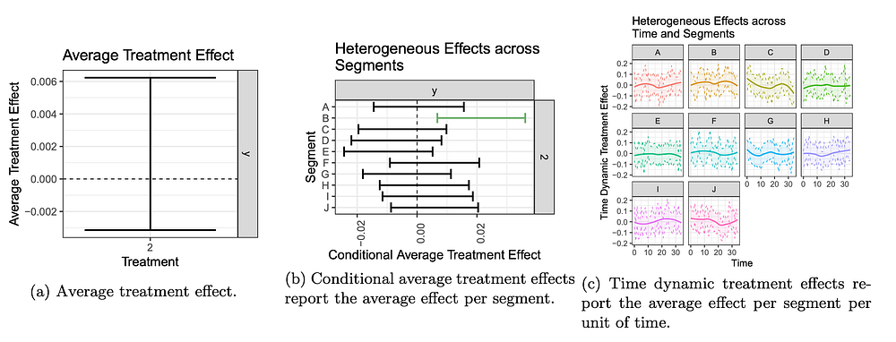

# Computational Causal Inference at Netflix

[_Jeffrey Wong_](https://www.linkedin.com/in/jeffctwong/)_, _[_Colin McFarland_](https://www.linkedin.com/in/mcfrl/)

Every Netflix data scientist, whether their background is from biology, psychology, physics, economics, math, statistics, or biostatistics, has made meaningful contributions to the way Netflix analyzes causal effects. Scientists from these fields have made many advancements in causal effects research in the past few decades, spanning instrumental variables, forest methods, heterogeneous effects, time-dynamic effects, quantile effects, and much more. These methods can provide rich information for decision making, such as in experimentation platforms (“XP”) or in algorithmic policy engines.

We want to amplify the effectiveness of our researchers by providing them software that can estimate causal effects models efficiently, and can integrate causal effects into large engineering systems. This can be challenging when algorithms for causal effects need to fit a model, condition on context and possible actions to take, score the response variable, and compute differences between counterfactuals. Computation can explode and become overwhelming when this is done with large datasets, with high dimensional features, with many possible actions to choose from, and with many responses. In order to gain broad software integration of causal effects models, a significant investment in software engineering, especially in computation, is needed. To address the challenges, Netflix has been building an interdisciplinary field across causal inference, algorithm design, and numerical computing, which we now want to share with the rest of the industry as **computational causal inference** (CompCI). A whitepaper detailing the field can be found [here](https://arxiv.org/abs/2007.10979).

Computational causal inference brings a software implementation focus to causal inference, especially in regards to high performance numerical computing. We are implementing several algorithms to be highly performant, with a low memory footprint. As an example, our XP is pivoting away from two sample t-tests to models that estimate average effects, heterogeneous effects, and time-dynamic treatment effects. **These effects help the business understand the user base, different segments in the user base, and whether there are trends in segments over time.** We also take advantage of user covariates throughout these models in order to increase statistical power. While this rich analysis helps to inform business strategy and increase member joy, the volume of the data demands large amounts of memory, and the estimation of the causal effects on such volume of data is computationally heavy.

In the past, the computations for covariate adjusted heterogeneous effects and time-dynamic effects were slow, memory heavy, hard to debug, a large source of engineering risk, and ultimately could not scale to many large experiments. Using optimizations from CompCI, we can estimate hundreds of conditional average effects and their variances on a dataset with 10 million observations in 10 seconds, on a single machine. In the extreme, we can also analyze conditional time dynamic treatment effects for hundreds of millions of observations on a single machine in less than one hour. To achieve this, we leverage a software stack that is completely optimized for sparse linear algebra, a lossless data compression strategy that can reduce data volume, and mathematical formulas that are optimized specifically for estimating causal effects. We also optimize for memory and data alignment.

This level of computing affords us a lot of luxury. First, the ability to scale complex models means we can deliver rich insights for the business. Second, being able to analyze large datasets for causal effects in seconds increases research agility. Third, analyzing data on a single machine makes debugging easy. Finally, the scalability makes computation for large engineering systems tractable, reducing engineering risk.

Computational causal inference is a new, interdisciplinary field we are announcing because we want to build it collectively with the broader community of experimenters, researchers, and software engineers. The integration of causal inference into engineering systems can lead to large amounts of new innovation. Being an interdisciplinary field, it truly requires the community of local, domain experts to unite. We have released a [whitepaper](https://arxiv.org/abs/2007.10979) to begin the discussion. There, we describe the rising demand for scalable causal inference in research and in software engineering systems. Then, we describe the state of common causal effects models. Afterwards, we describe what we believe can be a good software framework for estimating and optimizing for causal effects.

Finally, we close the CompCI whitepaper with a series of open challenges that we believe require an interdisciplinary collaboration, and can unite the community around. For example:

1. Time dynamic treatment effects are notoriously hard to scale. They require a panel of repeated observations, which generate large datasets. They also contain autocorrelation, creating complications for estimating the variance of the causal effect. How can we make the computation for the time-dynamic treatment effect, and its distribution, more scalable?
2. In machine learning, specifying a loss function and optimizing it using numerical methods allows a developer to interact with a single, umbrella framework that can span several models. Can such an umbrella framework exist to specify different causal effects models in a unified way? For example, could it be done through the generalized method of moments? Can it be computationally tractable?
3. How should we develop software that understands if a causal parameter is identified? A solution to this helps to create software that is safe to use, and can provide safe, programmatic access to the analysis of causal effects. We believe there are many edge cases in identification that require an interdisciplinary group to solve.

We hope this begins the discussion, and over the coming months we will be sharing more on the research we have done to make estimation of causal effects performant. There are still many more challenges in the field that are not listed here. We want to form a community spanning experimenters, researchers, and software engineers to learn about problems and solutions together. If you are interested in being part of this community, please reach us at compci-public@netflix.com.

---
**Tags:** Causal Inference · Experimentation · Machine Learning · Algorithms
