# Consistent caching mechanism in Titus Gateway

_by _[_Tomasz Bak_](https://twitter.com/tomaszbak_ca)_ and _[_Fabio Kung_](https://twitter.com/fabiokung)

## Introduction

Titus is the Netflix cloud container runtime that runs and manages containers at scale. In the time since it was [first presented](https://netflixtechblog.com/titus-the-netflix-container-management-platform-is-now-open-source-f868c9fb5436) as an advanced Mesos framework, Titus has transparently evolved from being built on top of Mesos to Kubernetes, handling an ever-increasing volume of containers. As the number of Titus users increased over the years, the load and pressure on the system increased substantially. The original assumptions and architectural choices were no longer viable. This blog post presents how our current iteration of Titus deals with high API call volumes by scaling out horizontally.

We introduce a caching mechanism in the API gateway layer, allowing us to offload processing from singleton leader elected controllers without giving up strict data consistency and guarantees clients observe. Titus API clients always see the latest (not stale) version of the data regardless of which gateway node serves their request, and in which order.

## Overview

The figure below depicts a simplified high-level architecture of a single Titus cluster (a.k.a cell):

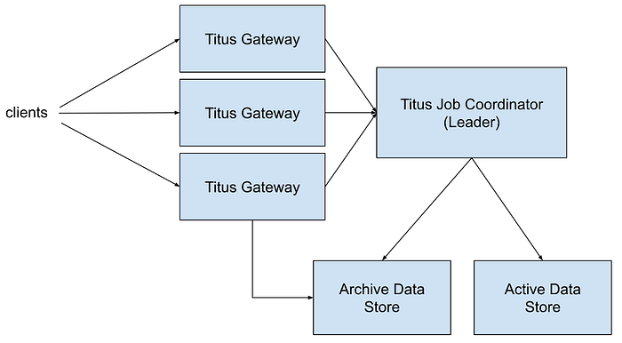

**Titus Job Coordinator** is a leader elected process managing the active state of the system. Active data includes jobs and tasks that are currently running. When a new leader is elected it loads all data from external storage. Mutations are first persisted to the active data store before in-memory state is changed. Data for completed jobs and tasks is moved to the archive store first, and only then removed from the active data store and from the leader memory.

**Titus Gateway** handles user requests. A user request could be a job creation request, a query to the active data store, or a query to the archive store (the latter handled directly in Titus Gateway). Requests are load balanced across all Titus Gateway nodes. All reads are consistent, so it does not matter which Titus Gateway instance is serving a query. For example, it is OK to send writes through one instance, and do reads from another one with full data read consistency guarantees. Titus Gateways always connect to the current Titus Job Coordinator leader. **During leader failovers, all writes and reads of the active data are rejected until a connection to the active leader is re-established.**

In the original version of the system, all queries to the active data set were forwarded to a singleton Titus Job Coordinator. The freshest data is served to all requests, and clients never observe [read-your-write or monotonic-read](https://en.wikipedia.org/wiki/Consistency_model#Session_guarantees) consistency issues¹:

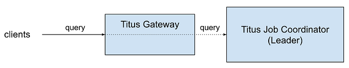

Data consistency on the Titus API is highly desirable as it simplifies client implementation. Causal consistency, which includes read-your-writes and monotonic-reads, frees clients from implementing client-side synchronization mechanisms. In [PACELC](http://www.cs.umd.edu/~abadi/papers/abadi-pacelc.pdf) terms we choose PC/EC and have the same level of availability for writes of our previous system while improving our theoretical availability for reads.

For example, a batch workflow orchestration system may create multiple jobs which are part of a single workflow execution. After the jobs are created, it monitors their execution progress. If the system creates a new job, followed immediately by a query to get its status, and there is a data propagation lag, it might decide that the job was lost and a replacement must be created. In that scenario, the system would need to deal with the data propagation latency directly, for example, by use of timeouts or client-originated update tracking mechanisms. As Titus API reads are always consistently reflecting the up-to-date state, such workarounds are not needed.

With traffic growth, a single leader node handling all request volume started becoming overloaded. We started seeing increased response latencies and leader servers running at dangerously high utilization. To mitigate this issue we decided to handle all query requests directly from Titus Gateway nodes but still preserve the original consistency guarantees:

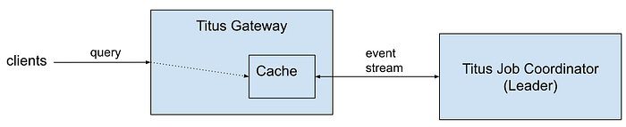

The state from Titus Job Coordinator is replicated over a persistent stream connection, with low event propagation latencies. A new wire protocol provided by Titus Job Coordinator allows monitoring of the cache consistency level and guarantees that clients always receive the latest data version. The cache is kept in sync with the current leader process. When there is a failover (because of node failures with the current leader or a system upgrade), a new snapshot from the freshly elected leader is loaded, replacing the previous cache state. Titus Gateways handling client requests can now be horizontally scaled out. The details and workings of these mechanisms are the primary topics of this blog post.

## How do I know that my cache is up to date?

It is an easy answer for systems that were built from the beginning with a consistent data versioning scheme and can depend on clients to follow the established protocol. Kubernetes is a good example here. Each object and each collection read from the Kubernetes cluster has a unique revision which is a monotonically increasing number. A user may request all changes since the last received revision. For more details, see [Kubernetes API Concepts](https://kubernetes.io/docs/reference/using-api/api-concepts/#resource-versions) and the [Shared Informer Pattern](https://github.com/kubernetes/client-go/blob/54928eef9f824667b23a938188498992d437156a/tools/cache/shared_informer.go#L35-L133).

In our case, we did not want to change the API contract and impose additional constraints and requirements on our users. Doing so would require a substantial migration effort to move all clients off the old API with questionable value to the affected teams (except for helping us solve Titus' internal scalability problems). In our experience, such migrations require a nontrivial amount of work, particularly with the migration timeline not fully in our control.

To fulfill the existing API contract, we had to guarantee that for a request received at a time T₀, the data returned to the client is read from a cache that contains all state updates in Titus Job Coordinator up to time T₀.

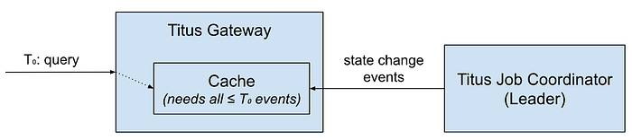

The path over which data travels from Titus Job Coordinator to a Titus Gateway cache can be described as a sequence of event queues with different processing speeds:

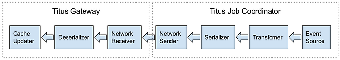

A message generated by the event source may be buffered at any stage. Furthermore, as each event stream subscription from Titus Gateway to Titus Job Coordinator establishes a different instance of the processing pipeline, the state of the cache in each gateway instance may be vastly different.

Let’s assume a sequence of events E₁…E₁₀, and their location within the pipeline of two Titus Gateway instances at time T₁:

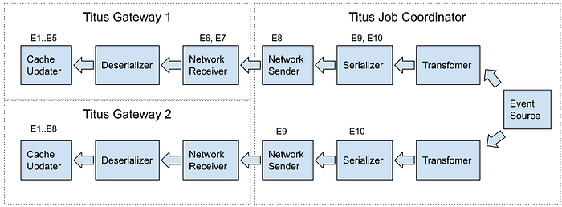

If a client makes a call to Titus Gateway 2 at the time T₁, it will read version E₈ of the data. If it immediately makes a request to Titus Gateway 1, the cache there is behind with respect to the other gateway so the client might read an older version of the data.

In both cases, data is not up to date in the caches. If a client created a new object at time T₀, and the object value is captured by an event update E₁₀, this object will be missing in both gateways at time T₁. A surprise to the client who successfully completed a create request, but the follow-up query returned a not-found error ([read-your-write](https://jepsen.io/consistency/models/read-your-writes) consistency violation).

The solution is to flush all the events created up to time T₁ and force clients to wait for the cache to receive them all. This work can be split into two different steps each with its own unique solution.

## Implementation details

We solved the cache synchronization problem (as stated above) with a combination of two strategies:

- Titus Gateway <-> Titus Job Coordinator synchronization protocol over the wire.
- Usage of high-resolution monotonic time sources like Java’s nano time within a single server process. Java’s nano time is used as a logical time within a JVM to define an order for events happening in the JVM process. An alternative solution based on an atomic integer values generator to order the events would suffice as well. Having the local logical time source avoids issues with [distributed clock synchronization](https://en.wikipedia.org/wiki/Logical_clock).

If Titus Gateways subscribed to the Titus Job Coordinator event stream without synchronization steps, the amount of data staleness would be impossible to estimate. To guarantee that a Titus Gateway received all state updates that happened until some time Tₙ an explicit synchronization between the two services must happen. Here is what the protocol we implemented looks like:

1. Titus Gateway receives a client request (queryₐ).
2. Titus Gateway makes a request to the local cache to fetch the latest version of the data.
3. The local cache in Titus Gateway records the local logical time and sends it to Titus Job Coordinator in a keep-alive message (_keep-aliveₐ_).
4. Titus Job Coordinator saves the keep-alive request together with the local logical time Tₐ of the request arrival in a local queue (_KAₐ, Tₐ_).
5. Titus Job Coordinator sends state updates to Titus Gateway until the former observes a state update (event) with a timestamp past the recorded local logical time (_E1, E2_).
6. At that time, Titus Job Coordinator sends an acknowledgment event for the keep-alive message (_KAₐ keep-alive ACK_).
7. Titus Gateway receives the keep-alive acknowledgment and consequently knows that its local cache contains all state changes that happened up to the time when the keep-alive request was sent.
8. At this point the original client request can be handled from the local cache, guaranteeing that the client will get a fresh enough version of the data (_responseₐ_).

This process is illustrated by the figure below:

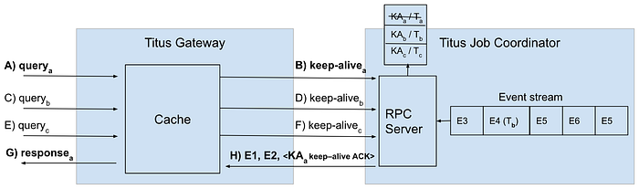

The procedure above explains how to synchronize a Titus Gateway cache with the source of truth in Titus Job Coordinator, but it does not address how the internal queues in Titus Job Coordinator are drained to the point where all relevant messages are processed. The solution here is to add a logical timestamp to each event and guarantee a minimum time interval between messages emitted inside the event stream. If not enough events are created because of data updates, a dummy message is generated and inserted into the stream. Dummy messages guarantee that each keep-alive request is acknowledged within a bounded time, and does not wait indefinitely until some change in the system happens. For example:

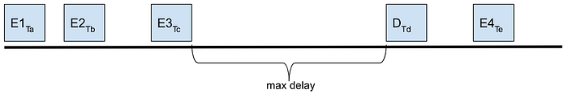

_Ta_, _Tb_, _Tc_, _Td_, and _Te_ are high-resolution monotonic logical timestamps. At time _Td_ a dummy message is inserted, so the interval between two consecutive events in the event stream is always below a configurable threshold. These timestamp values are compared with keep-alive request arrival timestamps to know when a keep-alive acknowledgment can be sent.

There are a few optimization techniques that can be used. Here are those implemented in Titus:

- Before sending a keep-alive request for each new client request, wait a fixed interval and send a single keep-alive request for all requests that arrived during that time. So the maximum rate of keep-alive requests is constrained by 1 / max_interval. For example, if max_interval is set to 5ms, the max keep alive request rate is 200 req / sec.
- Collapse multiple keep-alive requests in Titus Job Coordinator, sending a response to the latest one which has the arrival timestamp less than that of the timestamp of the last event sent over the network. On the Titus Gateway side, a keep-alive response with a given timestamp acknowledges all pending requests with keep-alive timestamps earlier or equal to the received one.
- Do not wait for cache synchronization on requests that do not have ordering requirements, serving data from the local cache on each Titus Gateway. Clients that can tolerate eventual consistency can opt into this new API for lower response times and increased availability.

Given the mechanism described so far, let’s try to estimate the maximum wait time of a client request that arrived at Titus Gateway for different scenarios. Let’s assume that the maximum keep alive interval is 5ms, and the maximum interval between events emitted in Titus Job Coordinator is 2ms.

Assuming that the system runs idle (no changes made to the data), and the client request arrives at a time when a new keep-alive request wait time starts, the cache update latency is equal to 7 milliseconds + network propagation delay + processing time. If we ignore the processing time and assume that the network propagation delay is <1ms given we have to only send back a small keep-alive response, we should expect an 8ms delay in the typical case. If the client request does not have to wait for the keep-alive to be sent, and the keep-alive request is acknowledged immediately in Titus Job Coordinator, the delay is equal to network propagation delay + processing time, which we estimated to be <1ms. The average delay introduced by cache synchronization **is around 4ms**.

Network propagation delays and stream processing times start to become a more important factor as the number of state change events and client requests increases. However, Titus Job Coordinator can now dedicate its capacity for serving high bandwidth streams to a finite number of Titus Gateways, relying on the gateway instances to serve client requests, instead of serving payloads to all client requests itself. Titus Gateways can then be scaled out to match client request volumes.

We ran empirical tests for scenarios of low and high request volumes, and the results are presented in the next section.

## Performance test results

To show how the system performs with and without the caching mechanism, we ran two tests:

- A test with a low/moderate load showing a median latency increase due to overhead from the cache synchronization mechanism, but better 99th percentile latencies.
- A test with load close to the peak of Titus Job Coordinator capacity, above which the original system collapses. Previous results hold, showing better scalability with the caching solution.

A single request in the tests below consists of one query. The query is of a moderate size, which is a collection of 100 records, with a serialized response size of ~256KB. The total payload (request size times the number of concurrently running requests) requires a network bandwidth of ~2Gbps in the first test and ~8Gbps in the second one.

**Moderate load level**

This test shows the impact of cache synchronization on query latency in a moderately loaded system. The query rate in this test is set to 1K requests/second.

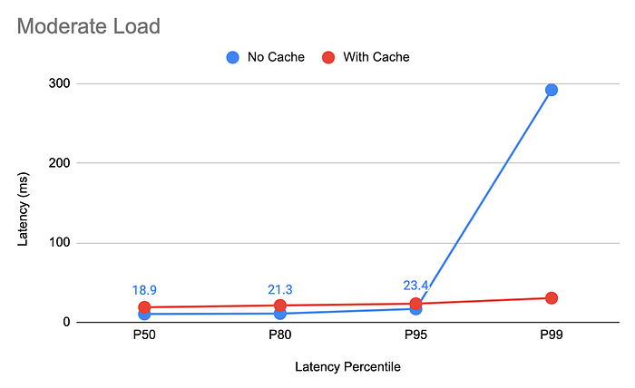

Median latency without caching is half of what we observe with the introduction of the caching mechanism, due to the added synchronization delays. In exchange, the worst-case 99th percentile latencies are 90% lower, dropping from 292 milliseconds without a cache to 30 milliseconds with the cache.

**Load level close to Titus Job Coordinator maximum**

If Titus Job Coordinator has to handle all query requests (when the cache is not enabled), it handles the traffic well up to 4K test queries / second, and breaks down (sharp latency increase and a rapid drop of throughput) at around 4.5K queries/sec. The maximum load test is thus kept at 4K queries/second.

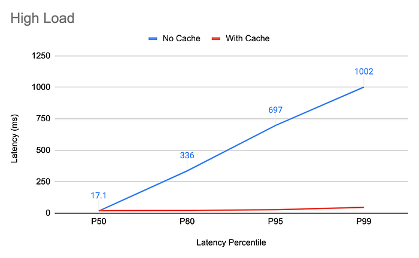

Without caching enabled the 99th percentile hovers around 1000ms, and the 80th percentile is around 336ms, compared with the cache-enabled 99th percentile at 46ms and 80th percentile at 22ms. The median still looks better on the setup with no cache at 17ms vs 19ms when the cache is enabled. It should be noted however that the system with caching enabled scales out linearly to more request load while keeping the same latency percentiles, while the no-cache setup collapses with a mere ~15% additional load increase.

Doubling the load when the caching is enabled does not increase the latencies at all. Here are latency percentiles when running 8K query requests/second:

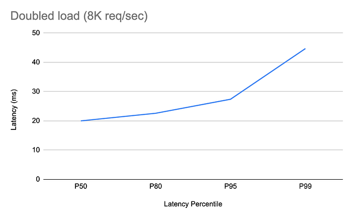

## Conclusion

After reaching the limit of vertical scaling of our previous system, we were pleased to implement a real solution that provides (in a practical sense) unlimited scalability of Titus read-only API. We were able to achieve better tail latencies with a minor sacrifice in median latencies when traffic is low, and gained the ability to horizontally scale out our API gateway processing layer to handle growth in traffic without changes to API clients. The upgrade process was completely transparent, and no single client observed any abnormalities or changes in API behavior during and after the migration.

The mechanism described here can be applied to any system relying on a singleton leader elected component as the source of truth for managed data, where the data fits in memory and latency is low.

As for prior art, there is ample coverage of cache coherence protocols in the literature, both in the context of multiprocessor architectures ([Adve & Gharachorloo, 1996](https://ieeexplore.ieee.org/abstract/document/546611)) and distributed systems ([Gwertzman & Seltzer, 1996](https://www.usenix.org/publications/library/proceedings/sd96/full_papers/seltzer.ps)). Our work fits within mechanisms of client polling and invalidation protocols explored by Gwertzman and Seltzer (1996) in their survey paper. Central timestamping to facilitate linearizability in read replicas is similar to the [Calvin](https://cs.yale.edu/homes/thomson/publications/calvin-sigmod12.pdf) system (example real-world implementations in systems like [FoundationDB](https://www.foundationdb.org/files/fdb-paper.pdf)) as well as the replica watermarking in AWS [Aurora](https://web.stanford.edu/class/cs245/readings/aurora.pdf).

---

¹ [Designing Data-Intensive Applications](https://dataintensive.net/) is an excellent book that goes into detail about consistency models discussed in this blog post.

² Adve, S. V., & Gharachorloo, K. (1996). Shared memory consistency models: A tutorial. computer, 29(12), 66–76.

³ Gwertzman, J., & Seltzer, M. I. (1996, January). World Wide Web Cache Consistency. In USENIX annual technical conference (Vol. 141, p. 152).

---
**Tags:** Titus · Distributed Systems · Software Engineering · Distributed Cache · Container Orchestration
