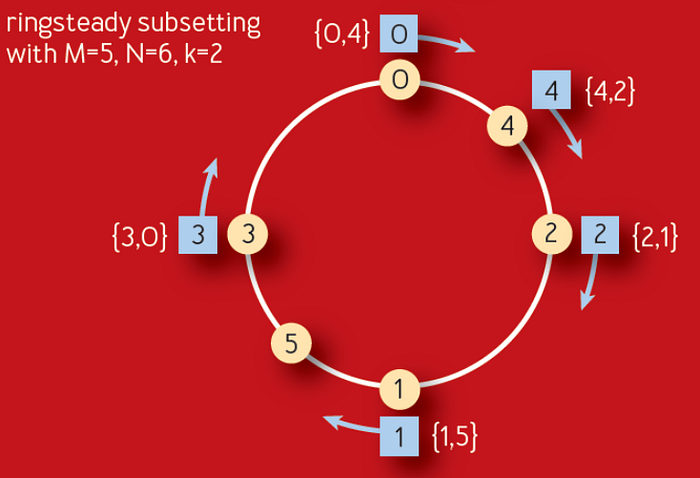
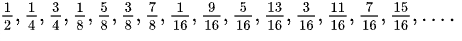
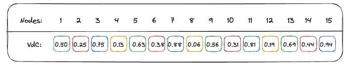
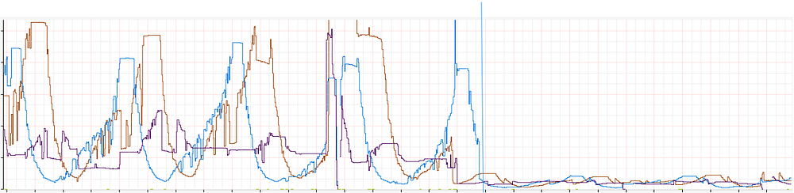
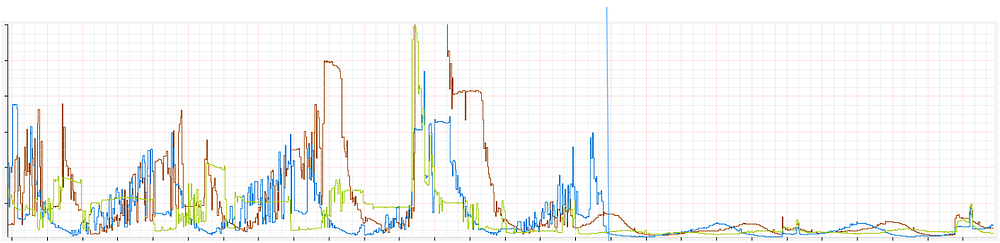
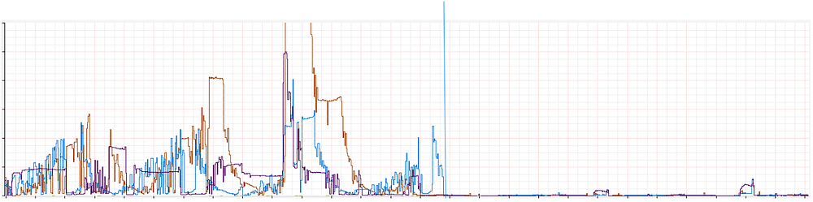
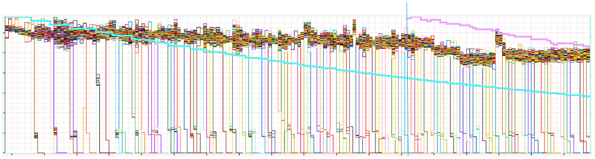
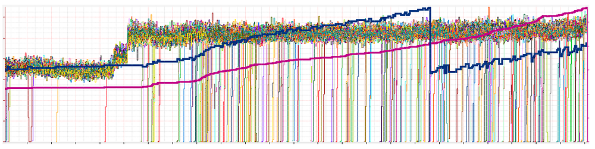

# Curbing Connection Churn in Zuul

_By _[_Arthur Gonigberg_](https://twitter.com/agonigberg), [_Argha C_](https://www.linkedin.com/in/argha-c)

## Plaintext Past

When [Zuul](https://github.com/Netflix/zuul) was [designed and developed](https://netflixtechblog.com/zuul-2-the-netflix-journey-to-asynchronous-non-blocking-systems-45947377fb5c), there was an inherent assumption that connections were effectively free, given we weren’t using mutual TLS (mTLS). It’s built on top of [Netty](https://netty.io/), using event loops for non-blocking execution of requests, one loop per core. To reduce contention among event loops, we created connection pools for each, keeping them completely independent. The result is that the entire request-response cycle happens on the same thread, significantly reducing context switching.

There is also a significant downside. It means that if each event loop has a connection pool that connects to every origin (our name for backend) server, there would be a multiplication of event loops by servers by Zuul instances. For example, a 16-core box connecting to an 800-server origin would have 12,800 connections. If the Zuul cluster has 100 instances, that’s 1,280,000 connections. That’s a significant amount and certainly more than is necessary relative to the traffic on most clusters.

As streaming has grown over the years, these numbers multiplied with bigger Zuul and origin clusters. More acutely, if a traffic spike occurs and Zuul instances scale up, it exponentially increases connections open to origins. Although this has been a known issue for a long time, it has never been a critical pain point until we moved large streaming applications to mTLS and our Envoy-based service mesh.

## Fixing the Flows

The first step in improving connection overhead was implementing HTTP/2 (H2) multiplexing to the origins. Multiplexing allows the reuse of existing connections by creating multiple streams per connection, each able to send a request. Rather than requiring a connection for every request, we could reuse the same connection for many simultaneous requests. The more we reuse connections, the less overhead we have in establishing mTLS sessions with roundtrips, handshaking, and so on.

Although Zuul has had H2 proxying for some time, it never supported multiplexing. It effectively treated H2 connections as HTTP/1 (H1). For backward compatibility with existing H1 functionality, we modified the H2 connection bootstrap to create a stream and immediately release the connection back into the pool. Future requests will then be able to reuse the existing connection without creating a new one. Ideally, the connections to each origin server should converge towards 1 per event loop. It seems like a minor change, but it had to be seamlessly integrated into our existing metrics and connection bookkeeping.

The standard way to initiate H2 connections is, over TLS, via an upgrade with [ALPN (Application-Layer Protocol Negotiation](https://en.wikipedia.org/wiki/Application-Layer_Protocol_Negotiation)). ALPN allows us to gracefully downgrade back to H1 if the origin doesn’t support H2, so we can broadly enable it without impacting customers. Service mesh being available on many services made testing and rolling out this feature very easy because it enables ALPN by default. It meant that no work was required by service owners who were already on service mesh and mTLS.

Sadly, our plan hit a snag when we rolled out multiplexing. Although the feature was stable and functionally there was no impact, we didn’t get a reduction in overall connections. Because some origin clusters were so large, and we were connecting to them from all event loops, there wasn’t enough re-use of existing connections to trigger multiplexing. Even though we were now capable of multiplexing, we weren’t utilizing it.

## Divide and Conquer

H2 multiplexing will improve connection spikes under load when there is a large demand for all the existing connections, but it didn’t help in steady-state. Partitioning the whole origin into subsets would allow us to reduce total connection counts while leveraging multiplexing to maintain existing throughput and headroom.

We had discussed subsetting many times over the years, but there was concern about disrupting load balancing with the algorithms available. An even distribution of traffic to origins is critical for accurate [canary analysis](https://netflixtechblog.com/chap-chaos-automation-platform-53e6d528371f) and preventing hot-spotting of traffic on origin instances.

Subsetting was also top of mind after reading a [recent ACM paper](https://queue.acm.org/detail.cfm?id=3570937) published by Google. It describes an improvement on their long-standing [Deterministic Subsetting](https://sre.google/sre-book/load-balancing-datacenter/) algorithm that they’ve used for many years. The Ringsteady algorithm (figure below) creates an evenly distributed ring of servers (yellow nodes) and then walks the ring to allocate them to each front-end task (blue nodes).

*The figure above is from Google’s ACM paper*

The algorithm relies on the idea of [low-discrepancy numeric sequences](https://en.wikipedia.org/wiki/Low-discrepancy_sequence) to create a naturally balanced distribution ring that is more consistent than one built on a randomness-based consistent hash. The particular sequence used is a binary variant of the [Van der Corput sequence](https://en.wikipedia.org/wiki/Van_der_Corput_sequence). As long as the sequence of added servers is monotonically incrementing, for each additional server, the distribution will be evenly balanced between 0–1. Below is an example of what the binary Van der Corput sequence looks like.

Another big benefit of this distribution is that it provides a consistent expansion of the ring as servers are removed and added over time, evenly spreading new nodes among the subsets. This results in the stability of subsets and no cascading churn based on origin changes over time. Each node added or removed will only affect one subset, and new nodes will be added to a different subset every time.

Here’s a more concrete demonstration of the sequence above, in decimal form, with each number between 0–1 assigned to 4 subsets. In this example, each subset has 0.25 of that range depicted with its own color.

You can see that each new node added is balanced across subsets extremely well. If 50 nodes are added quickly, they will get distributed just as evenly. Similarly, if a large number of nodes are removed, it will affect all subsets equally.

The real killer feature, though, is that if a node is removed or added, it doesn’t require all the subsets to be shuffled and recomputed. Every single change will generally only create or remove one connection. This will hold for bigger changes, too, reducing almost all churn in the subsets.

## Zuul’s Take

Our approach to implement this in Zuul was to integrate with [Eureka](https://github.com/Netflix/eureka) service discovery changes and feed them into a distribution ring, based on the ideas discussed above. When new origins register in Zuul, we load their instances and create a new ring, and from then on, manage it with incremental deltas. We also take the additional step of shuffling the order of nodes before adding them to the ring. This helps prevent accidental hot spotting or overlap among Zuul instances.

The quirk in any load balancing algorithm from Google is that they do their [load balancing centrally](https://sre.google/workbook/managing-load/#gslb). Their centralized service creates subsets and load balances across their entire fleet, with a global view of the world. To use this algorithm, **the key insight was to apply it to the event loops rather than the instances themselves**. This allows us to continue having decentralized, client-side load balancing while also having the benefits of accurate subsetting. Although Zuul continues connecting to all origin servers, each event loop’s connection pool only gets a small subset of the whole. We end up with a singular, global view of the distribution that we can control on each instance — and a single sequence number that we can increment for each origin’s ring.

When a request comes in, Netty assigns it to an event loop, and it remains there for the duration of the request-response lifecycle. After running the inbound filters, we determine the destination and load the connection pool for this event loop. This will pull from a mapping of loop-to-subset, giving us the limited set of nodes we’re looking for. We then load balance using a modified choice-of-2, as [discussed before](https://netflixtechblog.com/netflix-edge-load-balancing-695308b5548c). If this sounds familiar, it’s because there are no fundamental changes to how Zuul works. The only difference is that we provide a loop-bound subset of nodes to the load balancer as a starting point for its decision.

Another insight we had was that we needed to replicate the number of subsets among the event loops. This allows us to maintain low connection counts for large and small origins. At the same time, having a reasonable subset size ensures we can continue providing good balance and resiliency features for the origin. Most origins require this because they are not big enough to create enough instances in each subset.

However, we also don’t want to change this replication factor too often because it would cause a reshuffling of the entire ring and introduce a lot of churn. After a lot of iteration, we ended up implementing this by starting with an “ideal” subset size. We achieve this by computing the subset size that would achieve the ideal replication factor for a given cardinality of origin nodes. We can scale the replication factor across origins by growing our subsets until the desired subset size is achieved, especially as they scale up or down based on traffic patterns. Finally, we work backward to divide the ring into even slices based on the computed subset size.

Our ideal subset side is roughly 25–50 nodes, so an origin with 400 nodes will have 8 subsets of 50 nodes. On a 32-core instance, we’ll have a replication factor of 4. However, that also means that between 200 and 400 nodes, we’re not shuffling the subsets at all. An example of this subset recomputation is in the rollout graphs [below](https://medium.com/p/2feb273a3598#5e4d).

An interesting challenge here was to satisfy the dual constraints of origin nodes with a range of cardinality, and the number of event loops that hold the subsets. Our goal is to scale the subsets as we run on instances with higher event loops, with a sub-linear increase in overall connections, and sufficient replication for availability guarantees. Scaling the replication factor elastically described above helped us achieve this successfully.

## Subsetting Success

The results were outstanding. We saw improvements across all key metrics on Zuul, but most importantly, there was a significant reduction in total connection counts and churn.

### Total Connections

This graph (as well as the ones below) shows a week’s worth of data, with the typical diurnal cycle of Netflix usage. Each of the 3 colors represents our deployment regions in AWS, and the blue vertical line shows when we turned on the feature.

**Total connections at peak were significantly reduced in all 3 regions by a factor of 10x**. This is a huge improvement, and it makes sense if you dig into how subsetting works. For example, a machine running 16 event loops could have 8 subsets — each subset is on 2 event loops. That means we’re dividing an origin by 8, hence an 8x improvement. As to why peak improvement goes up to 10x, it’s probably related to reduced churn (below).

### Churn

This graph is a good proxy for churn. It shows how many TCP connections Zuul is opening per second. You can see the before and after very clearly. Looking at the peak-to-peak improvement, there is roughly an 8x improvement.

The decrease in churn is a testament to the stability of the subsets, even as origins scale up, down, and redeploy over time.

Looking specifically at connections created in the pool, the reduction is even more impressive:

The peak-to-peak reduction is massive and clearly shows how stable this distribution is. Although hard to see on the graph, the reduction went from thousands per second at peak down to about 60. There** **is** effectively no churn of connections, even at peak traffic**.

### Load Balancing

The key constraint to subsetting is ensuring that the load balance on the backends is still consistent and evenly distributed. You’ll notice all the RPS on origin nodes grouped tightly, as expected. The thicker lines represent the subset size and the total origin size.

*Balance at deploy*

*Balance 12 hours after deploy*

In the second graph, you’ll note that we recompute the subset size (blue line) because the origin (purple line) became large enough that we could get away with less replication in the subsets. In this case, we went from a subset size of 100 for 400 servers (a division of 4) to 50 (a division of 8).

### System Metrics

Given the significant reduction in connections, we saw reduced CPU utilization (~4%), heap usage (~15%), and latency (~3%) on Zuul, as well.

*Zuul canary metrics*

## Rolling it Out

As we rolled this feature out to our largest origins — streaming playback APIs — we saw the pattern above continue, but with scale, it became more impressive. On some Zuul shards, we saw a reduction of as much as 13 million connections at peak, with almost no churn.

Today the feature is rolled out widely. We’re serving the same amount of traffic but with tens of millions fewer connections. Despite the reduction of connections, there is no decrease in resiliency or load balancing. H2 multiplexing allows us to scale up requests separately from connections, and our subsetting algorithm ensures an even traffic balance.

Although challenging to get right, subsetting is a worthwhile investment.

## Acknowledgments

We would also like to thank [Peter Ward](https://twitter.com/flowblok), [Paul Wankadia](https://twitter.com/junyer), and [Kavita Guliani](https://www.linkedin.com/in/kavita-guliani/) at Google for developing this algorithm and publishing their work for the benefit of the industry.

---
**Tags:** Load Balancing · Cloud Computing · High Availability · Scalability · Software Engineering
