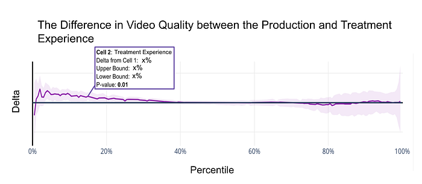
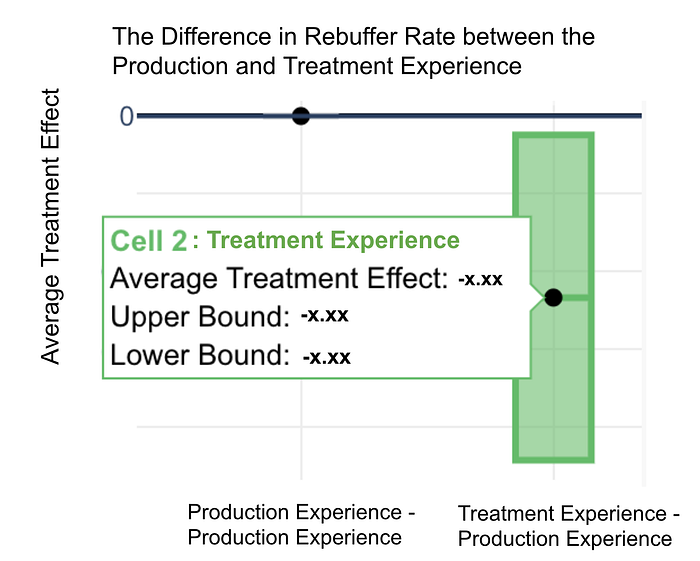
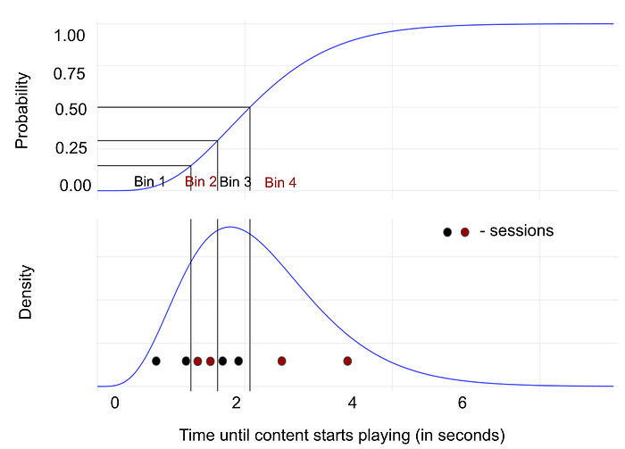
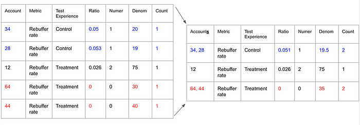

# Data Compression for Large-Scale Streaming Experimentation

_Julie (Novak) Beckley, Andy Rhines, Jeffrey Wong, Matthew Wardrop, Toby Mao, Martin Tingley_

Ever wonder why Netflix works so well when you’re streaming at home, on the train, or in a foreign hotel? Behind the scenes, Netflix engineers are constantly striving to improve the quality of your streaming service. The goal is to bring you joy by delivering the content you love quickly and reliably every time you watch. To do this, we have teams of experts that develop more efficient video and audio [encodes](https://medium.com/netflix-techblog/optimized-shot-based-encodes-now-streaming-4b9464204830), refine the [adaptive streaming algorithm](https://medium.com/netflix-techblog/using-machine-learning-to-improve-streaming-quality-at-netflix-9651263ef09f), and optimize content placement on the [distributed servers](https://medium.com/netflix-techblog/how-data-science-helps-power-worldwide-delivery-of-netflix-content-bac55800f9a7) that host the shows and movies that you watch. Within each of these areas, teams continuously run large-scale A/B experiments to test whether their ideas result in a more seamless experience for members.

With all these experiments, we aim to improve the Quality of Experience (QoE) for Netflix members. QoE is measured with a compilation of metrics that describe everything about the user’s experience from the time they press play until the time they finish watching. Examples of such metrics include how quickly the content starts playing and the number of times the video froze during playback (number of rebuffers).

Suppose the encoding team develops more efficient encodes that improve video quality for members with the lowest quality (those streaming on low bandwidth networks). They need to understand whether there was a meaningful improvement or if their A/B test results were due to noise. This is a hard problem because we must determine if and how the QoE metric distributions differ between experiences. At Netflix, we addressed these challenges by developing custom tools that use the bootstrap, a resampling technique for quantifying statistical significance. This helps the encoding team move past means and medians to evaluate how well the new encodes are working for all members, by enabling them to easily understand movements in different parts of a metric’s distribution. They can now answer questions such as: “Has the intervention improved the experience for the 5th percentile (corresponding to members with generally low video quality) while deteriorating the experience for the 95th (corresponding to those with generally high video quality), or has the intervention had a positive impact on all members?”

Although our engineering stakeholders loved the statistical insights, obtaining them was time consuming and inconvenient. When moving from an ad-hoc solution to integration into our internal platform, [ABlaze](https://medium.com/netflix-techblog/reimagining-experimentation-analysis-at-netflix-71356393af21), we encountered scaling challenges. For our methods to power all streaming experimentation reports, we needed to precompute the results for hundreds of streaming experiments, all segments of the population (e.g. device types), and all metrics. To make this happen, we developed an effective data compression technique by cleverly bucketing our data. This reduced the volume of our data by up to 1,000 times, allowing us to compute statistics in just a few seconds while maintaining precise results. The development of an effective data compression strategy enabled us to deploy bootstrapping methods at dramatically greater scale, allowing experimenters to analyze their A/B test results faster and with clearer insights.

Compression is used in many statistical applications, but why is it so valuable for Quality of Experience metrics? In short: we are interested in detecting arbitrary changes in various distributions while not making parametric assumptions, and simple statistical summarization methods are insufficient.

## The Bootstrapping Methods

Suppose you are watching The Crown on a train and Claire Foy’s face appears pixelated. Your instinct might tell you this is caused by an unusually slow network, but you still become frustrated that the video quality is not perfect. The encoding team can develop a solution for this scenario, but they need a way to test how well it actually worked.

In this section we briefly go over two sets of bootstrapping methods developed for different types of tests for metrics with different distributions.

### “Quantile Bootstrap”: A Solution for Understanding Movement in Parts of a Distribution

One class of methods, which we call quantile bootstrapping, was developed to understand movement in certain parts of metric distributions. Often times simply moving the mean or median of a metric is not the experimenter’s goal. We need to determine whether new encodes create a statistically significant improvement in video quality for members who need it most. In other words, we need to evaluate whether new encodes move the lower tail of the video quality distribution and whether this movement was statistically significant or simply due to noise.

To quantify whether we moved specific sections of the distribution, we compare differences in quantile functions between the treatment and production experiences. These plots help experimenters quickly assess the magnitude of the difference between test experiences for all quantiles. But did this difference happen by chance? To measure statistical significance, we use an efficient bootstrapping procedure to create confidence intervals and p-values for all quantiles (with adjustments to account for multiple comparisons). The encoding team then understands the improvement in [perceptual video quality](https://medium.com/netflix-techblog/toward-a-practical-perceptual-video-quality-metric-653f208b9652) for members who experience the worst video quality. If the p-values for the quantiles of interest are small, they can be assured that the newly developed encodes do in fact improve quality in the treatment experience. For more detail on how this methodology is implemented, you can read the following [article](https://medium.com/netflix-techblog/streaming-video-experimentation-at-netflix-visualizing-practical-and-statistical-significance-7117420f4e9a) on measuring practical and statistical significance.

*The difference plot with shaded confidence intervals demonstrates a practically and statistically significant increase in video quality at the lowest percentiles of the distribution*

### “Rare Event Bootstrap”: A Solution for Metrics with Non-Standard Distributions

In streaming experiments, we care a lot about changes in the frequency of rare events. One such example is how many rebuffers — the spinning wheels that interrupt our members’ playback experience — occur per hour. Since the service generally works quite well, most streaming sessions do not have rebuffers. However when a rebuffer does occur, it is very disruptive to the member. Many experiments aim to evaluate whether we have reduced rebuffers per hour for some members, and in all streaming experiments we check that the rebuffer rate has not increased.

To understand differences in metrics that occur rarely, we developed a class of methods we call the rare event bootstrap. Summary statistics such as means and medians would be insufficient for this class, since they would be calculated from member-level aggregates (as this is the grain of randomization in our experiments). These are unsatisfactory for a few reasons:

- If a member streamed for a very short period of time but had a single rebuffer, their rebuffers per hour value would be extremely large due to the small denominator. A mean over the member-level rates would then be dominated by these outlying values.
- Since these events occur infrequently, the distribution of rates over members consists of almost all zeros and a small fraction of non-zero values. The median is not a useful statistic as even large changes to the overall rebuffer rate would not result in the median changing.

This makes a standard nonparametric Mann-Whitney U test ineffective as well.

To account for these properties of rate metrics that are often zero, we develop a custom technique that compares rates for the control experience to the rate for each treatment experience. In the previous section, quantile bootstrap analysis, we had “one vote per member” since member-level aggregates do not encounter the two issues above. In the rare event analysis, we weigh each hour (or session) equally instead. **We do so by summing the rebuffers across all accounts, summing the total hours of content viewed across all accounts, and then dividing the two for both the production and treatment experience.**

To assess whether this difference is statistically significant, we need to quantify the uncertainty around our point estimates. We resample with replacement the pairs of {rebuffers, view hours} per member and then sum each to form the ratio. The new datasets are used to derive confidence intervals and compute p-values. When generating new datasets, we must resample a two-vector pair to maintain the member-level information, as this is our grain of randomization. Resampling the member’s ratio of rebuffers per hour will lose information about the viewing hours. For example, zero rebuffers in one second versus zero rebuffers in two hours are very different member experiences. Had we only resampled the ratio, both of those would have been 0 and we would not maintain meaningful differences between them.

*The treatment experience provided a statistically significant reduction in rebuffer rate*

Taken together, the two methods give a fairly complete view of the QoE metric movements in an A/B test.

## A Solution That Scales: An Effective Compression Mechanism

Our next challenge was to adapt these bootstrapping methods to work at the scale required to power all streaming QoE experiments. This means precomputing results for all tests, all QoE metrics, and all commonly compared segments of the population (e.g. for all device types in the test). Our method for doing so focuses on reducing the total number of rows in the dataset while maintaining accurate results compared to using the full dataset.

After trying different compression strategies, we decided to move forward with an n-tile bucketing approach, consisting of the following steps

1. Sort the data from smallest to largest value
2. Split it into _n_ evenly sized buckets by count
3. Calculate a summary statistic for each bucket (e.g. mean or median)
4. Consolidate all the rows from a single bucket into one row, keeping track only of the summary statistic and the total number of original rows we consolidated (the ‘count’)

Once the bucketing is complete, the total number of rows in your dataset equals the number of buckets, with an additional column indicating the number of original data points in that bucket. The problem becomes of cardinality _n,_ regardless of the allocation size.

For the ‘well behaved’ metrics where we are trying to understand movements in specific parts of the distribution, we group the original values into a fixed number of buckets. The number of buckets becomes the number of rows in the compressed dataset.

*For a ‘well behaved’ metric, we create buckets with equal numbers of data points. The buckets can map to unequal portions of the PDF and CDF curves given the skew in our data.*

When extending to metrics that occur rarely (like rebuffers per hour), we need to maintain a good approximation of the relationship between the numerator and the denominator. N-tiling the metric value itself (i.e. the ratio) will not work because it results in loss of information about the absolute scale.

In this case, we only apply the n-tiling approach to the denominator. We do not gain much reduction in data size by compressing the numerator as, in practice, we find that the number of unique numerator values is small. Take rebuffers per hour, for example, where the number of rebuffers a member has in the course of an experiment (the numerator) is usually 0, and a few members many have 1 to 5 rebuffers. The number of different values the numerator can take on is typically no more than 100. So we compress the denominators and persist the numerators.

We now have the same compression mechanism for both quantile and rare event bootstrapping, where the quantile bootstrap solution is a simpler special case of the 2D compression for rare event bootstrapping. Casting the quantile compression as a special case of the rare event approach simplifies the implementation.

*An example of how an uncompressed dataset (left) reduces down to a compressed dataset (right) through n-tile bucketing*

We explored the following evaluation criteria to identify the optimal number of buckets:

- mean absolute difference in estimates when using the full versus compressed datasets
- mean absolute difference in p-values when using the full versus compressed datasets
- total number of p-values which agreed (both statistically significant or not) when using the full versus compressed datasets

In the end, we decided to set the number of buckets by requiring agreement in over 99.9 percent of p-values. Also, the estimates and p-values for both bootstrapping techniques were not practically different.

In practice, these compression techniques reduce the number of rows in the dataset by a factor of 1000 while maintaining accurate results! These innovations unlocked our potential to scale our methods to power the analyses for all streaming experimentation reports.

## Impact on Experimentation at Netflix

The development of an effective data compression strategy completely changed the impact of our statistical tools for streaming experimentation at Netflix. Compressing the data allowed us to scale the number of computations to a point where we can now analyze the results for all metrics in all streaming experiments, across hundreds of population segments using our custom bootstrapping methods. The engineering teams are thrilled because we went from an ad-hoc, on demand, and slow solution outside of the experimentation platform to a paved-path, on-platform solution with lower latency and higher reliability.

The impact of this work reaches experimentation areas beyond streaming as well. Because of the [new experimentation platform infrastructure](https://medium.com/netflix-techblog/reimagining-experimentation-analysis-at-netflix-71356393af21), our methods can be incorporated into reports from other business areas. The learnings we have gained from our data compression research are also being leveraged as we think about scaling other statistical methods to run for high volumes of experimentation reports.

---
**Tags:** Data Science · Experimentation · Data Compression
