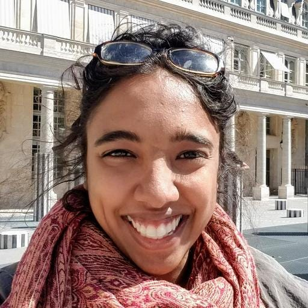

# Data Engineers of Netflix — Interview with Dhevi Rajendran

*Dhevi Rajendran*

This post is part of our **“Data Engineers of Netflix”** interview series, where our very own data engineers talk about their journeys to **Data Engineering @ Netflix**.

[**Dhevi Rajendran**](https://www.linkedin.com/in/dhevi-rajendran-7b736b29/)** is a Data Engineer on the Growth Data Science and Engineering team.** Dhevi joined Netflix in July 2020 and is one of many Data Engineers who have onboarded remotely during the pandemic. In this post, Dhevi talks about her passion for data engineering and taking on a new role during the pandemic.

Before Netflix, Dhevi was a software engineer at Two Sigma, where she was most recently on a data engineering team responsible for bringing in datasets from a variety of different sources for research and trading purposes. In her free time, she enjoys drawing, doing puzzles, reading, writing, traveling, cooking, and learning new things.

**Her favorite TV shows:** Atlanta, Barry, Better Call Saul, Breaking Bad, Dark, Fargo, Succession, The Killing

**Her favorite movies:** Das Leben der Anderen, Good Will Hunting, Intouchables, Mother, Spirited Away, The Dark Knight, The Truman Show, Up

## Dhevi, so what got you into data engineering?

While my background has mostly been in backend software engineering, I was most recently doing backend work in the data space prior to Netflix. One great thing about working with data is the impact you can create as an engineer.

> **At Netflix, the work that data engineers do to produce data in a robust, scalable way is incredibly important to provide the best experience to our members as they interact with our service.**

Beyond the really interesting technical challenges that come with working with big data, there are lots of opportunities to think about higher-level domain challenges as a data engineer. In college, I had done human-computer interaction research on subtitles for the Deaf and hard-of-hearing as well as computational genomics research on Alzheimer’s disease. **I’ve always enjoyed learning about new areas and combining this knowledge with my technical skills to solve real-world problems.**

## What drew you to Netflix?

Netflix’s mission and its culture primarily drew me to Netflix. I liked the idea of being a part of a company that brings joy to so many members around the world with an incredibly powerful platform for their stories to be heard. **The blend of creativity and a strong engineering culture at Netflix really appealed to me.**

The culture was also something that piqued my interest. I was pretty skeptical of Netflix’s culture memo at first. Many companies have lofty ideals that don’t necessarily translate into the reality of the company culture, so I was surprised to see how consistently the culture memo aligns with the actual culture at the company. I’ve found the culture of freedom and responsibility empowering.

> ****Rather than the typical top-down approach many companies use, Netflix trusts each person to make the right decisions for the company by using their deep knowledge of the problems they’re solving along with the context they gather from their leaders and stakeholders.****

This means a lot less red tape, a lot less friction, and a lot more freedom for everyone at the company to do what’s best for the business. I also really appreciate the amount of visibility and input we get into broader strategic decisions that the company makes.

Finally, I was also really excited about joining the Growth Data Engineering team! My team is responsible for building data products relating to how we connect with our new members around the world, which is high-impact and has far-reaching global significance. I love that I get to help Netflix connect with new members around the world and help shape the first impression we make on them.

## What is your favorite project or a project that you’re particularly proud of?

I have been primarily involved in the payments space. Not a project per se, but one of the things I’ve enjoyed being involved in is the cross-functional meetings with peers and stakeholders who are working in the payments space. These meetings include product managers, designers, consumer insights researchers, software engineers, data scientists, and people in a wide variety of other roles.

> **I love that I get to work cross-functionally with such a diverse group of people looking at the same set of problems from a variety of unique perspectives.**

In addition to my day-to-day technical work, these meetings have provided me with the opportunity to be involved in the high-level product, design, and strategic discussions, which I value. Through these cross-functional efforts, I’ve also really gotten to learn and appreciate the nuances of payments. From using credit cards (which are fairly common in the US but not as widely adopted outside the US) to physically paying in person, members in different countries prefer to pay for our subscription in a wide variety of ways. It’s incredible to see the thoughtful and deeply member-driven approach we use to think about something as seemingly routine, straightforward, and often taken for granted as payments.

## What was it like taking on a new role during the pandemic?

First off, I feel very lucky to have found a new role in this very difficult period. With the amount of change and uncertainty, the past year brought, it somehow felt both fitting and imprudent to voluntarily add a career change to the mix. The prospect was daunting at first. I knew there would be a bunch for me to learn coming into Netflix, considering that I hadn’t worked with the technologies my team uses (primarily Scala and Spark). Looking back now, I’m incredibly grateful for the opportunity and glad that I took it. I’ve already learned so much in the past six months and am excited about how much more I can learn and the impact I can make going forward.

Onboarding remotely has been a unique experience as well. Building relationships and gathering broader context are more difficult right now. I’ve found that I’ve learned to be more proactive and actively seek out opportunities to get to know people and the business, whether through setting up coffee chats, reading memos, or attending meetings covering topics I want to learn more about. I still haven’t met anyone I work with in person, but my teammates, my manager, and people across the company have been really helpful throughout the onboarding process.

> **It’s been incredible to see how gracious people are with their time and knowledge. The amount of empathy and understanding people have shown to each other, including to those who are new to the company, has made taking the leap and joining Netflix a positive experience.**

## Learning more

Interested in learning more about data roles at Netflix? You’re in the right place! Keep an eye out for our open roles in Data Science and Engineering [here](https://jobs.netflix.com/search?team=Data+Science+and+Engineering). Our culture is key to our impact and growth: read about it [here](https://jobs.netflix.com/culture).

---
**Tags:** Data Engineering · Data · Culture · Remote Working · Big Data
