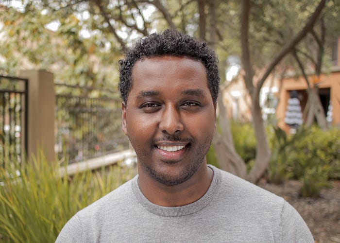

# Data Engineers of Netflix — Interview with Samuel Setegne

*Samuel Setegne*

This post is part of our **“Data Engineers of Netflix”** interview series, where our very own data engineers talk about their journeys to **Data Engineering @ Netflix**.

[**Samuel Setegne**](https://www.linkedin.com/in/samuel-setegne-905448122/)** is a Senior Software Engineer on the Core Data Science and Engineering team. Samuel and his team build tools and frameworks that support data engineering teams across Netflix. In this post, Samuel talks about his journey from being a clinical researcher to supporting data engineering teams.**

Samuel comes from West Philadelphia, and he received his Master’s in Biotechnology from Temple University. Before Netflix, Samuel worked at Travelers Insurance in the Data Science & Engineering space, implementing real-time machine learning models to predict severity and complexity at the onset of property claims.

**His favorite TV shows:** [Bojack Horseman](https://www.youtube.com/watch?v=ZOGxOQxXjdo), [Marco Polo](https://www.youtube.com/watch?v=OXfgvcJ5T8E), and [The Witcher](https://www.youtube.com/watch?v=ndl1W4ltcmg&t=6s)

**His favorite movies:** Scarface, I Am Legend and The Old Guard

## Sam, what drew you to data engineering?

Early in my career, I was headed full speed towards life as a clinical researcher. Many healthcare practitioners had strong hunches and wild theories that were exciting to test against an empirical study. I personally loved looking at raw data and using it to understand patterns in the world through technology. However, most challenges that came with my role were domain-related but not as technically demanding. For example — clinical data was often small enough to fit into memory on an average computer and only in rare cases would its computation require any technical ingenuity or massive computing power. There was not enough scope to explore the distributed and large-scale computing challenges that usually come with big data processing. Furthermore, engineering velocity was often sacrificed owing to rigid processes.

> Moving into pure Data engineering not only offered me the technical challenges I’ve always craved for but also the opportunity to connect the dots through data which was the best of both worlds.

## What is your favorite project or a project you’re particularly proud of?

The very first project I had the opportunity to work on as a Netflix contractor was migrating all of Data Science and Engineering’s [Python 2 code to Python 3](./python-at-netflix-bba45dae649e.md). This was without a doubt, my favorite project that also opened the door for me to join the organization as a full-time employee. It was thrilling to analyze code from various cross-functional teams and learn different coding patterns and styles.

> **This kind of exposure opened up opportunities for me to engage with various data engineering teams and advocate for python best practices that helped me drive greater impact at Netflix.**

## What drew you to Netflix?

What initially caught my attention about a chance to work at Netflix was the variety and quality of content. My family and friends were always ecstatic about having lively and raucous conversations about Netflix shows or movies they recently watched like Marco Polo and Tiger King.

> **Although other great companies play a role in our daily lives, many of them serve as a kind of utility, whereas Netflix is meant to make us live, laugh, and love by enabling us to experience new voices, cultures, and perspectives**.

After I read Netflix’s culture memo, I was completely sold. It precisely described what I always knew was missing in places I’ve worked before. I found the mantra of **“people over process”** extremely refreshing and eventually learned that it unlocked a bold and creative part of me in my technical designs. For instance, if I feel that a design of an application or a pipeline would benefit from new technology or architecture, I have the freedom to explore and innovate without excessive red tape. Typically in large corporations, you’re tied to strict and redundant processes, causing a lot of fatigue for engineers. **When I landed at Netflix, it was a breath of fresh air to learn that we lean into freedom and responsibility and allow engineers to push the boundaries.**

## Sam, how do you approach building tools/frameworks that can be used across data engineering teams?

**My team provides generalized solutions for common and repetitive data engineering tasks. This helps provide “paved path” solutions for data engineering teams and reduces the burden of re-inventing the wheel**. When you have many specialized teams composed of highly skilled engineers, the last thing you want for a data engineer is to spend too much time solving small problems that are usually buried inside of the big, broad, and impactful problems. When we extrapolate that to every engineer on every Data Science & Engineering team, it easily adds up and is something worth optimizing.

> **Any time you have a data engineer spending cycles working on tasks where the data engineering part of their brain is turned off, that’s an opportunity where better tooling can help.**

For example, many data engineering teams have to orchestrate notification campaigns when they make changes to critical tables that have downstream dependencies. This is achievable by a Data Engineer but it can be very time-consuming, especially having to track the migration of these downstream users over to your new table or table schema to ensure it’s safe to finalize your changes. This problem was tackled by one of my highly skilled team members who built a centralized migration service that lets Data Engineers easily start “migration campaigns” that can automatically identify downstream users and provide notification and status-tracking capabilities by leveraging Jira. The aim is to enable Data Engineers to quickly fire up one of these campaigns and keep an eye out for its completion while using that extra time to focus on other tasks.

> By investing in the right tooling to streamline redundant (yet necessary) tasks, we can drive higher data engineering productivity and efficiency, while accelerating innovation for Netflix.

## Learning more

Interested in learning more about data roles at Netflix? You’re in the right place! **Keep an eye out for our open roles in Data Science and Engineering by visiting our jobs site **[**here**](https://jobs.netflix.com/search?team=Data+Science+and+Engineering)**.** Our [culture](https://www.instagram.com/wearenetflix/?hl=en) is key to our impact and growth: read about it [here](https://jobs.netflix.com/culture). Check out our chat with Dhevi Rajendran to know more about starting a new role as a Data Engineer during the pandemic [here](https://netflixtechblog.medium.com/data-engineers-of-netflix-interview-with-dhevi-rajendran-a9ab7c7b36e5).

---
**Tags:** Data Engineering · Data Tools · Big Data · Culture · Developer Productivity
