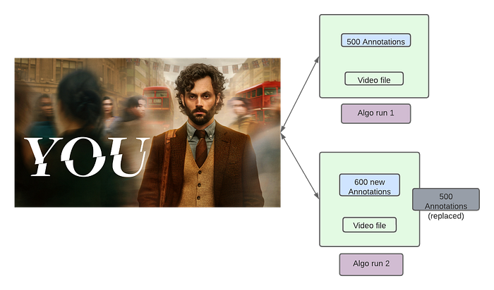
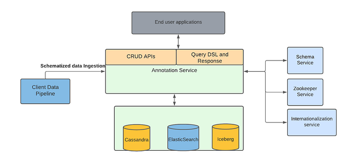
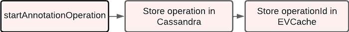
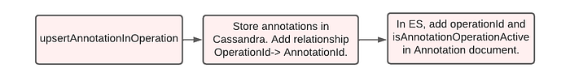
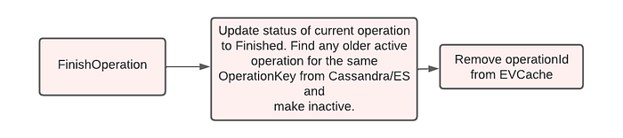

# Data ingestion pipeline with Operation Management

> by Varun Sekhri, Meenakshi Jindal, Burak Bacioglu

## Introduction

At Netflix, to promote and recommend the content to users in the best possible way there are many Media Algorithm teams which work hand in hand with content creators and editors. Several of these algorithms aim to improve different manual workflows so that we show the **personalized promotional image, trailer or the show to the user.**

These media focused machine learning algorithms as well as other teams generate a lot of data from the media files, which we described in our [previous blog](./scalable-annotation-service-marken-f5ba9266d428.md), are stored as annotations in Marken. We designed a unique concept called Annotation Operations which allows teams to create data pipelines and easily write annotations without worrying about access patterns of their data from different applications.

## Goals


*Annotation Operations*

Lets pick an example use case of identifying objects (like trees, cars etc.) in a video file. As described in the above picture

- During the first run of the algorithm it identified 500 objects in a particular Video file. These 500 objects were stored as annotations of a specific schema type, let’s say Objects, in Marken.
- The Algorithm team improved their algorithm. Now when we re-ran the algorithm on the same video file it created 600 annotations of schema type Objects and stored them in our service.

Notice that we cannot update the annotations from previous runs because we don’t know how many annotations a new algorithm run will result into. It is also very expensive for us to keep track of which annotation needs to be updated.

The goal is that when the consumer comes and searches for annotations of type Objects for the given video file then the following should happen.

- Before Algo run 1, if they search they should not find anything.
- After the completion of Algo run 1, the query should find the first set of 500 annotations.
- During the time when Algo run 2 was creating the set of 600 annotations, clients search should still return the older 500 annotations.
- When all of the 600 annotations are successfully created, they should replace the older set of 500.
- So now when clients search annotations for Objects then they should get 600 annotations.

Does this remind you of something? This seems very similar (not exactly same) to a distributed transaction.

Typically, an algorithm run can have 2k-5k annotations. There are many naive solutions possible for this problem for example:

- Write different runs in different databases. This is obviously very expensive.
- Write algo runs into files. But we cannot search or present low latency retrievals from files
- Etc.

Instead our challenge was to implement this feature on top of Cassandra and ElasticSearch databases because that’s what Marken uses. The solution which we present in this blog is not limited to annotations and can be used for any other domain which uses ES and Cassandra as well.

## Marken Architecture

Marken’s architecture diagram is as follows. We refer the reader to our previous [blog article](./scalable-annotation-service-marken-f5ba9266d428.md) for details. We use Cassandra as a source of truth where we store the annotations while we index annotations in ElasticSearch to provide rich search functionalities.


*Marken Architecture*

Our goal was to help teams at Netflix to create data pipelines without thinking about how that data is available to the readers or the client teams. Similarly, client teams don’t have to worry about when or how the data is written. This is what we call decoupling producer flows from clients of the data.

Lifecycle of a movie goes through a lot of creative stages. We have many temporary files which are delivered before we get to the final file of the movie. Similarly, a movie has many different languages and each of those languages can have different files delivered. Teams generally want to run algorithms and create annotations using all those media files.

Since algorithms can be run on a different permutations of how the media files are created and delivered we can simplify an algorithm run as follows

- Annotation Schema Type — identifies the schema for the annotation generated by the Algorithm.
- Annotation Schema Version — identifies the schema version of the annotation generated by the Algorithm.
- PivotId — a unique string identifier which identifies the file or method which is used to generate the annotations. This could be the SHA hash of the file or simply the movie Identifier number.

Given above we can describe the data model for an annotation operation as follows.

```
{
  "annotationOperationKeys": [
    {
      "annotationType": "string",   ❶
      "annotationTypeVersion": “integer”,
      "pivotId": "string",
      "operationNumber": “integer”    ❷
    }
  ],
  "id": "UUID",
  "operationStatus": "STARTED",   ❸
  "isActive": true   ❹
}
```

1. We already explained AnnotationType, AnnotationTypeVersion and PivotId above.
2. OperationNumber is an auto incremented number for each new operation.
3. OperationStatus — An operation goes through three phases, Started, Finished and Canceled.
4. IsActive — Whether an operation and its associated annotations are active and searchable.

As you can see from the data model that the producer of an annotation has to choose an AnnotationOperationKey which lets them define how they want UPSERT annotations in an AnnotationOperation. Inside, AnnotationOperationKey the important field is pivotId and how it is generated.

## Cassandra Tables

Our source of truth for all objects in Marken in Cassandra. To store Annotation Operations we have the following main tables.

- AnnotationOperationById — It stores the AnnotationOperations
- AnnotationIdByAnnotationOperationId — it stores the Ids of all annotations in an operation.

Since Cassandra is NoSql, we have more tables which help us create reverse indices and run admin jobs so that we can scan all annotation operations whenever there is a need.

## ElasticSearch

Each annotation in Marken is also indexed in ElasticSearch for powering various searches. To record the relationship between annotation and operation we also index two fields

- annotationOperationId — The ID of the operation to which this annotation belongs
- isAnnotationOperationActive — Whether the operation is in an ACTIVE state.

## APIs

We provide three APIs to our users. In following sections we describe the APIs and the state management done within the APIs.

### StartAnnotationOperation

When this API is called we store the operation with its OperationKey (tuple of annotationType, annotationType Version and pivotId) in our database. This new operation is marked to be in STARTED state. We store all OperationIDs which are in STARTED state in a distributed cache (EVCache) for fast access during searches.


*StartAnnotationOperation*

### UpsertAnnotationsInOperation

Users call this API to upsert the annotations in an Operation. They pass annotations along with the OperationID. We store the annotations and also record the relationship between the annotation IDs and the Operation ID in Cassandra. During this phase operations are in isAnnotationOperationActive = ACTIVE and operationStatus = STARTED state.

Note that typically in one operation run there can be 2K to 5k annotations which can be created. Clients can call this API from many different machines or threads for fast upserts.


*UpsertAnnotationsInOperation*

### FinishAnnotationOperation

Once the annotations have been created in an operation clients call FinishAnnotationOperation which changes following

- Marks the current operation (let’s say with ID2) to be operationStatus = FINISHED and isAnnotationOperationActive=ACTIVE.
- We remove the ID2 from the Memcache since it is not in STARTED state.
- Any previous operation (let’s say with ID1) which was ACTIVE is now marked isAnnotationOperationActive=FALSE in Cassandra.
- Finally, we call updateByQuery API in ElasticSearch. This API finds all Elasticsearch documents with ID1 and marks isAnnotationOperationActive=FALSE.


*FinishAnnotationOperation*

### Search API

This is the key part for our readers. When a client calls our search API we must exclude

- any annotations which are from isAnnotationOperationActive=FALSE operations or
- for which Annotation operations are currently in STARTED state. We do that by excluding the following from all queries in our system.

To achieve above

1. We add a filter in our ES query to exclude isAnnotationOperationStatus is FALSE.
2. We query EVCache to find out all operations which are in STARTED state. Then we exclude all those annotations with annotationId found in memcache. Using memcache allows us to keep latencies for our search low (most of our queries are less than 100ms).

## Error handling

Cassandra is our source of truth so if an error happens we fail the client call. However, once we commit to Cassandra we must handle Elasticsearch errors. In our experience, all errors have happened when the Elasticsearch database is having some issue. In the above case, we created a retry logic for updateByQuery calls to ElasticSearch. If the call fails we push a message to SQS so we can retry in an automated fashion after some interval.

## Future work

In near term, we want to write a high level abstraction single API which can be called by our clients instead of calling three APIs. For example, they can store the annotations in a blob storage like S3 and give us a link to the file as part of the single API.

---
**Tags:** Annotations · Machine Learning · Data Pipeline · Distributed Transaction · Marken
