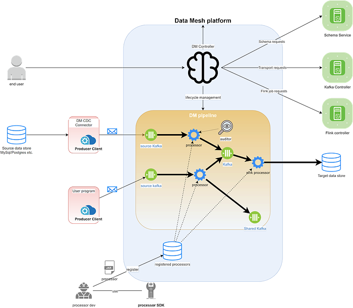
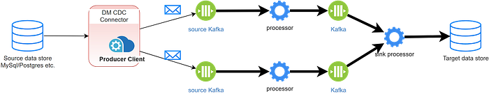

# Data Mesh — A Data Movement and Processing Platform @ Netflix

---

By [Bo Lei](https://www.linkedin.com/in/bolei1007/), [Guilherme Pires](https://www.linkedin.com/in/guilhermesmi/), [James Shao](https://www.linkedin.com/in/yufeng-james-shao-aa429830/), [Kasturi Chatterjee](https://www.linkedin.com/in/kasturi-chatterjee-a900715/), [Sujay Jain](https://www.linkedin.com/in/sujayjain/), [Vlad Sydorenko](https://www.linkedin.com/in/vlad-sydorenko/)

## Background

Realtime processing technologies (A.K.A stream processing) is one of the key factors that enable Netflix to maintain its leading position in the competition of entertaining our users. Our previous generation of streaming pipeline solution [Keystone](https://netflixtechblog.com/keystone-real-time-stream-processing-platform-a3ee651812a) has a proven track record of serving multiple of our key business needs. However, as we expand our offerings and try out new ideas, there’s a growing need to unlock other emerging use cases that were not yet covered by Keystone. After evaluating [the options](./delta-a-data-synchronization-and-enrichment-platform-e82c36a79aee.md), the team has decided to create Data Mesh as our next generation data pipeline solution.

Last year we wrote a [blog post](./data-movement-in-netflix-studio-via-data-mesh-3fddcceb1059.md) about how Data Mesh helped our Studio team enable data movement use cases. A year has passed, Data Mesh has reached its first major milestone and its scope keeps increasing. As a growing number of use cases on board to it, we have a lot more to share. We will deliver a series of articles that cover different aspects of Data Mesh and what we have learned from our journey. This article gives an overview of the system. The following ones will dive deeper into different aspects of it.

## Data Mesh Overview

### A New Definition Of Data Mesh

Previously, we defined Data Mesh as a fully managed, streaming data pipeline product used for enabling [Change Data Capture](https://en.wikipedia.org/wiki/Change_data_capture) (CDC) use cases. As the system evolves to solve more and more use cases, we have expanded its scope to handle not only the CDC use cases but also more general data movement and processing **use cases such that**:

- Events can be sourced from more generic applications (not only databases).
- The catalog of available DB connectors is growing (CockroachDB, Cassandra for example)
- More Processing patterns such as filter, projection, union, join, etc.

**As a result, today we define Data Mesh as a general purpose data movement and processing platform for moving data between Netflix systems at scale.**

### Overall Architecture

The Data Mesh system can be divided into the control plane (Data Mesh Controller) and the data plane (Data Mesh Pipeline). The controller receives user requests, deploys and orchestrates pipelines. Once deployed, the pipeline performs the actual heavy lifting data processing work. Provisioning a pipeline involves different resources. The controller delegates the responsibility to the corresponding microservices to manage their life cycle.

### Pipelines

A Data Mesh pipeline reads data from various sources, applies transformations on the incoming events and eventually sinks them into the destination data store. A pipeline can be created from the UI or via our declarative API. On the creation/update request the controller figures out the resources associated with the pipeline and calculates the proper configuration for each of them.

### Connectors

A source connector is a Data Mesh managed producer. It monitors the source database’s bin log and produces CDC events to the Data Mesh source fronting Kafka topic. It is able to talk to the Data Mesh controller to automatically create/update the sources.

Previously we only had RDS source connectors to listen to MySQL and Postgres using the [DBLog library](./dblog-a-generic-change-data-capture-framework-69351fb9099b.md); Now we have added Cockroach DB source connectors and Cassandra source connectors. They use different mechanisms to stream events out of the source databases. We’ll have blog posts deep dive into them.

In addition to managed connectors, application owners can emit events via a common library, which can be used in circumstances where a DB connector is not yet available or there is a preference to emit domain events without coupling with a DB schema.

### Sources

Application developers can expose their domain data in a centralized catalog of Sources. This allows data sharing as multiple teams at Netflix may be interested in receiving changes for an entity. In addition, a Source can be defined as a result of a series of processing steps — for example an enriched Movie entity with several dimensions (such as the list of _Talents_) that further can be [indexed](./how-netflix-content-engineering-makes-a-federated-graph-searchable-5c0c1c7d7eaf.md) to fulfill search use cases.

### Processors

A processor is a Flink Job. It contains a reusable unit of data processing logic. It reads events from the upstream transports and applies some business logic to each of them. An intermediate processor writes data to another transport. A sink processor writes data to an external system such as Iceberg, ElasticSearch, or a separate discoverable Kafka topic.

We have provided a Processor SDK to help the advanced users to develop their own processors. Processors developed by Netflix developers outside our team can also be registered to the platform and work with other processors in a pipeline. Once a processor is registered, the platform also automatically sets up a default alert UI and metrics dashboard

### Transports

We use Kafka as the transportation layer for the interconnected processors to communicate. The output events of the upstream processor are written to a Kafka topic, and the downstream processors read their input events from there.

Kafka topics can also be shared across pipelines. A topic in pipeline #1 that holds the output of its upstream processor can be used as the source in pipeline #2. We frequently see use cases where some intermediate output data is needed by different consumers. This design enables us to reuse and share data as much as possible. We have also implemented the features to track the data lineage so that our users can have a better picture of the overall data usage.

### Schema

**Data Mesh enforces schema on all the pipelines**, meaning we require all the events passing through the pipelines to conform to a predefined template. We’re using Avro as a shared format for all our schemas, as it’s simple, powerful, and widely adopted by the community..

We make schema as the first class citizen in Data Mesh due to the following reasons:

- **Better data quality**: Only events that comply with the schema can be encoded. Gives the consumer more confidence.
- **Finer granularity of data lineage**: The platform is able to track how fields are consumed by different consumers and surface it on the UI.
- **Data discovery**: Schema describes data sets and enables the users to browse different data sets and find the dataset of interest.

On pipeline creation, each processor in that pipeline needs to define what schema it consumes and produces. The platform handles the schema validation and compatibility check. We have also built automation around handling schema evolution. If the schema is changed at the source, the platform tries to upgrade the consuming pipelines automatically without human intervention.

## Future

Data Mesh Initially started as a project to solve our Change Data Capture needs. Over the past year, we have observed an increasing demand for all sorts of needs in other domains such as Machine Learning, Logging, etc. Today, Data Mesh is still in its early stage and there are just so many interesting problems yet to be solved. Below are the highlights of some of the high priority tasks on our roadmap.

### Making Data Mesh The Paved Path (Recommended Solution) For Data Movement And Processing

As mentioned above, Data Mesh is meant to be the next generation of Netflix’s real-time data pipeline solution. As of now, we still have several specialized internal systems serving their own use cases. To streamline the offering, it makes sense to gradually migrate those use cases onto Data Mesh. We are currently working hard to make sure that Data Mesh can achieve feature parity to Delta and Keystone. In addition, we also want to add support for more sources and sinks to unlock a wide range of data integration use cases.

### More Processing Patterns And Better Efficiency

People use Data Mesh not only to move data. They often also want to process or transform their data along the way. Another high priority task for us is to make more common processing patterns available to our users. Since by default a processor is a Flink job, having each simple processor doing their work in their own Flink jobs can be less efficient. We are also exploring ways to merge multiple processing patterns into one single Flink job.

### Broader support for Connectors

We are frequently asked by our users if Data Mesh is able to get data out of datastore X and land it into datastore Y. Today we support certain sources and sinks but it’s far from enough. The demand for more types of connectors is just enormous and we see a big opportunity ahead of us and that’s definitely something we also want to invest on.

Data Mesh is a complex yet powerful system. **We believe that as it gains its maturity, it will be instrumental in Netflix’s future success.** Again, we are still at the beginning of our journey and we are excited about the upcoming opportunities. In the following months, we’ll publish more articles discussing different aspects of Data Mesh. Please stay tuned!

## The Team

Data Mesh wouldn’t be possible without the hard work and great contributions from the team. Special thanks should go to our stunning colleagues:

[Bronwyn Dunn](https://www.linkedin.com/in/bronwyn-dunn/), [Jordan Hunt](https://www.linkedin.com/in/jordan-hunt-hmc/), [Kevin Zhu](https://www.linkedin.com/in/kevinzhu/), [Pradeep Kumar Vikraman](https://www.linkedin.com/in/pradeepvikraman/), [Santosh Kalidindi](https://www.linkedin.com/in/santosh-kalidindi/), [Satyajit Thadeshwar](https://www.linkedin.com/in/satyajit-thadeshwar/), [Tom Lee](https://www.linkedin.com/in/thomaslee4/), [Wei Liu](https://www.linkedin.com/in/davidliusde/)
