# Data Movement in Netflix Studio via Data Mesh

By [_Andrew Nguonly_](https://www.linkedin.com/in/andrewnguonly/)_, _[_Armando Magalhães_](https://www.linkedin.com/in/armandomagalhaes/)_, _[_Obi-Ike Nwoke_](https://www.linkedin.com/in/onwoke/), [_Shervin Afshar_](https://www.linkedin.com/in/shervinafshar/)_, _[_Sreyashi Das_](https://www.linkedin.com/in/sreyashidas/), [_Tongliang Liu_](https://www.linkedin.com/in/tonylxc/), [_Wei Liu_](https://www.linkedin.com/in/davidliusde/), [_Yucheng Zeng_](https://www.linkedin.com/in/yuchengzeng/)

## Background

Over the next few years, most content on Netflix will come from Netflix’s own Studio. From the moment a Netflix film or series is pitched and long before it becomes available on Netflix, it goes through [many phases](https://www.youtube.com/watch?v=pDu8Ccpr6Us&t=119s). This happens at an unprecedented scale and introduces many interesting challenges; one of the challenges is how to provide visibility of Studio data across multiple phases and systems to facilitate operational excellence and empower decision making. Netflix is known for its loosely coupled microservice architecture and with a global studio footprint, surfacing and connecting the data from microservices into a studio data catalog in real time has become more important than ever.

Operational Reporting is a reporting paradigm specialized in covering high-resolution, low-latency data sets, serving detailed day-to-day activities and processes of a business domain. Such a paradigm aspires to assist front-line operations personnel and stakeholders in performing their tasks through means such as ad hoc analysis, decision-support, and tracking (of tasks, assets, schedules, etc). The paradigm spans across methods, tools, and technologies and is usually defined in contrast to analytical reporting and predictive modeling which are more strategic (vs. tactical) in nature.

At Netflix Studio, teams build various views of business data to provide visibility for day-to-day decision making. With dependable near real-time data, Studio teams are able to track and react better to the ever-changing pace of productions and improve efficiency of global business operations using the most up-to-date information. Data connectivity across Netflix Studio and availability of Operational Reporting tools also incentivizes studio users to avoid forming data silos.

## The Journey

In the past few years, Netflix Studio has gone through few iterations of data movement approaches. In the initial stage, data consumers set up ETL pipelines directly pulling data from databases. With this batch style approach, several issues have surfaced like data movement is tightly coupled with database tables, database schema is not an exact mapping of business data model, and data being stale given it is not real time etc. Later on, we moved to event driven streaming data pipelines (powered by [Delta](./delta-a-data-synchronization-and-enrichment-platform-e82c36a79aee.md)), which solved some problems compared to the batch style, but had its own pain points, such as a high learning curve of stream processing technologies, manual pipeline setup, a lack of schema evolution support, inefficiency of onboarding new entities, inconsistent security access models, etc.

With the latest Data Mesh Platform, data movement in Netflix Studio reaches a new stage. This configuration driven platform decreases the significant lead time when creating a new pipeline, while offering new support features like end-to-end schema evolution, self-serve UI and secure data access. The high level diagram below indicates the latest version of data movement for Operational Reporting.

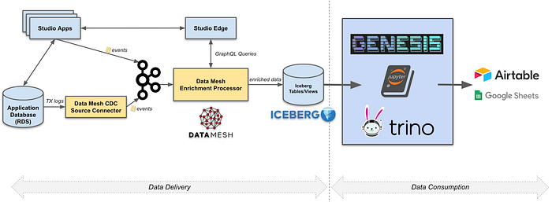
*Operational Reporting Architecture Overview*

For data delivery, we leverage the Data Mesh platform to power the data movement. Netflix Studio applications expose GraphQL queries via [Studio Edge](./how-netflix-scales-its-api-with-graphql-federation-part-1-ae3557c187e2.md), which is a unified graph that connects all data in Netflix Studio and provides consistent data retrieval. Change Data Capture(CDC) source connector reads from studio applications’ database transaction logs and emits the change events. The CDC events are passed on to the Data Mesh enrichment processor, which issues GraphQL queries to Studio Edge to enrich the data. Once the data has landed in the Iceberg tables in Netflix Data Warehouse, they could be used for ad-hoc or scheduled querying and reporting. Centralized data will be moved to third party services such as Google Sheets and Airtable for the stakeholders. We will deep dive into Data Delivery and Data Consumption in the following sections.

## Data Delivery via Data Mesh

### What is Data Mesh?

Data Mesh is a fully managed, streaming data pipeline product used for enabling Change Data Capture (CDC) use cases. In Data Mesh, users create sources and construct pipelines. Sources mimic the state of an externally managed source — as changes occur in the external source, corresponding CDC messages are produced to the Data Mesh source. Pipelines can be configured to transform and store data to externally managed sinks.

**Data Mesh provides a drag-and-drop, self-service user interface for exploring sources and creating pipelines so that users can focus on delivering business value without having to worry about managing and scaling complex data streaming infrastructure.**

### CDC and data source

**Change data capture or ****[CDC](./dblog-a-generic-change-data-capture-framework-69351fb9099b.md)****, is a semantic for processing changes in a source for the purpose of replicating those changes to a sink. **The table changes could be row changes (insert row, update row, delete row) or schema changes (add column, alter column, drop column). As of now, CDC sources have been implemented for data stores at Netflix (MySQL, Postgres). CDC events can also be sent to Data Mesh via a Java Client Producer Library.

### Reusable Processors and Configuration Driven

In Data Mesh, a processor is a configurable data processing application that consumes, transforms, and produces CDC events. A processor has 1 or more inputs and 0 or more outputs. Processors with 0 outputs are sink connectors; which write events to externally managed sinks (e.g. Iceberg, ElasticSearch, etc).

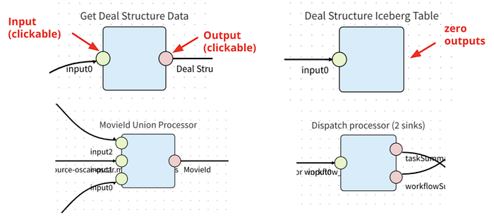
*Processors with Different Inputs/Outputs*

Data Mesh allows developers to contribute processors to the platform. Processors are not necessarily centrally developed and managed. However, the Data Mesh platform team strives to provide and manage the most highly leveraged processors (e.g. source connectors and sink connectors)

Processors are reusable. The same processor image package is used multiple times for all instances of the processor. Each instance is configured to fit each use case. For example, a GraphQL enrichment processor can be provisioned to query GraphQL Services to enrich data in different pipelines; an Iceberg sink processor can be initialized multiple times to write data to different databases/tables with different schema.

### End-to-End Schema Evolution

Schema is a key component of Data Mesh. When an upstream schema evolves (e.g. schema change in the MySQL table), Data Mesh detects the change, checks the compatibility and applies the change to the downstream. With schema evolution, Data Mesh ensures the Operational Reporting pipelines always produce data with the latest schema.

We will cover a few core concepts in the Data Mesh Schema domain.

**Consumer schema  
**Consumer schema defines how data is consumed by the downstream processors. See example below.

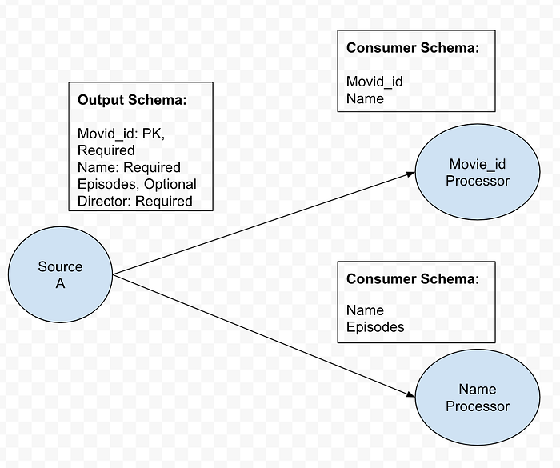
*Consumer Schema Example*

**Schema Compatibility**  
Data Mesh uses Consumer Schema compatibility to achieve flexible yet safe schema evolution. If a field consumed by an Operational Reporting pipeline is removed from CDC source, Data Mesh categorizes this change as **incompatible**, pauses the pipeline processing and notifies the pipeline owner. On the other hand, if a required field is not consumed by any consumer, dropping such fields would be **compatible**.

**Two Types of Processors  
**1. Pass through all fields from upstream to downstream.

- Example: Filter Processor, Sink Processors

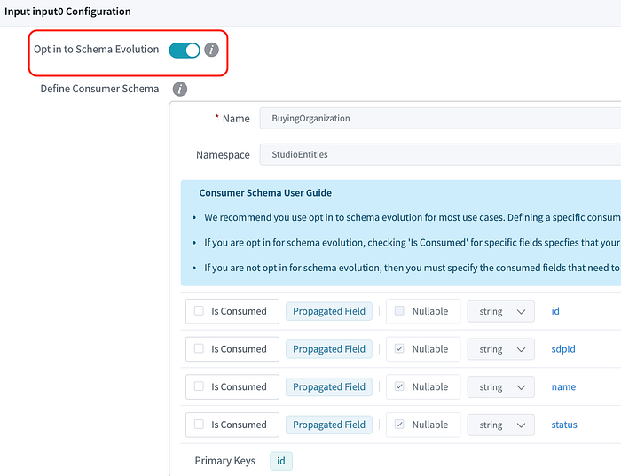
*Opt in to schema Evolution example*

2. Only uses a subset of fields from upstream.

- Example: Project Processor, Enrichment Processor

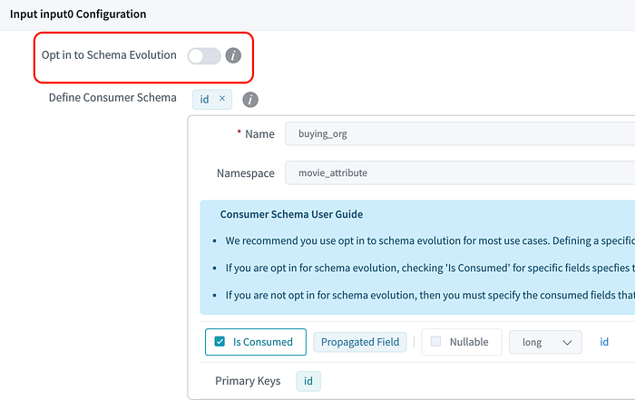
*Opt out to schema Evolution example*

In Data Mesh, we introduce the_ _**_Opt-in to Schema Evolution _**boolean flag to differentiate those two types of use cases.

- **Opt in:** All the upstream fields will be propagated to the processor. For example, when a new field is added upstream, it will be propagated automatically.
- **Opt out:** Only a subset of fields (defined using ‘Is Consumed’ checkboxes) is propagated and used in the processor. Upstream changes to the rest of the fields won’t affect this processor.

**Schema Propagation  
**After the Schema Compatibility is checked, Data Mesh Platform will propagate the schema change based on the end user’s intention. With the opt-in to schema Evolution flag, Operational Reporting pipelines can keep the schema up-to-date with upstream data stores. As part of schema propagation, the platform also syncs the schema from the pipeline to the Iceberg sink.

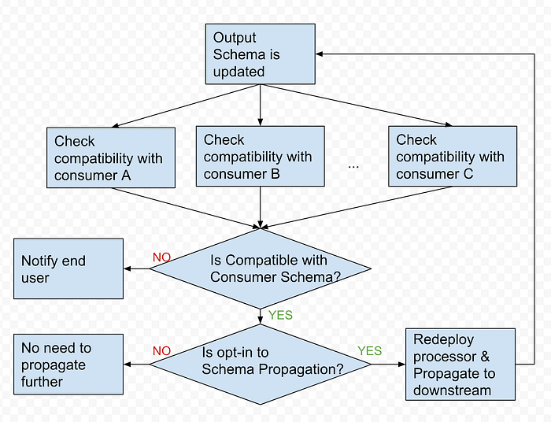
*Schema Evolution Diagram*

### Enrichment Processor via GraphQL

In the current Data Mesh Operational Reporting pipelines, the most commonly used intermediate processor is the GraphQL Enrichment Processor. It takes in the column value from CDC events coming from Source Connector as GraphQL query input, then submits a query to Studio Edge to enrich the data. With Studio Edge’s single data model, it centralizes data modeling efforts, which is highly leveraged by Studio UI Apps, Backend services and Search platforms. Enriching the data via Studio Edge helps us achieve consistent data modeling across the whole ecosystem for Operational Reporting.

Here is the example of GraphQL processor configuration, pipeline builder only need config the following fields to provision an enrichment processor:

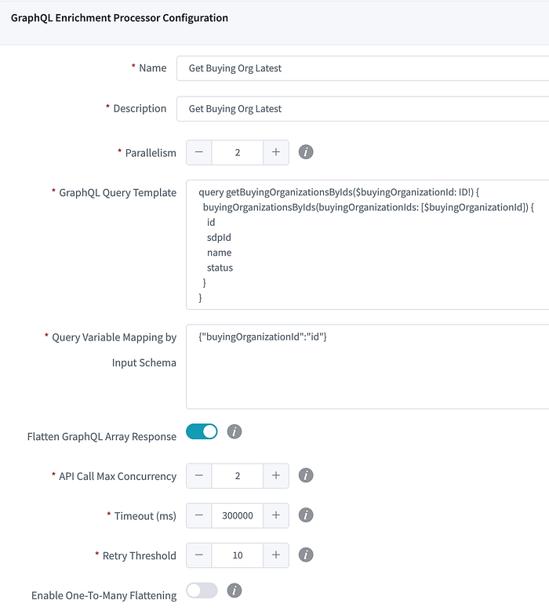
*GraphQL Enrichment Processor Configuration Example*

The image below is a sample Operational Reporting pipeline in the production environment to sink the Movie related data. Teams who want to move their data no longer need to learn and write customized Stream Processing jobs. Instead they just need to configure the pipeline topology in the UI while getting other features like schema evolution and secure data access out of the box.

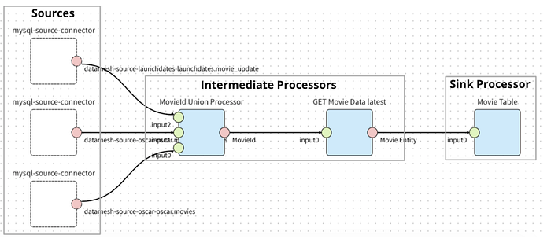
*Operational Reporting Pipeline Example*

### Iceberg Sink

[Apache Iceberg](https://iceberg.apache.org/) is an open source table format for huge analytics datasets. Data Mesh leverages Iceberg tables as data warehouse sinks for downstream analytics use cases. Currently Iceberg sink is appended only. Views are built on top of the raw Iceberg tables to retrieve the latest record for every primary key based on the operational timestamp, which indicates when the record is produced in the sink. Current pipeline consumers are directly consuming Views instead of raw tables.

The compaction process is needed to optimize the performance of downstream queries on the business view as well as lower costs of S3 GET OBJECT operations. A daily process ranks the records by timestamp to generate a data frame of compacted records. Old data files are overwritten with a set of new data files that contain only the compacted data.

### Data Quality

Data Mesh provides metrics and dashboards at both the processor and pipeline level for operational observability. Operational Reporting pipeline owners will get alerts if something goes wrong with their pipelines. We also have two types of auditing on the data tables generated from Data Mesh pipelines to guarantee data quality: end-to-end auditing and synthetic events.

Most of the business views created on top of the Iceberg tables can tolerate a few minutes of latency. However, it is paramount that we validate the complete set of identifiers such as a list of movie ids across producers and consumers for higher overall confidence in the data transport layer of choice. For end-to-end audits, the objective is to run the audits hourly via Big data Platform Scheduler, which is a centralized and integrated tool provided by Netflix data platform for running workflows in an efficient, reliable and reproducible way. The audits check for equality (i.e. query results should be the same), the symmetric difference between two data sets should be empty across multiple runs, and the eventual consistency within the SLA. An hourly notification is sent when a set of primary keys consistently do not match between source of truth and target Data Mesh tables.

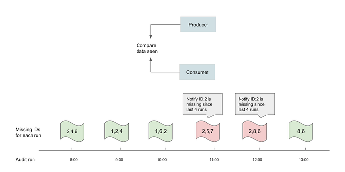
*End to End (Black Box) Auditing Example*

Synthetic events audits are artificially triggered change events to imitate common CUD operations of services. It is generating heartbeat signals at a constant frequency with the objective of using them as a baseline to verify the health of the pipeline regardless of traffic patterns or occasional silences.

## Data Consumption

Our studio partners rely on data to make informed decisions and to collaborate during all the phases related to production. The Studio Tech Solutions team provides near real-time reports in some data tool of choice, which we call trackers** **to empower the decision making.

For the past few years, many of these trackers were powered by hand-curated SQL scripts and API calls being managed by CRON schedulers implemented in a Java Service called Lego. Lego was the main tool for the STS team, and at its peak, Lego managed 300+ trackers.

This strategy had its own set of challenges: being schema-less and treating every report column like a string not always worked out, the volatile reliance on direct RDS connections and rate limits from third party APIs would often make jobs fail. We had a set of “core views” which would be specifically tailored for reports, but this caused queries that just required a very small subset of fields to be slow and expensive due to the view doing a huge amount of joining and aggregation work before being able to retrieve that small subset.

Besides the issues, this worked fine when we didn’t have many trackers to maintain, but as we created more trackers to the point of having many hundreds, we started having issues around **maintenance**, **awareness**, **knowledge sharing** and **standardization**. New team members had a hard time getting onboard, figuring out which SQL powered which tracker was tough, the lack of standards made every SQL look different and having to update trackers as the data sources changed was a nightmare.

With this in mind, the Studio Tech Solutions focused efforts in building **Genesis**, a Semantic Data Layer that allows the team to map data points in Data Source Definitions defined as YAML files and then use those to generate the SQL needed for the trackers, based on a selection of fields, filters and formatters specified in an Input Definition file. Genesis takes care of joining, aggregating, formatting and filtering data based on what is available in the Data Source Definitions and specified by the user through the Input Definition being executed.

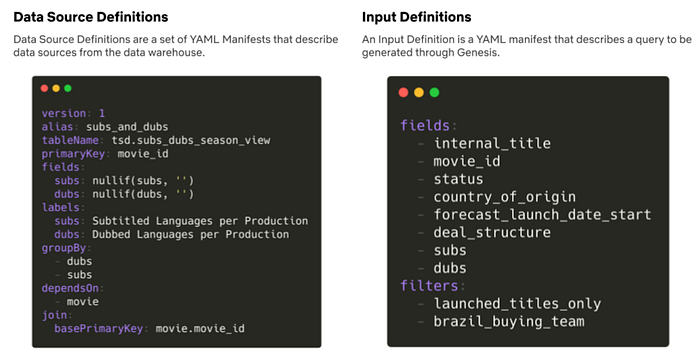
*Genesis Data Source and Input definition example*

Genesis is a stateless CLI written in Node.js that reads everything it needs from the file system based on the paths specified in the arguments. This allows us to hook Genesis into Jenkins Jobs, providing a GitOps and CI experience to maintain existing trackers, as well as create new trackers. We can simply change the data layer, trigger an empty pull request, review the changes and have all our trackers up to date with the data source changes.

As of the date of writing, Genesis powers 240+ trackers and is growing everyday, empowering thousands of partners in our studios globally to collaborate, annotate and share information using near-real-time data.

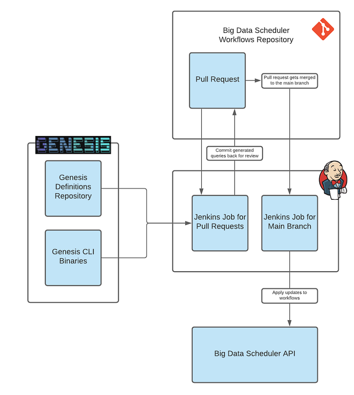
*Git-based Tracker management workflow powered by Genesis and the Big Data Scheduler*

The generated queries are then used in Workflow Definitions for multiple trackers. The Netflix Data Warehouse offers support for users to create data movement workflows that are managed through our Big Data Scheduler, powered by [Titus](https://netflix.github.io/titus/).

We use the scheduler to execute our queries and move the results to a data tool, which often is a Google Sheet Tab, Airtable base or Tableau dashboard. The scheduler offers templated jobs for moving data from a Trino output to these tools, making it easy to create and maintain hundreds of data movement workflows.

The diagram below summarizes the data consumption flow when building trackers:

*Data Consumption Overview*

As of July 2021, the Studio Tech Solutions team is finishing a migration from all the trackers built in Lego to use Genesis and the Data Portal. This strategy has increased the Studio Tech Solutions team performance and stability. Trackers are now easy for the team to create, review, change, monitor and discover.

## Now and Future

In conclusion, our studio partners have a tracker available to them, populated with near real-time data and tailored to their needs. They can manipulate, annotate, and collaborate using a flexible tool they are familiar with.

Along the journey, we have learned that evolving data movement in complex domains could take multiple iterations and needs to be driven by the business impact. The great cross-functional partnership and collaboration among all data stakeholders is crucial to shape the ideal data product.

However, our story doesn’t end here. We still have a long journey ahead of us to fulfill the vision of such ideal data product, especially in areas such as:

- Self-servicing data pipelines provisioning via configuration
- Providing toolings for data discoverability, understandability, usage visibility and change management
- Enabling data domain orientation and ownership/governance management
- Bootstrapping trackers in our Studio ecosystem instead of third party tools. Along the same line as the point above, this would allow us to maintain high standards of data governance, lineage, and security.
- Read-write reports and trackers using GraphQL mutations

These are some of the interesting areas that Netflix Studio is planning to invest in. We will have follow up blog posts on these topics in future. Please stay tuned!

## Acknowledgements

Data Movement via Data Mesh has been a success in Netflix Studio owing to multiple teams’ efforts. We would like to acknowledge the following colleagues: [Amanda Benhamou](https://www.linkedin.com/in/amandabenhamou/), [Andreas Andreakis](https://www.linkedin.com/in/andreas-andreakis/), [Anthony Preza](https://www.linkedin.com/in/apreza/), [Bo Lei](https://www.linkedin.com/in/bolei1007/), [Charles Zhao](https://www.linkedin.com/in/czhao/), [Justin Cunningham](https://www.linkedin.com/in/justincinmd/),[ Kasturi Chatterjee](https://www.linkedin.com/in/kasturi-chatterjee-a900715/),[Kevin Zhu](https://www.linkedin.com/in/kevinzhu/), [Stephanie Barreyro](https://www.linkedin.com/in/barreyro/), [Yoomi Koh](https://www.linkedin.com/in/yoomikoh/).

---
**Tags:** Data Pipeline · Data Mesh · Stream Processing · Data Movement · Data Streaming
