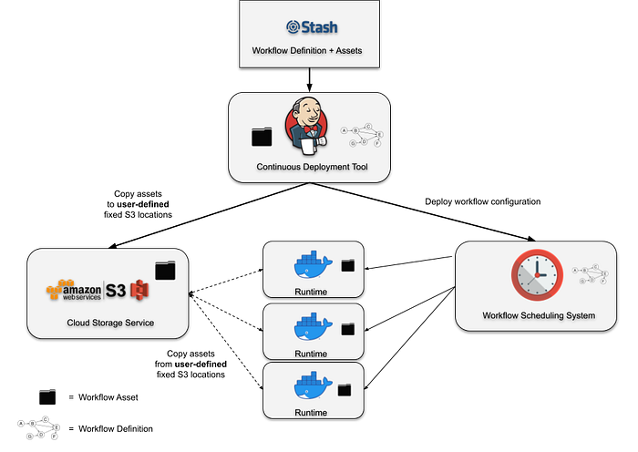
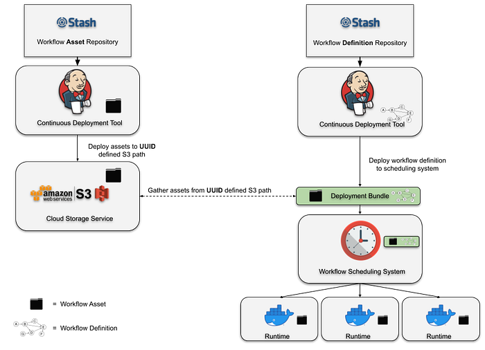
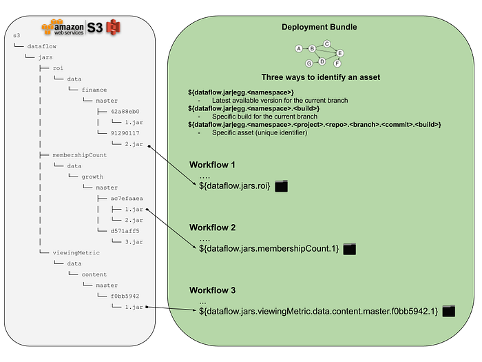
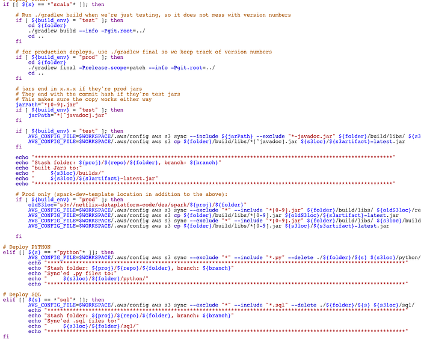

# Data pipeline asset management with Dataflow

by Sam Redai, Jai Balani, Olek Gorajek

## Glossary

- **_asset_** — any business logic code in a raw (e.g. SQL) or compiled (e.g. JAR) form to be executed as part of the user defined data pipeline.
- ****_data pipeline_****** — a set of tasks (or jobs) to be executed in a predefined order (a.k.a. DAG) for the purpose of transforming data using some business logic.**
- **_Dataflow_** — Netflix homegrown CLI tool for data pipeline management.
- **job **— a.k.a task, an atomic unit of data transformation logic, a non-separable execution block in the workflow chain.
- **_namespace_** — unique label, usually representing a business subject area, assigned to a workflow asset to identify it across all other assets managed by Dataflow (e.g. security).
- **_workflow_** — see “data pipeline”

## Intro

The problem of managing scheduled workflows and their assets is as old as the use of cron daemon in early Unix operating systems. The design of a cron job is simple, you take some system command, you pick the schedule to run it on and you are done. Example:

```
0 0 * * MON /home/alice/backup.sh
```

In the above example the system would wake up every Monday morning and execute the backup.sh script. Simple right? But what if the script does not exist in the given path, or what if it existed initially but then Alice let Bob access her home directory and he accidentally deleted it? Or what if Alice wanted to add new backup functionality and she accidentally broke existing code while updating it?

The answers to these questions is something we would like to address in this article and propose a clean solution to this problem.

Let’s define some requirements that we are interested in delivering to the Netflix data engineers or anyone who would like to schedule a workflow with some external assets in it. By external assets we simply mean some executable carrying the actual business logic of the job. It could be a JAR compiled from Scala, a Python script or module, or a simple SQL file. The important thing is that this business logic can be built in a separate repository and maintained independently from the workflow definition. Keeping all that in mind we would like to achieve the following properties for the whole workflow deployment:

1. **Versioning**: we want both the workflow definition and its assets to be versioned and we want the versions to be tied together in a clear way.
2. **Transparency**: we want to know which version of an asset is running along with every workflow instance, so if there are any issues we can easily identify which version caused the problem and to which one we could revert, if necessary.
3. **ACID deployment**: for every scheduler workflow definition change, we would like to have all the workflow assets bundled in an atomic, durable, isolated and consistent manner. This way, if necessary, all we need to know is which version of the workflow to roll back to, and the rest would be taken care of for us.

While all the above goals are our North Star, we also don’t want to negatively affect fast deployment, high availability and arbitrary life span of any deployed asset.

## Previous solutions

The basic approach to pulling down arbitrary workflow resources during workflow execution has been known to mankind since the invention of cron, and with the advent of “infinite” cloud storage systems like S3, this approach has served us for many years. Its apparent flexibility and convenience can often fool us into thinking that by simply replacing the asset in the S3 location we can, without any hassle, introduce changes to our business logic. This method often proves very troublesome especially if there is more than one engineer working on the same pipeline and they are not all aware of the other folks’ “deployment process”.

The slightly improved approach is shown on the diagram below.


*Figure 1. Manually constructed continuous delivery system.*

In Figure 1, you can see an illustration of a typical deployment pipeline manually constructed by a user for an individual project. The continuous deployment tool submits a workflow definition with pointers to assets in fixed S3 locations. These assets are then separately deployed to these fixed locations. At runtime, the assets are retrieved from the defined locations in S3 and executed in the runtime container. Despite requiring users to construct the deployment pipeline manually, often by writing their own scripts from scratch, this design works and has been successfully used by many teams for years. That being said, it does have some drawbacks that are revealed as you try to add any amount of complexity to your deployment logic. Let’s discuss a few of them.

### Does not consider branch/PR deployments

In any production pipeline, you want the flexibility of having a “safe” alternative deployment logic. For example, you may want to build your Scala code and deploy it to an alternative location in S3 while pushing a sandbox version of your workflow that points to this alternative location. Something this simple gets very complicated very quickly and requires the user to consider a number of things. Where should this alternative location be in S3? Is a single location enough? How do you set up your deployment logic to know when to deploy the workflow to a test or dev environment? Answers to these questions often end up being more custom logic inside of the user’s deployment scripts.

### Cannot rollback to previous workflow versions

When you deploy a workflow, you really want it to encapsulate an atomic and idempotent unit of work. Part of the reason for that is the desire for the ability to rollback to a previous workflow version and knowing that it will always behave as it did in previous runs. There can be many reasons to rollback but the typical one is when you’ve recognized a regression in a recent deployment that was not caught during testing. In the current design, reverting to a previous workflow definition in your scheduling system is not enough! You have to rebuild your assets from source and move them to your fixed S3 location that your workflow points to. To enable atomic rollbacks, you can add more custom logic to your deployment scripts to always deploy your assets to a new location and generate new pointers for your workflows to use, but that comes with higher complexity that often just doesn’t feel worth it. More commonly, teams will opt to do more testing to try and catch regressions before deploying to production and will accept the extra burden of rebuilding all of their workflow dependencies in the event of a regression.

### Runtime dependency on user-managed cloud storage locations

At runtime, the container must reach out to a user-defined storage location to retrieve the assets required. This causes the user-managed storage system to be a critical runtime dependency. If we zoom out to look at an entire workflow management system, the runtime dependencies can become unwieldy if it relies on various storage systems that are arbitrarily defined by the workflow developers!

## Dataflow deployment with asset management

In the attempt to deliver a simple and robust solution to the managed workflow deployments we created a command line utility called Dataflow. It is a Python based CLI + library that can be installed anywhere inside the Netflix environment. This utility can build and configure workflow definitions and their assets during testing and deployment. See below diagram:


*Figure 2. Dataflow asset management system.*

In Figure 2, we show a variation of the typical manually constructed deployment pipeline. Every asset deployment is released to some newly calculated UUID. The workflow definition can then identify a specific asset by its UUID. Deploying the workflow to the scheduling system produces a “Deployment Bundle”. The bundle includes all of the assets that have been referenced by the workflow definition and the entire bundle is deployed to the scheduling system. At every scheduled runtime, the scheduling system can create an instance of your workflow without having to gather runtime dependencies from external systems.

The asset management system that we’ve created for Dataflow provides a strong abstraction over this deployment design. Deploying the asset, generating the UUID, and building the deployment bundle is all handled automatically by the Dataflow build logic. The user does not need to be aware of anything that’s happening on S3, nor that S3 is being used at all! Instead, the user is given a flexible UUID referencing system that’s layered on top of our scheduling system’s workflow DSL. Later in the article we’ll cover this referencing system in some detail. But first, let’s look at an example of deploying an asset and a workflow.

### Deployment of an asset

Let’s walk through an example of a workflow asset build and deployment. Let’s assume we have a repository called **stranger-data** with the following structure:

```
.
├── dataflow.yaml
├── pyspark-workflow
│ ├── main.sch.yaml
│ └── hello_world
│     ├── ...
│     └── setup.py
└── scala-workflow
    ├── build.gradle
    ├── main.sch.yaml
    └── src
    ├── main
    │   └── ...
    └── test
        └── ...
```

Let’s now use Dataflow command to see what project components are visible:

```
stranger-data$ dataflow project list
Python Assets:
 -> ./pyspark-workflow/hello_world/setup.py
Summary: 1 found.
Gradle Assets:
 -> ./scala-workflow/build.gradle
Summary: 1 found.
Scheduler Workflows:
 -> ./scala-workflow/main.sch.yaml
 -> ./pyspark-workflow/main.sch.yaml
Summary: 2found.
```

Before deploying the assets, and especially if we made any changes to them, we can run unit tests to make sure that we didn’t break anything. In a typical Dataflow configuration this manual testing is optional because Dataflow continuous integration tests will do that for us on any pull-request.

```
stranger-data$ dataflow project test
Testing Python Assets:
 -> ./pyspark-workflow/hello_world/setup.py... PASSED
Summary: 1 successful, 0 failed.
Testing Gradle Assets:
 -> ./scala-workflow/build.gradle... PASSED
Summary: 1 successful, 0 failed.
Building Scheduler Workflows:
 -> ./scala-workflow/main.sch.yaml... CREATED ./.workflows/scala-workflow.main.sch.rendered.yaml
 -> ./pyspark-workflow/main.sch.yaml... CREATED ./.workflows/pyspark-workflow.main.sch.rendered.yaml
Summary: 2 successful, 0 failed.
Testing Scheduler Workflows:
 -> ./scala-workflow/main.sch.yaml... PASSED
 -> ./pyspark-workflow/main.sch.yaml... PASSED
Summary: 2 successful, 0 failed.
```

Notice that the test command we use above not only executes unit test suites defined in our Scala and Python sub-projects, but it also renders and statically validates all the workflow definitions in our repo, but more on that later…

Assuming all tests passed, let’s now use the Dataflow command to build and deploy a new version of the Scala and Python assets into the Dataflow asset registry.

```
stranger-data$ dataflow project deploy
Building Python Assets:
 -> ./pyspark-workflow/hello_world/setup.py... CREATED ./pyspark-workflow/hello_world/dist/hello_world-0.0.1-py3.7.egg
Summary: 1 successful, 0 failed.
Deploying Python Assets:
 -> ./pyspark-workflow/hello_world/setup.py... DEPLOYED AS dataflow.egg.hello_world.user.stranger-data.master.39206ee8.3
Summary: 1 successful, 0 failed.
Building Gradle Assets:
 -> ./scala-workflow/build.gradle... CREATED ./scala-workflow/build/libs/scala-workflow-all.jar
Summary: 1 successful, 0 failed.
Deploying Gradle Assets:
 -> ./scala-workflow/build.gradle... DEPLOYED AS dataflow.jar.scala-workflow.user.stranger-data.master.39206ee8.11
Summary: 1 successful, 0 failed.
...
```

Notice that the above command:

- created a new version of the workflow assets
- assigned the asset a “UUID” (consisting of the “dataflow” string, asset type, asset namespace, git repo owner, git repo name, git branch name, commit hash and consecutive build number)
- and deployed them to a Dataflow managed S3 location.

We can check the existing assets of any given type deployed to any given namespace using the following Dataflow command:

```
stranger-data$ dataflow project list eggs --namespace hello_world --deployed
Project namespaces with deployed EGGS:
hello_world
 -> dataflow.egg.hello_world.user.stranger-data.master.39206ee8.3
 -> dataflow.egg.hello_world.user.stranger-data.master.39206ee8.2
 -> dataflow.egg.hello_world.user.stranger-data.master.39206ee8.1
```

The above list could come in handy, for example if we needed to find and access an older version of an asset deployed from a given branch and commit hash.

### Deployment of a workflow

Now let’s have a look at the build and deployment of the workflow definition which references the above assets as part of its pipeline DAG.

Let’s list the workflow definitions in our repo again:

```
stranger-data$ dataflow project list workflows
Scheduler Workflows:
 -> ./scala-workflow/main.sch.yaml
 -> ./pyspark-workflow/main.sch.yaml
Summary: 2 found.
```

And let’s look at part of the content of one of these workflows:

```
stranger-data$ cat ./scala-workflow/main.sch.yaml
...
dag:
 - ddl -> write
 - write -> audit
 - audit -> publish
jobs:
 - ddl: ...
 - write:
     spark:
       script: ${dataflow.jar.scala-workflow}
       class: com.netflix.spark.ExampleApp
       conf: ...
       params: ...
 - audit: ...
 - publish: ...
...
```

You can see from the above snippet that the write job wants to access some version of the JAR from the scala-workflow namespace. A typical workflow definition, written in YAML, does not need any compilation before it is shipped to the Scheduler API, but Dataflow designates a special step called “rendering” to substitute all of the Dataflow variables and build the final version.

The above expression `${dataflow.jar.scala-workflow}` means that the workflow will be rendered and deployed with the latest version of the scala-workflow JAR available at the time of the workflow deployment. It is possible that the JAR is built as part of the same repository in which case the new build of the JAR and a new version of the workflow may be coming from the same deployment. But the JAR may be built as part of a completely different project and in that case the testing and deployment of the new workflow version can be completely decoupled.

We showed above how one would request the latest asset version available during deployment, but with Dataflow asset management we can distinguish two more asset access patterns. An obvious next one is to specify it by all its attributes: asset type, asset namespace, git repo owner, git repo name, git branch name, commit hash and consecutive build number. There is one more extra method for a middle ground solution to pick a specific build for a given namespace and git branch, which can help during testing and development. All of this is part of the user-interface for determining how the deployment bundle will be created. See below diagram for a visual illustration.


*Figure 3. A closer at the Deployment Bundle*

In short, using the above variables gives the user full flexibility and allows them to pick any **version** of any **asset** in any **workflow.**

An example of the workflow deployment with the rendering step is shown below:

```
stranger-data$ dataflow project deploy
...
Building Scheduler Workflows:
 -> ./scala-workflow/main.sch.yaml... CREATED ./.workflows/scala-workflow.main.sch.rendered.yaml
 -> ./pyspark-workflow/main.sch.yaml... CREATED ./.workflows/pyspark-workflow.main.sch.rendered.yaml
Summary: 2 successful, 0 failed.
Deploying Scheduler Workflows:
 -> ./scala-workflow/main.sch.yaml… DEPLOYED AS https://hawkins.com/scheduler/sandbox:user.stranger-data.scala-workflow
 -> ./pyspark-workflow/main.sch.yaml… DEPLOYED AS https://hawkins.com/scheduler/sandbox:user.stranger-data.pyspark-workflow
Summary: 2 successful, 0 failed.
```

And here you can see what the workflow definition looks like before it is sent to the Scheduler API and registered as the latest version. Notice the value of the script variable of the write job. In the original code says `${dataflow.jar.scala-workflow}` and in the rendered version it is translated to a specific file pointer:

```
stranger-data$ cat ./scala-workflow/main.sch.yaml
...
dag:
 - ddl -> write
 - write -> audit
 - audit -> publish
jobs:
 - ddl: ...
 - write:
     spark:
       script: s3://dataflow/jars/scala-workflow/user/stranger-data/master/39206ee8/1.jar
       class: com.netflix.spark.ExampleApp
       conf: ...
       params: ...
 - audit: ...
 - publish: ...
...
```

## User perspective

The Infrastructure DSE team at Netflix is responsible for providing insights into data that can help the Netflix platform and service scale in a secure and effective way. Our team members partner with business units like Platform, OpenConnect, InfoSec and engage in enterprise level initiatives on a regular basis.

One side effect of such wide engagement is that over the years our repository evolved into a mono-repo with each module requiring a customized build, testing and deployment strategy packaged into a single Jenkins job. This setup required constant upkeep and also meant every time we had a build failure multiple people needed to spend a lot of time in communication to ensure they did not step on each other.

Last quarter we decided to split the mono-repo into separate modules and adopt Dataflow as our asset orchestration tool. Post deployment, the team relies on Dataflow for automated execution of unit tests, management and deployment of workflow related assets.

By the end of the migration process our Jenkins configuration went from:


*Figure 4. Real example of a deployment script.*

to:

```
cd /dataflow_workspace
dataflow project deploy
```

The simplicity of deployment enabled the team to focus on the problems they set out to solve while the branch based customization gave us the flexibility to be our most effective at solving them.

## Conclusions

This new method available for Netflix data engineers makes workflow management easier, more transparent and more reliable. And while it remains fairly easy and safe to build your business logic code (in Scala, Python, etc) in the same repository as the workflow definition that invokes it, the new Dataflow versioned asset registry makes it easier yet to build that code completely independently and then reference it safely inside data pipelines in any other Netflix repository, thus enabling easy code sharing and reuse.

One more aspect of data workflow development that gets enabled by this functionality is what we call branch-driven deployment. This approach enables multiple versions of your business logic and workflows to be running at the same time in the scheduler ecosystem, and makes it easy, not only for individual users to run isolated versions of the code during development, but also to define isolated staging environments through which the code can pass before it reaches the production stage. Obviously, in order for the workflows to be safely used in that configuration they must comply with a few simple rules with regards to the parametrization of their inputs and outputs, but let’s leave this subject for another blog post.

## Credits

Special thanks to Peter Volpe, Harrington Joseph and Daniel Watson for the initial design review.

---
**Tags:** Data Management · Deployment · Automation · Ci Cd Pipeline · Data Engineering
