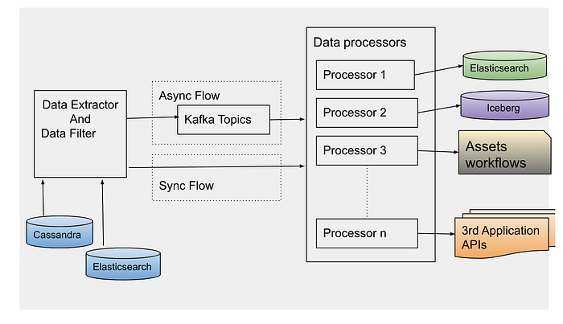
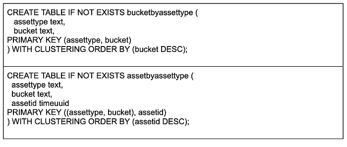
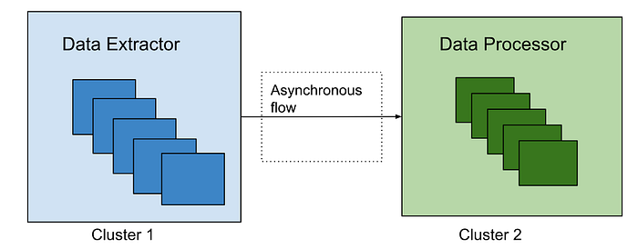

# Data Reprocessing Pipeline in Asset Management Platform @Netflix

By [Meenakshi Jindal](https://www.linkedin.com/in/meenakshijindal/)

## Overview

At Netflix, we built the asset management platform (AMP) as a centralized service to organize, store and discover the digital media assets created during the movie production. Studio applications use this service to store their media assets, which then goes through an asset cycle of schema validation, versioning, access control, sharing, triggering configured workflows like inspection, proxy generation etc. This platform has evolved from supporting studio applications to data science applications, machine-learning applications to discover the assets metadata, and build various data facts.

**During this evolution, quite often we receive requests to update the existing assets metadata or add new metadata for the new features added. This pattern grows over time when we need to access and update the existing assets metadata. Hence we built the data pipeline that can be used to extract the existing assets metadata and process it specifically to each new use case.** This framework allowed us to evolve and adapt the application to any unpredictable inevitable changes requested by our platform clients without any downtime. Production assets operations are performed in parallel with older data reprocessing without any service downtime. Some of the common supported data reprocessing use cases are listed below.

## Production Use Cases

- Real-Time APIs (backed by the Cassandra database) for asset metadata access don’t fit analytics use cases by data science or machine learning teams. We build the data pipeline to persist the assets data in the [iceberg](https://iceberg.apache.org/) in parallel with cassandra and elasticsearch DB. But to build the data facts, we need the complete data set in the iceberg and not just the new. Hence the existing assets data was read and copied to the iceberg tables without any production downtime.
- Asset versioning scheme is evolved to support the major and minor version of assets metadata and relations update. This feature support required a significant update in the data table design (which includes new tables and updating existing table columns). Existing data got updated to be backward compatible without impacting the existing running production traffic.
- Elasticsearch version upgrade which includes backward incompatible changes, so all the assets data is read from the primary source of truth and reindexed again in the new indices.
- **Data Sharding strategy in elasticsearch is updated to provide low search latency** (as described in [blog](https://medium.com/@netflixtechblog/elasticsearch-indexing-strategy-in-asset-management-platform-amp-99332231e541) post)
- Design of new Cassandra reverse indices to support different sets of queries.
- Automated workflows are configured for media assets (like inspection) and these workflows are required to be triggered for old existing assets too.
- Assets Schema got evolved that required reindexing all assets data again in ElasticSearch to support search/stats queries on new fields.
- Bulk deletion of assets related to titles for which license is expired.
- Updating or Adding metadata to existing assets because of some regressions in client application/within service itself.

## Data Reprocessing Pipeline Flow

*Figure 1. Data Reprocessing Pipeline Flow*

## Data Extractor

Cassandra is the primary data store of the asset management service. With SQL datastore, it was easy to access the existing data with pagination regardless of the data size. But there is no such concept of pagination with No-SQL datastores like Cassandra. Some features are provided by Cassandra (with newer versions) to support pagination like [pagingstate](https://docs.datastax.com/en/drivers/java/2.1/com/datastax/driver/core/PagingState.html), [COPY](https://docs.datastax.com/en/cql-oss/3.x/cql/cql_reference/cqlshCopy.html), but each one of them has some limitations. To avoid dependency on data store limitations, we designed our data tables such that the data can be read with pagination in a performant way.

Mainly we read the assets data either by asset schema types or time bucket based on asset creation time. Data sharding completely based on the asset type may have created the wide rows considering some types like VIDEO may have many more assets compared to others like TEXT. Hence, we used the asset types and time buckets based on asset creation date for data sharding across the Cassandra nodes. Following is the example of tables primary and clustering keys defined:

*Figure 2. Cassandra Table Design*

Based on the asset type, first time buckets are fetched which depends on the creation time of assets. Then using the time buckets and asset types, a list of assets ids in those buckets are fetched. Asset Id is defined as a cassandra T[imeuuid](https://docs.datastax.com/en/cql-oss/3.3/cql/cql_reference/uuid_type_r.html) data type. We use Timeuuids for AssetId because it can be sorted and then used to support pagination. Any sortable Id can be used as the table primary key to support the pagination. Based on the page size e.g. N, first N rows are fetched from the table. Next page is fetched from the table with limit N and asset id < last asset id fetched.

*Figure 3. Cassandra Data Fetch Query*

Data layers can be designed based on different business specific entities which can be used to read the data by those buckets. But the primary id of the table should be sortable to support the pagination.

Sometimes we have to reprocess a specific set of assets only based on some field in the payload. We can use Cassandra to read assets based on time or an asset type and then further filter from those assets which satisfy the user’s criteria. Instead we use Elasticsearch to search those assets which are more performant.

After reading the asset ids using one of the ways, an event is created per asset id to be processed synchronously or asynchronously based on the use case. For asynchronous processing, events are sent to Apache Kafka topics to be processed.

## Data Processor

Data processor is designed to process the data differently based on the use case. Hence, different processors are defined which can be extended based on the evolving requirements. Data can be processed synchronously or asynchronously.

**Synchronous Flow**: Depending on the event type, the specific processor can be directly invoked on the filtered data. Generally, this flow is used for small datasets.

**Asynchronous Flow**: **Data processor consumes the data events sent by the data extractor. ****[Apache Kafka](https://kafka.apache.org/)**** topic is configured as a message broker**. Depending on the use case, we have to control the number of events processed in a time unit e.g. to reindex all the data in elasticsearch because of template change, it is preferred to re-index the data at certain RPS to avoid any impact on the running production workflow. Async processing has the benefit to control the flow of event processing with Kafka consumers count or with controlling thread pool size on each consumer. Event processing can also be stopped at any time by disabling the consumers in case production flow gets any impact with this parallel data processing. For fast processing of the events, we use different [settings](https://kafka.apache.org/documentation/#consumerconfigs_max.poll.records) of Kafka consumer and Java executor thread pool. We poll records in bulk from Kafka topics, and process them asynchronously with multiple threads. Depending on the processor type, events can be processed at high scale with right settings of consumer poll size and thread pool.

Each of these use cases mentioned above looks different, but they all need the same reprocessing flow to extract the old data to be processed. Many applications design data pipelines for the processing of the new data; but setting up such a data processing pipeline for the existing data supports handling the new features by just implementing a new processor. This pipeline can be thoughtfully triggered anytime with the data filters and data processor type (which defines the actual action to be performed).

## Error Handling

Errors are part of software development. But with this framework, it has to be designed more carefully as bulk data reprocessing will be done in parallel with the production traffic. We have set up the different clusters of data extractor and processor from the main Production cluster to process the older assets data to avoid any impact of the assets operations live in production. Such clusters may have different configurations of thread pools to read and write data from database, logging levels and connection configuration with external dependencies.

*Figure 4: Processing clusters*

Data processors are designed to continue processing the events even in case of some errors for eg. There are some unexpected payloads in old data. In case of any error in the processing of an event, Kafka consumers acknowledge that event is processed and send those events to a different queue after some retries. Otherwise Kafka consumers will continue trying to process the same message again and block the processing of other events in the topic. We reprocess data in the dead letter queue after fixing the root cause of the issue. We collect the failure metrics to be checked and fixed later. We have set up the alerts and continuously monitor the production traffic which can be impacted because of the bulk old data reprocessing. In case any impact is noticed, we should be able to slow down or stop the data reprocessing at any time. With different data processor clusters, this can be easily done by reducing the number of instances processing the events or reducing the cluster to 0 instances in case we need a complete halt.

## Best Practices

- Depending on existing data size and use case, processing may impact the production flow. So identify the optimal event processing limits and accordingly configure the consumer threads.
- If the data processor is calling any external services, check the processing limits of those services because bulk data processing may create unexpected traffic to those services and cause scalability/availability issues.
- Backend processing may take time from seconds to minutes. Update the Kafka consumer timeout settings accordingly otherwise different consumer may try to process the same event again after processing timeout.
- Verify the data processor module with a small data set first, before trigger processing of the complete data set.
- Collect the success and error processing metrics because sometimes old data may have some edge cases not handled correctly in the processors. We are using the Netflix[ Atlas](https://github.com/Netflix/atlas) framework to collect and monitor such metrics.

## Acknowledgements

[Burak Bacioglu](mailto:burakb@netflix.com) and other members of the Asset Management platform team have contributed in the design and development of this data reprocessing pipeline.

---
**Tags:** Data Processing · Kafka · Asset Management · Elasticsearch · Cassandra
