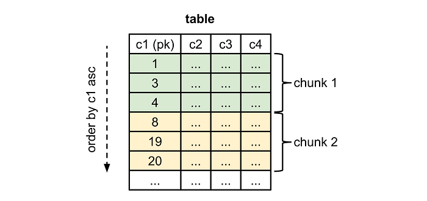
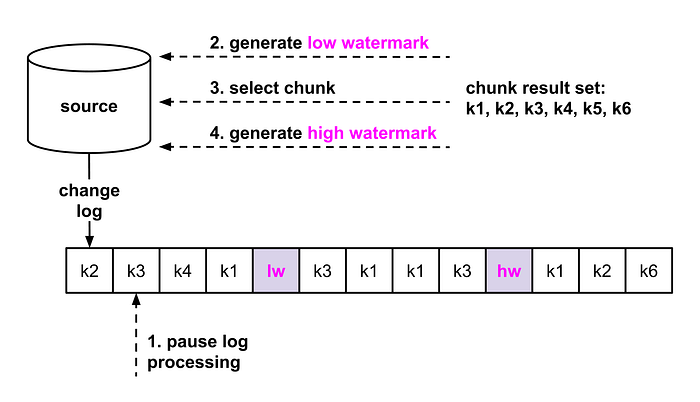
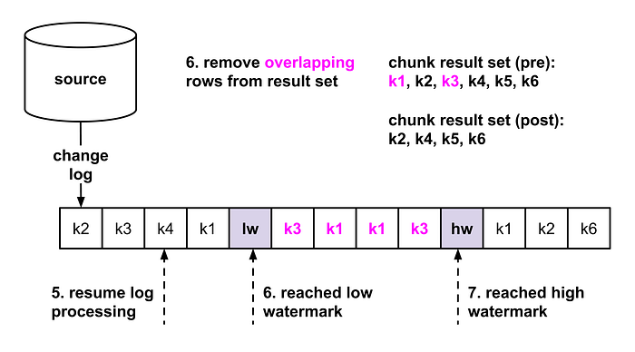
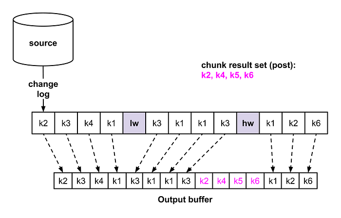
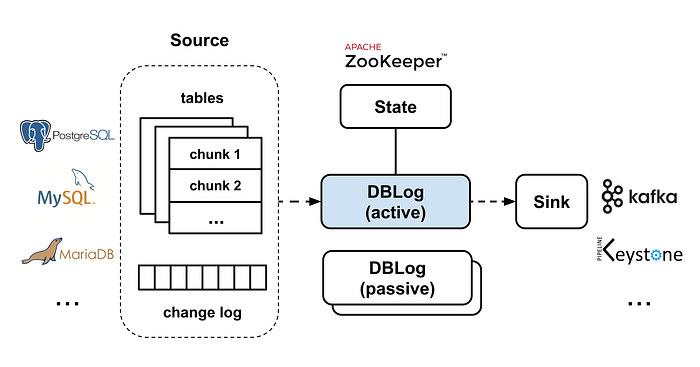
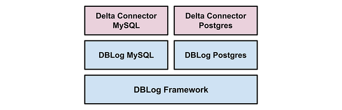

# DBLog: A Generic Change-Data-Capture Framework

[Andreas Andreakis](https://www.linkedin.com/in/andreas-andreakis-b95606a1/), [Ioannis Papapanagiotou](https://www.linkedin.com/in/ipapapa/)

## Overview

Change-Data-Capture (CDC) allows capturing committed changes from a database in real-time and propagating those changes to downstream consumers [1][2]. CDC is becoming increasingly popular for use cases that require keeping multiple heterogeneous datastores in sync (like MySQL and ElasticSearch) and addresses challenges that exist with traditional techniques like dual-writes and distributed transactions [3][4].

In databases like MySQL and PostgreSQL, transaction logs are the source of CDC events. As transaction logs typically have limited **retention**, they aren’t guaranteed to contain the full history of changes. Therefore, dumps are needed to capture the full state of a source. There are several open source CDC projects, often using the same underlying libraries, database APIs, and protocols. Nonetheless, we found a number of limitations that could not satisfy our requirements e.g. stalling the processing of log events until a dump is complete, missing ability to trigger dumps on demand, or implementations that block write traffic by using table locks.

This motivated the development of **DBLog**, which offers log and dump processing under a generic framework. In order to be supported, a database is required to fulfill a set of features that are commonly available in systems like MySQL, PostgreSQL, MariaDB, and others.

Some of DBLog’s features are:

- **Processes captured log events in-order.**
- **Dumps can be taken any time**, across all tables, for a specific table or specific primary keys of a table.
- **Interleaves log with dump events, ******by taking dumps in chunks****. This way log processing can progress alongside dump processing. If the process is terminated, it can resume after the last completed chunk without needing to start from scratch. This also allows dumps to be throttled and paused if needed.
- **No locks on tables are ever acquired,** which prevent impacting write traffic on the source database.
- **Supports any kind of output**, so that the output can be a stream, datastore, or even an API.
- **Designed with High Availability in mind**. Hence, downstream consumers have confidence to receive change events as they occur on a source.

## Requirements

In a previous blog post, we discussed [Delta](https://medium.com/netflix-techblog/delta-a-data-synchronization-and-enrichment-platform-e82c36a79aee), a data enrichment and synchronization platform. The goal of Delta is to keep multiple datastores in sync, where one store is the source of truth (like MySQL) and others are derived stores (like ElasticSearch). One of the key requirements is to have low propagation delays from the source of truth to the destinations and that the flow of events is highly available. These conditions apply regardless if multiple datastores are used by the same team, or if one team is owning data which another team is consuming. In our [Delta blog post](https://medium.com/netflix-techblog/delta-a-data-synchronization-and-enrichment-platform-e82c36a79aee), we also described use cases beyond data synchronization, such as event processing.

For data synchronization and event processing use cases, we need to fulfill the following requirements, beyond the ability to capture changes in real-time:

- **Capturing the full state. **Derived stores (like ElasticSearch) must eventually store the full state of the source. We provide this via dumps from the source database.
- **Triggering repairs at any time. **Instead of treating dumps as a one-time setup activity, we aim to enable them at any time: across all tables, on a specific table, or for specific primary keys. This is crucial for repairs downstream when data has been lost or corrupted.
- **Providing high availability for real-time events.** The propagation of real-time changes has high availability requirements; it is undesired if the flow of events stops for a longer duration of time (such as minutes or longer). This requirement needs to be fulfilled even when repairs are in progress so that they don’t stall real-time events. We want real-time and dump events to be interleaved so that both make progress.
- **Minimizing database impact**. When connecting to a database, it is important to ensure that it is impacted as little as possible in terms of its bandwidth and ability to serve reads and writes for applications. For this reason, it is preferred to avoid using APIs which can block write traffic such as locks on tables. In addition to that, controls must be put in place which allow throttling of log and dump processing, or to pause the processing if needed.
- **Writing events to any output. **For streaming technology, Netflix utilizes a variety of options such as Kafka, SQS, Kinesis, and even Netflix specific streaming solutions such as [Keystone](https://medium.com/netflix-techblog/keystone-real-time-stream-processing-platform-a3ee651812a). Even though having a stream as an output can be a good choice (like when having multiple consumers), it is not always an ideal choice (as if there is only one consumer). We want to provide the ability to directly write to a destination without passing through a stream. The destination may be a datastore or an external API.
- **Supporting Relational Databases**. There are services at Netflix that use RDBMS kind of databases such as MySQL or PostgreSQL via AWS RDS. We want to support these systems as a source so that they can provide their data for further consumption.

## Existing Solutions

We evaluated a series of existing Open Source offerings, including: [Maxwell](https://github.com/zendesk/maxwell), [SpinalTap](https://github.com/airbnb/SpinalTap), Yelp’s [MySQL Streamer](https://github.com/Yelp/mysql_streamer), and [Debezium](https://github.com/debezium/debezium). Existing solutions are similar in regard to capturing real-time changes that originate from a transaction log. For example by using MySQL’s binlog replication protocol, or PostgreSQL’s replication slots.

In terms of dump processing, we found that existing solutions have at least one of the following limitations:

- **Stopping log event processing while processing a dump**. This limitation applies if log events are not processed while a dump is in progress. As a consequence, if a dump has a large volume, log event processing stalls for an extended period of time. This is an issue when downstream consumers rely on short propagation delays of real-time changes.
- **Missing ability to trigger dumps on demand**. Most solutions execute a dump initially during a bootstrap phase or if data loss is detected at the transaction logs. However, the ability to trigger dumps on demand is crucial for bootstrapping new consumers downstream (like a new ElasticSearch index) or for repairs in case of data loss.
- **Blocking write traffic by locking tables**. Some solutions use locks on tables to coordinate the dump processing. Depending on the implementation and database, the duration of locking can either be brief or can last throughout the whole dump process [5]. In the latter case, write traffic is blocked until the dump completes. In some cases, a [dedicated read replica](https://engineeringblog.yelp.com/2016/08/streaming-mysql-tables-in-real-time-to-kafka.html) can be configured in order to avoid impacting writes on the master. However, this strategy does not work for all databases. For example in PostgreSQL RDS, changes can only be captured from the master.
- **Using database specific features**. We found that some solutions use advanced database features that are typically not available in other systems, such as: using MySQL’s blackhole engine or getting a consistent snapshot for dumps from the creation of a PostgreSQL replication slot. Preventing code reuse across databases.

Ultimately, we decided to implement a different approach to handle dumps. One which:

- interleaves log with dump events so that both can make progress
- allows to trigger dumps at any time
- does not use table locks
- uses commonly available database features

## DBLog Framework

DBLog is a Java-based framework, able to capture changes in real-time and to take dumps. Dumps are taken in chunks so that they interleave with real-time events and don’t stall real-time event processing for an extended period of time. Dumps can be taken any time, via a provided API. This allows downstream consumers to capture the full database state initially or at a later time for repairs.

We designed the framework to minimize database impact. Dumps can be paused and resumed as needed. This is relevant both for recovery after failure and to stop processing if the database reached a bottleneck. We also don’t take locks on tables in order not to impact the application writes.

DBLog allows writing captured events to any output, even if it is another database or API. We use Zookeeper to store state related to log and dump processing, and for leader election. We have built DBLog with pluggability in mind allowing implementations to be swapped as desired (like replacing Zookeeper with something else).

The following subsections explain log and dump processing in more detail.

### Log Processing

The framework requires a database to emit an event for each changed row in real-time and in commit order. A transaction log is assumed to be the origin of those events. The database is sending them to a transport that DBLog can consume. We use the term ‘_change log’_ for that transport. An event can either be of type: _create_, _update_, or _delete_.** For each event, the following needs to be provided: a log sequence number, the column state at the time of the operation, and the schema that applied at the time of the operation.**

Each change is serialized into the DBLog event format and is sent to the writer so that it can be delivered to an output. Sending events to the writer is a non-blocking operation, as the writer runs in its own thread and collects events in an internal buffer. Buffered events are written to an output in-order. The framework allows to plugin a custom formatter for serializing events to a custom format. The output is a simple interface, allowing to plugin any desired destination, such as a stream, datastore or even an API.

### Dump Processing

Dumps are needed as transaction logs have limited retention, which prevents their use for reconstituting a full source dataset. Dumps are taken in chunks so that they can interleave with log events, allowing both to progress. An event is generated for each selected row of a chunk and is serialized in the same format as log events. This way, a downstream consumer does not need to be concerned if events originate from the log or dumps. Both log and dump events are sent to the output via the same writer.

Dumps can be scheduled any time via an API for all tables, a specific table or for specific primary keys of a table. A dump request per table is executed in chunks of a configured size. Additionally, a delay can be configured to hold back the processing of new chunks, allowing only log event processing during that time. The chunk size and the delay allow to balance between log and dump event processing and both settings can be updated at runtime.

Chunks are selected by sorting a table in ascending primary key order and including rows, where the primary key is greater than the last primary key of the previous chunk. It is required for a database to execute this query efficiently, which typically applies for systems that implement range scans over primary keys.

*Figure 1. Chunking a table with 4 columns c1-c4 and c1 as the primary key (pk). Pk column is of type integer and chunk size is 3. Chunk 2 is selected with the condition c1 > 4.*

Chunks need to be taken in a way that does not stall log event processing for an extended period of time and which preserves the history of log changes so that a selected row with an older value can not override newer state from log events.

In order to achieve this, we create recognizable watermark events in the change log so that we can sequence the chunk selection. Watermarks are implemented via a table at the source database. The table is stored in a dedicated namespace so that no collisions occur with application tables. Only a single row is contained in the table which stores a UUID field. A watermark is generated by updating this row to a specific UUID. The row update results in a change event which is eventually received through the change log.

By using watermarks, dumps are taken using the following steps:

1. Briefly pause log event processing.
2. Generate a low watermark by updating the watermark table.
3. Run SELECT statement for the next chunk and store result-set in-memory, indexed by primary key.
4. Generate a high watermark by updating the watermark table.
5. Resume sending received log events to the output. Watch for the low and high watermark events in the log.
6. Once the low watermark event is received, start removing entries from the result-set for all log event primary keys that are received after the low watermark.
7. Once the high watermark event is received, send all remaining result-set entries to the output before processing new log events.
8. Go to step 1 if more chunks present.

A SELECT is assumed to return state which represents committed changes up to a certain point in history. Or equivalently: a SELECT executes on a specific position of the change log, considering changes up to that point. Databases typically don’t expose the SELECT execution position (MariaDB is an [exception](https://mariadb.com/kb/en/library/enhancements-for-start-transaction-with-consistent-snapshot/#status-variables)).

The core idea of our approach is to determine a window on the change log which guarantees to contain the chunk SELECT position. The window is opened by writing the low watermark, the SELECT runs, and the window is closed by writing the high watermark. As the exact SELECT position is unknown, all selected rows are removed which collide with log events within that window. This ensures that the chunk selection can not override the history of log changes.

In order for this to work, the SELECT must read the table state from the time of the low watermark write, or later (it is ok to include changes that committed after the low watermark write and before the read). More generally, it is required that **the SELECT sees the changes that committed before its execution**. We define this capability as ‘non-stale reads’. Additionally, as the high watermark is written afterwards, it is guaranteed that the SELECT is executed before that.

Figures 2a and 2b are illustrating the chunk selection algorithm. We provide an example with a table that has primary keys k1 to k6. Each change log entry represents a create, update, or delete event for a primary key. In figure 2a, we showcase the watermark generation and chunk selection (steps 1 to 4). Updating the watermark table at step 2 and 4 creates two change events (magenta color) which are eventually received via the log. In figure 2b, we focus on the selected chunk rows that are removed from the result set for primary keys that appear between the watermarks (steps 5 to 7).

*Figure 2a — The watermark algorithm for chunk selection (steps 1–4).*

*Figure 2b — The watermark algorithm for chunk selection (steps 5–7).*

Note that a large count of log events may appear between the low and high watermark, if one or more transactions committed a large set of row changes in between. This is why our approach is briefly pausing log processing during steps 2–4 so that the watermarks are not missed. This way, log event processing can resume event-by-event afterwards, eventually discovering the watermarks, without ever needing to cache log event entries. Log processing is paused only briefly as steps 2–4 are expected to be fast: watermark updates are single write operations and the SELECT runs with a limit.

Once the high watermark is received at step 7, the non-conflicting chunk rows are handed over to the written for in-order delivery to the output. This is a non-blocking operation as the writer runs in a separate thread, allowing log processing to quickly resume after step 7. Afterwards, log event processing continues for events that occur post the high watermark.

In Figure 2c we are depicting the order of writes throughout a chunk selection, by using the same example as figures 2a and 2b. Log events that appear up to the high watermark are written first. Then, the remaining rows from the chunk result (magenta color). And finally, log events that occur after the high watermark_._

*Figure 2c — Order of output writes. Interleaving log with dump events.*

## Database support

In order to use DBLog a database needs to provide a change log from a linear history of committed changes and non-stale reads. These conditions are fulfilled by systems like MySQL, PostgreSQL, MariaDB, etc. so that the framework can be used uniformly across these kind of databases.

So far, we added support for MySQL and PostgreSQL. Integrating log events required using different libraries as each database uses a proprietary protocol. For MySQL, we use [shyiko/mysql-binlog-connector](https://github.com/shyiko/mysql-binlog-connector-java) which implementing the binlog replication protocol in order to receive events from a MySQL host. For PostgreSQL, we are using replication slots with the [wal2json](https://github.com/eulerto/wal2json) plugin. Changes are received via the streaming replication protocol which is implemented by the PostgreSQL [jdbc driver](https://jdbc.postgresql.org/). Determining the schema per captured change varies between MySQL and PostgreSQL. In PostgreSQL, wal2json contains the column names and types alongside with the column values. For MySQL schema changes must be tracked which are received as binlog events.

Dump processing was integrated by using SQL and JDBC, only requiring to implement the chunk selection and watermark update. The same code is used for MySQL and PostgreSQL and can be used for other similar databases as well. The dump processing itself has no dependency on SQL or JDBC and allows to integrate databases which fulfill the DBLog framework requirements even if they use different standards.

*Figure 3 — DBLog High Level Architecture.*

## High Availability

DBLog uses an active-passive architecture. One instance is active and the others are passive standbys. We leverage [Zookeeper](https://zookeeper.apache.org/) for leader election to determine the active instance. The leadership is a lease and is lost if it is not refreshed in time, allowing another instance to take over. We currently deploy one instance per AZ (typically we have 3 AZs), so that if one AZ goes down, an instance in another AZ can continue processing with minimal overall downtime. Passive instances across regions are also possible, though it is recommended to operate in the same region as the database host in order to keep the change capture latencies low.

## Production usage

DBLog is the foundation of the MySQL and PostgreSQL Connectors at Netflix, which are used in [Delta](https://medium.com/netflix-techblog/delta-a-data-synchronization-and-enrichment-platform-e82c36a79aee). Delta is used in production since 2018 for datastore synchronization and event processing use cases in Netflix studio applications. On top of DBLog, the Delta Connectors are using a custom event serializer, so that the Delta event format is used when writing events to an output. Netflix specific streams are used as outputs such as [Keystone](https://medium.com/netflix-techblog/keystone-real-time-stream-processing-platform-a3ee651812a).

*Figure 4— Delta Connector.*

Beyond Delta, DBLog is also used to build Connectors for other Netflix data movement platforms, which have their own data formats.

## Stay Tuned

DBLog has additional capabilities which are not covered by this blog post, such as:

- Ability to capture table schemas without using locks.
- Schema store integration. Storing the schema of each event that is sent to an output and having a reference in the payload of each event to the schema store.
- Monotonic writes mode. Ensuring that once the state has been written for a specific row, a less recent state can not be written afterward. This way downstream consumers experience state transitions only in a forward direction, without going back-and-forth in time.

We are planning to open source DBLog and include additional documentation.

## Credits

We would like to thank the following persons for contributing to the development of DBLog: [Josh Snyder](https://www.linkedin.com/in/josnyder406/), [Raghuram Onti Srinivasan](https://www.linkedin.com/in/raghuramos/), [Tharanga Gamaethige](https://www.linkedin.com/in/tgamaethige/), and [Yun Wang](https://www.linkedin.com/in/yunwang-io/).

## References

[1] Das, Shirshanka, et al. “[All aboard the Databus!: Linkedin’s scalable consistent change data capture platform.](https://engineering.linkedin.com/research/2012/all-aboard-the-databus-linkedlns-scalable-consistent-change-data-capture-platform)” Proceedings of the Third ACM Symposium on Cloud Computing. ACM, 2012

[2] “[About Change Data Capture (SQL Server)](https://docs.microsoft.com/en-us/sql/relational-databases/track-changes/about-change-data-capture-sql-server?view=sql-server-2017)”, Microsoft SQL docs, 2019

[3] Kleppmann, Martin, “[Using logs to build a solid data infrastructure (or: why dual writes are a bad idea)](https://www.confluent.io/blog/using-logs-to-build-a-solid-data-infrastructure-or-why-dual-writes-are-a-bad-idea/)“, Confluent, 2015

[4] Kleppmann, Martin, Alastair R. Beresford, and Boerge Svingen. “[Online event processing.](https://martin.kleppmann.com/papers/olep-cacm.pdf)” Communications of the ACM 62.5 (2019): 43–49

[5] [https://debezium.io/documentation/reference/0.10/connectors/mysql.html#snapshots](https://debezium.io/documentation/reference/0.10/connectors/mysql.html#snapshots)

---
**Tags:** MySQL · Postgres · Change Data Capture · Data Synchronization · Database
