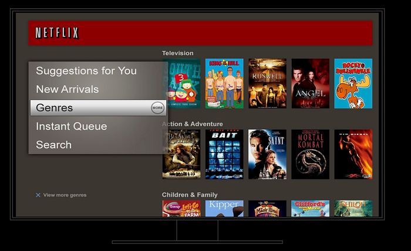

# Decision Making at Netflix

[_Martin Tingley_](https://www.linkedin.com/in/martintingley/)_ with _[_Wenjing Zheng_](https://www.linkedin.com/in/wenjing-zheng/)_, _[_Simon Ejdemyr_](https://www.linkedin.com/in/simon-ejdemyr-22b920123/)_, _[_Stephanie Lane_](https://www.linkedin.com/in/stephanielane1/)_, and _[_Colin McFarland_](https://www.linkedin.com/in/mcfrl/)

_This introduction is the first in a multi-part series on how Netflix uses A/B tests to make decisions that continuously improve our products, so we can deliver more joy and satisfaction to our members. Subsequent posts will cover the basic statistical concepts underpinning A/B tests, the role of experimentation across Netflix, how Netflix has invested in infrastructure to support and scale experimentation, and the importance of the culture of experimentation within Netflix._

**Netflix was created with the idea of putting consumer choice and control at the center of the entertainment experience, and as a company we continuously evolve our product offerings to improve on that value proposition.** For example, the Netflix UI has undergone a complete transformation over the last decade. Back in 2010, the UI was static, with limited navigation options and a presentation inspired by displays at a video rental store. Now, the UI is immersive and video-forward, the navigation options richer but less obtrusive, and the box art presentation takes greater advantage of the digital experience.

*Figure 1: The Netflix TVUI in 2010 (top) and in 2020 (bottom).*

Transitioning from that 2010 experience to what we have today required Netflix to make countless decisions. What’s the right balance between a large display area for a single title vs showing more titles? Are videos better than static images? How do we deliver a seamless video-forward experience on constrained networks? How do we select which titles to show? Where do the navigation menus belong and what should they contain? The list goes on.

**Making decisions is easy — what’s hard is making the right decisions.** How can we be confident that our decisions are delivering a better product experience for current members and helping grow the business with new members? There are a number of ways Netflix could make decisions about how to evolve our product to deliver more joy to our members:

- Let leadership make all the decisions.
- Hire some experts in design, product management, UX, streaming delivery, and other disciplines — and then go with their best ideas.
- Have an internal debate and let the viewpoints of our most charismatic colleagues carry the day.
- Copy the competition.

*Figure 2: Different ways to make decisions. Clockwise from top left: leadership, internal experts, copy the competition, group debate.*

In each of these paradigms, a limited number of viewpoints and perspectives contribute to the decision. The leadership group is small, group debates can only be so big, and Netflix has only so many experts in each domain area where we need to make decisions. And there are maybe a few tens of streaming or related services that we could use as inspiration. Moreover, these paradigms don’t provide a systematic way to make decisions or resolve conflicting viewpoints.

At Netflix, we believe there’s a better way to make decisions about how to improve the experience we deliver to our members: **we use A/B tests**. Experimentation scales. Instead of small groups of executives or experts contributing to a decision, experimentation gives all our members the opportunity to vote, with their actions, on how to continue to evolve their joyful Netflix experience.

More broadly, A/B testing, along with other causal inference methods like [quasi-experimentation](https://netflixtechblog.com/quasi-experimentation-at-netflix-566b57d2e362) are ways that Netflix uses the [scientific method](https://en.wikipedia.org/wiki/Scientific_method) to inform decision making. **We form hypotheses, gather empirical data, including from experiments, that provide evidence for or against our hypotheses, and then make conclusions and generate new hypotheses.** As [explained](https://netflixtechblog.com/a-b-testing-and-beyond-improving-the-netflix-streaming-experience-with-experimentation-and-data-5b0ae9295bdf) by my colleague Nirmal Govind, experimentation plays a critical role in the iterative cycle of deduction (drawing specific conclusions from a general principle) and induction (formulating a general principle from specific results and observations) that underpins the scientific method.

Curious to learn more? Follow the [Netflix Tech Blog](http://netflixtechblog.com/) for future posts that will dive into the details of A/B tests and how Netflix uses tests to inform decision making. [Part 2](./what-is-an-a-b-test-b08cc1b57962.md) is already available.

---
**Tags:** Ab Testing · Experimentation · Causal Inference · Decision Making
