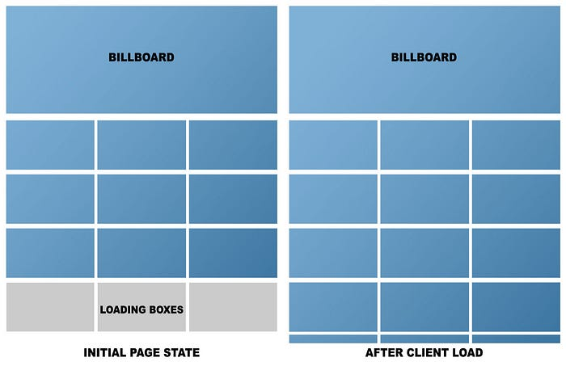
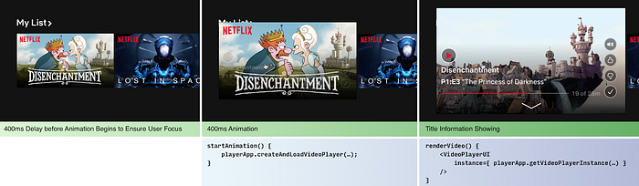
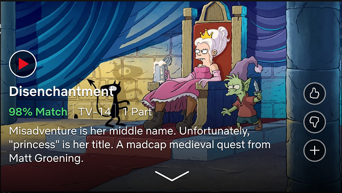

# Delivering Meaning with Previews on Web

> By Corey Grunewald and Tony Casparro

As the Netflix catalog of films and series continues to grow, it becomes more challenging to present members with enough information to decide what to watch. How can a member tell if a movie is both a horror and a comedy? The synopsis and artwork help provide some context, but how can we leverage video previews (trailers) to help members find something great to watch?

Our goal was to create a rich and enjoyable video preview experience to give our users a deeper understanding of the content we have to offer. This deeper understanding about the characters, mood, and other elements of a title is what we consider as meaning.


*Our final video preview experience on the web*

Giving members meaning via video previews brings new technical and experiential challenges. It would need to have fast playback, smooth transitions, and minimal friction. The tasks ahead of us were:

- Optimize the existing homepage to reduce CPU load and network traffic
- Integrate video preview playback in existing canvases
- Create an intuitive user experience

### Optimize Page Load

The previous version of the home page rendered **all **rows of titles as its highest priority. This included fetching data from the server, creating all DOM nodes, and loading images. Our goal was to enable fast vertical scrolling through 30+ rows of titles.

For the new experience, we needed our page to load faster, minimize memory overhead, and allow for smooth playback. We knew these performance optimizations would come with a tradeoff against existing member behavior. To understand these tradeoffs, we began by measuring the existing home page load.

**When the home page loads, we first render the billboard image and the top three rows on the server. Once this page has been delivered to the client, we make a call for the rest of the homepage, render the rest of the rows, and load all the images.**


*Page load from the server vs. page load after auto-loading all rows*

Here’s what the page load looks like from a data perspective.


*Page load from the server vs. page load after auto-loading all rows*

That’s a lot of DOM nodes! In addition to the CPU load of generating those nodes, the sheer number of images we load saturates the member’s bandwidth.

We conducted experiments to determine when to load images and how many to load. We found the best performance by simply rendering only the first few rows of DOM and lazy loading the rest as the member scrolled. This resulted in a decreased load time for members who don’t scroll as far, with a tradeoff of slightly increased rendering time for those who do scroll. The overall result was faster start times for our video previews and full-screen playback.

### Integrating the Video Preview Playback Experience

To get an optimal video preview playback experience, we

- Optimized network usage
- Optimized video player creation
- Simplified existing audio toggling behavior

Our concern with introducing video previews was the impact it would have on network throughput. We did not want to saturate a member’s connection to the point where network contention would slow down non-video requests. We tackled this problem by matching the video preview stream resolution to be roughly the same size as the video preview canvas, thus lowering the amount of video data requested.

To improve video preview start times, we developed a new business logic layer on the client that specifically focused on the creation and interaction of video player instances. This allowed us to decouple video player creation and state management from being tied only to the UI render cycle. With this system, we can efficiently create a video player instance during the UI animation when a focused title expands. While the 400ms animation is taking place, we are already pre-buffering the preview video. When the expanded title canvas renders, it is passed the previously created player instance.



After we optimized the start time of video playback, we tackled audio state management. Members expect that clicking any mute button should globally toggle sound. Previously, we had separate components and places in our application state that represented whether audio should be muted. We converged onto a single component and backing representation for the mute state. We also added a serialization routine inside of the business logic layer to capture mute state in a cookie, so when members refreshed the page, their preference would be preserved.

### Intuitive User Experience

Our main goal with the user experience was to allow our members to focus on each movie/series, understand what it is about, and avoid any friction from the interaction.

Our first point of friction was due to a large amount of information already shown on the expanded title canvas. We know this information is valuable to many members but would distract from the new video preview experience.


*A very busy expanded title canvas*

After trying different variations, we arrived at an expanded title canvas that slowly fades out this extra information over a 10 second period, gradually allowing the member to fully focus on the video preview. This fade out begins as soon as the video starts playing and reverts to full opacity on any interaction. This worked well for members who wanted to be immersed in the video, while still giving control to members who wanted to read the summary or add the title to their list.


*A title canvas which gradually fades out contextual information*

Another key part of reducing friction was to transfer the playing video from the expanded title canvas to the title details canvas, as shown below. The UI canvases were distant relatives in regards to the UI structure making it difficult to pass information between them.


*Transition from the expanded title canvas to the title detail canvas*

We solved this by utilizing unique session identifiers for each canvas type that could be used to query for video playback state. This allowed us to get the current video position from the expanded title canvas when creating the title details canvas and pass in the previous timestamp as the initial position for the new video player instance.

Code Example

```
// inside of TitleDetails.jsx
componentDidMount() {
  const playerService = this.context.videoPlayerService;
  const currentTimeOfExpandedVideo = 
    playerService.api.getCurrentTimeBySessionId(
      this.props.expandedVideoSessionId
    );
  playerService.createVideoPlayer({
    startTime: currentTimeOfExpandedVideo,
    videoId: this.props.videoId
  });
}
```

## Conclusion

Although we feel this is a great step forward in delivering more meaning to our members, we still see opportunities to make the website more effortless for content discovery and playback. In addition, there are more potential wins for members with low bandwidth and CPU restrictions by reducing payload and streamlining components.

We’ve just scratched the surface of meaning we can bring to our members. Stay tuned for more great things to come.

---
**Tags:** Web Development · Experimentation · Trailers · User Interface · React
