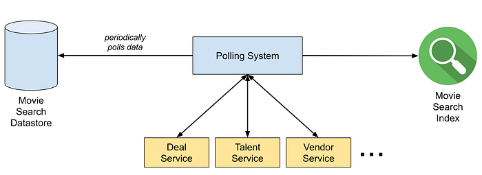
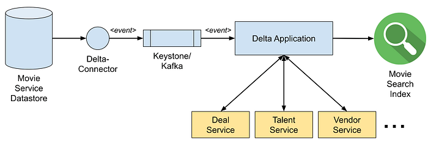
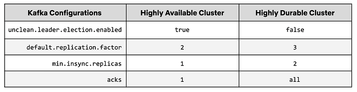
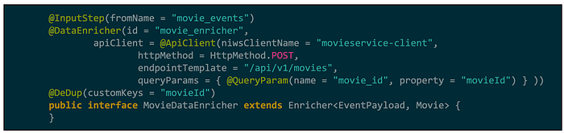
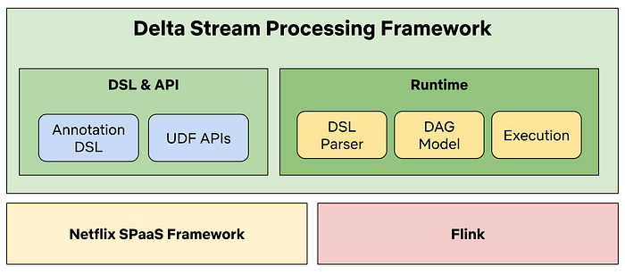
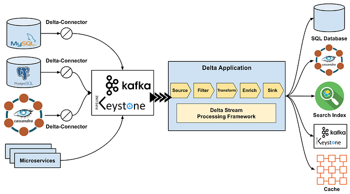

# Delta: A Data Synchronization and Enrichment Platform

> Part I: Overview

[_Andreas Andreakis_](https://www.linkedin.com/in/andreas-andreakis-b95606a1/)_, _[_Falguni Jhaveri_](https://www.linkedin.com/in/falgunijhaveri/)_, _[_Ioannis Papapanagiotou_](https://www.linkedin.com/in/ipapapa/)_, _[_Mark Cho_](https://www.linkedin.com/in/markcho/)_, _[_Poorna Reddy_](https://www.linkedin.com/in/poorna-reddy-5721939/)_, _[_Tongliang Liu_](https://www.linkedin.com/in/tonylxc/)

## Overview

It is a commonly observed pattern for applications to utilize multiple datastores where each is used to serve a specific need such as storing the canonical form of data (MySQL etc.), providing advanced search capabilities (ElasticSearch etc.), caching (Memcached etc.), and more. Typically when using multiple datastores, one of them acts as the primary store, and the others as derived stores. Now the challenge becomes how to keep these datastores in sync.

We have observed a series of distinct patterns which have tried to address **multi-datastore synchronization**, such as dual writes, distributed transactions, etc. However, these approaches have limitations in regards to feasibility, robustness, and maintenance. Beyond data synchronization, some applications also need to enrich their data by calling external services.

To address these challenges, we developed **Delta**. Delta is an eventual consistent, event driven, data synchronization and enrichment platform.

## Existing Solutions

### Dual Writes

In order to keep two datastores in sync, one could perform a dual write, which is executing a write to one datastore following a second write to the other. The first write can be retried, and the second can be aborted should the first fail after exhausting retries. However, the two datastores can get out of sync if the write to the second datastore fails. A common solution is to build a repair routine, which can periodically re-apply data from the first to the second store, or does so only if differences are detected.

**Issues:  
**Implementing the repair routine typically is tailored work which may not be reusable. Also, data between the stores remain out of sync until the repair routine is applied. The solution can become increasingly complicated if more than two datastores are involved. Finally, the repair routine can add substantial stress to the primary data source during its activity.

### Change Log Table

When mutations (like an insert, update and delete) occur on a set of tables, entries for the changes are added to the log table as part of the same transaction. Another thread or process is constantly polling events from the log table and writes them to one or multiple datastores, optionally removing events from the log table after acknowledged by all datastores.

**Issues:  
**This needs to be implemented as a library and ideally without requiring code changes for the application using it. In a polyglot environment this library implementation needs to be repeated for each supported language and it is challenging to ensure consistent features and behavior across languages.

Another issue exists for the capture of schema changes, where some systems, like MySQL, don’t support transactional schema changes [1][2]. Therefore, the pattern to execute a change (like a schema change) and to transactionally write it to the change log table does not always work.

### Distributed Transactions

Distributed transactions can be used to span a transaction across multiple heterogeneous datastores so that a write operation is either committed to all involved stores or to none.

**Issues:  
**Distributed transactions have proven to be problematic across heterogeneous datastores. By their nature, they can only rely on the lowest common denominator of participating systems. For example, [XA](https://en.wikipedia.org/wiki/X/Open_XA) transactions block execution if the application process fails during the prepare phase; moreover, XA provides no deadlock detection and no support for optimistic concurrency-control schemes. Also, certain systems like ElasticSearch, do not support XA or any other heterogeneous transaction model. Thus, ensuring the atomicity of writes across different storage technologies remains a challenging problem for applications [3].

## Delta

Delta has been developed to address the limitations of existing solutions for data synchronization, and also allows to enrich data on the fly. Our goal was to abstract those complexities from application developers so they can focus on implementing business features. In the following, we are describing “Movie Search”, an actual use case within Netflix that leverages Delta.

In Netflix the microservice architecture is widely adopted and each microservice typically handles only one type of data. The core movie data resides in a microservice called Movie Service, and related data such as movie deals, talents, vendors and so on are managed by multiple other microservices (e.g Deal Service, Talent Service and Vendor Service). Business users in Netflix Studios often need to search by various criteria for movies in order to keep track of productions, therefore, it is crucial for them to be able to search across all data that are related to movies.

Prior to Delta, the movie search team had to fetch data from multiple other microservices before indexing the movie data. Moreover, the team had to build a system that periodically updated their search index by querying others for changes, even if there was no change at all. That system quickly grew very complex and became difficult to maintain.

*Figure 1. Polling System Prior to Delta*

After on-boarding to Delta, the system is simplified into an event driven system, as depicted in the following diagram. CDC (Change-Data-Capture) events are sent by the Delta-Connector to a Keystone Kafka topic. A Delta application built using the Delta Stream Processing Framework (based on Flink) consumes the CDC events from the topic, enriches each of them by calling other microservices, and finally sinks the enriched data to the search index in Elasticsearch. The whole process is nearly real-time, meaning as soon as the changes are committed to the datastore, the search indexes are updated.

*Figure 2. Data Pipeline using Delta*

In the following sections, we are going to describe the Delta-Connector that connects to a datastore and publishes CDC events to the Transport Layer, which is a real-time data transportation infrastructure routing CDC events to Kafka topics. And lastly we are going to describe the Delta Stream Processing Framework that application developers can use to build their data processing and enrichment logics.

### CDC (Change-Data-Capture)

We have developed a CDC service named Delta-Connector, which is able to capture committed changes from a datastore in real-time and write them to a stream. Real-time changes are captured from the datastore’s transaction log and dumps. Dumps are taken because transaction logs typically do not contain the full history of changes. Changes are commonly serialized as Delta events so that a consumer does not need to be concerned if a change originates from the transaction log or a dump.

Delta-Connector offers multiple advanced features such as:

- Ability to write into custom outputs beyond Kafka.
- Ability to trigger manual dumps at any time, for all tables, a specific table, or for specific primary keys.
- Dumps can be taken in chunks, so that there is no need to repeat from scratch in case of failure.
- No need to acquire locks on tables, which is essential to ensure that the write traffic on the database is never blocked by our service.
- High availability, via standby instances across AWS Availability Zones.

We currently support MySQL and Postgres, including when deployed in AWS RDS and its Aurora flavor. In addition, we support Cassandra (multi-master). Details of the Delta-Connector is covered in [this blog](./dblog-a-generic-change-data-capture-framework-69351fb9099b.md).

### Kafka & Transport Layer

The transport layer of Delta events were built on top of the Messaging Service in our [Keystone platform](https://medium.com/netflix-techblog/keystone-real-time-stream-processing-platform-a3ee651812a).

Historically, message publishing at Netflix is optimized for availability instead of durability (see [a previous blog](https://medium.com/netflix-techblog/kafka-inside-keystone-pipeline-dd5aeabaf6bb)). The tradeoff is potential broker data inconsistencies in various edge scenarios. For example, unclean leader election will result in consumer to potentially duplicate or lose events.

For Delta, we want stronger durability guarantees in order to make sure CDC events can be guaranteed to arrive to derived stores. To enable this, we offered special purpose built Kafka cluster as a first class citizen. Some broker configuration looks like below.

In Keystone Kafka clusters, unclean leader election is usually enabled to favor producer availability. This can result in messages being lost when an out-of-sync replica is elected as a leader. For the new high durability Kafka cluster, unclean leader election is disabled to prevent these messages getting lost.

We’ve also increased the replication factor from 2 to 3 and the minimum insync replicas from 1 to 2. Producers writing to this cluster require acks from all, to guarantee that 2 out of 3 replicas have the latest messages that were written by the producers.

When a broker instance gets terminated, a new instance replaces the terminated broker. However, this new broker will need to catch up on out-of-sync replicas, which may take hours. To improve the recovery time for this scenario, we started using block storage volumes (Amazon Elastic Block Store) instead of local disks on the brokers. When a new instance replaces the terminated broker, it now attaches the EBS volume that the terminated instance had and starts catching up on new messages. This process reduces the catch up time from hours to minutes since the new instance no longer have to replicate from a blank state. In general, the separate life cycles of storage and broker greatly reduce the impact of broker replacement.

To further maximize our delivery guarantee, we used the [message tracing system](https://medium.com/@NetflixTechBlog/inca-message-tracing-and-loss-detection-for-streaming-data-netflix-de4836fc38c9) to detect any message loss due to extreme conditions (e.g clock drift on the partition leader).

### Stream Processing Framework

The processing layer of Delta is built on top of Netflix SPaaS platform, which provides Apache Flink integration with the Netflix ecosystem. The platform provides a self-service UI which manages Flink job deployments and Flink cluster orchestration on top of our container management platform Titus. The self-service UI also manages job configurations and allows users to make dynamic configuration changes without having to recompile the Flink job.

Delta provides a stream processing framework on top of Flink and SPaaS that uses an annotation driven DSL (Domain Specific Language) to abstract technical details further away. For example, to define a step that enriches events by calling external services, users only need to write the following DSL and the framework will translate it into a model which is executed by Flink.

*Figure 3. Enrichment DSL Example in a Delta Application*

The processing framework not only reduces the learning curve, but also provides common stream processing functionalities like deduplication, schematization, as well as resilience and fault tolerance to address general operational concerns.

Delta Stream Processing Framework consists of two key modules, the DSL & API module and Runtime module. The DSL & API module provides the annotation based DSL and UDF (User-Defined-Function) APIs for users to write custom processing logic (e.g filter and transformation). The Runtime module provides DSL parser implementation that builds an internal representation of the processing steps in DAG models. The Execution component interprets the DAG models to initialize the actual Flink operators and eventually run the Flink app. The architecture of the framework is illustrated in the following Chart.

*Figure 4. Delta Stream Processing Framework Architecture*

This approach has several benefits:

- Users can focus on their business logic without the need of learning the specifics of Flink or the SPaaS framework.
- Optimization can be made in a way that is transparent to users, and bugs can be fixed without requiring any changes to user code (UDFs).
- Operating Delta applications is made simple for users as the framework provides resilience and failure tolerance out of the box and collects many granular metrics that can be used for alerts.

### Production Usages

Delta has been running in production for over a year and has been playing a crucial role in many Netflix Studio applications. It has helped teams implement use cases such as search indexing, data warehousing, and event driven workflows. Below is a view of the high level architecture of the Delta platform.

*Figure 5. High Level Architecture of Delta*

## Stay Tuned

We will publish follow-up blogs about technical details of the key components such as Delta-Connector and Delta Stream Processing Framework. Please stay tuned. Also feel free to reach out to the authors for any questions you may have.

## Credits

_We would like to thank the following persons that have been involved in making Delta successful at Netflix: _[_Allen Wang_](https://www.linkedin.com/in/allen-xiaozhong-wang-97a6925/)_, _[_Charles Zhao_](https://www.linkedin.com/in/czhao/)_, _[_Jaebin Yoon_](https://www.linkedin.com/in/jaebin/)_, _[_Josh Snyder_](https://www.linkedin.com/in/josnyder406/)_, _[_Kasturi Chatterjee_](https://www.linkedin.com/in/kasturi-chatterjee-a900715/)_, _[_Mark Cho_](https://www.linkedin.com/in/markcho/)_, _[_Olof Johansson_](https://www.linkedin.com/in/olofjohanson/)_, _[_Piyush Goyal_](https://www.linkedin.com/in/piygoyal/)_, _[_Prashanth Ramdas_](https://www.linkedin.com/in/pramdas/)_, _[_Raghuram Onti Srinivasan_](https://www.linkedin.com/in/raghuramos/)_, _[_Sandeep Gupta_](https://www.linkedin.com/in/sandeep-gupta-6145235/)_, _[_Steven Wu_](https://www.linkedin.com/in/stevenzhenwu/)_, _[_Tharanga Gamaethige_](https://www.linkedin.com/in/tgamaethige/)_, _[_Yun Wang_](https://www.linkedin.com/in/yunwang-io/)_, and _[_Zhenzhong Xu_](https://www.linkedin.com/in/zhenzhong-xu-0243003/)_._

## References

1. [https://dev.mysql.com/doc/refman/5.7/en/implicit-commit.html](https://dev.mysql.com/doc/refman/5.7/en/implicit-commit.html)
2. [https://dev.mysql.com/doc/refman/5.7/en/cannot-roll-back.html](https://dev.mysql.com/doc/refman/5.7/en/cannot-roll-back.html)
3. Martin Kleppmann, Alastair R. Beresford, Boerge Svingen: Online event processing. Commun. ACM 62(5): 43–49 (2019). DOI: [https://doi.org/10.1145/3312527](https://doi.org/10.1145/3312527)

---

## Delta Blog Series

1. [Delta: A Data Synchronization and Enrichment Platform](./delta-a-data-synchronization-and-enrichment-platform-e82c36a79aee.md)
2. [DBLog: A Generic Change-Data-Capture Framework](./dblog-a-generic-change-data-capture-framework-69351fb9099b.md)

---
**Tags:** Big Data · Stream Processing · Event Driven Systems · Data Synchronization · Change Data Capture
