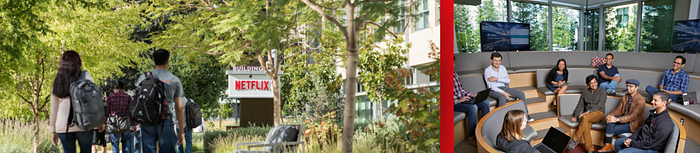
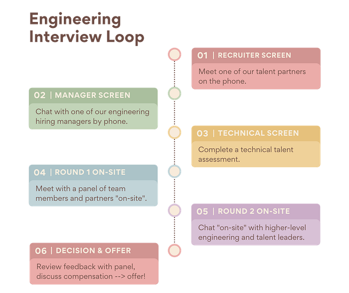

# Demystifying Interviewing for Backend Engineers @ Netflix

**_By Karen Casella, Director of Engineering, Access & Identity Management_**

Have you ever experienced one of the following scenarios while looking for your next role?

- You study and practice coding interview problems for hours/days/weeks/months, only to be asked to merge two sorted lists.
- You apply for multiple roles at the same company and proceed through the interview process with each hiring team separately, despite the fact that there is tremendous overlap in the roles.
- You go through the interview process, do really well, get really excited about the company and the people you meet, and in the end, you are “matched” to a role that does not excite you, working with a manager and team you have not even met during the interview process.

Interviewing can be a daunting endeavor and how companies, and teams, approach the process varies greatly. We hope that by demystifying the process, you will feel more informed and confident about your interview experience.

## Backend Engineering Interview Loop

When you apply for a backend engineering role at Netflix, or if one of our recruiters or hiring managers find your LinkedIn profile interesting, a recruiter or hiring manager reviews your technical background and experience to see if your experience is aligned with our requirements. If so, we invite you to begin the interview process.

Most backend engineering teams follow a process very similar to what is shown below. While this is a relatively stream-lined process, it is not as efficient if a candidate is interested in or qualified for multiple roles within the organization.

Following is a brief description of each of these stages.

**Recruiter Phone Screen: **A member of our talent team contacts you to explain the process and to assess high-level qualifications . The recruiter also reviews the relevant open roles to see if you have a strong affinity for one or another. If your interests and experience align well with one or more of the roles, they schedule a phone screen with one of the hiring managers.

**Manager Phone Screen: **The purpose of this discussion is to get a sense for your technical background, your approach to problem solving, and how you work. It’s also a great opportunity for you to learn more about the available roles, the technical challenges the teams are facing and what it’s like to work on a backend engineering team at Netflix.

**Technical Screen: **The final screen before on-site interviews is used to assess your technical skills and match for the team. For many roles, you will be given a choice between a take-home coding exercise or a one-hour discussion with one of the engineers from the team. The problems you are asked to solve are related to the work of the team.

**Round 1 Interviews: **If you are invited on-site, the first round interview is with four or five people for 45 minutes each. The interview panel consists of two or three engineers, a hiring manager and a recruiter. The engineers assess your technical skills by asking you to solve various design and coding problems. These questions reflect actual challenges that our teams face.

**Round 2 Interviews: **You meet with two or three additional people, for 45 minutes each. The interview panel comprises an engineering director, a partner engineer or manager, and another engineering leader. The focus of this round is to assess how well you partner with other teams and your non-technical skills.

**Decision & Offer: **After round 2, we review the feedback and decide whether or not we will be offering you a role. If so, you will work with the recruiter to discuss compensation expectations, answer any questions that remain for you, and discuss a start date with your new team.

## Enter Centralized Hiring

Some Netflix backend engineering teams, seeking [stunning colleagues](https://jobs.netflix.com/culture) with similar backgrounds and talents, are joining forces and adopting a centralized hiring model. **Centralized hiring is an approach of making multiple hiring decisions through one unified hiring process across multiple teams with shared needs in skill, function and experience level.**

The interview approach does not vary much from what is shown above, with one big exception: **_there are several potential “pivot points” where you and / or Netflix may decide to focus on a particular role based on your experience and preference. _**At each stage of the process, we consider your preference and skills and may focus your remaining interviews with a specific team if we both consider it a strong match. It’s important to note that, even though your experience may not be an exact match for one team, you might be more closely aligned with another team. In that case, we would pivot you to another team rather than disqualify you from the process.

## Interview Tips

Interviewing can be intimidating and stressful! Being prepared can help you minimize stress and anxiety. Following are a few quick tips to help you prepare:

- Review your profile and make connections between your experience and the job description.
- Think about your past work experiences and prepare some examples of when you achieved something amazing, or had some tough challenges.
- We recommend against interview coding practice puzzle-type exercises, as we don’t ask those types of questions. **If you want to practice, focus on medium-difficulty real-world problems you might encounter in a software engineering role.**
- Be sure to have questions prepared to ask the interviewers. This is a conversation, not an inquisition!

We are here to accommodate any accessibility needs you may have, to ensure that you’re set up for success during your interview. Let us know if you need any assistive technology or other accommodations ahead of time, and we’ll be sure to work with you to get it set up.

We want to see you at your best — we are not trying to trick you or trip you up! Try to relax, remember to breathe, and be honest and curious. **_Remember, this is not just about whether Netflix thinks you are a fit for the role, it’s about you deciding that Netflix and the role are right for you!_**

## Yes, We Are Hiring!

Several of our backend engineering teams are searching for our next stunning colleagues. Some of the areas for which we are actively seeking backend engineers include Streaming & Gaming Technologies, Product Innovation, Infrastructure, and Studio Technologies. If any of the high-level descriptions below are of interest to you and seem like a good match for your experience and career goals, we’d like to hear from you! Simply click on the job description link and submit your application through our jobs site.

## Streaming & Gaming Technologies

([https://jobs.netflix.com/jobs/175726412](https://jobs.netflix.com/jobs/175726412))

- You are a **distributed systems engineer **working on product backend systems that support streaming video and/or mobile & cloud games.
- You’re passionate about **resilience, scalability, availability, and observability**. Passion for large data sets, APIs, access & identity management, or delivering backend systems that enable mobile and cloud gaming is a big plus.
- Your work centers around **architecting, building and operating fault-tolerant distributed systems at massive scale**.

## Product Innovation

([https://jobs.netflix.com/jobs/175728345](https://jobs.netflix.com/jobs/175728345))

- You are a **distributed systems engineer** working on core backend services that support our user journeys in signup, subscription, search, personalization and messaging.
- You’re passionate about working at the **intersection of business, product and technology** at large scale.
- Your work centers around **building fault-tolerant backend systems and services** that make a direct impact on users and the business.

## Infrastructure

([https://jobs.netflix.com/jobs/122163878](https://jobs.netflix.com/jobs/122163878))

- You are a **distributed systems engineer** working on infrastructure and platforms that enable or amplify the work of other engineering teams or systems.
- You’re passionate about **scalable and highly available complex distributed systems** and have a deep understanding of how they operate and fail.
- Your work centers around **raising levels of abstraction to improve development at scale** and creating engineering efficiencies.

## Studio Technologies

([https://jobs.netflix.com/jobs/175745345](https://jobs.netflix.com/jobs/175745345))

- You are a **software engineer that builds products and services used by creative partners across the studio and external productions to produce and manage all of Netflix global content. **Our products enable the entire workflow of content acquisition, production, promotion and financing from script to screen. We create innovative solutions that develop and manage entertainment at scale while helping entertain the world as members find joy in the shows and movies they love.
- You’re **passionate about innovation, scalability, functionality, shipping high-value features **quickly and are committed to delivering exceptional backend systems for our consumers. You’re humble, curious, and looking to deliver results with other stunning colleagues.
- Your work centers around **building products and services targeting creative partners producing/managing global content.**

## Conclusion

Netflix has a Freedom & Responsibility culture in which every Netflix employee has the freedom to do their best work and the responsibility to achieve excellence. We value strong judgment, communication, impact, curiosity, innovation, courage, passion, integrity, selflessness, inclusion, and diversity. For more information on the culture, see [http://jobs.netflix.com/culture](http://jobs.netflix.com/culture).

**Karen Casella** is the Director of Engineering for Access & Identity Management technologies for Netflix streaming and gaming products. Connect with Karen on [LinkedIn](http://www.linkedin.com/in/kcasella) or [Twitter](http://twitter.com/kcasella).

---
**Tags:** Recruiting · Engineering · Netflix · Back End Development · Gaming
