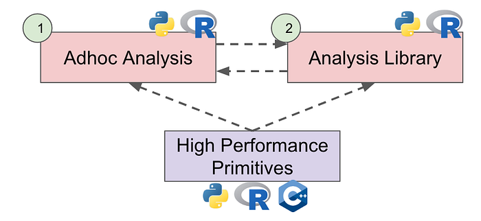
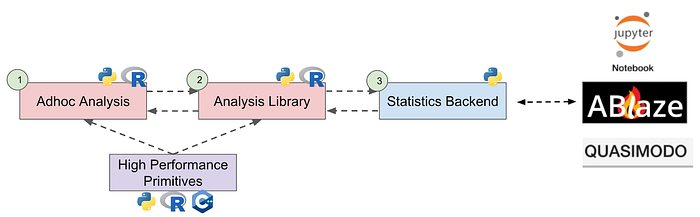

# Design Principles for Mathematical Engineering in Experimentation Platform at Netflix

> Jeffrey Wong, Senior Modeling Architect, Experimentation Platform   
> Colin McFarland, Director, Experimentation Platform

At Netflix, we have data scientists coming from many backgrounds such as neuroscience, statistics and biostatistics, economics, and physics; each of these backgrounds has a meaningful contribution to how experiments should be analyzed. To unlock these innovations we are making a strategic choice that our focus should be geared towards developing the surrounding infrastructure so that scientists’ work can be easily absorbed into the wider [Netflix Experimentation Platform](https://research.netflix.com/research-area/machine-learning-platform). There are 2 major challenges to succeed in our mission:

1. _We want to democratize the platform and create a contribution model: with a developer and production deployment experience that is designed for data scientists and friendly to the stacks they use._
2. _We have to do it at Netflix’s scale: For hundreds of millions of users across hundreds of concurrent tests, spanning many deployment strategies from traditional A/B experiments, to evolving areas like _[_quasi experiments_](https://medium.com/netflix-techblog/quasi-experimentation-at-netflix-566b57d2e362)_._

Mathematical engineers at Netflix in particular work on the scalability and engineering of models that estimate treatment effects. They develop scientific libraries that scientists can apply to analyze experiments, and also contribute to the engineering foundations to build a scientific platform where new research can graduate to. In order to produce software that improves a scientist’s productivity we have come up with the following design principles.

## 1. Composition

Data Science is a curiosity driven field, and should not be unnecessarily constrained_[_[_1_](https://multithreaded.stitchfix.com/blog/2019/01/18/fostering-innovation-in-data-science/)_]_. We support data scientists to have freedom to explore research in any new direction. To help, we provide software autonomy for data scientists by focusing on composition, a design principle popular in data science software like ggplot2 and dplyr_[_[_2_](https://speakerdeck.com/hadley/pipelines-for-data-analysis-in-r)_]_. Composition exposes a set of fundamental building blocks that can be assembled in various combinations to solve complex problems. For example, ggplot2 provides several lightweight functions like geom_bar, geom_point, geom_line, and theme, that allow the user to assemble custom visualizations; every graph whether simple or complex can be composed of small, lightweight ggplot2 primitives.

In the democratization of the experimentation platform we also want to allow custom analysis. Since converting every experiment analysis into its own function for the experimentation platform is not scalable, we are making the strategic bet to invest in building high quality causal inference primitives that can be composed into an arbitrarily complex analysis. The primitives include a grammar for describing the data generating process, generic counterfactual simulations, regression, **bootstrapping**, and more.

## 2. Performance

**If our software is not performant it could limit adoption, subsequent innovation, and business impact.** This will also make graduating new research into the experimentation platform difficult. Performance can be tackled from at least three angles:

### A) Efficient computation

We should **leverage** the structure of the data and of the problem as much as possible to identify the optimal compute strategy. For example, if we want to fit ridge regression with various different regularization strengths we can do an SVD upfront and express the full solution path very efficiently in terms of the SVD.

### B) Efficient use of memory

We should optimize for sparse linear algebra. When there are many linear algebra operations, we should understand them holistically so that we can optimize the order of operations and not materialize unnecessary intermediate matrices. **When indexing into vectors and matrices, we should index contiguous blocks as much as possible to improve spatial locality****_[_****[_3_](https://people.eecs.berkeley.edu/~demmel/cs267_Spr99/Lectures/Lect_02_1999b.pdf)**_]_.

### C) Compression

Algorithms should be able to work on raw data as well as compressed data. For example, regression adjustment algorithms should be able to use frequency weights, analytic weights, and probability weights_[_[_4_](https://www.parisschoolofeconomics.eu/docs/dupraz-yannick/using-weights-in-stata(1).pdf)_]_. Compression algorithms can be lossless, or lossy with a tuning parameter to control the loss of information and impact on the standard error of the treatment effect.

## 3. Graduation

**We need a process for graduating new research into the experimentation platform.** The end to end data science cycle usually starts with a data scientist writing a script to do a new analysis. If the script is used several times it is rewritten into a function and moved into the Analysis Library. If performance is a concern, it can be refactored to build on top of high performance causal inference primitives made by mathematical engineers. This is the first phase of graduation.

The first phase will have a lot of iterations. The iterations go in both directions: data scientists can promote functions into the library, but they can also use functions from the library in their analysis scripts.

The second phase interfaces the Analysis Library with the rest of the experimentation ecosystem. This is the promotion of the library into the Statistics Backend, and negotiating engineering contracts for input into the Statistics Backend and output from the Statistics Backend. This can be done in an experimental notebook environment, where data scientists can demonstrate end to end what their new work will look like in the platform. This enables them to have conversations with stakeholders and other partners, and get feedback on how useful the new features are. Once the concepts have been proven in the experimental environment, the new research can graduate into the production experimentation platform. Now we can expose the innovation to a large audience of data scientists, engineers and product managers at Netflix.

## 4. Reproducibility

Reproducibility builds trustworthiness, transparency, and understanding for the platform. Developers should be able to reproduce an experiment analysis report outside of the platform using only the backend libraries. The ability to replicate, as well as rerun the analysis programmatically with different parameters is crucial for agility.

## 5. Introspection

In order to get data scientists involved with the production ecosystem, whether for debugging or innovation, they need to be able to step through the functions the platform is calling. This level of interaction goes beyond reproducibility. Introspectable code allows data scientists to check data, the inputs into models, the outputs, and the treatment effect. It also allows them to see where the opportunities are to insert new code. To make this easy we need to understand the steps of the analysis, and expose functions to see intermediate steps. For example we could break down the analysis of an experiment as

- _Compose data query_
- _Retrieve data_
- _Preprocess data_
- _Fit treatment effect model_
- _Use treatment effect model to estimate various treatment effects and variances_
- _Post process treatment effects, for example with multiple hypothesis correction_
- _Serialize analysis results to send back to the Experimentation Platform_

It is difficult for a data scientist to step through the online analysis code. Our path to introspectability is to power the analysis engine using python and R, a stack that is easy for a data scientist to step through. By making the analysis engine a python and R library we will also gain reproducibility.

## 6. Scientific Code in Production and in Offline Environments

In the causal inference domain data scientists tend to write code in python and R. We intentionally are not rewriting scientific functions into a new language like Java, because that will render the library useless for data scientists since they cannot integrate optimized functions back into their work. Rewriting poses reproducibility challenges since the python/R stack would need to match the Java stack. Introspection is also more difficult because the production code requires a separate development environment.

We choose to develop high performance scientific primitives in C++, which can easily be wrapped into both python and R, and also delivers on highly performant, production quality scientific code. In order to support the diversity of the data science teams and offer first class support for hybrid stacks like python and R, we standardize data on the [Apache Arrow](https://arrow.apache.org/) format in order to facilitate data exchange to different statistics languages with minimal overhead.

## 7. Well Defined Point of Entry, Well Defined Point of Exit

Our causal inference primitives are developed in a pure, scientific library, without business logic. For example, regression can be written to accept a feature matrix and a response vector, without any specific experimentation data structures. This makes the library portable, and allows data scientists to write extensions that can reuse the highly performant statistics functions for their own **adhoc** analysis. It is also portable enough for other teams to share.

Since these scientific libraries are decoupled from business logic, they will always be sandwiched in any engineering platform; upstream will have a data layer, and downstream will have a visualization and interpretation layer. To facilitate a smooth data flow, we need to design simple connectors. For example, all analyses need to receive data and a description of the data generating process. By focusing on composition, an arbitrary analysis can be constructed by layering causal analysis primitives on top of that starting point. Similarly, the end of an analysis will always consolidate into one data structure. This simplifies the workflow for downstream consumers so that they know what data type to consume.

## Next Steps

We are actively developing high performance software for regression, heterogeneous treatment effects, longitudinal studies and much more for the Experimentation Platform at Netflix. We aim to accelerate research in causal inference methodology, **expedite** product innovation, and ultimately bring the best experience and delight to our members. This is an ongoing journey, and if you are passionate about our exciting work, [join our all-star team](https://research.netflix.com/research-area/machine-learning-platform)!

---
**Tags:** Data Science · Experimentation · Scientific Software · Causal Inference · Scientific Research
