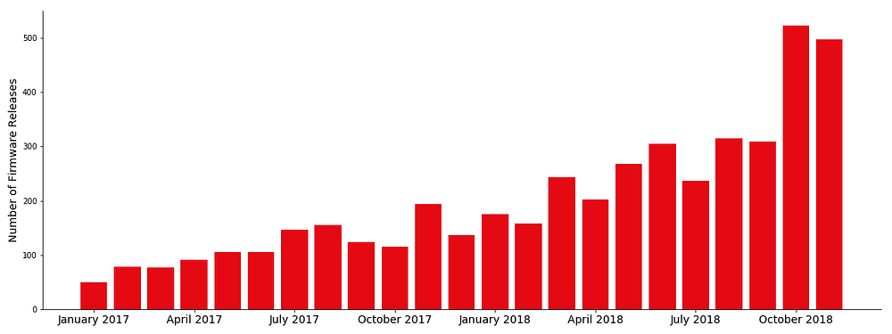
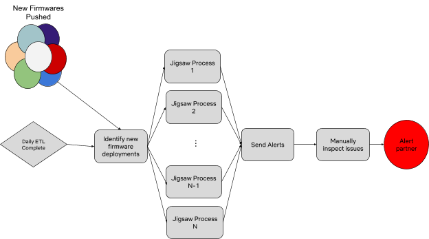

# Detecting Performance Anomalies in External Firmware Deployments

by [_Richard Cool_](https://www.linkedin.com/in/richardjcool/)

Netflix has over 139M members streaming on more than half a billion devices spanning over 1,700 different types of devices from hundreds of brands. This diverse device ecosystem results in a high dimensionality feature space, often with sparse data, and can make identifying device performance issues challenging. Identifying ways to scale solutions in this space is vital as the ecosystem continues to grow both in volume and diversity. Streaming devices are also used on a wide range of networks which directly impact the delivered user experience. The video quality and app performance that can be delivered to a limited-memory mobile phone with a spotty cellular connection is quite different than what can be achieved on a cable set top box with high speed broadband; **understanding how device characteristics and network behavior interact adds a layer of complexity in triaging potential device performance issues.**

We strive to ensure that when a member opens the Netflix app and presses play, they are presented with a high-quality experience every step of the way. Encountering an error page, waiting a very long time for video to begin playing, or having the video pause during playback, etc. are poor experiences, and we strive to minimize them. Previous blog posts have detailed the efforts of the Device Reliability Team ([part 1](https://www.linkedin.com/pulse/managing-reliability-across-thousands-netflix-ready-device-petry/?trk=pulse_spock-articles), [part 2](https://www.linkedin.com/pulse/managing-reliability-across-thousands-netflix-ready-device-petry-1/)) to identify issues and troubleshoot them and have given examples of the uses of [machine learning to improve streaming quality](https://medium.com/netflix-techblog/using-machine-learning-to-improve-streaming-quality-at-netflix-9651263ef09f).

Device-related issues typically occur in one of two scenarios: (1) Netflix introduces a change to the app or backend servers that interacts badly with some devices or (2) a consumer electronics partner, browser developer, or operating system developer pushes a change (e.g. a firmware change or browser/OS change) that interacts poorly with our app. While we have tools for dealing with the first scenario (for example, automated canary analysis using [Kayenta](https://medium.com/netflix-techblog/automated-canary-analysis-at-netflix-with-kayenta-3260bc7acc69)), the second type previously was only detected when the update had reached a sufficient volume of devices to shift core performance metrics. Being able to quickly identify firmware updates that result in poorer member experience allows us to minimize the impact of these issues and work with device partners to root-cause problems.

*Figure 1 — Monthly number of firmware releases seen on consumer electronics devices streaming Netflix.*

Figure 1 shows that the rate at which our consumer electronics device partners are pushing new firmware is growing rapidly. In 2018, our partners pushed over 500 firmware pushes a month; this value will likely pass 1,000 firmware upgrades per month by 2020. Often firmware rollouts begin slowly with a fraction of all devices receiving the new firmware for several days before the rest of the devices are upgraded. These rollouts are not random; often a specific subset of devices are targeted for new firmwares and sometimes rollouts target specific geographic regions. Naive analysis of metric changes between new firmwares and devices on older firmwares can be confounded by the non-random rollout, so it’s important to control for this when asking if a new firmware has negatively impacted the Netflix member experience.

## Putting the Pieces Together

Consider the case of a metric which follows the grey distribution (with a mean value of ~ 4,570) shown in Figure 2. We see a new firmware deploy in the field (red distribution) which follows an approximately normal distribution with noticeably higher mean of 5,600, indicating that devices using the new firmware have a poor experience than the mean of the full device population. _Should we be concerned that the new firmware has resulted in lower performance than prior versions?_

*Figure 2 — Left: Hypothetical distribution of a device performance metric between the control sample of devices (grey) and a population of the same devices which have been upgraded to a new firmware (red). Right: The control sample (red) has been broken into multiple sub-components (grey) based on geographic region.*

If the devices running the new firmware were a random subsample of the control sample, we very likely should be concerned. Unfortunately, this is not an assumption we can make when working with firmware deployments with our consumer electronics partners. In this example, we can break down the control sample by geographic region (right panel of Figure 2) and see that the control sample is an aggregation of distinct distributions from each region. If our partners roll out a new firmware preferentially to some regions compared to others, we must correct for this effect before quantifying any changes in performance metrics on devices with the new firmware.

*Figure 3 — Comparison of the treatment sample distribution (red) with one of the randomly matched control samples (grey) using the methodology described in the text. While the treatment sample has a larger mean metric value than the full control sample shown in Figure 2, when we account for the fact that the treatment sample came from a different population than the control sample, we can see that treatment sample has a lower mean (which is an improved member experience in this case).*

We created a framework, Jigsaw, which allows data scientists and engineering teams at Netflix to understand changes in metrics with biased treatment populations. For each treatment sample, we create a Monte Carlo “matched” sample from our control sample. This matched sample is constructed to mirror the same property distribution as the treatment sample using a list of user-specified dimensions. In our example above, we would construct a matched control sample that follows the same geographic distribution as the devices in the treatment sample. This process is not limited to one dimension — in practice, we often match on geographic dimensions as well as key device characteristics (such as device model or device model year). Increasing the number of dimensions used in the matching, however, can lead to data sparsity issues. For our analysis we typically limit matching to one or two device properties to ensure sufficient data. Once we have compared the metric distributions for both the matched control and treatment samples, we repeat the Monte Carlo matching procedure multiple times to estimate the probability that the treatment sample could have been drawn from the control sample given the sampling uncertainties. Figure 3 shows one matched sample realization in the example described above. While the treatment sample has a higher mean metric in the overall comparison, controlling for differences in the underlying population show that the treatment cell has actually _lowered_ the metric and _improved _our member_ _experience.

## The Bigger Picture

*Figure 4 — Workflow diagram illustrating the daily cycle of Jigsaw alerts.*

The introduction of Jigsaw into the Netflix device reliability engineering team’s workflow quickly made direct impact on our members’ experiences. During the summer of 2018, two device performance deteriorations were detected while the culpable new firmware was only present on 0.5% of the several million potentially impacted devices. With the early alerts from Jigsaw, the device reliability team was able to work with our consumer electronics partners to correct the problem and prevent millions of users from experiencing errors during playback. Work is underway to use the Jigsaw framework to understand more than firmware changes, as well. Comparing metrics between two web browser software versions or operating system versions is aiding several of the Netflix engineering teams understand the effects of in-field software changes on performance metrics.

Netflix members have many options when it comes to entertainment. We strive to provide the best possible experience each time anyone launches Netflix. By enriching our device performance monitoring with automated anomaly detection, we can scale our efforts as the device ecosystem continues to grow and evolve. Through being proactive rather than reacting to issues after they have had wide impact, we protect our members from poor experiences, empowering them to continue to find more moments of uninterrupted joy.

_Check out the _[_Netflix Research Page_](http://research.netflix.com/)_ if you want to learn more. We are _[_always looking_](https://jobs.netflix.com/search)_ for new stunning colleagues to join us!_

---
**Tags:** Data Science · Anomaly Detection · Machine Learning · Analytics · Statistics
