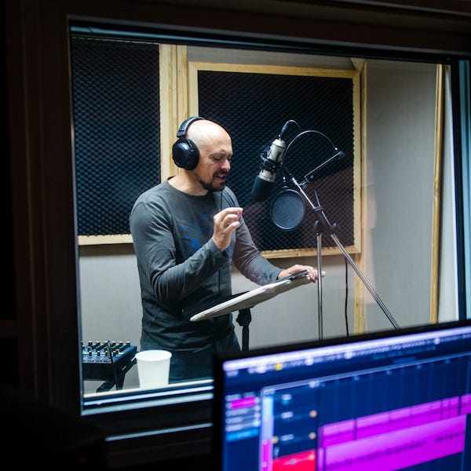

# Detecting Speech and Music in Audio Content

[Iroro Orife](https://www.linkedin.com/in/iroroorife/), [Chih-Wei Wu](https://www.linkedin.com/in/chih-wei-wu-73081689/) and [Yun-Ning (Amy) Hung](https://www.linkedin.com/in/yun-ning-hung/)

## Introduction

When you enjoy the latest season of _Stranger Things_ or _Casa de Papel (Money Heist)_, have you ever wondered about the secrets to fantastic story-telling, besides the stunning visual presentation? From the violin melody accompanying a pivotal scene to the soaring orchestral arrangement and thunderous sound-effects propelling an edge-of-your-seat action sequence, the various components of the audio soundtrack combine to evoke the very essence of story-telling. To uncover the magic of audio soundtracks and further improve the sonic experience, we need a way to systematically examine the interaction of these components, typically categorized as [dialogue, music and effects](https://www.jstor.org/stable/j.ctt16t8zf9).

In this blog post, we will introduce speech and music detection as an enabling technology for a variety of audio applications in Film & TV, as well as introduce our speech and music activity detection (SMAD) system which we recently published as a [journal article](https://asmp-eurasipjournals.springeropen.com/articles/10.1186/s13636-022-00253-8) in EURASIP Journal on Audio, Speech, and Music Processing.

Like semantic segmentation for audio, SMAD separately tracks the amount of speech and music in each frame in an audio file and is useful in _content understanding_ tasks during the audio production and delivery lifecycle. The detailed temporal metadata SMAD provides about speech and music regions in a polyphonic audio mixture are a first step for structural audio segmentation, indexing and pre-processing audio for the following downstream tasks. Let’s have a look at a few applications.

## Practical use cases for speech & music activity

### Audio dataset preparation

Speech & music activity is an important preprocessing step to prepare corpora for training. SMAD classifies & segments long-form audio for use in large corpora, such as

- musical segments for [music information retrieval tasks](https://www.ismir.net/resources/datasets/) (MIR).
- utterances for [speech tasks](https://github.com/s3prl/s3prl#downstream) like speaker diarization, emotion classification, semantic and phonetic transcription and translation.

*From “Audio Signal Classification” by David Gerhard*

### Dialogue analysis & processing

- During encoding at Netflix, speech-gated loudness is computed for every audio master track and used for loudness normalization. Speech-activity metadata is thus a central part of accurate catalog-wide loudness management and improved audio volume experience for Netflix members.
- Similarly, algorithms for dialogue intelligibility, spoken-language-identification and speech-transcription are only applied to audio regions where there is measured speech.

### Music information retrieval

- There are a few studio use cases where music activity metadata is important, including quality-control (QC) and at-scale multimedia content analysis and tagging.
- There are also inter-domain tasks like singer-identification and song lyrics transcription, which do not fit neatly into either speech or classical MIR tasks, but are useful for annotating musical passages with lyrics in closed captions and subtitles.
- Conversely, where neither speech nor music activity is present, such audio regions are estimated to have content classified as noisy, environmental or sound-effects.

### Localization & Dubbing

Finally, there are [post-production tasks](./introducing-netflix-timed-text-authoring-lineage-6fb57b72ad41.md), which take advantage of accurate speech segmentation at the the spoken utterance or sentence level, ahead of translation and dub-script generation. Likewise, authoring accessibility-features like [Audio Description](https://en.wikipedia.org/wiki/Audio_description) (AD) involves music and speech segmentation. The AD narration is typically mixed-in to not overlap with the primary dialogue, while music lyrics strongly tied to the plot of the story, are sometimes referenced by AD creators, especially for translated AD.

*A voice actor in the studio*

## Our Approach to Speech and Music Activity Detection

Although the application of deep learning methods has improved audio classification systems in recent years, this data driven approach for SMAD requires large amounts of audio source material with audio-frame level speech and music activity labels. The collection of such fine-resolution labels is costly and labor intensive and audio content often cannot be publicly shared due to the copyright limitations. We address the challenge from a different angle.

### Content, genre and languages

Instead of augmenting or synthesizing training data, we sample the large scale data available in the Netflix catalog with noisy labels. In contrast to clean labels, which indicate precise start and end times for each speech/music region, noisy labels only provide approximate timing, which may impact SMAD classification performance. Nevertheless, noisy labels allow us to increase the scale of the dataset with minimal manual efforts and potentially generalize better across different types of content.

Our dataset, which we introduced as TVSM (TV Speech and Music) in [our publication](https://www.springeropen.com/epdf/10.1186/s13636-022-00253-8?sharing_token=qUE9lQ50qcQxbhy4q7WuAm_BpE1tBhCbnbw3BuzI2RPYHxmYyj04FfJD9WVAT3xVEfjU0YvWAKHjSrjS3Pk16I2vFtdRuQgSdmgaSKkf5JiXbOSb0AglyInIbQCpnL8z0kJbzIzN5s368ENFJJSbKW1C3I7fzTQEHjPKYPBd2xM%3D), has a total number of 1608 hours of professionally recorded and produced audio. TVSM is significantly larger than other SMAD datasets and contains both speech and music labels at the frame level. TVSM also contains overlapping music and speech labels, and both classes have a similar total duration.

Training examples were produced between 2016 and 2019, in 13 countries, with 60% of the titles originating in the USA. Content duration ranged from 10 minutes to over 1 hour, across the various genres listed below.

The dataset contains audio tracks in three different languages, namely English, Spanish, and Japanese. The **language distribution** is shown in the figure below. The name of the episode/TV show for each sample remains unpublished. However, each sample has both a show-ID and a season-ID to help identify the connection between the samples. For instance, two samples from different seasons of the same show would share the same show ID and have different season IDs.

### What constitutes music or speech?

To evaluate and benchmark our dataset, we manually labeled 20 audio tracks from various TV shows which do not overlap with our training data. One of the fundamental issues encountered during the annotation of our manually-labeled TVSM-test set, was the definition of music and speech. The heavy usage of ambient sounds and sound effects blurs the boundaries between active music regions and non-music. Similarly, switches between conversational speech and singing voices in certain TV genres obscure where speech starts and music stops. Furthermore, must these two classes be mutually exclusive? To ensure label quality, consistency, and to avoid ambiguity, we converged on the following guidelines for differentiating music and speech:

- Any music that is perceivable by the annotator at a comfortable playback volume should be annotated.
- Since sung lyrics are often included in closed-captions or subtitles, human singing voices should all be annotated as both speech and music.
- Ambient sound or sound effects without **_apparent melodic contours_** should not be annotated as music. Traditional phone bell, ringing, or buzzing without apparent melodic contours should not be annotated as music.
- Filled pauses (uh, um, ah, er), backchannels (mhm, uh-huh), sighing, and screaming should not be annotated as speech.

### Audio format and preprocessing

All audio files were originally delivered from the post-production studios in the standard 5.1 surround format at 48 kHz sampling rate. We first normalize all files to an average loudness of −27 LKFS ± 2 LU dialog-gated, then downsample to 16 kHz before creating an [ITU downmix](https://www.itu.int/dms_pubrec/itu-r/rec/bs/R-REC-BS.775-1-199407-S!!PDF-E.pdf).

### Model Architecture

Our modeling choices take advantage of both convolutional and recurrent architectures, which are known to work well on audio sequence classification tasks, and are well supported by previous investigations. We adapted the SOTA convolutional recurrent neural network (**CRNN**) architecture to accommodate our requirements for input/output dimensionality and model complexity. The best model was a CRNN with three convolutional layers, followed by two bi-directional recurrent layers and one fully connected layer. The model has 832k trainable parameters and emits frame-level predictions for both speech and music with a temporal resolution of 5 frames per second.

For training, we leveraged our large and diverse catalog dataset with noisy labels, introduced above. Applying a random sampling strategy, each training sample is a 20 second segment obtained by randomly selecting an audio file and corresponding starting timecode offset on the fly. All models in our experiments were trained by minimizing **binary cross-entropy (BCE) loss**.

### Evaluation

In order to understand the influence of different variables in our experimental setup, e.g. model architecture, training data or input representation variants like log-Mel Spectrogram versus per-channel energy normalization (PCEN), we setup** a detailed ablation study**, which we encourage the reader to explore fully in our [EURASIP journal article](https://asmp-eurasipjournals.springeropen.com/articles/10.1186/s13636-022-00253-8).

For each experiment, we reported the class-wise F-score and error rate with a segment size of 10ms. The error rate is the summation of deletion rate (false negative) and insertion rate (false positive). Since a binary decision must be attained for music and speech to calculate the F-score, a threshold of 0.5 was used to quantize the continuous output of speech and music activity functions.

### Results

We evaluated our models on** four open datasets** comprising audio data from TV programs, YouTube clips and various content such as concert, radio broadcasts, and low-fidelity folk music. The excellent performance of our models demonstrates the importance of building a robust system that detects **overlapping speech and music** and supports our assumption that a large but noisy-labeled real-world dataset can serve as a viable solution for SMAD.

## Conclusion

At Netflix, tasks throughout the content production and delivery lifecycle work are most often interested in one part of the soundtrack. Tasks that operate on just dialogue, music or effects are performed hundreds of times a day, by teams around the globe, in dozens of different audio languages. So investments in algorithmically-assisted tools for automatic audio content understanding like SMAD, can yield substantial productivity returns at scale while minimizing tedium.

## Additional Resources

We have made audio features and labels available via [Zenodo](https://zenodo.org/record/7025971). There is also [GitHub repository](https://github.com/biboamy/TVSM-dataset) with the following audio tools:

- Python code for data pre-processing, including scripts for 5.1 downmixing, Mel spectrogram generation, MFCCs generation, VGGish features generation, and the PCEN implementation.
- Python code for reproducing all experiments, including scripts of data loaders, model implementations, training and evaluation pipelines.
- Pre-trained models for each conducted experiment.
- Prediction outputs for all audio in the evaluation datasets.

_Special thanks to the entire Audio Algorithms team, as well as _[_Amir Ziai_](https://www.linkedin.com/in/amirziai/)_, _[_Anna Pulido_](https://www.linkedin.com/in/anna-pulido-61025063/)_, and _[_Angie Pollema_](https://www.linkedin.com/in/angiepollema1/)_._

---
**Tags:** Speech · Music Classification · Machine Learning
