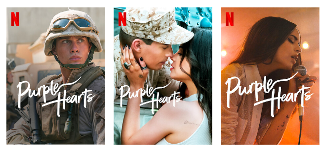
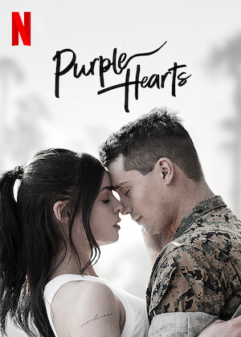
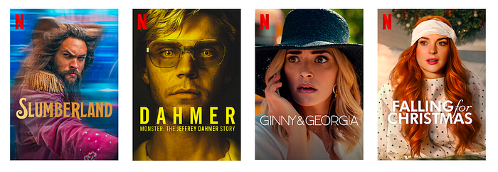
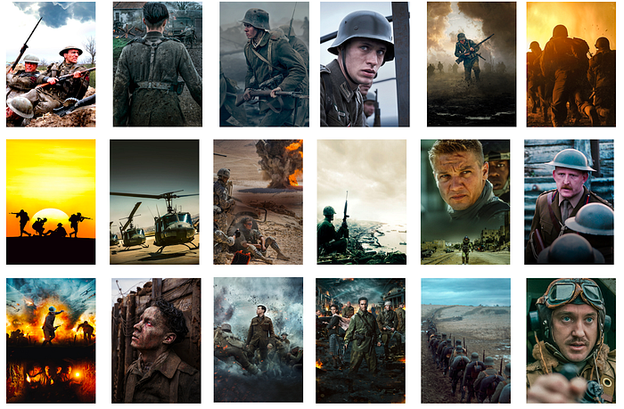
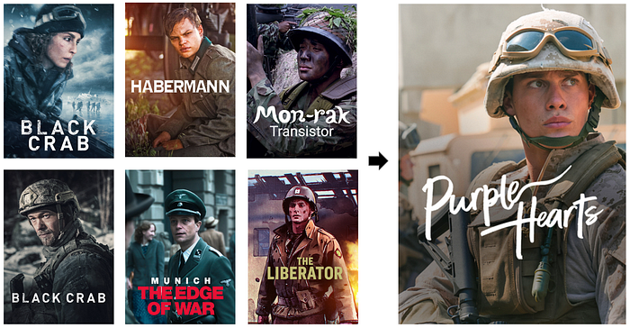
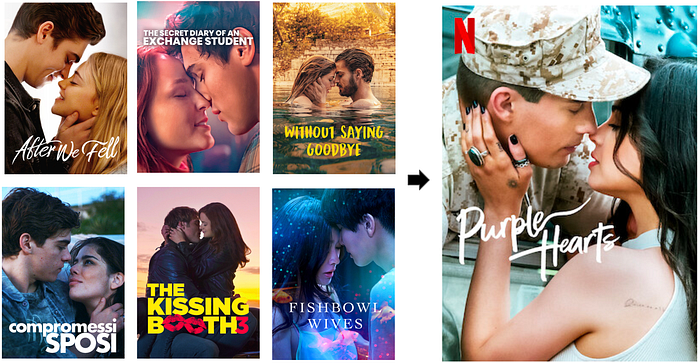
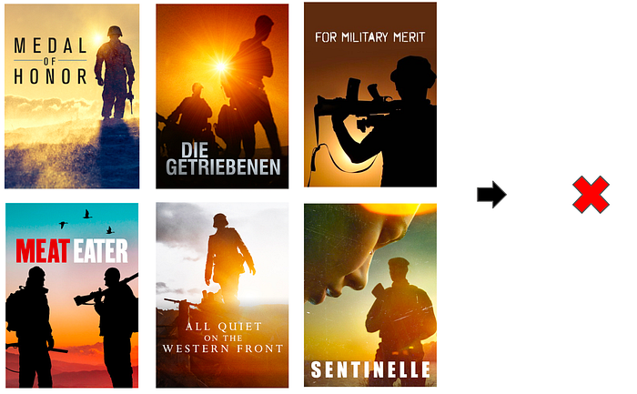

# Discovering Creative Insights in Promotional Artwork

By [Grace Tang](https://www.linkedin.com/in/tsmgrace/), [Aneesh Vartakavi](https://www.linkedin.com/in/aneeshvartakavi/), [Julija Bagdonaite](https://www.linkedin.com/in/jbagdonaite/), [Cristina Segalin](https://www.linkedin.com/in/cristinasegalin/), and [Vi Iyengar](https://www.linkedin.com/in/vi-pallavika-iyengar-144abb1b/)

When members are shown a title on Netflix, the displayed artwork, trailers, and synopses are personalized. That means members see the assets that are most likely to help them make an informed choice. These assets are a critical source of information for the member to make a decision to watch, or not watch, a title. The stories on Netflix are multidimensional and there are many ways that a single story could appeal to different members. We want to show members the images, trailers, and synopses that are most helpful to them for making a watch decision.

In a [previous blog post](https://netflixtechblog.com/artwork-personalization-c589f074ad76) we explained how our artwork personalization algorithm can pick the best image for each member, but how do we create a good set of images to choose from? What data would you like to have if you were designing an asset suite?

In this blog post, we talk about two approaches to create effective artwork. Broadly, they are:

1. The top-down approach, where we preemptively identify image properties to investigate, informed by our initial beliefs.
2. The bottom-up approach, where we let the data naturally surface important trends.

## The role of promotional artwork

Great promotional media helps viewers discover titles they’ll love. In addition to helping members quickly find titles already aligned with their tastes, they help members discover new content. We want to make artwork that is compelling and personally relevant, but we also want to represent the title authentically. We don’t want to make clickbait.

Here’s an example: [_Purple Hearts_](https://www.netflix.com/title/81043665) is a film about an aspiring singer-songwriter who commits to a marriage of convenience with a soon-to-deploy Marine._ _This title has storylines that might appeal to both fans of romance as well as military and war themes. This is reflected in our artwork suite for this title.

*Images for the title “Purple Hearts”*

## Creative Insights

To create suites that are relevant, attractive, and authentic, we’ve relied on creative strategists and designers with intimate knowledge of the titles to recommend and create the right art for upcoming titles. To supplement their domain expertise, we’ve built a suite of tools to help them look for trends. By inspecting past asset performance from thousands of titles that have already been launched on Netflix, we achieve a beautiful intersection of art & science. However, there are some downsides to this approach: It is tedious to manually scrub through this large collection of data, and looking for trends this way could be subjective and vulnerable to confirmation bias.

Creators often have years of experience and expert knowledge on what makes a good piece of art. However, it is still useful to test our assumptions, especially in the context of the specific canvases we use on the Netflix product. For example, certain traditional art styles that are effective in traditional media like movie posters might not translate well to the Netflix UI in your living room. Compared to a movie poster or physical billboard, Netflix artwork on TV screens and mobile phones have very different size, aspect ratios, and amount of attention paid to them. As a consequence, we need to conduct research into the effectiveness of artwork on our unique user interfaces instead of extrapolating from established design principles.

Given these challenges, we develop data-driven recommendations and surface them to creators in an actionable, user-friendly way. These insights complement their extensive domain expertise in order to help them to create more effective asset suites. We do this in two ways, a top-down approach that can find known features that have worked well in the past, and a bottom-up approach that surfaces groups of images with no prior knowledge or assumptions.

## Top-down approach

In our top-down approach, we describe an image using attributes and find features that make images successful. We collaborate with experts to identify a large set of features based on their prior knowledge and experience, and model them using Computer Vision and Machine Learning techniques. These features range from low level features like color and texture, to higher level features like the number of faces, composition, and facial expressions.

*An example of the features we might capture for this image include: number of people (two), where they’re facing (facing each other), emotion (neutral to positive), saturation (low), objects present (military uniform)*

We can use pre-trained models/APIs to create some of these features, like face detection and object labeling. We also build internal datasets and models for features where pre-trained models are not sufficient. For example, common Computer Vision models can tell us that an image contains two people facing each other with happy facial expressions — are they friends, or in a romantic relationship? We have built human-in-the-loop tools to help experts train ML models rapidly and efficiently, enabling them to build custom models for subjective and complex attributes.

Once we describe an image with features, we employ various [predictive and causal methods](https://netflixtechblog.medium.com/causal-machine-learning-for-creative-insights-4b0ce22a8a96) to extract insights about which features are most important for effective artwork, which are leveraged to create artwork for upcoming titles. **An example insight is that when we look across the catalog, we found that single person portraits tend to perform better than images featuring more than one person.**

*Single Character Portraits*

**Bottom-up approach**

The top-down approach can deliver clear actionable insights supported by data, but these insights are limited to the features we are able to identify beforehand and model computationally. We balance this using a bottom-up approach where we do not make any prior guesses, and let the data surface patterns and features. In practice, we surface clusters of similar images and have our creative experts derive insights, patterns and inspiration from these groups.

One such method we use for image clustering is leveraging large pre-trained convolutional neural networks to model image similarity. Features from the early layers often model low level similarity like colors, edges, textures and shape, while features from the final layers group images depending on the task (eg. similar objects if the model is trained for object detection). We could then use an unsupervised clustering algorithm (like k-means) to find clusters within these images.

Using our example title above, one of the characters in _Purple Hearts_ is in the Marines. Looking at clusters of images from similar titles, we see a cluster that contains imagery commonly associated with images of military and war, featuring characters in military uniform.

*An example cluster of imagery related to military and war.*

Sampling some images from the cluster above, we see many examples of soldiers or officers in uniform, some holding weapons, with serious facial expressions, looking off camera. A creator could find this pattern of images within the cluster below, confirm that the pattern has worked well in the past using performance data, and use this as inspiration to create final artwork.

*A creator can draw inspiration from images in the cluster to the left, and use this to create effective artwork for new titles, such as the image for Purple Hearts on the right.*

Similarly, the title has a romance storyline, so we find a cluster of images that show romance. From such a cluster, a creator could infer that showing close physical proximity and body language convey romance, and use this as inspiration to create the artwork below.

On the flip side, creatives can also use these clusters to learn what _not_ to do. For example, here are images within the same cluster with military and war imagery above. If, hypothetically speaking, they were presented with historical evidence that these kinds of images didn’t perform well for a given canvas, a creative strategist could infer that highly saturated silhouettes don’t work as well in this context, confirm it with a test to establish a causal relationship, and decide not to use it for their title.

*A creator can also spot patterns that didn’t work in the past, and avoid using it for future titles.*

**Member clustering**

Another complementary technique is member clustering, where we group members based on their preferences. We can group them by viewing behavior, or also leverage our image personalization algorithm to find groups of members that positively responded to the same image asset. As we observe these patterns across many titles, we can learn to predict which user clusters might be interested in a title, and we can also learn which assets might resonate with these user clusters.

As an example, let’s say we are able to cluster Netflix members into two broad clusters — one that likes romance, and another that enjoys action. We can look at how these two groups of members responded to a title after its release. We might find that 80% of viewers of _Purple Hearts_ belong to the romance cluster, while 20% belong to the action cluster. Furthermore, we might find that a representative romance fan (eg. the cluster centroid) responds most positively to images featuring the star couple in an embrace. Meanwhile, viewers in the action cluster respond most strongly to images featuring a soldier on the battlefield. As we observe these patterns across many titles, we can learn to predict which user clusters might be interested in similar upcoming titles, and we can also learn which themes might resonate with these user clusters. Insights like these can guide artwork creation strategy for future titles.

**Conclusion**

Our goal is to empower creatives with data-driven insights to create better artwork. Top-down and bottom-up methods approach this goal from different angles, and provide insights with different tradeoffs.

Top-down features have the benefit of being clearly explainable and testable. On the other hand, it is relatively difficult to model the effects of interactions and combinations of features. It is also challenging to capture complex image features, requiring custom models. For example, there are many visually distinct ways to convey a theme of “love”: heart emojis, two people holding hands, or people gazing into each others’ eyes and so on, which are all very visually different. Another challenge with top-down approaches is that our lower level features could miss the true underlying trend. For example, we might detect that the colors green and blue are effective features for nature documentaries, but what is really driving effectiveness may be the portrayal of natural settings like forests or oceans.

In contrast, bottom-up methods model complex high-level features and their combinations, but their insights are less explainable and subjective. Two users may look at the same cluster of images and extract different insights. However, bottom-up methods are valuable because they can surface unexpected patterns, providing inspiration and leaving room for creative exploration and interpretation without being prescriptive.

The two approaches are complementary. Unsupervised clusters can give rise to observable trends that we can then use to create new testable top-down hypotheses. Conversely, top-down labels can be used to describe unsupervised clusters to expose common themes within clusters that we might not have spotted at first glance. Our users synthesize information from both sources to design better artwork.

There are many other important considerations that our current models don’t account for. For example, there are factors outside of the image itself that might affect its effectiveness, like how popular a celebrity is locally, cultural differences in aesthetic preferences or how certain themes are portrayed, what device a member is using at the time and so on. As our member base becomes increasingly global and diverse, these are factors we need to account for in order to create an inclusive and personalized experience.

**Acknowledgements**

This work would not have been possible without our cross-functional partners in the creative innovation space. We would like to specifically thank Ben Klein and Amir Ziai for helping to build the technology we describe here.

---
**Tags:** Data Science · Machine Learning · Computer Vision · Unsupervised Learning · Clustering Algorithm
