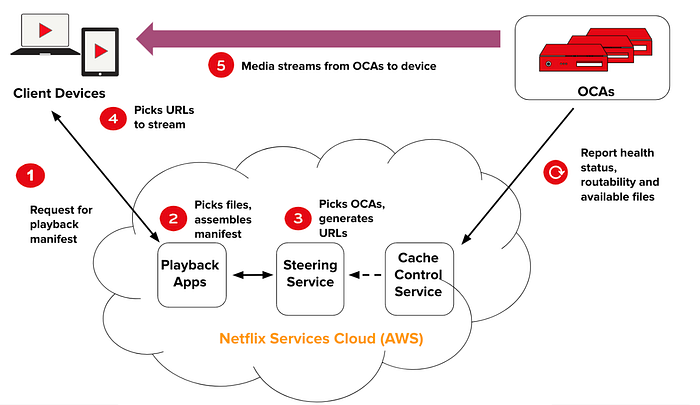
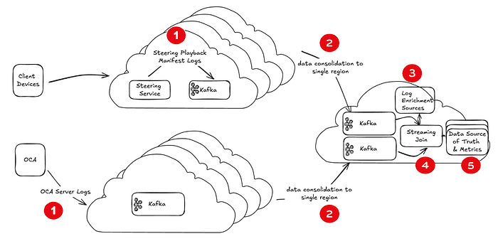
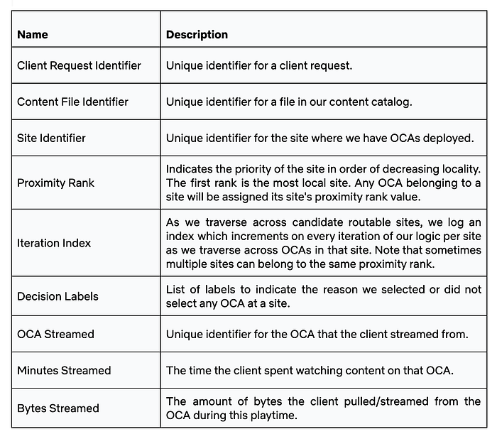
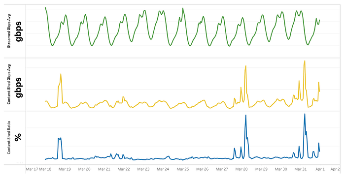

# Driving Content Delivery Efficiency Through Classifying Cache Misses

By [Vipul Marlecha](https://www.linkedin.com/in/mvipulbharat/), [Lara Deek](https://www.linkedin.com/in/lara-deek-79773966), [Thiara Ortiz](https://www.linkedin.com/in/thiaraortiz)

_The mission of _[_Open Connect_](https://openconnect.netflix.com/en/#what-is-open-connect)_, _**_our dedicated content delivery network (CDN), is to deliver the best quality of experience (QoE)_**_ to our members. By localizing our Open Connect Appliances (OCAs), we bring Netflix content closer to the end user. This is achieved through close partnerships with internet service providers (ISPs) worldwide. Our ability to efficiently localize traffic, known as Content Delivery Efficiency, is a critical component of Open Connect’s service._

_In this post, we discuss one of the frameworks we use to evaluate our efficiency and identify sources of inefficiencies. Specifically, we classify the causes of traffic not being served from local servers, a phenomenon that we refer to as cache misses._

### Why does Netflix have the Open Connect Program?

The Open Connect Program is a cornerstone of Netflix’s commitment to delivering unparalleled QoE for our customers. By localizing traffic delivery from Open Connect servers at IX or ISP sites, we significantly enhance the speed and reliability of content delivery. The inherent latencies of data traveling across physical links, compounded by Internet infrastructure components like routers and network stacks, can disrupt a seamless viewing experience. Delays in video start times, reduced initial video quality, and the frustrating occurrence of buffering lead to an overall reduction in customer QoE. Open Connect empowers Netflix to maintain hyper-efficiency, ensuring a flawless client experience for new, latency-sensitive, on-demand content such as live streams and ads.

Our custom-built servers, known as Open Connect Appliances (OCAs), are designed for both efficiency and cost-effectiveness. By logging detailed historical streaming behavior and using it to model and forecast future trends, we hyper-optimize our OCAs for long-term caching efficiency. We build methods to efficiently and reliably store, stream, and move our content.

The mission of Open Connect hinges on our ability to effectively localize content on our OCAs globally, despite limited storage space, and also by design with specific storage sizes. This ensures that our cost and power efficiency metrics continue to improve, enhancing client QoE and reducing costs for our ISP partners. A critical question we continuously ask is: How do we evaluate and monitor which bytes should have been served from local OCAs but resulted in a cache miss?

**The Anatomy of a Playback Request**

Let us start by introducing the logic that directs or “steers” a specific Netflix client device to its dedicated OCA. The lifecycle from when a client device presses play until the video starts being streamed to that device is referred to as “playback.” Figure 1 illustrates the logical components involved in playback.

**Figure 1:** Components for Playback

The components involved in playback are important to understand as we elaborate on the concept of how we determine a cache miss versus hit. Independent of client requests, every OCA in our CDN periodically reports its capacity and health, learned BGP routes, and current list of stored files. All of this data is reported to the Cache Control Service (CCS). When a member hits the play button, this request is sent to our AWS services, specifically the Playback Apps service. After Playback Apps determines which files correspond to a specific movie request, it issues a request to “steer” the client’s playback request to OCAs via the Steering Service. The Steering Service in turn, using the data reported from OCAs to CCS as well as other client information such as geo location, identifies the set of OCAs that can satisfy that client’s request. This set of OCAs is then returned in the form of rank-ordered URLs to the client device, the client connects to the top-ranked OCA and requests the files it needs to begin the video stream.

### What is a Cache Miss?

A cache miss occurs when bytes are not served from the best available OCA for a given Netflix client, independent of OCA state. For each playback request, the Steering Service computes a ranked list of local sites for the client, ordered by network proximity alone. This ranked list of sites is known as the “proximity rank.” Network proximity is determined based on the IP ranges (BGP routes) that are advertised by our ISP partners. Any OCA from the first “most proximal” site on this list is the most preferred and closest, having advertised the longest, most specific matching prefix to the client’s IP address. A cache miss is logged when bytes are not streamed from any OCA at this first local site, and we log when and why that happens.

It is important to note that our concept of cache misses is viewed from the client’s perspective, focusing on the optimal delivery source for the end user and prepositioning content accordingly, rather than relying on traditional CDN proxy caching mechanisms. Our “prepositioning” differentiator allows us to prioritize client QoE by ensuring content is served from the most optimal OCA.

We attribute cache misses to three logical categories. The intuition behind the delineated categories is that each category informs parallel strategies to achieve content delivery efficiency.

- **Content Miss:** This happens when the files were not found on OCAs in the local site. In previous articles like “[Content Popularity for Open Connect](https://netflixtechblog.com/content-popularity-for-open-connect-b86d56f613b)” and “[Distributing Content to Open Connect](https://netflixtechblog.com/distributing-content-to-open-connect-3e3e391d4dc9),” we discuss how we decide what content to prioritize populating first onto our OCAs. A sample of efforts this insights informs include: (1) how accurately we predict the popularity of content, (2) how rapidly we pre-position that content, (3) how well we design our OCA hardware, and (4) how well we provision storage capacity at our locations of presence.
- **Health Miss:** This happens when the local site’s OCA hardware resources are becoming saturated, and one or more OCA can not handle more traffic. As a result, we direct clients to other OCAs with capacity to serve that content. Each OCA has a control loop that monitors its bottleneck metrics (such as CPU, disk usage, etc.) and assesses its ability to serve additional traffic. This is referred to as “OCA health.” Insight into health misses informs efforts such as: (1) how well we load balance traffic across OCAs with heterogeneous hardware resources, (2) how well we provision enough copies of highly popular content to distribute massive traffic, which is also tied to how accurately we predict the popularity of content, and (3) how well we preposition content to specific hardware components with varying traffic serve capabilities and bottlenecks.

Next we will dig into the framework we built to log and compute these metrics in real-time, with some extra attention to technical detail.

### Cache Miss Computation Framework

### Logging Components

There are two critical data components that we log, gather, and analyze to compute cache misses:

- **Steering Playback Manifest Logs:** Within the Steering Service, we compute and log the ranked list of sites for each client request, i.e. the “proximity rank” introduced earlier. We also enrich that list with information that reflects the logical decisions and filters our algorithms applied across all proximity ranks given that point-in-time state of our systems. This information allows us to replay/simulate any hypothetical scenario easily, such as to evaluate whether an outage across all sites in the first proximity rank would overwhelm sites in the second proximity rank, and many more such scenarios!
- **OCA Server Logs:** Once a Netflix client connects with an OCA to begin video streaming, the OCAs log any data regarding that streaming session, such as the files streamed and total bytes. All OCA logs are consolidated to identify which OCA(s) each client actually watched its video stream from, and the amount of content streamed.

The above logs are joined for every Netflix client’s playback request to compute detailed cache miss metrics (in bytes and hours streamed) at different aggregation levels (such as per OCA, movie, file, encode type, country, and so on).

### System Architecture

Figure 2 outlines how the logging components fit into the general engineering architecture that allows us to compute content miss metrics at low-latency and almost real-time.

**Figure 2:** Components of the cache miss computation framework.

We will now describe the system requirements of each component.

1. **Log Emission**: The logs for computing cache miss are emitted to Kafka clusters in each of our evaluated AWS regions, enabling us to send logs with the lowest possible latency. After a client device makes a playback request, the Steering Service generates a _steering playback manifest_, logs it, and sends the data to a Kafka cluster. Kafka is used for event streaming at Netflix because of its high-throughput event processing, low latency, and reliability. After the client device starts the video stream from an OCA, the OCA stores information about the bytes served for each file requested by each unique client playback stream. This data is what we refer to as _OCA server logs_.
2. **Log Consolidation**: The logs emitted by the Steering Service and the OCAs can result in data for a single playback request being distributed across different AWS regions, because logs are recorded in geographically distributed Kafka clusters. _OCA server logs_ might be stored in one region’s Kafka cluster while _steering playback manifest logs_ are stored in another. One approach to consolidate data for a single playback is to build complex many-to-many joins. In streaming pipelines, performing these joins requires replicating logs across all regions, which leads to data duplication and increased complexity. This setup complicates downstream data processing and inflates operational costs due to multiple redundant cross-region data transfers. To overcome these challenges, we perform a cross-region transfer only once, consolidating all logs into a single region.
3. **Log Enrichment**: We enrich the logs during streaming joins with metadata using various slow-changing dimension tables and services so that we have the necessary information about the OCA and the played content.
4. **Streaming Window-Based Join**: We perform a streaming window-based join to merge the _steering playback manifest logs_ with the _OCA server logs_. Performing enrichment and log consolidation upstream allows for more seamless and un-interrupted joining of our log data sources.
5. **Cache Miss Calculations**: After joining the logs, we compute the cache miss metrics. The computation checks whether the client played content from an OCA in the first site listed in the _steering playback manifest_’s proximity rank or from another site. When a video stream occurs at a higher proximity rank, this indicates that a cache miss occurred.

## Data Model to Evaluate Cache Misses

One of the most exciting opportunities we have enabled through these logs (in these authors’ opinions) is the ability to replay our logic offline and in simulations with variable parameters, to reproduce impact in production under different conditions. This allows us to test new conditions, features, and hypothetical scenarios without impacting production Netflix traffic.

To achieve the above, our data should satisfy two main conditions. First, the data should be comprehensive in representing the state of each distinct logical step involved in steering, including the decisions and their reasons. In order to achieve this, the underlying logic, here the Steering Service, needs to be built in a modularized fashion, where each logical component overlays data from the prior component, resulting in a rich blurb representing the system’s full state, which is finally logged. This all needs to be achieved without adding perceivable latency to client playback requests! Second, the data should be in a format that allows near-real-time aggregate metrics for monitoring purposes.

Some components of our final, joined data model that enables us to collect rich insights in a scalable and timely manner are listed in Table 1.

**Table 1: Unified Data Model after joining _steering playback manifest_ and _OCA server logs_.**

### Cache Miss Computation Sample

Let us share an example of how we compute cache miss metrics. For a given unique client play request, we know we had a cache miss when the client streams from an OCA that is not in the client’s first proximity rank. As you can see from Table 1, each file needed for a client’s video streaming session is linked to routable OCAs and their corresponding sites with a proximity rank. These are 0 based indexes with proximity rank zero indicating the most optimal OCA for the client. “Proximity Rank Zero” indicates that the client connected to an OCA in the most preferred site(s), thus no misses occurred. Higher proximity ranks indicate a miss has occurred. The aggregation of all bytes and hours streamed from non-preferred sites constitutes a missed opportunity for Netflix and are reported in our cache miss metrics.

**Decision Labels and Bytes Sent**

Sourced from the _steering playback manifest logs_, we record why we did not select an OCA for playback. These are denoted by:

- “H”: Health miss.
- “C”: Content miss.

**Metrics Calculation and Categorization**

For each file needed for a client’s video streaming session, we can categorize the bytes streamed by the client into different types of misses:

- No Miss: If proximity rank is zero, bytes were streamed from the optimal OCA.
- Health Miss (“H”): Miss due to the OCA reporting high utilization.
- Content Miss (“C”): Miss due to the OCA not having the content available locally.

### How are miss metrics used to monitor our efficiency?

Open Connect uses cache miss metrics to manage our Open Connect infrastructure. One of the team’s goals is to reduce the frequency of these cache misses, as they indicate that our members are being served by less proximal OCAs. By maintaining a detailed set of metrics that reveal the reasons behind cache misses, we can set up alerts to quickly identify when members are streaming from suboptimal locations. This is crucial because we operate a global CDN with millions of members worldwide and tens of thousands of servers.

The figure below illustrates how we track the volume of total streaming traffic alongside the proportion of traffic streamed from less preferred locations due to content shedding. By calculating the ratio of content shed traffic to total streamed traffic, we derive a content shed ratio:

content shed ratio = content shed traffic total streamed traffic

This active monitoring of content shedding allows us to maintain a tight feedback loop to ensure the efficacy of our deployment and prediction algorithms, streaming traffic, and the QoE of our members. Given that content shedding can occur for multiple reasons, it is essential to have clear signals indicating when it happens, along with known and automated remediation strategies, such as mechanisms to quickly deploy mispredicted content onto OCAs. When special intervention is necessary to minimize shedding, we use it as an opportunity to enhance our systems as well as to ensure they are comprehensive in considering all known failure cases.

### Conclusion

Open Connect’s unique strategy requires us to be incredibly efficient in delivering content from our OCAs. We closely track miss metrics to ensure we are maximizing the traffic our members stream from most proximal locations. This ensures we are delivering the best quality of experience to our members globally.

Our methods for managing cache misses are evolving, especially with the introduction of new streaming types like Live and Ads, which have different streaming behaviors and access patterns compared to traditional video. We remain committed to identifying and seizing opportunities for improvement as we face new challenges.
