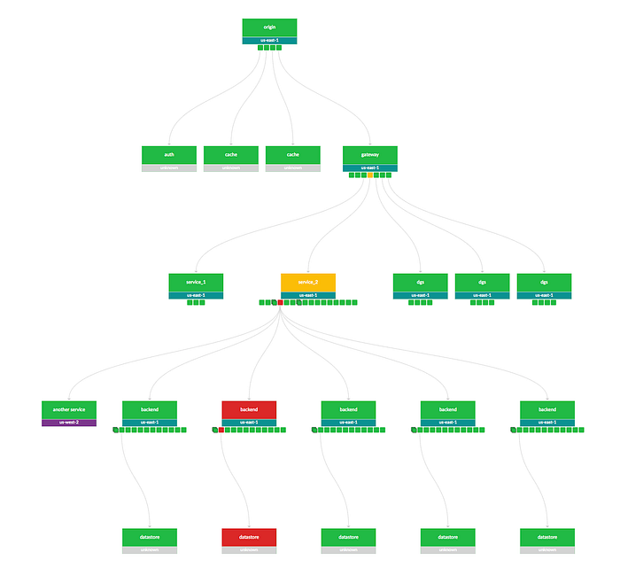
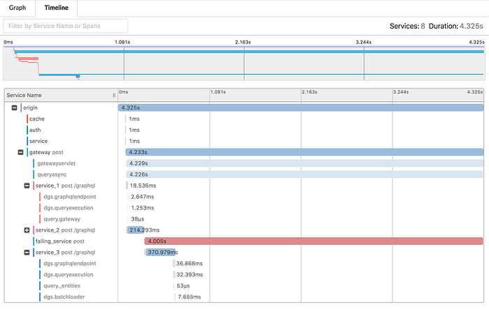
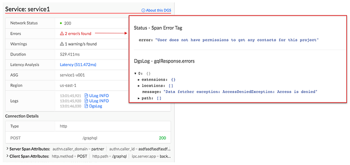
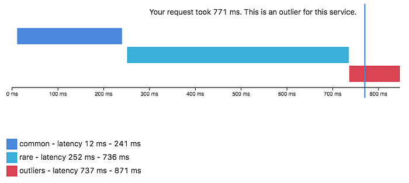
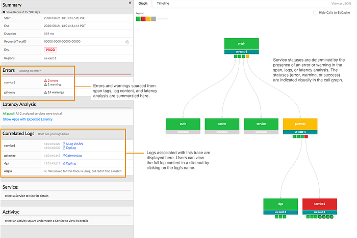
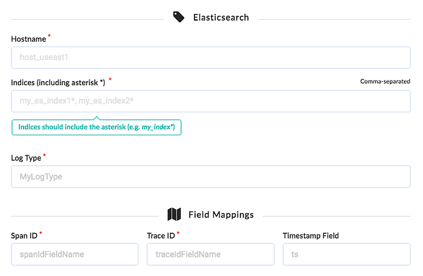
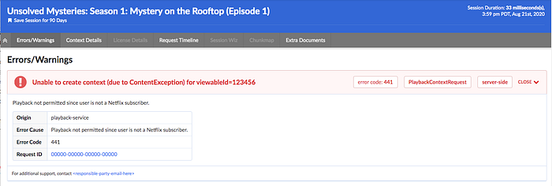
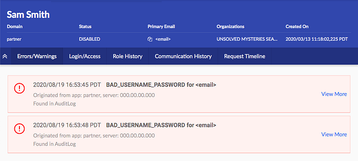

# Edgar: Solving Mysteries Faster with Observability

> Edgar helps Netflix teams troubleshoot distributed systems efficiently with the help of a summarized presentation of request tracing, logs, analysis, and metadata.

_by _[_Elizabeth Carretto_](https://www.linkedin.com/in/elizabethcarretto/)

Our Team — [Kevin Lew](https://www.linkedin.com/in/kevin-lew-298155/), [Maulik Pandey](https://www.linkedin.com/in/maulikpandey/), [Narayanan Arunachalam](https://www.linkedin.com/in/narayanan-a-0744291/), [Dustin Haffner](https://www.linkedin.com/in/dustin-haffner-55534aab/), Andrei Ushakov, [Seth Katz](https://www.linkedin.com/in/katzseth22202/), [Greg Burrell](https://www.linkedin.com/in/greg-burrell-67ab273/), [Ram Vaithilingam](https://www.linkedin.com/in/ramvaith/), [Mike Smith](https://www.linkedin.com/in/kerumai/) and [Elizabeth Carretto](https://www.linkedin.com/in/elizabethcarretto/)

Everyone loves Unsolved Mysteries. There’s always someone who seems like the surefire culprit. There’s a clear motive, the perfect opportunity, and an incriminating footprint left behind. Yet, this is Unsolved Mysteries! It’s never that simple. Whether it’s a cryptic note behind the TV or a mysterious phone call from an unknown number at a critical moment, the pieces rarely fit together perfectly. As mystery lovers, we want to answer the age-old question of whodunit; we want to understand what _really_ happened.

For engineers, instead of whodunit, the question is often “what failed and why?” When a problem occurs, we put on our detective hats and start our mystery-solving process by gathering evidence. The more complex a system, the more places to look for clues. An engineer can find herself digging through logs, poring over traces, and staring at dozens of dashboards.

All of these sources make it challenging to know where to begin and add to the time spent figuring out what went wrong. While this abundance of dashboards and information is by no means unique to Netflix, it certainly holds true within our microservices architecture. Each microservice may be easy to understand and debug individually, but what about when combined into a request that hits tens or hundreds of microservices? Searching for key evidence becomes like digging for a needle in a group of haystacks.

*Example call graph in Edgar*

In some cases, the question we’re answering is, “What’s happening right now??” and every second without resolution can carry a heavy cost. We want to resolve the problem as quickly as possible so our members can resume enjoying their favorite movies and shows. For teams building observability tools, the question is: how do we make understanding a system’s behavior fast and digestible? Quick to parse, and easy to pinpoint where something went wrong even if you aren’t deeply familiar with the inner workings and intricacies of that system? At Netflix, we’ve answered that question with a suite of observability tools. In an earlier blog post, we discussed [Telltale](./telltale-netflix-application-monitoring-simplified-5c08bfa780ba.md), our health monitoring system. Telltale tells us when an application is unhealthy, but sometimes we need more fine-grained insight. We need to know why a specific request is failing and where. We built Edgar to ease this burden, by empowering our users to troubleshoot distributed systems efficiently with the help of a summarized presentation of request tracing, logs, analysis, and metadata.

## What is Edgar?

Edgar is a self-service tool for troubleshooting distributed systems, built on a foundation of request tracing, with additional context layered on top. With request tracing and additional data from logs, events, metadata, and analysis, Edgar is able to show the flow of a request through our distributed system — what services were hit by a call, what information was passed from one service to the next, what happened inside that service, how long did it take, and what status was emitted — and highlight where an issue may have occurred. If you’re familiar with platforms like [Zipkin](https://zipkin.io/) or [OpenTelemetry](http://opentelemetry.io/), this likely sounds familiar. But, there are a few substantial differences in how Edgar approaches its data and its users.

- While Edgar is built on top of request tracing, it also uses the traces as the thread to tie additional context together. Deriving meaningful value from trace data alone can be challenging, as Cindy Sridharan articulated in [this blog post](https://medium.com/@copyconstruct/distributed-tracing-weve-been-doing-it-wrong-39fc92a857df). In addition to trace data, Edgar pulls in **additional context from logs, events, and metadata**, sifting through them to determine valuable and relevant information, so that Edgar can visually highlight where an error occurred and provide detailed context.
- Edgar **captures 100% of interesting traces**, as opposed to sampling a small fixed percentage of traffic. This difference has substantial technological implications, from the classification of what’s interesting to transport to cost-effective storage (keep an eye out for later Netflix Tech Blog posts addressing these topics).
- Edgar provides a **powerful and** **consumable user experience to both engineers and non-engineers alike**. If you embrace the cost and complexity of storing vast amounts of traces, you want to get the most value out of that cost. With Edgar, we’ve found that we can leverage that value by curating an experience for additional teams such as customer service operations, and we have embraced the challenge of building a product that makes trace data easy to access, easy to grok, and easy to gain insight by several user personas.

## Tracing as a foundation

Logs, metrics, and traces are the three pillars of observability. **Metrics communicate what’s happening on a macro scale, traces illustrate the ecosystem of an isolated request, and the logs provide a detail-rich snapshot into what happened within a service.** These pillars have immense value and it is no surprise that the industry has invested heavily in building impressive dashboards and tooling around each. The downside is that we have so many dashboards. In one request hitting just ten services, there might be ten different analytics dashboards and ten different log stores. However, a request has its own unique trace identifier, which is a common thread tying all the pieces of this request together. The trace ID is typically generated at the first service that receives the request and then passed along from service to service as a header value. This makes the trace a great starting point to unify this data in a centralized location.

A **trace** is a set of segments representing each step of a single request throughout a system. Distributed tracing is the process of generating, transporting, storing, and retrieving traces in a distributed system. As a request flows between services, each distinct unit of work is documented as a **span**. A trace is made up of many spans, which are grouped together using a trace ID to form a single, end-to-end umbrella. A span:

- Represents a unit of work, such as a network call from one service to another (a client/server relationship) or a purely internal action (e.g., starting and finishing a method).
- Relates to other spans through a parent/child relationship.
- Contains a set of key value pairs called tags, where service owners can attach helpful values such as urls, version numbers, regions, corresponding IDs, and errors. Tags can be associated with errors or warnings, which Edgar can display visually on a graph representation of the request.
- Has a start time and an end time. Thanks to these timestamps, a user can quickly see how long the operation took.

The trace (along with its underlying spans) allows us to **graphically represent the request chronologically**.

*Sample timeline view of a trace, based on Jaegar UI’s timeline view*

## Adding context to traces

With distributed tracing alone, Edgar is able to draw the path of a request as it flows through various systems. This centralized view is extremely helpful to determine which services were hit and when, but it lacks nuance. A tag might indicate there was an error but doesn’t fully answer the question of what happened. Adding logs to the picture can help a great deal. **With logs, a user can see what the service itself had to say about what went wrong. **If a data fetcher fails, the log can tell you what query it was running and what exact IDs or fields led to the failure. That alone might give an engineer the knowledge she needs to reproduce the issue. In Edgar, we parse the logs looking for error or warning values. We add these errors and warnings to our UI, highlighting them in our call graph and clearly associating them with a given service, to make it easy for users to view any errors we uncovered.

*Example view of errors associated with a service, including an error parsed from a log*

With the trace and additional context from logs illustrating the issue, one of the next questions may be how does this individual trace fit into the overall health and behavior of each service. Is this an anomaly or are we dealing with a pattern? To help answer this question, Edgar pulls in anomaly detection from a partner application, [Telltale](./telltale-netflix-application-monitoring-simplified-5c08bfa780ba.md). Telltale provides Edgar with latency benchmarks that indicate if the individual trace’s latency is abnormal for this given service. A trace alone could tell you that a service took 500ms to respond, but it takes in-depth knowledge of a particular service’s typical behavior to make a determination if this response time is an outlier. Telltale’s anomaly analysis looks at historic behavior and can evaluate whether the latency experienced by this trace is anomalous. With this knowledge, Edgar can then visually warn that _something _happened in a service that caused its latency to fall outside of normal bounds.

*Sample latency analysis*

## Edgar should reduce burden, not add to it

Presenting all of this data in one interface reduces the footwork of an engineer to uncover each source. However, discovery is only part of the path to resolution. With all the evidence presented and summarized by Edgar, an engineer may know what went wrong and where it went wrong. This is a huge step towards resolution, but not yet cause for celebration. The root cause may have been identified, but who owns the service in question? Many times, finding the right point of contact would require a jump into Slack or a company directory, which costs more time. In Edgar, we have integrated with our services to provide that information in-app alongside the details of a trace. For any service configured with an owner and support channel, Edgar provides a link to a service’s contact email and their Slack channel, smoothing the hand-off from one party to the next. If an engineer does need to pass an issue along to another team or person, Edgar’s request detail page **contains** **all the context — the trace, logs, analysis — and is easily shareable**, eliminating the need to write a detailed description or provide a cascade of links to communicate the issue.

*Edgar’s request detail page*

A key aspect of Edgar’s mission is to minimize the burden on both users and service owners. With all of its data sources, the sheer quantity of data could become overwhelming. It is essential for Edgar to maintain **a prioritized interface, built to highlight errors and abnormalities to the user** and assist users in taking the next step towards resolution. As our UI grows, it’s important to be discerning and judicious in how we handle new data sources, weaving them into our existing errors and warnings models to minimize disruption and to facilitate speedy understanding. We lean heavily on focus groups and user feedback to ensure a tight feedback loop so that Edgar can continue to meet our users’ needs as their services and use cases evolve.

As services evolve, they might change their log format or use new tags to indicate errors. We built an admin page to give our service owners that configurability and to decouple our product from in-depth service knowledge. Service owners can configure the essential details of their log stores, such as where their logs are located and what fields they use for trace IDs and span IDs. Knowing their trace and span IDs is what enables Edgar to correlate the traces and logs. Beyond that though, what are the idiosyncrasies of their logs? Some fields may be irrelevant or deprecated, and teams would like to hide them by default. Alternatively, some fields contain the most important information, and by promoting them in the Edgar UI, they are able to view these fields more quickly. **This self-service configuration helps reduce the burden on service owners.**

*Initial log configuration in Edgar*

## Leveraging Edgar

In order for users to turn to Edgar in a situation when time is of the essence, users need to be able to trust Edgar. In particular, they need to be able to count on Edgar having data about their issue. Many approaches to distributed tracing involve setting a sample rate, such as 5%, and then only tracing that percentage of request traffic. Instead of sampling a fixed percentage, Edgar’s mission is to capture 100% of interesting requests. As a result, when an error happens, Edgar’s users can be confident they will be able to find it. That’s key to positioning Edgar as a reliable source. **Edgar’s approach makes a commitment to have data about a given issue.**

In addition to storing trace data for all requests, Edgar implemented a feature to collect additional details on-demand at a user’s discretion for a given criteria. With this fine-grained level of tracing turned on, Edgar captures request and response payloads as well as headers for requests matching the user’s criteria. This adds clarity to exactly **what data is being passed from service to service** through a request’s path. While this level of granularity is unsustainable for all request traffic, it is a robust tool in targeted use cases, especially for errors that prove challenging to reproduce.

As you can imagine, this comes with very real storage costs. While the Edgar team has done its best to manage these costs effectively and to optimize our storage, the cost is not insignificant. One way to strengthen our return on investment is by being a key tool throughout the software development lifecycle. Edgar is a crucial tool for operating and maintaining a production service, where reducing the time to recovery has direct customer impact. Engineers also rely on our tool throughout development and testing, and they use the Edgar request page to communicate issues across teams.

By providing our tool to multiple sets of users, we are able to leverage our cost more efficiently. Edgar has become not just a tool for engineers, but rather **a tool for anyone who needs to troubleshoot a service at Netflix**. In Edgar’s early days, as we strove to build valuable abstractions on top of trace data, the Edgar team first targeted streaming video use cases. We built a curated experience for streaming video, grouping requests into playback sessions, marked by starting and stopping playback for a given asset. We found this experience was powerful for customer service operations as well as engineering teams. Our team listened to customer service operations to understand which common issues caused an undue amount of support pain so that we could summarize these issues in our UI. This empowers customer service operations, as well as engineers, to quickly understand member issues with minimal digging. By logically grouping traces and summarizing the behavior at a higher level, trace data becomes extremely useful in answering questions like why a member didn’t receive 4k video for a certain title or why a member couldn’t watch certain content.

*An example error viewing a playback session in Edgar*

## Extending Edgar for Studio

As the studio side of Netflix grew, we realized that our movie and show production support would benefit from a similar aggregation of user activity. Our movie and show production support might need to answer why someone from the production crew can’t log in or access their materials for a particular project. As we worked to serve this new user group, we sought to understand what issues our production support needed to answer most frequently and then tied together various data sources to answer those questions in Edgar.

The Edgar team built out an experience to meet this need, building another abstraction with trace data; this time, the focus was on troubleshooting production-related use cases and applications, rather than a streaming video session. Edgar provides our production support the ability to search for a given contractor, vendor, or member of production staff by their name or email. After finding the individual, Edgar reaches into numerous log stores for their user ID, and then pulls together their login history, role access change log, and recent traces emitted from production-related applications. Edgar scans through this data for errors and warnings and then presents those errors right at the front. Perhaps a vendor tried to login with the wrong password too many times, or they were assigned an incorrect role on a production. In this new domain, Edgar is** solving the same multi-dashboarded problem by tying together information** and pointing its users to the next step of resolution.

*An example error for a production-related user*

## What Edgar is and is not

Edgar’s goal is not to be the be-all, end-all of tools or to be the One Tool to Rule Them All. Rather, **our goal is to act as a concierge of troubleshooting **— Edgar should quickly be able to guide users to an understanding of an issue, as well usher them to the next location, where they can remedy the problem. Let’s say a production vendor is unable to access materials for their production due to an incorrect role/permissions assignment, and this production vendor reaches out to support for assistance troubleshooting. When a support user searches for this vendor, Edgar should be able to indicate that this vendor recently had a role change and summarize what this role change is. Instead of being assigned to Dead To Me Season 2, they were assigned to Season 1! In this case, Edgar’s goal is to help a support user come to this conclusion and direct them quickly to the role management tool where this can be rectified, not to own the full circle of resolution.

## Usage at Netflix

While Edgar was created around Netflix’s core streaming video use-case, it has since evolved to cover a wide array of applications. While Netflix streaming video is used by millions of members, some applications using Edgar may measure their volume in requests per minute, rather than requests per second, and may only have tens or hundreds of users rather than millions. While we started with a curated approach to solve a pain point for engineers and support working on streaming video, we found that this pain point is scale agnostic. Getting to the bottom of a problem is costly for all engineers, whether they are building a budget forecasting application used heavily by 30 people or a SVOD application used by millions.

Today, many applications and services at Netflix, covering a wide array of type and scale, publish trace data that is accessible in Edgar, and teams ranging from service owners to customer service operations rely on Edgar’s insights. From streaming to studio,** Edgar leverages its wealth of knowledge to speed up troubleshooting across applications with the same fundamental approach of summarizing request tracing, logs, analysis, and metadata**.

As you settle into your couch to watch a new episode of Unsolved Mysteries, you may still find yourself with more questions than answers. Why did the victim leave his house so abruptly? How did the suspect disappear into thin air? Hang on, how many people saw that UFO?? Unfortunately, Edgar can’t help you there (trust me, we’re disappointed too). But, if your relaxing evening is interrupted by a production outage, Edgar will be behind the scenes, helping Netflix engineers solve the mystery at hand.

_Keeping services up and running allows Netflix to share stories with our members around the globe. Underneath every outage and failure, there is a story to tell, and powerful observability tooling is needed to tell it. If you are passionate about observability then _[_come talk to us_](https://www.linkedin.com/in/ramvaith/)_._

---
**Tags:** Distributed Tracing · Observability · Microservices · Netflix · Operational Insight
